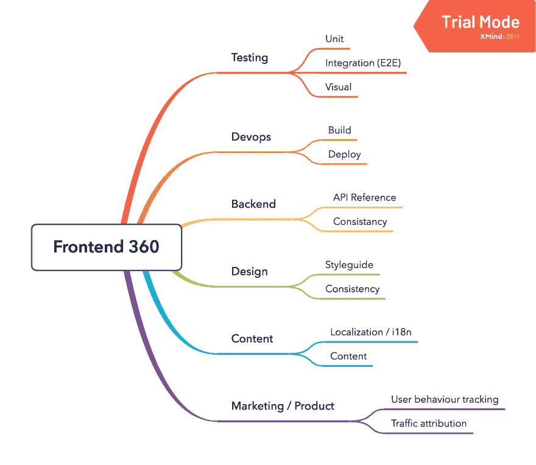
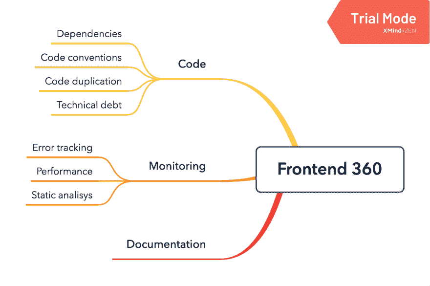
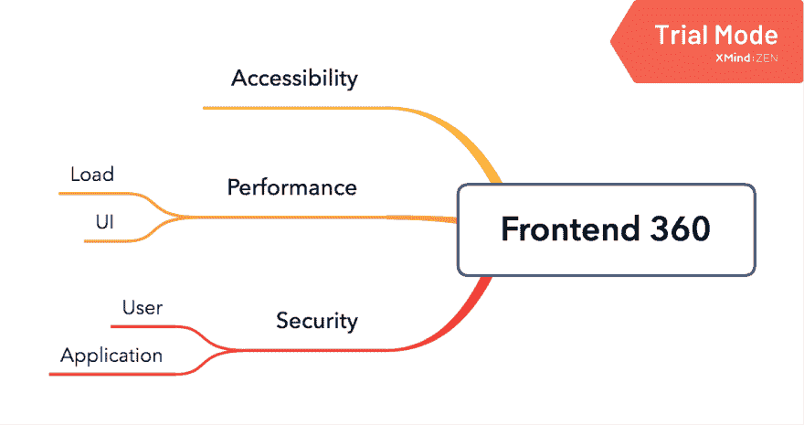
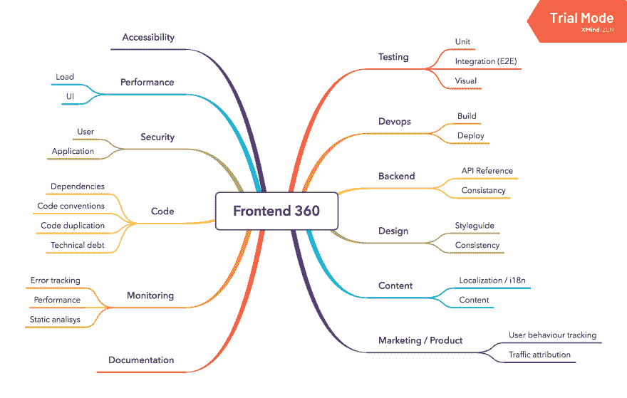

# 前端 360

> 原文：<https://dev.to/omaiboroda/frontend-360-35no>

*最初发布于[https://oles.dev/posts/frontend-360](https://oles.dev/posts/frontend-360)T3】*

我需要在前端上组织我的想法，所以我最终有了一个思维导图，我雄心勃勃地将其命名为前端 360。这个系统可以帮助你评估项目的状态，指出优势和劣势。

思维导图可以分为 3 个子类别——同伴、自己和用户

## 同行

<figure>

<figcaption>Areas of Frontend Peers</figcaption>

</figure>

前端不能生活在真空中。作为与客户的接触点，它与其他领域相互依赖。
对等类别涉及与前端相关的领域- **测试、开发、后端、设计、内容、营销**

*   项目构建有多快，部署有多容易？
*   应用程序有足够的测试覆盖率来防止错误吗？
*   糟糕的 API 决策会泄露到前端吗？
*   你在应用程序中的用户界面/UX 是一致的吗？
*   翻译/内容机制是否令人愉快？
*   用户跟踪报告没有错误吗？

## 自我

<figure>

<figcaption>Areas of Frontend itself</figcaption>

</figure>

第二部分涉及我们自己，前端代码维护人员，涵盖以下领域- **代码、文档、监控**

*   代码库有像样的文档吗？
*   生产中有 JS 错误吗？
*   你如何应对性能退化？
*   技术债有多大？
*   我们所有的依赖项都是最新的吗？

### 用户

最后，但同样重要的是，从用户的角度来看，前端的可访问性、性能和安全性

*   你提供的服务是包容性的吗？
*   你应用的速度是 UX 的瓶颈吗？
*   我们用户的数据和您的应用安全吗？

<figure>

<figcaption>Areas of users</figcaption>

</figure>

### 都在一起

这些问题和部分可以很好地描述前端的状态

所有这些方面对于保持一个健康的项目都是很重要的，它会给你、你的同事和你的用户带来工作的乐趣。