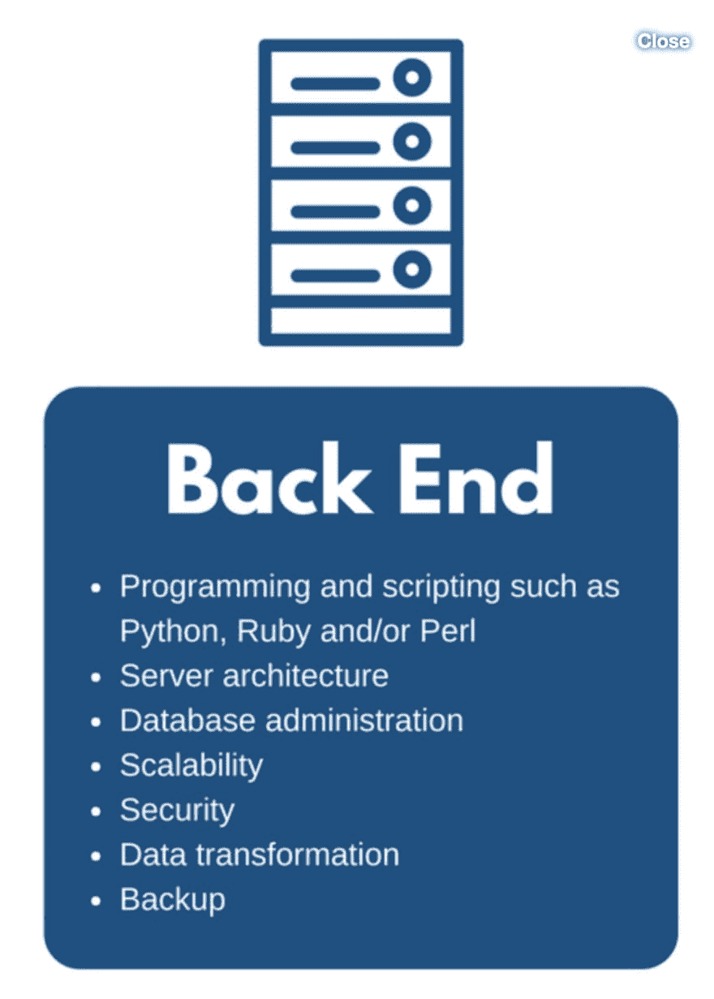

# 前端与后端:哪一个适合你？

> 原文：<https://dev.to/molly/frontend-vs-backend-which-one-is-right-for-you-5gjg>

新开发人员多次问我，当我学习编码时，我应该学习和关注什么？问这个问题就相当于一个医科学生问他们应该专攻哪个领域。根本没有放之四海而皆准的答案。然而，我想给一些指导，并提供一些我自己对这个话题的想法。希望，如果你正处于职业生涯的开始，这篇文章会给你一些东西去思考。

# 定义

当开始做软件时，通常会出现的第一个内部争论是，我应该把重点放在哪里，前端还是后端？在我们深入研究每个专业的特征之前，让我们先定义它们。

### 前端

> 指的是网站的表示层以及它如何与来自后端的数据交互。想想 HTML，CSS，Javascript，Angular 等。

### 后端

> 指应用程序的数据处理层。这一层与数据库对话，并决定将哪些信息发送到前端进行显示。想想 Ruby，Rails，Python，Java 等等。

好了，现在我们知道它们是什么了，但是你如何选择你想和哪一个一起工作呢？老实说，这可以归结为个人偏好，以及为什么你首先选择成为一名开发者。

# 工作满意度

如果你选择成为一名开发者是因为你想要职业满足感，你想要做你喜欢的事情，那么我的建议是当你开始的时候两者都做。涉足前端和后端，这样你就能感受到你更喜欢什么。会有更多的工作吗？当然，但是你会大大增加找到你喜欢使用的堆栈的机会。

在前端和后端生态系统中，仍然有许多专业可以分支并完成，这可能是势不可挡的。当你开始的时候，试着感受一下基础，不要太担心一路跳水。测试水，看看当你用它工作时，是否有一种真的吸引你。然而，当你开始的时候要意识到，无论你从哪里开始，一开始都会很艰难。我想说的是，在你决定把重点放在哪里之前，给自己一两年的时间在整个堆栈上工作。这将给你足够的时间来克服最初的“哇，这太糟糕了，因为它太难了”的困扰，并进入你真正能够评估它是否是你喜欢使用的技术的时候。

虽然每个人都有不同的爱好，但是你可能会发现看到其他开发人员喜欢使用什么语言和技术会很有趣。2019 年 StackOverflow 调查着眼于[哪些语言最受喜爱](https://insights.stackoverflow.com/survey/2019#technology-_-most-loved-dreaded-and-wanted-languages)。

从整个堆栈开始工作的另一个好处是，您可以感受到所有东西是如何协同工作的。无论你决定将来把重点放在哪里，这都会非常有用。如果你知道另一半是如何工作的，那只会让你在你的专业领域内创建更好的代码和界面。

最后，当在整个堆栈中工作时，您可能会决定不想选择！你可能希望在整个堆栈中工作，并成为你职业生涯中的全堆栈工程师。这也是完全正确的！

# 薪资/稳定

如果你进入开发职业的动机是为了它提供的薪水和稳定性，那么学习这两者可能是浪费你的时间。如果你想尽快进入职业生涯，那么就对你想从事的领域做一些研究。找出前端和后端的薪资趋势。此外，尝试找出哪种类型的开发是最需要的。

我不敢说我知道是前端还是后端的工资更高，但是有一些调查试图回答这个问题。再一次，我们可以看看 2019 年 StackOverflow 调查，该调查按类型对开发人员的[薪资进行了细分。](https://insights.stackoverflow.com/survey/2019#work-_-salary-by-developer-type)

### 全局

1)全堆叠$57k
2)后端$56k
3)前端$52k

### 美国

1)后端$116k
2)全堆叠$110k
3)前端$103k

此外，它还根据技术分解了工资[。以下是这些调查的样本。](https://insights.stackoverflow.com/survey/2019#top-paying-technologies)

### 全局

*   clo jure 9 万美元
*   去$80k
*   python 6.3 万美元
*   swift 59，000 美元
*   JavaScript 56k 美元
*   HTML/CSS $55k

### 美国

*   Scala 14.3 万美元
*   clo jure 13.9 万美元
*   13.6 万美元
*   swift 12 万美元
*   python 11.6 万美元
*   JavaScript 11 万美元
*   HTML/CSS 10.5 万美元

需要注意的是，这些工资和趋势可能会有所不同，这取决于你在哪里工作，以及你是否正在寻找一份远程工作。当然，做你的研究。这可能很简单，只需查看工作公告板，搜索后端和前端技术，看看有多少结果返回。

# 我为什么选择后端

我想我应该在这里解释一下为什么我最终选择了后端，希望它可以在其他人做决定时提供信息。当我转行成为一名开发人员并决定开始跨整个堆栈工作时，我正在寻求工作满足感。在我真正开始转向后端之前，我做了 3 年的全栈开发。吸引我到后端的是 Ruby 的整洁。Javascript 和前端语言对我来说总是感觉不太有条理。我也热衷于优化代码性能。我喜欢寻找让事情运行得更好更快的方法。后端似乎给了我更多的机会去做这件事。

最后，我不是一个非常视觉化或艺术化的人。有些人可以看到一个网页，并找出如何布局和一切应该去哪里。我从来不擅长这个，所以后端对我来说更自然和舒适。

如果你想更深入地了解别人的观点，看看这个讨论前端和后端 web 开发的 [CodeNewbie Chat](https://wakelet.com/wake/7d71f467-89ba-49cb-a196-4e32657369ac) 。您也可以查看我在周二开始的 dev.to 线程，询问人们他们选择在堆栈的哪个部分工作以及为什么。

## 文章不再可用

# 没有什么是永恒的

无论你决定专注于什么，要知道没有什么是永恒的。如果你选择了一条路，并认为那是错误的，你可以随时改变。软件工程的一个伟大之处在于，它可以整合在一起。对一个领域了解很多只会帮助你在另一个领域学习和做得更好。