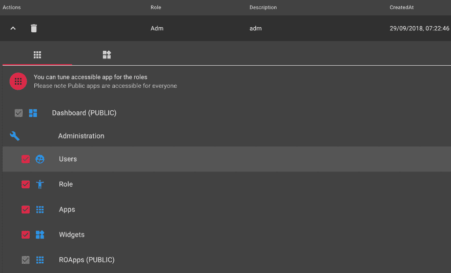

# Fullstack React 材料仪表板(应用程序框架)

> 原文：<https://dev.to/ashkank83/fullstack-react-material-dashboard-3m62>

# 一个全栈 React 材质-UI 仪表盘

[](https://res.cloudinary.com/practicaldev/image/fetch/s--fRWpRgxo--/c_limit%2Cf_auto%2Cfl_progressive%2Cq_auto%2Cw_880/https://thepracticaldev.s3.amazonaws.com/i/bsl2i3liq302bklsyao9.png)

## [试玩](https://logidashboard.z19.web.core.windows.net/)

使用 U: "test" P: "test "登录

或者 U:“admin”P:“test”以获得更易访问的应用程序

*注意数据库处于只读模式，因此任何更改尝试都将失败*

## 设置

### 服务器

```
Git clone https://github.com/logipro/Dashboard-API.git
npm install npm start 
```

### 客户端

```
git clone https://github.com/logipro/logi-dashboard.git
yarn install yarn start 
```

## 什么事？！

一个**正在进行的工作** fullstack 微框架(框架这个词对吗？！)它将为您提供基本的授权、认证、路由和一些开箱即用的通用功能。因此，您可以专注于开发您的应用和小工具，并将其交付给您的最终用户。

## 主要特征

*   添加/禁用用户，更改用户密码，向用户授予/授予角色
*   添加/移除可访问不同应用程序和微件集的角色
*   创建窗口小部件，并将它们添加到要在仪表盘上显示的框架中(**可能会分享一些好的)😀**)
*   创建应用程序(反应组件)
*   拥有公共应用程序和微件(无需登录即可查看)
*   每个用户都可以保存他/她的仪表板布局
*   使用 react.lazy 和 suspension 延迟加载应用程序。应用程序将只为有权访问它们的用户加载。

## 用过什么？

### **前端**

[反应堆](https://reactjs.org/)

[材料界面](https://material-ui.com/)

[React-路由器](https://reacttraining.com/react-router/)
为动态路由神奇发生客户端

[TypeScript](https://typescriptlang.org) 不是 100%的 TypeScript，因为你会看到一些 js 文件和大量的 js 代码，但它就在那里！

我们找了一个很好的材料表，但没有找到一个能满足我所有需求的！所以决定开发我自己的。这个 table 组件目前缺少很多特性，这就是它还不是 npm 包的原因。也许有一天，当它覆盖更多，测试更好的时候，我们会将它作为自己的包发布，现在它将留在仪表板内的一个单独的文件夹中！

### **后端**

[节点 j](https://nodejs.org)

[快递](https://expressjs.com/)

[Passport](http://www.passportjs.org/) ,用于与 express-jwt 一起进行身份验证，以便向登录的用户和客人提供令牌

为了避免安装任何数据库管理系统，我们决定使用 Sqlite。当然，对于您的应用程序，您可以添加到主业务的任何其他数据库的连接，同时框架相关的持久性，如用户、角色、应用程序，...正在使用 sqlite。

## 添加新应用

A.任何 react 组件都可以是一个应用程序，Logi-dashboard 将为具有访问权限的用户加载它们。例如，看看管理用户的应用程序 User.tsx 。

B.从管理/应用程序管理
[](https://res.cloudinary.com/practicaldev/image/fetch/s--fWhvDeTe--/c_limit%2Cf_auto%2Cfl_progressive%2Cq_auto%2Cw_880/https://thepracticaldev.s3.amazonaws.com/i/g93qxy3vzzelp4ou221z.png) 
添加您的应用程序您必须为每个应用程序设置以下内容:

**应用**:要在侧边栏显示的应用名称

**ParentID** :如果你想让你的应用显示在一个群组下，设置这个

**RouteName** :设置此应用程序的相对路径，Logi-dashboard 将使用此路径加载您的组件

**组件**:App 组件的相对路径(相对于 App.tsx)

**道具**:从这里向应用程序发送道具，比如说我想要两个不同版本的*用户*应用程序，一个只读，另一个完全访问。我在这个表中创建同一个应用程序两次，并将其中一个应用程序的 Props 设置为{"Readonly":"true"}，然后 users.tsx 可以在加载时检查这一点，并执行所需的操作(在这种情况下隐藏编辑图标)

**IsPublic** :如果你想让你的应用在登录前可用，就把它设为 true。仪表板必须保持公开

**图标**:一个[材质 UI 图标](https://material.io/tools/icons/)显示在侧边栏。

## 添加新的 Widget

widget 显示在仪表板上，您可以将自己的 widget 添加到可用 widget 集合中:

A.创建您的小部件，并将其复制到框架/仪表板/卡片(或任何地方！).点击查看样品

B.将您的新 Widget 添加到具有首选大小的 [widget.tsx](https://github.com/logipro/logi-dashboard/blob/69fcb29c119cd5974a0999e3a0d4f2ce7f708ab8/src/framework/dashboard/Widget.tsx#L13) 中。(仪表板布局使用网格布局)

C.从管理/微件将您的微件添加到微件表中

[](https://res.cloudinary.com/practicaldev/image/fetch/s--5mjxurmg--/c_limit%2Cf_auto%2Cfl_progressive%2Cq_auto%2Cw_880/https://thepracticaldev.s3.amazonaws.com/i/vnizuot2drcl0hks3ipz.png)

**组件** : Widget 组件名称
**属性**:从这里发送 Widget 中需要的任何属性。

*提示*:试着创建通用的和可重用的部件，并用这里的道具定制它们。例如，如果您有一个图表，它应该以 x 分钟的时间间隔获取数据，请发送数据的 URl 路径以及从这里开始的时间间隔。

**IsPublic** :在登录仪表板之前，可以访问公共小部件。登录的用户可以隐藏小部件

## 访问应用程序和小工具

对应用程序和微件的访问通过角色来管理。
[T3】](https://res.cloudinary.com/practicaldev/image/fetch/s--4O3yvZxC--/c_limit%2Cf_auto%2Cfl_progressive%2Cq_auto%2Cw_880/https://thepracticaldev.s3.amazonaws.com/i/qhr0o1uzerewdbpylrj9.png)

选择一个角色并展开其详细信息，以查看该角色可用的应用程序和微件。选择或取消选择任何项目以修改访问权限。

调整角色访问后，您可以从“用户”应用程序向用户分配角色。每个用户可以有一个或多个角色，她/他的访问权限是所有可访问应用程序的联合。
[T3】](https://res.cloudinary.com/practicaldev/image/fetch/s--9oojCWAS--/c_limit%2Cf_auto%2Cfl_progressive%2Cq_auto%2Cw_880/https://thepracticaldev.s3.amazonaws.com/i/imjgtm5rm07ucspckol1.png)