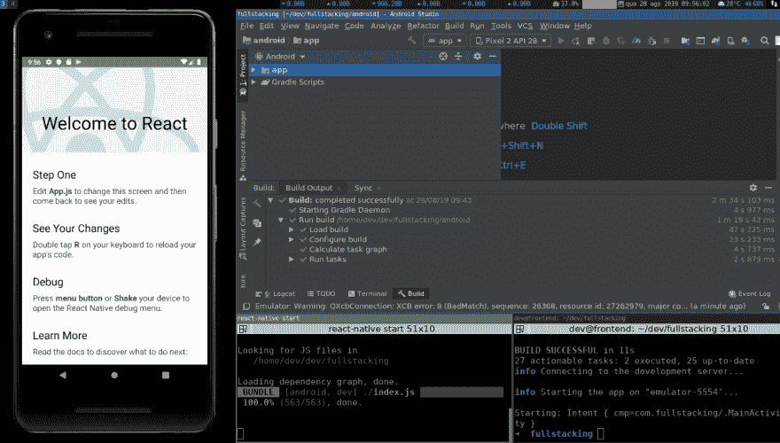

# 全堆叠:设置 React Native

> 原文：<https://dev.to/heymarkkop/fullstacking-setting-up-react-native-1g21>

这次我们将[为 React Native](https://facebook.github.io/react-native/docs/getting-started) 设置开发环境。起初，我打算使用`expo` - *这是一种使用 wifi 将应用程序上的更改直接复制到智能手机上的工具* -但是我发现我需要在没有无线网络可用的情况下进行开发，所以我们将走上“艰难”的道路。
我用`Ubuntu 18.04`搭配`Node 10.16.2`和`npm 6.10.3`

## 反应原生

**安装 Node 8.3 或更新版本**【https://nodejs.org/en/download/package-manager/】
T3

**安装 React Native CLI**
`npm install -g react-native-cli`

**[下载](https://jdk.java.net/12/) & [安装](https://openjdk.java.net/install/index.html) [OpenJDK](https://openjdk.java.net/)**
`tar -zxvf openjdk...tar.gz`

**下载&安装[安卓工作室](https://developer.android.com/studio/index.html)**
`tar -zxvf android...tar.gz`
`cd android-studio`
`cd bin`
`./studio.sh`
`check Android SDK, Android SDK Platform and Android Virtual Device`
`install them`

如果碰巧遇到`required packages`的[错误](https://stackoverflow.com/a/42742218)，完成失败的安装，转到`Settings -> Appearance & Behavior -> System Settings -> Updates`，将`Update Channel`改为`Canary Channel`。

**安装 AndroidSDK**
`Settings -> Appearance & Behavior -> System Settings -> AndroidSDK`
勾选`Show Package Details`并展开`Android 9 (Pie)`
勾选`Android SDK Platform 28`
勾选`Intel x86 Atom_64 System Image`或`Google APIs Intel x86 Atom System Image`
选择`SDK Tools`标签，`Show Package Details`并勾选`28.0.03`
点击`Apply`并安装

**配置 ANDROID_HOME 环境变量**
在`$HOME/.bashrc_profile`文件
`export ANDROID_HOME=$HOME/Android/Sdk
export PATH=$PATH:$ANDROID_HOME/emulator
export PATH=$PATH:$ANDROID_HOME/tools
export PATH=$PATH:$ANDROID_HOME/tools/bin
export PATH=$PATH:$ANDROID_HOME/platform-tools`
*中添加以下代码行(如果您使用的是另一个 shell，如 zsh，您必须将它们添加到它的 profile 文件中，如~/。zshrc)*
运行`echo $PATH`并检查$ANDROID_HOME 是否存在

**[安装](https://facebook.github.io/watchman/docs/install.html#buildinstall)守夜人**
`git clone https://github.com/facebook/watchman.git
cd watchman
git checkout v4.9.0 # the latest stable release
./autogen.sh
./configure
make
sudo make install`

你可能需要
安装 libtoolize: `sudo apt install libtool`
安装 automake(a local)`sudo apt install automake`
安装 pkg-config `sudo apt install pkg-config`
Add `export M4=/usr/bin/m4`就像 ANDROID_HOME 一样

**新建 React 原生 app**
`react-native init AwesomeProject`

**运行虚拟 Android 设备**
打开 Android Studio (studio.sh)然后打开/AwesomeProject/android 项目文件夹
打开`AVD Manager`点击其图标
选择`Create Virtual Device...`，然后从列表中选择任意一部手机点击`Next`，然后选择`Pie API Level 28 image`。完成后按绿色三角按钮

**在仿真设备**
中运行 react-nactive 项目打开终端并运行`react-native start`
打开另一个终端并在项目文件夹内运行`react-native run-android`

**但是如果你的电脑几乎和我的一样爆炸，试着直接在你的 Android 智能手机上运行它**
[在你的智能手机上启用](https://facebook.github.io/react-native/docs/running-on-device)`Debuggin USB`
运行`lsusb`
后找到你的设备从它的 id(例如 **22b8** )
`echo 'SUBSYSTEM=="usb", ATTR{idVendor}=="22b8", MODE="0666", GROUP="plugdev"' | sudo tee /etc/udev/rules.d/51-android-usb.rules`
(不要忘记更改上面一行中的**22 b8**)
检查您的设备是否出现在`adb devices`
`react-native start`
`react-native run-android`

现在，您的应用程序应该会出现在您的智能手机中。
您可以通过`adb -s <device name> reverse tcp:8081 tcp:8081`打开`Live Reloading`，设备名称在`adb devices`中

如果您在重新加载时遇到类似于[这个](https://pbs.twimg.com/media/EDD7ycNW4AAmjE1?format=jpg&name=large)的错误，请尝试运行以下命令
`adb reverse tcp:8081 tcp:8081
adb -d reverse tcp:8081 tcp:8081
adb -e reverse tcp:8081 tcp:8081`

现在我们可以准备好开始 React Native 了。但是，我们仍然需要设置 NodeJS 和 KoaJS。