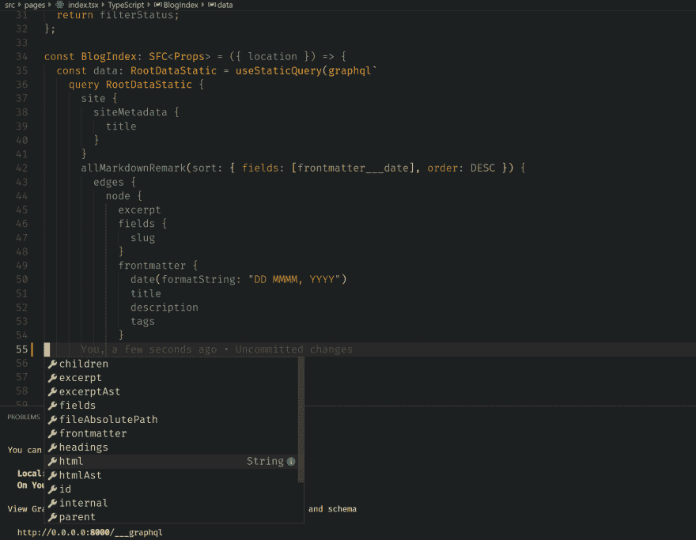
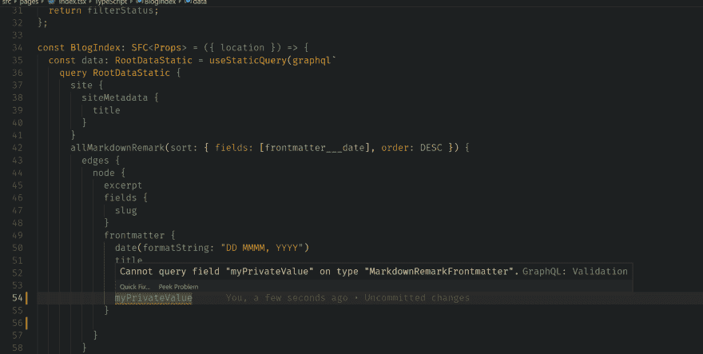

# 盖茨比太棒了

> 原文：<https://dev.to/itminds/gatsbyjs-is-amazing-5ejg>

Gatsby 是一个无头 CMS 框架。Gatsby 编译到静态站点，这意味着它可以托管在静态文件服务器或 CDN 上。这很好，因为流量没有限制。

在许多集成解决方案中，服务器上正在进行某种工作，如果有足够多的人同时请求数据，这种“工作”将成为性能瓶颈。

有了 gatsby，您只需获得所需的单个 HTML 文件，然后 gatsby 会用其余的文件“合成”您的站点，因此您仍然可以获得一个响应良好的站点。

为了说明盖茨比的一些好的特点，我写了一个简单的博客来展示这些特点。该网站的内容是丹麦语，但所有的代码是英语。 *[链接](https://github.com/Simmetopia/theguinnies)* 。

首先，当您启动 gatsby development 时，它会检查您的文件并生成一个您可以查询的 graphql 模式。

在我的博客示例中，“博客”部分使用 markdown 和 [Jekyll](https://jekyllrb.com/docs/front-matter/) frontmatter。这些 frontmatter 变量在构建时被检查并添加到模式中。

启动开发环境后，您可以在`localhost:8000/___graphql`上自省 graphql 模式。
注意，在下面显示的查询`MyQuery`中，我请求从模式中获取标签和标题值。这是因为在我用 markdown 写的博客中，这些字段是使用 jekyll 语法定义的。

[](https://res.cloudinary.com/practicaldev/image/fetch/s--EfrhN8i1--/c_limit%2Cf_auto%2Cfl_progressive%2Cq_auto%2Cw_880/https://thepracticaldev.s3.amazonaws.com/i/8zzbuvssqhuk9xo6zwm9.png)

markdownRemark 字段只返回数据列表中的第一个元素。allMarkdownRemark 查询返回所有博客文章的可选分页列表。
[T3】](https://res.cloudinary.com/practicaldev/image/fetch/s--bcnVSbzW--/c_limit%2Cf_auto%2Cfl_progressive%2Cq_auto%2Cw_880/https://thepracticaldev.s3.amazonaws.com/i/t5mxrt5u2f7xbt4f7fz7.png)

在上面的查询中，我演示了分页选项，同时显示了网站上博客的总数。

## 与 visual studio 代码集成

Apollo 提供了一个名为 Graphql 的 vscode 扩展。这个扩展很酷，因为它自省了 graphql 端点，并为您提供了编辑器支持。
最初我只在使用 [ApolloGraphQL 栈](https://www.apollographql.com/docs/)的项目中使用过这个。
当 gatsby develop 脚本正在运行并且`localhost:8000/___graphql` endpoint 处于活动状态时，您将获得所有的扩展功能。

让我们看看 vscode 中的 a 查询是什么样子的

Gatsby 站点不一定要有数据库才能完全发挥作用。然而，盖茨比的网站最好是静态的所有访问网站。

### 智能感知所有可查询数据？你明白了

[](https://res.cloudinary.com/practicaldev/image/fetch/s--ydBzrZoV--/c_limit%2Cf_auto%2Cfl_progressive%2Cq_auto%2Cw_880/https://thepracticaldev.s3.amazonaws.com/i/sklb9svh184he799bvm2.png)

### 编辑器中的  支持检查查询的数据是否存在？没问题

[](https://res.cloudinary.com/practicaldev/image/fetch/s--OHLFpRVS--/c_limit%2Cf_auto%2Cfl_progressive%2Cq_auto%2Cw_880/https://thepracticaldev.s3.amazonaws.com/i/nxjpqu0hest7wyuugau0.png)

### config

要让 apollo graphql 工作，您需要一个配置文件。为了方便起见，我已经添加了我用于本地开发的名称，您应该只需要将名称改为适合您自己的 gatsby 站点的名称。

```
module.exports  =  {
    client:  {
        tagName:  'graphql',
        includes: ['./.cache/**/*.js',  './src/**/*.{ts,tsx}'],  // array of glob patterns
        service:  { name:  'theGuinnies', url:  'http://localhost:8000/___graphql'  },
    },
}; 
```

只是为了澄清添加到 includes 数组中的 globs。/.graphql 查询的缓存部分是 gatsby 在检查站点时添加的，下一部分是指定我们自己的所有查询的地方。为什么这么问？

> 您可以添加 typescript 类型来完全键入 graphql 查询中的查询

我在我的包 json 中添加了一个名为 codegen 的脚本，这将运行 apollo cli 工具来检查我的所有查询，然后根据 graphql 模式对它们进行自省，由此它将生成反映 graphql 模式的 typescript 类型。由于 graphql api 是强类型的，这使得 typescript 类型安全成为一个完整的循环。我强烈推荐您了解如何从 graphql 模式生成类型。对于开发 API 的类型安全消费者来说，这是一个传奇特性。

## GraphQL 牛逼

有很多技术将 GraphQL 提升到下一个水平的例子，gatsby 就是其中之一。它允许你建立一个静态网站，没有任何初始工作。它给你一种为你的静态数据与数据库集成的感觉，并提供了一个简单的接口来实现这一点。这是在 GraphiQL 操场上环顾四周时看到的。

由于没有服务器，静态网站最有可能获得即时加载时间，甚至在用户负载很大的情况下也能运行。

gatsby 生态系统提供了可以附加到 Gatsby 配置文件的插件。其中一个例子是 markdown 注释，它将 markdown 解析为可呈现的 html。另一个例子是 PWA 插件，它注册了一个服务人员并使你的站点可缓存。

想象一下静态站点和服务人员的合并？除了更新，你的客户可以即时访问你的网站，即使他们是离线的。那确实是非常好的东西。

谷歌分析的一个插件条目的例子:

```
{
    resolve:  `gatsby-plugin-google-analytics`,
    options:  {     
        trackingId:  'UA-142835995-1',
        // Defines where to place the tracking script - `true` in the head and `false` in the body
        head:  false,
        // Setting this parameter is optional
        anonymize:  true,
        // Setting this parameter is also optional
        respectDNT:  true,
    },
} 
```

gatsby 插件的完整列表可以在这里找到。