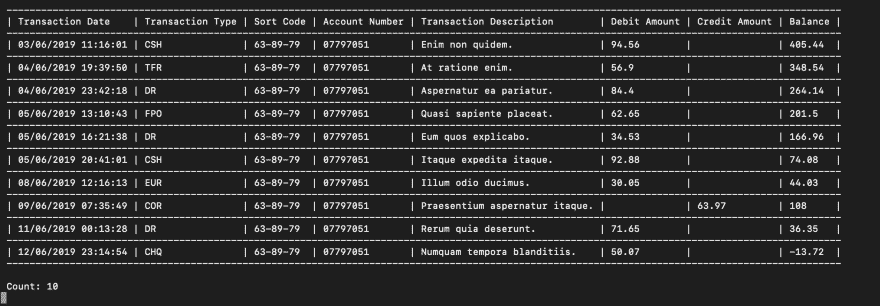

# 用伪代码生成测试数据

> 原文：<https://dev.to/volkanpaksoy/generating-test-data-with-bogus-12me>

生成高质量的测试数据会对整个测试的准确性产生影响。在这篇文章中，我将展示如何使用一个叫做[的有用的 C#库](https://github.com/bchavez/Bogus)

## 展示项目:银行对账单生成器

在这个例子中，我将生成假的银行对账单。通常它们以 CSV 文件的形式出现，并具有以下模型:

```
public class BankStatementLine
{
    public DateTime TransactionDate { get; set; }
    public string TransactionType { get; set; }
    public string SortCode { get; set; }
    public string AccountNumber { get; set; }
    public string TransactionDescription { get; set; }
    public decimal? DebitAmount { get; set; }
    public decimal? CreditAmount { get; set; }
    public decimal Balance { get; set; }
} 
```

我将使用 Bogus 生成逼真的假语句行，最后将其保存为 CSV 格式，看看它看起来是否真实。

## 规则和限制

我希望上面模型中的字段符合一些现实的规则:

*   交易日期必须在我提供的某个范围内，因为银行对账单是在某个日期范围内生成的。
*   日期应该是递增的，而不是随机的
*   排序代码必须采用以下格式:NN-NN-NN，并且在整个语句中必须相同。
*   帐号必须是一个 8 位数字，并且在整个报表中保持不变。
*   交易描述必须是自由文本
*   借方金额和贷方金额必须是十进制数字，但在任何给定的行中只能有一个数字
*   交易类型必须是预定义的值之一，而且有些类型可以是信用交易，有些类型只能是借记交易。
*   余额应该是所有借方和贷方金额的总和加上报表中的第一个余额。所以这个值依赖于它前面的值。
*   语句中的行数应该是随机的。

## 规则实现

上面提到的一些规则非常简单，容易实现。这些是伪造品的一些例子。要获得完整的文档，请查看 GitHub 资源库。

### 支持日期范围

生成一个日期范围很简单:

```
.RuleFor(x => x.TransactionDate, f => f.Date.Between(startDate, endDate)) 
```

### 支持枚举和数组

对于交易类型，我想从设定值列表中选择一个随机值。这可以通过两种方式实现:使用 enum 或 IEnumerable。

```
var transactionTypes = new[] { "FPO", "DEB", "DB", "FPI" }; 
```

在规则描述中，它可以用作

```
.RuleFor(x => x.TransactionType, f => f.PickRandom(transactionTypes) ) 
```

另一种方法是使用枚举，如:

```
public enum TransactionType
{
    FPO,
    DEB,
    DB,
    FPI
} 
```

规则变成了:

```
 .RuleFor(x => x.TransactionType, f => f.PickRandom<TransactionType>().ToString()) 
```

在我的最终实现中，我使用了从对象列表中选择。您可以查看[示例代码](https://github.com/volkanpaksoy/lab/tree/master/blog/GeneratingTestDataWithBogus)来查看该版本。

### 数字范围

对于账号，我需要一个 8 位数的数字，这可以通过类似这样的规则来实现:

```
.RuleFor(x => x.AccountNumber, f => f.Random.Long(100000000, 99999999).ToString()) 
```

Bogus API 也有对账号的内置支持，所以下面是一个更优雅、更有表现力的实现方式:

```
.RuleFor(x => x.AccountNumber, f => f.Finance.Account()) 
```

### 格式化字符串

格式化排序代码可以通过字段来实现。随机.替换方法

```
.RuleFor(x => x.SortCode, f => f.Random.Replace("##-##-##")) 
```

与账号类似，它也内置了对排序代码的支持:

```
.RuleFor(x => x.SortCode, f => f.Finance.SortCode()) 
```

### 空值

在我的情况下，在一些字段中，我也希望有空值。这可以通过*或空*扩展方法来实现。例如，在下面的代码中，它生成%20 的 DebitAmount 值 null。

```
.RuleFor(x => x.DebitAmount, f => f.Random.Decimal(0.00m, 9999.00m).OrNull(f, 0.2f)) 
```

### 常见字段

在我的例子中，每个语句行中的一些值在整个语句中重复出现，比如帐号和分类代码。为此，我创建了一个“基本”语句行，每个伪语句行都使用这些共享字段，而不是生成新字段。

```
var commonFields = new Faker<BankStatementLine>()
    .RuleFor(x => x.AccountNumber, f => f.Finance.Account())
    .RuleFor(x => x.SortCode, f => f.Finance.SortCode())
    .Generate();

var fakeTransactions = new Faker<BankStatementLine>()
    .StrictMode(true)
    .RuleFor(x => x.AccountNumber, commonFields.AccountNumber)
    .RuleFor(x => x.SortCode, f => commonFields.SortCode)
    ...
    ... 
```

### 随机编号的对象

在语句中使用不同的行数更现实。使用 Generate 方法，您可以指定您想要生成的项目的确切数量，这对单元测试是有益的。出于我的目的，我只是想在每个语句中创建随机的行，因为我只需要导入数据。这可以通过以下方式实现:

```
var statementLines = fakeTransactions.GenerateBetween(10, 20); 
```

### 依赖值

这个场景中棘手的部分是依赖值。通常，当您使用 RuleFor 扩展方法时，它会单独为该字段生成值。在我的例子中，一个限制是借方金额和贷方金额不能在同一行中有值。平衡也取决于这些值，并且需要在每一行中进行计算。

据我所知，没有内置的支持来定义这些依赖关系。根据我的测试，我可以通过两种方式实现这一点

1.  用扩展方法相应更新**完成中的值**
2.  使用 **Rules** 扩展方法一次定义多个规则，并实现其中的限制。

我认为后者是一个更好的解决方案，因为 FinishWith 听起来更像清理、记录或类似的额外活动，而规则听起来更像实际的业务逻辑实现。

考虑到这一点，我的借方金额、贷方金额和余额字段的规则如下:

```
.Rules((f, x) =>
{
    var debitAmount = (decimal?)f.Random.Decimal(1, 100).OrNull(f, 1.0f - statementconfig.DebitTransactionRatio);
    if (debitAmount.HasValue) // Is it a debit transaction?
    {
        x.CreditAmount = null;
        x.DebitAmount = debitAmount.Value;
        balance -= x.DebitAmount.Value;

        x.TransactionType = f.PickRandom(TransactionType.AllTransactionTypes
            .Where(tt => tt.Direction == TransactionDirection.Debit || tt.Direction == TransactionDirection.DebitOrCredit)
            .Select(tt => tt.Code));
    }
    else
    {
        var creditAmount = f.Random.Decimal(1, 100);
        x.DebitAmount = null;
        x.CreditAmount = creditAmount;

        balance += x.CreditAmount.Value;

        x.TransactionType = f.PickRandom(TransactionType.AllTransactionTypes
            .Where(tt => tt.Direction == TransactionDirection.Credit || tt.Direction == TransactionDirection.DebitOrCredit)
            .Select(tt => tt.Code));
    }

    x.Balance = balance;
}); 
```

这种方法的一个警告是，我不能再使用 **StrictMode** 了，因为它会抱怨这 3 个字段有空值。它特别提到在例外中。如果您使用规则，您需要自己确保所有字段都被正确填充。

一次设置多个规则的另一个缺点是很容易使代码变得难以阅读。对我来说幸运的是，库[的作者 Brian Chavez](https://bchavez.bitarmory.com/) 友好地审阅了代码并提出了一些重构建议，其中一个证明了对于方法和严格模式仍然可以使用**规则。我已经用这些重构更新了最终的源代码。因此，对于单独的规则，实现看起来像这样:** 

```
.RuleFor(x => x.DebitAmount, f =>
{
    return (decimal?)f.Random.Decimal(1, 100).OrNull(f, 1.0f - statementconfig.DebitTransactionRatio);
})
.RuleFor(x => x.CreditAmount, (f, x) =>
{
    return x.IsCredit() ? (decimal?)f.Random.Decimal(1, 100) : null;
})
.RuleFor(x => x.TransactionType, (f, x) =>
{
    if (x.IsCredit())
    {
        return RandomTxCode(TransactionDirection.Credit); ;
    }
    else
    {
        return RandomTxCode(TransactionDirection.Debit);
    }

    string RandomTxCode(TransactionDirection direction)
    {
        return f.PickRandom(TransactionType.AllTransactionTypes
            .Where(tt => tt.Direction == direction || tt.Direction == TransactionDirection.DebitOrCredit)
            .Select(tt => tt.Code));
    }
})
.RuleFor(x => x.Balance, (f, x) =>
{
    if (x.IsCredit())
        balance += x.CreditAmount.Value;
    else
        balance -= x.DebitAmount.Value;

    return balance;
}); 
```

上面提到的 IsDebit 和 IsCredit 方法是这样定义的扩展方法:

```
public static class Extensions
{
   public static bool IsCredit(this BankStatementLine bsl)
   {
      return bsl.DebitAmount is null;
   }
   public static bool IsDebit(this BankStatementLine bsl)
   {
      return !IsCredit(bsl);
   }
} 
```

### 随机文本

对于事务描述，现在我将使用随机的 Lorem Ipsum 文本。博古对此也有支持

```
.RuleFor(x => x.TransactionDescription, f => f.Lorem.Sentence(3)) 
```

我可能会很快需要使用一个固定的描述列表，但目前来说还不错。如下图所示，切换到那个也很容易。

### 增量值

类似于余额依赖于以前的值，交易日期也是依赖的，因为它需要以递增的方式进行。我找不到对此的内置支持，所以使用我自己的共享变量来实现它，如下:

```
.RuleFor(x => x.TransactionDate, f =>
{
    lastDate = lastDate.AddDays(f.Random.Double(0, statementconfig.TransactionDateInterval));
    if (lastDate.Date > statementconfig.EndDate)
    {
        lastDate = statementconfig.EndDate;
    }
    return lastDate;
}) 
```

## 把所有的东西放在一起

因此，让我们借助另一个名为[控制台表](https://github.com/khalidabuhakmeh/ConsoleTables)的漂亮库来看看输出

[](https://res.cloudinary.com/practicaldev/image/fetch/s---JDjTQI6--/c_limit%2Cf_auto%2Cfl_progressive%2Cq_auto%2Cw_880/https://volkanpaksoy.cimg/vpblogimg/2019/06/generating-test-data-with-bogus-output.png)

## 源代码

示例应用程序可以在存储库中的 blog/generatingtestdatawithpogus 文件夹下找到。

## 资源

*   [伪造的 GitHub 库](https://github.com/bchavez/Bogus)
*   [控制台表库](https://github.com/khalidabuhakmeh/ConsoleTables)
*   [示例源代码](https://github.com/volkanpaksoy/lab/tree/master/blog/GeneratingTestDataWithBogus)
*   [作者布莱恩·查韦斯的网站](https://bchavez.bitarmory.com/) 