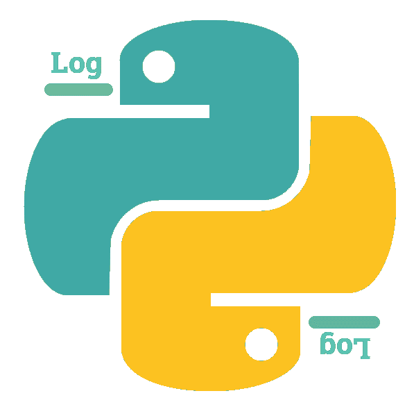
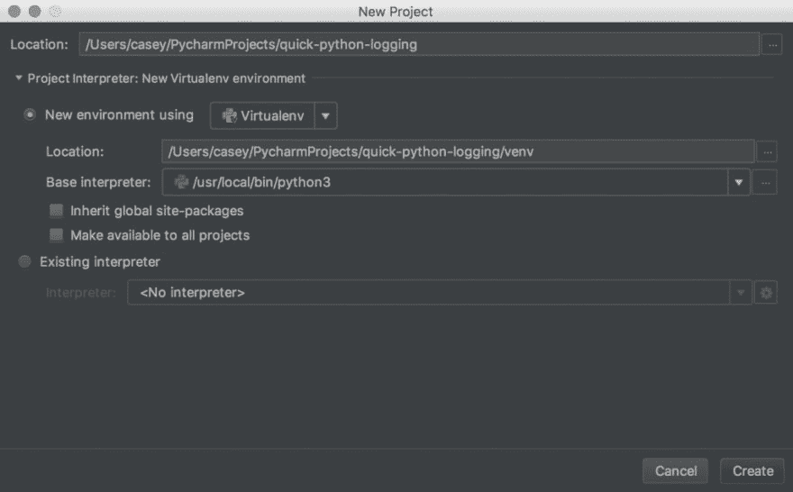
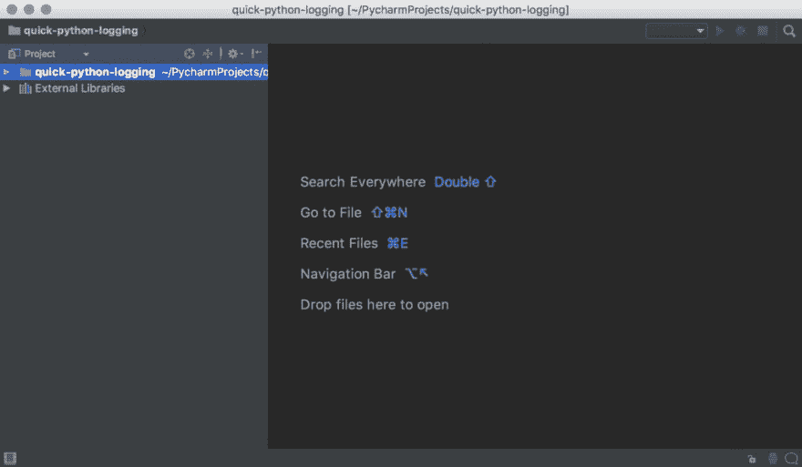
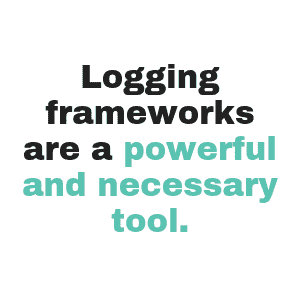

# Python 日志记录快速入门

> 原文：<https://dev.to/scalyr/get-started-quickly-with-python-logging-1o7b>

从以前关于如何让[开始使用 C#](https://www.scalyr.com/blog/get-started-quickly-csharp-logging/) 和 [Java](https://www.scalyr.com/blog/get-started-quickly-java-logging/) 进行日志记录的文章中，今天我们将看看如何快速使用 Python 日志记录。

即使你已经读过前面的文章，这篇文章也值得一读。它将涵盖新的领域，比如 Python 中应用程序日志的基础知识和其他一些东西，比如

*   配置日志模块。
*   记录什么以及为什么。
*   日志记录的安全含义。

你还在等什么？继续阅读，让我们建立一个简单的项目开始工作。

[ ](https://res.cloudinary.com/practicaldev/image/fetch/s--uV2V7u44--/c_limit%2Cf_auto%2Cfl_progressive%2Cq_auto%2Cw_880/https://library.scalyr.com/2018/07/19175338/Python-Scalyr-Colors-with-Log.png) <-更多- >

## 可行的最简单的 Python 日志记录

对于这个演示，我将使用 JetBrain 的 PyCharm IDE 的免费社区版。如果你以前没有用过它，那么[下载](https://www.jetbrains.com/pycharm/download/)并安装它。一旦你安装了 PyCharm，打开它。

在“欢迎”屏幕上，单击“创建新项目”

[](https://res.cloudinary.com/practicaldev/image/fetch/s--mMMzFgl7--/c_limit%2Cf_auto%2Cfl_progressive%2Cq_auto%2Cw_880/https://staging-design.scalyr.com/wp-content/uploads/2018/07/pycharm-create-new-project.png)

[](https://res.cloudinary.com/practicaldev/image/fetch/s--D2aOz1nS--/c_limit%2Cf_auto%2Cfl_progressive%2Cq_auto%2Cw_880/https://library.scalyr.com/2018/02/30185233/pycharm-create-new-project-1024x635.png)

在下一个屏幕上，我们需要设置一些选项。首先，设置位置。它应该默认为 PyCharm 项目的位置。你可以给这个项目起任何名字。我把我的叫做“快速 python 日志”展开“位置”选项下面的部分，您将看到与 Python 虚拟环境和解释器相关的选项。如果这不是为 Python3 设置的，请参考这个[指南](https://www.jetbrains.com/help/pycharm-edu/configuring-python-interpreter.html)，它会让你开始运行。

一旦你有了所有这些选项，继续点击“创建”

[ ](https://res.cloudinary.com/practicaldev/image/fetch/s--ULgBdrrY--/c_limit%2Cf_auto%2Cfl_progressive%2Cq_auto%2Cw_880/https://staging-design.scalyr.com/wp-content/uploads/2018/07/pycharm-project-setup.png) [ ](https://res.cloudinary.com/practicaldev/image/fetch/s--Jw4KqRTj--/c_limit%2Cf_auto%2Cfl_progressive%2Cq_auto%2Cw_880/https://library.scalyr.com/2018/02/30185303/pycharm-project-setup-1024x635.png)

PyCharm 将为我们创建一个新的虚拟环境，一两分钟后，我们将有一个空的 Python 项目准备好开始编写代码。让我们创建一个新的 Python 文件，方法是右键单击项目名称，并从“新建”子菜单下拉菜单中选择“新建 Python 文件”。

[ ](https://res.cloudinary.com/practicaldev/image/fetch/s--R4joBirx--/c_limit%2Cf_auto%2Cfl_progressive%2Cq_auto%2Cw_880/https://staging-design.scalyr.com/wp-content/uploads/2018/07/pycharm-empty-project.png) [ ](https://res.cloudinary.com/practicaldev/image/fetch/s--sG9QOOB---/c_limit%2Cf_auto%2Cfl_progressive%2Cq_auto%2Cw_880/https://library.scalyr.com/2018/02/30185324/pycharm-empty-project-1024x597.png)

叫它 main.py。

[](https://res.cloudinary.com/practicaldev/image/fetch/s--1hInulY7--/c_limit%2Cf_auto%2Cfl_progressive%2Cq_auto%2Cw_880/https://staging-design.scalyr.com/wp-content/uploads/2018/07/pycharm-new-python-file.png)

[](https://res.cloudinary.com/practicaldev/image/fetch/s--4xQUfIDM--/c_limit%2Cf_auto%2Cfl_progressive%2Cq_auto%2Cw_880/https://library.scalyr.com/2018/02/30185339/pycharm-new-python-file.png)

继续用下面的代码更新我们新的 main.py 文件:

```
if __name__ == "__main__":
    print("Hello, Python!")

```

现在，让我们来验证您的解释器设置是否正确。进入`Run` > `Run 'Main'`或者使用快捷键`Shift` + `F10` (Windows 和 Linux)或者`Control` + `R` (Mac)。如果一切都设置正确，PyCharm 将打开运行输出窗口，在这里我们将看到我们的消息。它应该是这样的:

[ ](https://res.cloudinary.com/practicaldev/image/fetch/s--UUdi6wrY--/c_limit%2Cf_auto%2Cfl_progressive%2Cq_auto%2Cw_880/https://staging-design.scalyr.com/wp-content/uploads/2018/07/pycharm-run.png) [ ](https://res.cloudinary.com/practicaldev/image/fetch/s--8Aod18G4--/c_limit%2Cf_auto%2Cfl_progressive%2Cq_auto%2Cw_880/https://library.scalyr.com/2018/02/30185400/pycharm-run-1024x189.png)

虽然我们可以使用 print 语句向控制台显示消息，但是谁没有这样做来调试问题呢？-这不是我们在任何应用程序中处理日志的理想方式。应用程序日志不仅仅是将消息打印到屏幕上。

## 什么是应用程序日志？

那么什么是应用程序日志记录呢？嗯，如果你碰巧读过 [C#日志文章](https://www.scalyr.com/blog/get-started-quickly-csharp-logging/)，你就会知道那篇文章中给出的应用程序日志的定义是

> 应用程序日志记录包括将有关应用程序运行时行为的信息记录到更持久的介质中。

日志语句中可能会出现许多信息。应用程序通常与我们将要记录的内容有很多共同点。您的应用程序在记录业务流程时可能还需要其他信息，考虑这些信息会很有用。

从概念上讲，我们希望记录任何可以让我们深入了解应用程序运行时的行为的东西。我们还将保存这些消息，供以后查看和分析。

## 伐木的动机是什么？何必呢？

想象一下这种非常常见的场景。您最近完成了一个应用程序的重大升级，并且刚刚发布到生产环境中。所有的生产测试都通过了。周末到了，是时候坐下来放松一下了——或者事实证明，也不尽然。

[](https://res.cloudinary.com/practicaldev/image/fetch/s--Emphs2FO--/c_limit%2Cf_auto%2Cfl_progressive%2Cq_auto%2Cw_880/https://library.scalyr.com/2018/02/30185449/Is-there-some-unknown-factor-that-might-cause-this-application-to-fail.png) 报告开始传来，说有东西不工作了，于是你登录并查看日志...除了你看不到任何问题。没有出现异常，也没有给出应用程序运行不正常的其他指示。围绕几个业务流程对日志记录进行彻底检查的工作正在进行中，但是在上一个季度的发布中没有时间去做这件事。

看，在许多这样的情况下，组织没有适当的工具或记录。应用真的可以吗？它通过了质量保证验收测试，但是*那些*可以吗？他们够好吗？在生产的关键时刻，是否有一些未知的因素可能导致这个应用程序失败？

正确记录您的应用程序可以回答所有这些问题，甚至更多。日志记录可以为我们提供关于应用程序健康状况的信息，并允许我们

*   重构业务流程中的问题。
*   在违反安全的情况下审查请求和上下文信息。
*   为营销分析提供数据。
*   监控违反政策和法规的情况。

您需要在应用程序中使用日志策略，以确保记录和管理正确的数据。

## 你该做什么(和不该做什么！)日志

我们可以在日志文件中放入很多东西，但是有些信息我们绝对不应该包含在日志输出中。您不应记录任何形式的敏感商业数据或[个人身份信息(PII)](https://en.wikipedia.org/wiki/Personally_identifiable_information) 。

敏感的业务数据有点笼统。什么是敏感的，什么不是敏感的，这取决于行业，但至少，您不应该记录以下内容:

*   账号
*   信用卡号码(包括有效期和 CVV 代码)
*   密码
*   会话标识符
*   加密密钥

个人身份信息包括任何可用于识别个人身份的信息。该列表并不详尽，但它将包括以下内容

*   社会安全号码
*   生日
*   全名
*   电子邮件地址
*   驾照号码

简而言之，对待你的日志，就好像它们有一天会公开一样。日志数据是攻击者可以利用的重要信息来源。开放 Web 应用安全项目(OWASP)T1 有一个很棒的关于日志记录的 T2 备忘单 T3，绝对值得一读以获取更多信息。

## 进入 Python 日志框架

让我们回到一些代码。Python 有一个非常广泛的标准库，这已经不是什么秘密了。Python [logging](https://docs.python.org/3/library/logging.html) 模块是一个非常强大的日志框架，所以让我们将它集成到我们的应用程序中。

继续修改 main.py 来导入日志库，并向我们的应用程序添加一些日志消息。

```
import logging

if __name__ == "__main__":
    logging.warning("I'm a warning!")
    logging.info("Hello, Python!")
    logging.debug("I'm a debug message!")
```

现在，如果你运行这个，你可能会看到一些意想不到的东西。

[ ](https://res.cloudinary.com/practicaldev/image/fetch/s--_Ndkoyc8--/c_limit%2Cf_auto%2Cfl_progressive%2Cq_auto%2Cw_880/https://staging-design.scalyr.com/wp-content/uploads/2018/07/pycharm-demo-log-warning.png) [ ](https://res.cloudinary.com/practicaldev/image/fetch/s---osozSjk--/c_limit%2Cf_auto%2Cfl_progressive%2Cq_auto%2Cw_880/https://library.scalyr.com/2018/02/30185514/pycharm-demo-log-warning-1024x193.png)

我们的其他消息在哪里？为什么只打印了警告信息？嗯，这跟[测井级别](https://www.scalyr.com/blog/logging-levels/)有关。我们稍后将处理这些，但是让我们先来看看关于我们的日志代码的一些其他的事情。

虽然我们可以继续使用我们的日志库将消息打印到控制台，但这可能不会长期有效。我们知道我们需要持久化信息，那么为什么不是文件呢？这很容易做到，但是我们需要看看如何配置日志模块。

## 配置记录器

Python 日志模块分为四个不同的抽象:*记录器*、*处理器*、*过滤器*和*格式化器*。

*记录器*公开了我们用来记录应用程序事件的主要接口。*处理程序*，嗯，处理日志事件发送到哪里。使用不同的处理程序，我们可以让日志事件进入不同的文件，或者一些进入一个文件，其余的进入 syslog。我们可以通过使用*过滤器*来改变日志事件的内容或者给事件添加上下文信息。最后，log *格式化器*允许我们在写入数据时指定数据的布局。

我们还可以在不同的模块和类级别配置日志记录。这使我们能够更好地控制记录的内容和发送到的位置。

## 编辑代码

让我们将当前的日志记录演示写入一个日志文件。我们将在日志模块上使用 basicConfig 方法来为我们的应用程序快速配置日志。打开 main.py 并将其更改为以下内容:

```
import logging

logging.basicConfig(filename='demo.log')

if __name__ == "__main__":
    logging.warning("I'm a warning!")
    logging.info("Hello, Python!")
    logging.debug("I'm a debug message!")
```

运行这个程序，您会看到在您的项目目录中创建了一个名为 demo.log 的文件。打开它，您会发现它包含以下内容:

[ ](https://res.cloudinary.com/practicaldev/image/fetch/s--_i1WYOPp--/c_limit%2Cf_auto%2Cfl_progressive%2Cq_auto%2Cw_880/https://library.scalyr.com/2018/02/30185534/pycharm-demo-log.png) [ ](https://res.cloudinary.com/practicaldev/image/fetch/s--J0zHpPbH--/c_limit%2Cf_auto%2Cfl_progressive%2Cq_auto%2Cw_880/https://staging-design.scalyr.com/wp-content/uploads/2018/07/pycharm-demo-log.png)

在我们继续之前，让我们将剩余的消息写入日志文件。早些时候，我提到由于日志级别的原因，我们的其他消息没有出现。让我们改变这一点，这样我们就可以记录所有内容。

转到 main.py 并更新配置:

```
import logging

logging.basicConfig(filename='demo.log', level=logging.DEBUG)

if __name__ == "__main__":
    logging.warning("I'm a warning!")
    logging.info("Hello, Python!")
    logging.debug("I'm a debug message!")
```

现在运行应用程序。您将在文件中看到我们的其他消息。

[ ](https://res.cloudinary.com/practicaldev/image/fetch/s--wkWkDal5--/c_limit%2Cf_auto%2Cfl_progressive%2Cq_auto%2Cw_880/https://staging-design.scalyr.com/wp-content/uploads/2018/07/pycharm-demo-log-all.png) [ ](https://res.cloudinary.com/practicaldev/image/fetch/s--S8nqvFEr--/c_limit%2Cf_auto%2Cfl_progressive%2Cq_auto%2Cw_880/https://library.scalyr.com/2018/02/30185614/pycharm-demo-log-all.png)

那么，我们做了什么？日志框架将记录的消息类型分为不同的类别或严重级别。基于日志框架，实际的细分可能有所不同。Python 使用以下优先级，从最高优先级开始:

*   批评的
*   错误
*   警告
*   信息
*   调试
*   Notset

默认情况下，Python 日志记录模块设置为警告日志记录级别。这意味着任何处于警告级别或更高优先级的请求都会被记录到目标。其余的被忽略。这就是为什么我们的信息和调试消息没有出现在日志中。

## 格式化我们的消息

既然我们已经将日志消息写入了持久化介质，我们需要使我们的消息更加有用。让我们配置一个格式化程序来创建一个更好的布局，并包含一些额外的信息来帮助调试我们的应用程序。

将以下内容添加到 main.py 中:

```
import logging

logging.basicConfig(filename='demo.log',
                    level=logging.DEBUG,
                    format='%(asctime)s - %(name)s - %(threadName)s -  %(levelname)s - %(message)s')

if __name__ == "__main__":
    logging.warning("I'm a warning!")   
    logging.info("Hello, Python!")
    logging.debug("I'm a debug message!")
```

现在再次运行应用程序并打开 demo.log 文件。

[ ](https://res.cloudinary.com/practicaldev/image/fetch/s--JUwCHCMt--/c_limit%2Cf_auto%2Cfl_progressive%2Cq_auto%2Cw_880/https://library.scalyr.com/2018/02/30185637/pycharm-demo-log-format-1024x136.png) [ ](https://res.cloudinary.com/practicaldev/image/fetch/s--kiNFYS8v--/c_limit%2Cf_auto%2Cfl_progressive%2Cq_auto%2Cw_880/https://staging-design.scalyr.com/wp-content/uploads/2018/07/pycharm-demo-log-format.png)

现在我们有进展了。我们的小记录器更有用。那么这个格式语句是怎么回事呢？以下是我们日志文件中的信息消息:

```
2018-01-27 12:54:48,312 - root - MainThread - INFO - Hello, Python!
```

我们来分解一下。

> 2018-01-27 12:54:48,312

我们记录的第一件事是通过 Python asctime 变量的时间戳。这是一个符合 ISO8601 标准的时间戳。

> 根

这是记录器的名称。您可以将日志记录器视为一棵树，因为我们没有给我们的日志记录器命名，所以默认情况下我们被赋予根日志记录器。

> 主线程

MainThread 是当前线程的名称。这在登录多线程应用程序时非常有用。

> 信息

这是消息的日志记录级别。

> 你好，蟒蛇！

最后，我们有消息本身。

## 现在怎么办？

日志框架是一个强大而必要的工具。我们可以用日志模块做更多的事情，比如为多个模块配置日志或者使用一个配置文件。我们还需要决定一个总体的[日志策略](https://www.scalyr.com/blog/application-logging-practices-adopt/)。

[](https://res.cloudinary.com/practicaldev/image/fetch/s--kbHwfawS--/c_limit%2Cf_auto%2Cfl_progressive%2Cq_auto%2Cw_880/https://library.scalyr.com/2018/02/30185710/Logging-frameworks-are-a-powerful-and-necessary-tool-1.png) 有更多的选项可以用来配置记录器、处理程序和格式化程序。我鼓励您进行试验，看看什么最适合您的特定应用。Python 文档中有很多关于[日志模块](https://docs.python.org/3/library/logging.html#module-logging)的信息，以及[基本](https://docs.python.org/3/howto/logging.html#logging-basic-tutorial)和[高级](https://docs.python.org/3/howto/logging.html#logging-advanced-tutorial)日志指南。

请继续关注 Scalyr 的博客，获取更多关于日志和日志最佳实践的文章。Scalyr 使[成为一个日志聚合工具](https://scalyr.com/blog/what-is-log-aggregation-and-how-does-it-help-you/)，这意味着一旦你有大量数据分布在许多文件中，它们将帮助你把它们放在一个地方，搜索它们，并可视化其中的数据。

现在，看一看您正在使用的应用程序，并考虑当前使用的日志记录策略。很可能还有改进的空间，所以你还在等什么？

*本文由[凯西·邓纳姆](http://www.caseydunham.com/)撰写。Casey 最近开办了自己的安全业务，他因在应用程序安全的所有领域的独特方法而闻名，这源于他 10 多年的专业软件开发职业生涯。他的优势包括安全 SDLC 开发咨询；威胁建模；开发者培训；以及审核 web、移动和桌面应用程序的安全缺陷。*