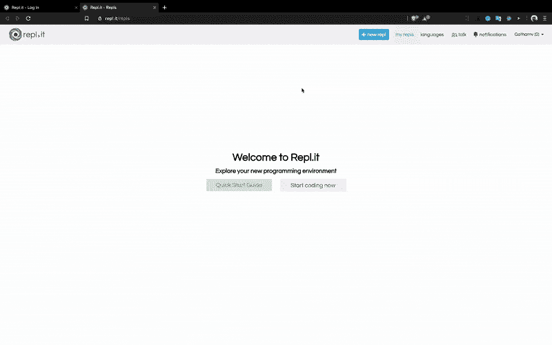
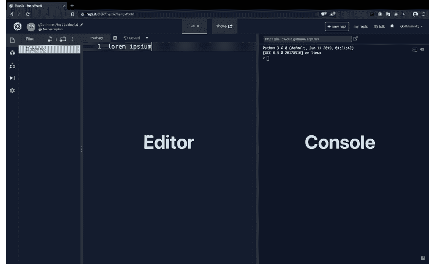
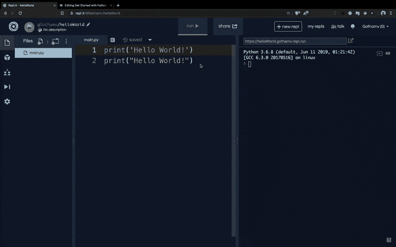

# 10 分钟内开始使用 Python

> 原文：<https://dev.to/gothamv/get-started-with-python-in-under-10-minutes-3a5j>

所以你想学习如何编码？你以前没有编码经验，还是来自另一种编程语言？你来对地方了。这是用 Python 编程的初学者终极指南。我们不会深入编程。但是我们将尽快开始编写代码。所以让我们开始吧！

## 第一部分:设置编码环境

你可以在你的终端、VSCode 甚至是 PyCharm 这样的专用 IDE 上写 Python 代码。但是因为你是初学者，我们不想你浪费时间来设置一个。你可以以后再做。现在，您可以通过云计算获得一个简单快捷的 IDE 设置。

转到 [Repl.it](https://repl.it) 。它为您提供了一个在一个地方学习、构建、协作和托管所有内容的即时 IDE。

1.  创建新的副本。

2.  选择 Python(不是 Python 2.7)。

3.  命名您的 Repl。

4.  创建副本。

[ ](https://res.cloudinary.com/practicaldev/image/fetch/s--cnArY3xe--/c_limit%2Cf_auto%2Cfl_progressive%2Cq_66%2Cw_880/https://cdn-images-1.medium.com/max/2000/1%2AQXQFArTYxQlZfFzI9YyysQ.gif) *如有困惑，请跟随 GIF。*

现在我们有了一个 IDE，让我们写第一行代码吧！

## 第二部分:我们写点代码吧！

在您开始编码之前，在任何编程语言中，从编写代码打印“Hello World！”开始都是一个传统所以让我们不要打破传统，就这么做吧！

## 1。让我们用 Python 打印东西:

repl 的中间部分是你写代码的地方。右边叫做控制台。就当是你和 python 之间的中间人吧。控制台是您对 python 程序进行输入/输出的地方。

[](https://res.cloudinary.com/practicaldev/image/fetch/s--gw0wB128--/c_limit%2Cf_auto%2Cfl_progressive%2Cq_auto%2Cw_880/https://cdn-images-1.medium.com/max/6816/1%2ACNoFX5BkVE5aLSN_vPMnKg.png)

为了在控制台上打印一些东西，我们使用 print()语句。指定要在“”或“”引号内打印的文本。

```
print('Hello World!')
print("Hello World!") 
```

Enter fullscreen mode Exit fullscreen mode

在控制台中写完上面的代码后，点击顶部的 Run 按钮。

[](https://res.cloudinary.com/practicaldev/image/fetch/s--eTfs6UDi--/c_limit%2Cf_auto%2Cfl_progressive%2Cq_66%2Cw_880/https://cdn-images-1.medium.com/max/2000/1%2AmH4OsX34RB1-mmU18PbEBQ.gif)

恭喜你！您已经编写了第一段 Python 代码！现在让我们继续写一些代码，实际做一些事情。

现在你应该熟悉如何使用 repl.it 了。从现在开始，我将把 repl 直接嵌入到本文中，这样你就不必不停地切换标签，这很快就会变得非常烦人。因此，您可以编写自己的代码并在这里运行它们！

## 2。Python 中的注释

注释用来解释你的代码行做了什么。您可以使用“#”符号编写注释。' # '告诉 python 忽略该行，不要执行它。您甚至可以在现有代码行之前添加#符号，使其成为注释。您也可以用' ' ' '开始和结束多行注释。为了清楚起见，请参考下面的示例。

点击下面绿色的播放按钮来执行代码。您也可以在这里编辑代码。添加代码行并运行它们！

[https://repl.it/@Gothamv/comments?lite=true](https://repl.it/@Gothamv/comments?lite=true)

## 3。Python 中的变量

把变量想象成一个盒子，你在里面储存东西。你可以储存数字，字符，句子等等。现在让我们处理数字、字符和句子(字符串)。

### 让我们给一个变量赋一个数。

等号' = '是一个赋值运算符，用于给变量赋值。

```
myVariable = 13
myVariable2 = 12.6969 
```

Enter fullscreen mode Exit fullscreen mode

您可以继续使用 type()语句检查变量的类型，并在 type()内传递变量名。

```
type(myVariable)
type(myVariable2)

# To view this in the console pass the above statement inside the print function like this :

print(type(myVariable))
print(type(myVariable2)) 
```

Enter fullscreen mode Exit fullscreen mode

当您运行上面的代码时，您会看到返回了 myVariable 和 myVariable2。

你可能已经猜到了。这是因为 13 是一个整数，12.6969 是一个十进制数，在编程界我们称之为浮点数。

### 让我们给一个变量赋值一个字符/字符串。

要将字符赋给变量，必须用' '(单引号)或" "(双引号)将变量的值括起来。

按照惯例，字符长度为 1，并使用' '(单引号)。
字符串是句子，或者有一个以上的字符，通常用
" "(双引号)括起来。

```
char1 = 'a'
string1 = "Musk Cult" 
```

Enter fullscreen mode Exit fullscreen mode

运行下面的代码，自己看看！

[https://repl.it/@Gothamv/variablesInPython?lite=true](https://repl.it/@Gothamv/variablesInPython?lite=true)

## 4。Python 中的算术运算

还记得我们在上面创建的数值变量吗？你可以对它们进行数学运算。让我们看看数学中一些基本算术运算的实现。

下面的代码非常简单。运行代码并检查它。

```
myVariable1 = 6
myVariable2 = 3 
```

Enter fullscreen mode Exit fullscreen mode

### 加法+:

```
myVariable + myVariable2

# To see the result on the console :
print(myVariable + myVariable2) 
```

Enter fullscreen mode Exit fullscreen mode

### 减法:

```
print(myVariable - myVariable2) 
```

Enter fullscreen mode Exit fullscreen mode

### 乘法*:

```
print(myVariable * myVariable2) 
```

Enter fullscreen mode Exit fullscreen mode

### 师/:

```
print(myVariable / myVariable2) 
```

Enter fullscreen mode Exit fullscreen mode[https://repl.it/@Gothamv/arithmetic?lite=true](https://repl.it/@Gothamv/arithmetic?lite=true)

## 5。打印变量

以前，我们使用 print 语句直接打印算术运算的结果。但是有一个更好的方法来做到这一点；将结果存储在另一个变量中。

```
result = myVariable + myVariable2
print(result) 
```

Enter fullscreen mode Exit fullscreen mode

您还可以将变量值与 print 语句一起打印出来。让我给你看看我在说什么。运行下面的代码。

```
print("The result of addition is :",result) 
```

Enter fullscreen mode Exit fullscreen mode[https://repl.it/@Gothamv/printingVariables?lite=true](https://repl.it/@Gothamv/printingVariables?lite=true)

因此，我们可以拥有有意义的语句，而不是仅仅在控制台中打印一个数字。

您还可以在 print 语句中指定希望打印变量的特定位置。

```
print("%s is the value of myVar!" % myVar) 
```

Enter fullscreen mode Exit fullscreen mode

我们在 print 语句中的字符串后面使用了' % '，而不是逗号。“%s”被称为字符串文字，用于指定您希望变量值在字符串中的位置。

```
print("The result of addition of %s and %s is : %s" % (myVar,myVar2,result)) 
```

Enter fullscreen mode Exit fullscreen mode

这里我们想要放置多个变量，所以在%后面添加一个括号( )，并按照您希望的顺序在 print 语句中提到这些变量，用逗号分隔。运行下面的代码，自己看看。

[https://repl.it/@Gothamv/sPrinting?lite=true](https://repl.it/@Gothamv/sPrinting?lite=true)

## 6。从用户那里获得输入。

以前我们自己给变量赋值。相反，我们可以从用户那里获得变量的值。方法如下:

我们使用 input()语句。将变量等同于输入语句。在你的语句中，用单引号或双引号括起来。

```
myVar = input("Enter the First Number : ")
myVar2 = input("Enter the Second Number : ") 
```

Enter fullscreen mode Exit fullscreen mode

如果你检查 myVar 和 myVar2 的类型，它会是。这是因为默认情况下输入函数的类型是字符串。但是我们只能对数字进行数学计算。因此，为了将它转换成一个数字，我们做了一件叫做“类型转换”的事情。我们将输入语句包装在 int()中。这会将字符串类型转换为整数类型。如果要处理小数，请使用 float()。

```
myVar = int(input("Enter the First Number : "))
myVar2 = int(input("Enter the Second Number : ")) 
```

Enter fullscreen mode Exit fullscreen mode[https://repl.it/@Gothamv/inputFromUser?lite=true](https://repl.it/@Gothamv/inputFromUser?lite=true)

现在你知道了！你已经写了你的第一段代码了！我们将在接下来的文章中学习更多关于编程和 python 的知识！

### 基本就这么多了。