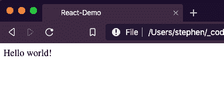

# 启动并运行基本的 React 应用程序

> 原文：<https://dev.to/stephencweiss/getting-a-basic-react-app-up-and-running-28im>

在这一点上，我对 React 感觉相当舒服，但当我不得不回到基础，在这个周末启动并运行一个应用程序时，我发现我忘记的比我想象的要多。

既然我固执(傻？)又不想用`npx create-react-app`自举，只好查了几个东西。 <sup>1</sup> 下面是我在启动和运行一个基本的 React 应用时学到的一些东西。

快速预览你可以通过阅读了解到的内容:

1.  React 如何适应更大的网站(例如，如何将 HTML 与 React 融合)
2.  如何装配多个 React 组件(这些组件可以扩展成完全成熟的功能)
3.  如何使用 Webpack 和 Babel 捆绑 React

## 向网站添加 React

React 团队有一个很棒的页面，可以让 React 快速进入现有网站。不幸的是，在我的例子中，我没有任何进展，所以我需要从更上游的地方开始。

让我们从最基本的开始:

1.  为你的项目制作一个目录，`mkdir <the-name-of-my-project>`
2.  导航进去，`cd <the-name-of-my-project>`
3.  用`git`和`npm` ( `git init`和`npm init`)初始化回购。

用一些文件和文件夹搭建一个基本的应用程序结构。这是我的样子

```
.
├── .gitignore
├── .prettierrc
├── dist
│ └── index.html
├── package-lock.json
├── package.json
├── src
│ └── index.js
└── webpack.config.js 
```

### 设置 HTML

在非常基础的层面上，React 通过覆盖 DOM 中的单个元素来工作。按照惯例，这是通过让一个空的`<div>`元素带有一个 React-DOM 能够识别和覆盖的`id=“app”`来完成的。

为了清楚起见，我稍微偏离了一下(当我稍后添加一个*秒*反应组件时，这将变得更加清楚)。这是我的第一个`dist/index.html`

```
<!DOCTYPE html>
<html lang="en">
<head>
  <meta charset="UTF-8">
  <meta name="viewport" content="width=device-width, initial-scale=1.0">
  <meta http-equiv="X-UA-Compatible" content="ie=edge">
  Toast-Demo
</head>
<body>
  <div id="React-App"></div>
  <script src="bundle.js"></script>
</body>
</html> 
```

有了 HTML，我们现在需要一个实际的 React 组件。

(我们还会回到`<script>`标签。)

### 我们的第一个反应元件

这是我放入`src/index.js`的

```
import ReactDOM from ‘react-dom’;
import React from ‘react’;

const HelloWorld = () => {
  return (
    <div>
      Hello world!
    </div>
  )
};

ReactDOM.render(
  <HelloWorld/>, document.getElementById(‘React-App’)
) 
```

由此，很容易看出 ReactDOM 是如何呈现`HelloWorld`组件的——它*在 Id`’React-App’`的位置替换了文档`index.html`中的*。

如果此时，我们试图在浏览器中打开`index.html`，我们会看到一个空白屏幕。这是因为即使 React 替换了 DOM 中的`div`,它也不能被解释。

我们需要构建我们的应用程序并创建包。

### 使用 Webpack 和 Babel 捆绑我们的应用

Babel 是一个 Javascript 编译器——一个应用程序，它可以转换 Javascript 未来版本中编写的代码，并将其翻译成浏览器兼容版本。Babel 可以提供帮助的几个方面在他们文档的第一页都有突出显示:

> *   Transformational grammar
> *   The missing Polyfill feature in your target environment (via [@ babel/polyfill](https://babeljs.io/docs/en/babel-polyfill) )
> *   Source code conversion (codemods)
> *   Wait! (Check out these [videos](https://babeljs.io/videos.html) for inspiration)

这是通过各种插件和梯子完成的，但应该清楚的是，它既*非常*易于设置，又*非常*强大。

Webpack 使用 Babel(在我们的例子中)来协调整个过程，并通过将它用作加载器和指定某些选项来创建一个包。另一个约定(类似于 React 的`id=“app”`)是调用 Webpack 的输出`bundle`。您可以随意命名它，并在 webpack 配置中指定它。还应该注意的是，Webpack 比我在这里演示的要*强大得多*，我在这里演示只是为了说明如何编译 Javascript 和 JSX 文件，以便在我们的演示应用程序中使用。

在根目录中，我们的`webpack.config.js`文件有如下设置:

```
const path = require(‘path’)

module.exports = {
  entry: ‘./src/index.js’,
  output: {
    filename: ‘bundle.js’,
    path: path.resolve(__dirname, ‘dist’)
  },
  module: {
    rules: [
      {
        test: [/\.js$/, /\.jsx?$/],
        exclude: /node_modules/,
        loader: 'babel-loader’,
        options: {
          presets: [‘@babel/env’, ‘@babel/react’,]
        }
      },
    ],
  }
} 
```

需要注意的事项:

*   入口点——这是 Webpack 想要捆绑的东西
*   输出——这是捆绑过程的产品的去向(您可以看到我们已经将它命名为 int `bundle.js`)。
*   模块——这些是捆绑工作中使用的工具

我在`webpack.config.js`的选项中设置预设名称的方式意味着我*不*需要一个`.bablerc`文件 <sup>4</sup>

### 依赖关系

我们在这里使用了相当多的依赖项，所以值得看一下`package.json`

```
{  "name":  "react-playground",  "version":  "0.0.1",  "description":  "a playground to understand react, webpack, and babel",  "main":  "index.js",  "scripts":  {  "test":  "echo \"Error: no test specified\" && exit 1",  "build":  "webpack",  },  "keywords":  [  "react"  ],  "author":  "Stephen Weiss <stephen.c.weiss@gmail.com>",  "license":  "MIT",  "devDependencies":  {  "@babel/core":  "^7.5.5",  "@babel/preset-env":  "^7.5.5",  "@babel/preset-react":  "^7.0.0",  "@babel/preset-typescript":  "^7.3.3",  "babel-loader":  "^8.0.6",  "prettier":  "^1.18.2",  "webpack":  "^4.39.3",  "webpack-cli":  "^3.3.7"  },  "dependencies":  {  "react":  "^16.9.0",  "react-dom":  "^16.9.0"  }  } 
```

### 启动应用程序

现在应用程序已经配置好了，我们有了一个 React 组件，并且我们已经设置了我们的 Webpack，我们可以开始构建了。

在 shell 中，运行我们的脚本`npm run build` ( `npx webpack —config webpack.config.js`也可以，如果你不想安装`webpack`作为依赖)。

完成后，您应该会看到一个新文件`dist/bundle.js`。

现在，当您在浏览器中打开/刷新您的应用程序时，它应该会显示我们的`HelloWorld`组件。

[](///static/341e77df9a6f81d4932d980bee130e32/fd831/hello-world.png)

我承诺过我会回来`<script>`标签:这是应用程序加载的唯一原因。如果没有它，我们会有一个 Javascript 包，但是没有调用它的东西。因此，即使我们已经编译了我们的应用程序，客户端也没有理由调用它，因此不会显示我们的 React 应用程序。

## 添加第二个 React 组件

要添加第二个 React 组件并将其融入现有网站，我们需要做一些更改:

1.  更新我们的`src`目录以包含第二个 React 组件(第一个 React 组件和第二个组件都可以被显著扩展，这只是一个简单的例子)
2.  更新`webpack.config.js`以拥有多个入口点
3.  更新我们的`dist/index.html`,注意不同的 React 组件应该放在哪里。

### Part Deux:一个新的 React 组件

在`src`目录中，我添加了一个`index2.js`(不是一个很棒的名字，但也可以):

```
import ReactDOM from ‘react-dom’;
import React from ‘react’;

const PartDeux = () => {
  return (
    <div>
      PartDeux
    </div>
  )
};

ReactDOM.render(
  <PartDeux/>, document.getElementById(‘React-App-2’)
) 
```

这是另一个非常简单的 React 组件，它将安装到我们的`index.html`中 id 为`React-App-2`的`div`上。

### 修改 Webpack

除了`entry`键:
之外，`webpack.config.js`文件仍然很大

```
const path = require(‘path’)

module.exports = {
  entry: [‘./src/index.js’, ‘./src/index2.js’,],
  ...
} 
```

### 修改 HTML

最后，更新 HTML 以指示第二个组件将去往的地方*:* 

```
<!DOCTYPE html>
<html lang=“en”>
<head>
  <meta charset=“UTF-8”>
  <meta name=“viewport” content=“width=device-width, initial-scale=1.0”>
  <meta http-equiv=“X-UA-Compatible” content=“ie=edge”>
  React-Demo
</head>
<body>
  <h1>
    Here’s my first react entry point
  </h1><div id=“React-App”></div>
  <h1>Here’s my second react entry point</h1>
  <div id=“React-App-2”></div>
  <script src=“bundle.js”></script>
</body>
</html> 
```

### 重新捆绑运行

再次运行 webpack 并在浏览器中打开我们的`index.html`，我现在看到: [](///static/bdf53e079781b6180f95f62f4941e52b/0336a/multiple-components.png) 瞧

## 结论

希望这个演示有助于解释 React 如何安装到 DOM，如何在一个网站中使用多个不同的 React 应用程序，以及如何用 Webpack 和 Babel 协调这一切。我知道我在这个过程中学到了很多！

这个演示的完整代码可以在我的 Github 上找到。 <sup>5</sup>

## 脚注

*   <sup>1</sup> [创建新的 React 应用| React](https://reactjs.org/docs/create-a-new-react-app.html)
*   <sup>2</sup> [添加 React 到网站| React](https://reactjs.org/docs/add-react-to-a-website.html)
*   <sup>3</sup> [什么是巴别塔？|巴别塔](https://babeljs.io/docs/en/)
*   <sup>4</sup> [配置巴别塔|巴别塔](https://babeljs.io/docs/en/configuration#babelrc)
*   <sup>5</sup>T2】react-demo | GitHub

## 资源/附加阅读

*   [教程:如何从头开始设置 React、webpack 和 Babel 7(2019)](https://www.valentinog.com/blog/babel/)
*   [将 React 添加到网站| React](https://reactjs.org/docs/add-react-to-a-website.html)
*   [入门| webpack](https://webpack.js.org/guides/getting-started/)
*   [巴别塔是什么？|巴别塔](https://babeljs.io/docs/en/)