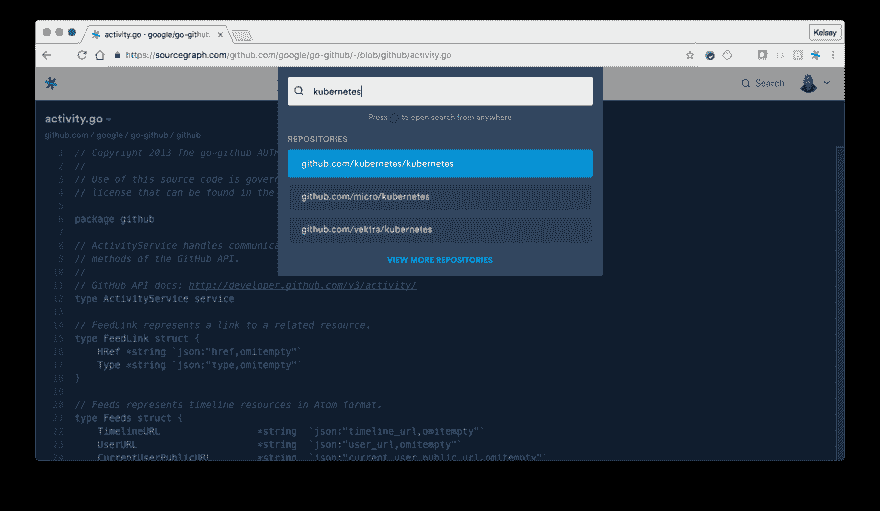

# 开始使用新的代码库

> 原文：<https://dev.to/aswinmprabhu/getting-started-with-a-new-codebase-2n3e>

开发人员花更多的时间阅读和编辑别人写的代码，而不是编写新代码。如果您正在使用的代码库对您来说是完全陌生的，那么这将变得异常困难。有些代码库可以**大**。

在过去的三个月里，我一直在做我的[谷歌代码之夏](https://summerofcode.withgoogle.com/) [项目](https://summerofcode.withgoogle.com/projects/#5444359158235136)。但是在我被 GSoC 选中之前，我必须在 GSoC 网站上寻找适合我的项目。一旦我发现一些有趣的东西，我会克隆他们的库，尝试开始使用他们的代码库，只是为了看看这个项目是否适合我，我是否真的能完成它😄。在经历了这个练习很多次之后，我想我已经收集了一些关于如何尽可能高效地做这件事的技巧。

让我们先从最明显的开始...

### 1。阅读自述文件😲

好的。这是最明显的一个。我甚至不知道为什么我会提到这个。但是不仅仅是 README.md，可能还有一个**contributed . MD**(或者类似的东西..可能是维基)。我认为这对于希望为项目做贡献的人来说更有用。这个文件可以告诉你目录结构、项目架构、 **git 工作流**等等。git 工作流尤其重要。该项目可能有关于如何格式化提交消息或如何命名分支的具体说明。Readme 将提供如何构建项目的信息。所以，我一读完自述文件，我就会**克隆它，构建它，运行它**。

### 2。先做用户，再做开发者

我承认，如果你打算为 kubernetes 这样的东西做贡献，这是很难做到的。但是，如果它是一个网络应用程序或其他东西，在你开始使用它之前，先尝试一下。如果不知道某个东西是做什么的，就很难修复它。我们就到此为止吧。

### 3。找到一个水面点，然后深潜

通过“表面点”，我指的是一个面向用户的界面。这可能是一个 UI 元素，如表单或服务器接口，如 REST API 端点。一旦找到这样一个接口，试着通过**深入其内部工作**来理解它是如何工作的。如果是 API 端点，找到 HTTP 请求的处理函数。然后看看这个函数做什么。如此等等。

### 4。使用全局搜索

搜索比浏览目录结构要好得多。我发现搜索对于**寻找“表面点”**特别有用。假设你正在寻找一个特定的 HTML 表单，知道要搜索什么是很重要的。搜索输入框可能会产生一百个结果。最好搜索像输入框的占位符这样的唯一字符串。在服务器代码库的情况下，搜索像“/posts”这样的端点应该可以。任何一个还算过得去的编辑都会有全局搜索，如果没有，就用 grep、silver searcher、 [ripgrep](https://github.com/BurntSushi/ripgrep) 等工具。

### 5。从测试开始

我认为编写和修复测试是开始新代码库的最好方式。这有助于我理解代码在做什么，并给我足够的**机会接触代码库**，以便以后开始贡献代码。**集成测试**是**了解整个事情如何走到一起的最好方式**。**单元测试**是一个很好的**文档来源**来理解如何使用他们正在测试的代码。

### 6。使用好的开发工具

这个值得扣分。

**答:使用 [sourcegraph](https://about.sourcegraph.com/) -** 试图在 GitHub 上阅读代码就像蒙着眼睛在迷宫中导航。Sourcegraph 是一个非常酷的工具，通过在浏览器中为您提供强大的类似 IDE 的功能，使您可以在浏览器中阅读代码。他们甚至有一个 [chrome 扩展](https://chrome.google.com/webstore/detail/sourcegraph/dgjhfomjieaadpoljlnidmbgkdffpack?hl=en)，在 GitHub 上给你一些这样的功能。

使用一个好的编辑器/IDE - 当导航一个新的代码库时，像“转到定义”和“悬停文档”这样的特性是非常有用的。

c .使用调试器- 当你需要理解一段代码的行为时，调试器非常有用。在像 VSCode 这样的优秀编辑器中逐句通过代码要比用 print 语句乱写代码好得多(尽管没有评判)。调试器也给了我调用栈，这是分析控制流的一个很好的方法。

**d .使用静态代码分析器-** 这些工具通常能让你很好地了解代码库的架构。例如， [go-guru](https://docs.google.com/document/d/1_Y9xCEMj5S-7rv2ooHpZNH15JgRT5iM742gJkw5LtmQ/edit) 是 golang 的一个代码分析工具，它可以回答诸如“哪些具体类型实现了这个接口？”或者“在这个通道上发送的值可能在哪里被接收？”。这些问题是像 VSCode 这样编辑器无法回答的。也存在可以为 C++或 Java 等语言生成 UML 图或 API 概述的工具。

### 7。愚蠢的人——懂英语有助于阅读莎士比亚的作品

啊...糟糕的类比...我知道。我想说的是，我发现当你试图理解一个代码库时，至少了解编程语言的基础知识真的很有帮助。我曾经认为，如果你懂一种语言，你就可以了解所有的语言。后来我发现了哈斯克尔。对于像 haskell 这样的语言来说尤其如此，因为它可能与你所知道的语言完全不同。例如，不仅仅是 haskell，我发现仅仅通过阅读使用它们的代码很难理解 golang 中的并发概念。理解代码库本身就很难，不了解语言原语只会让理解变得更难。

我不认为你需要了解整个代码库来提高工作效率。我的 GSoC 项目有 5 个不同的组件，它们作为独立的过程运行，我只需要使用其中一个组件，并且知道其他组件的 API。此外，当试图分解复杂的架构时，愚蠢的纸笔图工作得很好。

黑客快乐！！