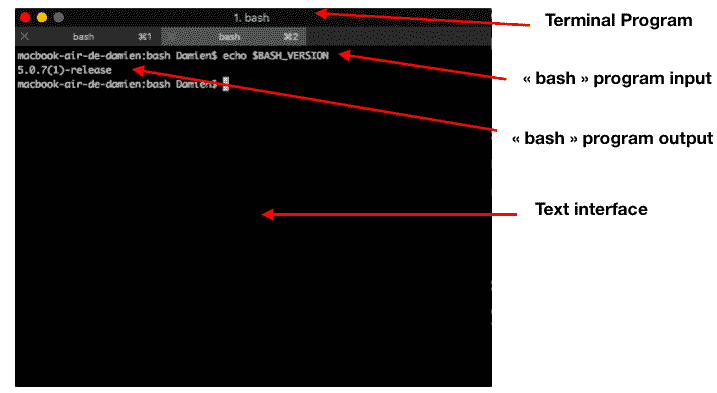

# bash 入门

> 原文：<https://dev.to/damcosset/getting-started-with-bash-1cp0>

# 简介

巴什到底是什么？在做任何研究之前，我很难找到一个简单的解释。

Bash 是你电脑上的一个程序。这个程序被设计来接受你，用户的命令。但是 bash 被编程为执行无数的任务。为了确保这个程序是高效的，一个 bash *语言*已经被创建。这种语言允许您与 bash 程序对话，告诉它该做什么。

*bash* 代表 *Bourne Again shell* ，它是大多数 Linux 发行版和 OS X 中的默认 SHell。有不同种类的 SHell，C shell (csh)、Z shell (zsh)、Korn shell (ksh)...因为我在 OS X 上，bash 是我机器上的默认 shell，所以我将使用它。

## 它是如何接受命令的？

Bash 有两种获取命令的方式:

*   等待用户在命令行界面(通常是您的终端应用程序)中键入命令。这叫做*交互模式*。
*   解释包含要执行的命令的文本文件。这被称为*批处理模式*。

因此，您将没有任何 GUI(图形用户界面)来与 bash 交互。它接受文本命令，它的简单就是它的力量。

## 它有什么作用？

非常...我只触及了表面，但我已经很惊讶了...编辑文件和图像，然后转换它们。移动和复制文件，创建备份。下载代码，编译代码，运行代码...

Bash 是一个了不起的工具。通过学习如何使用一些简单的命令(你已经做到了😉)，你会让你的生活轻松很多。

## 少说话，多敲打？

如果您使用的是 Linux 或 OS X，那么您很可能已经安装了 bash。在 Windows 10 上，我相信你可以激活一个叫做 *Windows 子系统 for Linux* 的东西。

打开一个终端。我使用 iTerm2，但是任何终端都可以。让我们输入第一个命令:

```
$ echo $BASH_VERSION
5.0.7(1)-release 
```

第一个 bash 命令完成！您成功地返回了您正在使用的 bash 版本。

*注意:*终端不是 bash。终端是让文本出现在屏幕上的东西，在界面里面。Bash 是可以在您的终端上运行的许多程序之一。

[](https://res.cloudinary.com/practicaldev/image/fetch/s--mW5FUxXC--/c_limit%2Cf_auto%2Cfl_progressive%2Cq_auto%2Cw_880/https://thepracticaldev.s3.amazonaws.com/i/litkchpd9keql5s486fv.png)

好了，让我们编写我们的第一个 bash 脚本。创建一个名为`script.sh`的文件。

每个 bash 脚本都以一个 *shebang* 开始，它指定了用于运行脚本的命令解释器的完整路径。我的将是:

`#! /usr/local/bin/bash`

都是以 *#开头！*紧随其后的是小路。要获得您的路径，您可以在您的终端中运行`which bash`。

接下来，我们来做一些简单的命令:

```
#! /usr/local/bin/bash

echo "Hello World!"

echo "What is your name?"

read name

echo "Nice to meet you $name!" 
```

为了确保我们的电脑不会爆炸，我们必须尊重我们人民的古老传统，从一个 *Hello World 开始！*。一旦完成，我们使用 *echo* 命令打印一些字符串。我们使用 *read* 命令要求用户输入。我们将输入存储在一个名为 *name* 的变量中，并在终端上打印出来。

启动简单又容易。

现在，我们需要执行这个脚本。但是，出于安全原因，脚本在默认情况下是不可执行的。要更改这一点，您必须运行:

`chmod +x script.sh`

很好，现在运行脚本:

`./script.sh`

```
macbook-air-de-damien:bash Damien$ ./script.sh
Hello World!
What is your name?
Damien
Nice to meet you Damien!
macbook-air-de-damien:bash Damien$ 
```

我用*达米安*填充的变量*名称*在我的终端上被正确打印出来。

让我们编辑我们的脚本来做一些不同的事情，并探索其他命令。

```
#! /usr/local/bin/bash

printf "Hello `whoami`!\n"
printf "Today's date is $(date)\n"
printf "You are here => $(pwd)\n"
read -p "Give me the answer to the universe: " answer
if [ $answer = "42" ]
then echo "Damn right it is!"
else echo "So wrong!"
fi 
```

好的，我们这里有一些东西。

*   前三行打印不同命令的结果( *whoami* 、 *date* 和 *pwd* )。请注意，您可以使用两种语法，`whoami`或\$(whoami)。 *whoami* 给你当前的用户名， *date* 给你日期， *pwd* 给你你所在的目录。

*   我们还使用另一个命令打印到名为 *printf* 的终端。这个命令没有像 *echo* 那样的自动换行符。这就是为什么我们有了 */n* 这个角色。

*   然后，我们有另一个*读*命令。这一次，我们添加了 *-p* 标志来创建一个提示。我们没有使用 *echo* 然后 *read* 的组合，而是将它们组合成一行！

*   最后，我们有一个 if/else 语句。我们将 if 条件放在方括号[]中。

你必须在条件周围加上空格。

不这样做将导致错误。你已经被警告了！

所以，如果答案变量等于 42，我们打印一些东西，否则我们打印一些东西。关键字 *fi* 表示 if 就此停止。忘记这个关键字也会给你一个错误。

## 结论

好了，我觉得这对于 bash 的第一篇文章来说已经足够了。我们已经了解了 bash 是什么，如何与它交互，并使用了一些简单的命令。下次，我们会潜得更深😉

快乐编码