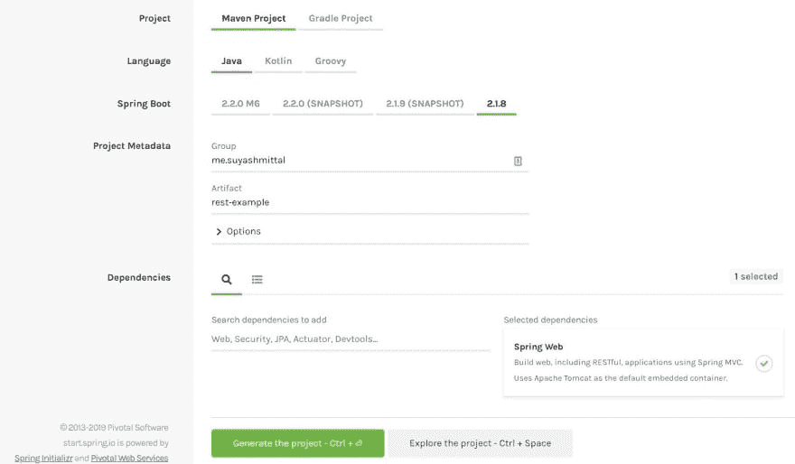

# Spring Boot 2 入门

> 原文：<https://dev.to/suyash01/getting-started-with-spring-boot-2-3doi>

这个 tut 的先决条件会是 **Java** ，关于 **Maven** 和 **Spring** 的一些知识以及如何使用 **Spring 工具套件 4** (或者 Eclipse)。

我们将使用 Spring Boot 创建一个 REST API。我将为这个项目使用 [Spring 工具套件 4](https://spring.io/tools) 和 JDK 1.8。这个项目可以从 [Spring Initializr](https://start.spring.io/) 网站生成，也可以直接从 STS4 生成，这两个都在下面提到过。该项目将使用 [Maven](https://maven.apache.org/) 进行依赖管理。

如果您需要一个定制的组名和工件 id，请继续填写，但这不是强制性的。你也可以使用我在图片中使用的东西。

对于这个项目，我们将只需要 spring boot starter 提供的 web 依赖。

##### 春季初始化 zr

[](https://res.cloudinary.com/practicaldev/image/fetch/s--c47DSQtN--/c_limit%2Cf_auto%2Cfl_progressive%2Cq_auto%2Cw_880/https://thepracticaldev.s3.amazonaws.com/i/cbd2mbbru3rnqf8601o5.jpg)

在依赖项搜索栏中搜索 web 依赖项，如图所示选择它，然后单击**生成项目**按钮。您将得到一个 zip 文件，您需要提取并导入到 STS 中。

##### STS4

在 STS 中创建一个 Spring Starter 项目，并按照你的喜好填写细节，或者你可以使用上图中的细节。

单击 next，然后搜索名为 **Spring Web** 的依赖项，选择它并单击 finish。

##### 编码

现在一切都设置好了，在启动程序给你的基础包下创建一个名为 **controller** 的包，然后在这个包中创建一个名为 **RestExampleController** 的类名。项目结构将如下所示。

[](https://res.cloudinary.com/practicaldev/image/fetch/s--WBsgfdnf--/c_limit%2Cf_auto%2Cfl_progressive%2Cq_auto%2Cw_880/https://thepracticaldev.s3.amazonaws.com/i/cmtqm8voc30ng4ufqz7f.jpg)

这是我们需要为处理我们的请求而创建的唯一文件。控制器类的最终代码如下所示。

```
package me.suyashmittal.restexample.controller;

import org.springframework.web.bind.annotation.GetMapping;
import org.springframework.web.bind.annotation.PostMapping;
import org.springframework.web.bind.annotation.RequestBody;
import org.springframework.web.bind.annotation.RequestMapping;
import org.springframework.web.bind.annotation.RequestMethod;
import org.springframework.web.bind.annotation.RequestParam;
import org.springframework.web.bind.annotation.RestController;

@RestController
public class RestExampleController {

    @RequestMapping("/")
    public String index(@RequestParam(value="name", defaultValue="anonymous") String name) {
        return "Hello " + name;
    }

    @RequestMapping(value = "/getRequest/{name}", method = RequestMethod.GET)
    public String getIndex(@PathVariable("name") String name) {
        return "Hello " + name;
    }

    @GetMapping("/get")
    public String getRequest() {
        return "Hello from /get";
    }

    @PostMapping("/post")
    public String postRequest(@RequestBody String name) {
        return "Hello " + name;
    }
} 
```

##### 理解

`@RestController` annotation 用于告诉框架它应该包含在组件扫描中，并且每个映射的返回值应该作为响应直接发送。

`@RequestMapping`注释用于将请求映射到提到的端点，例如这里的端点是`/`和`/getRequest`。它处理所有类型的请求，这在所有场景中并不理想。因此，我们可以使用第二种方法上面所示的`method`参数来指定请求的类型。

`@GetMapping`和`@PostMapping`是已经指定方法的`@RequestMapping`的特殊形式，分别为`GET`和`POST`。Spring Boot 也为其他 Http 方法提供了类似的注释，如`PUT`、`DELETE`等。

`@RequestParam`用于从`url`中获取参数，我还指定了一个默认值，这不是强制的。例如`http://localhost:8080/?name=suyash`将导致`Hello suyash`。您也可以设置`required`参数，使该参数成为强制参数，反之亦然。

`@PathVariable`用于提取`url`的一部分。例如`http://localhost:8080/getRequest/suyash`将导致`Hello suyash`。

`@RequestBody`用于在`POST`和`PUT`请求的情况下提取尸体。默认情况下，该值必须出现在主体中，但是可以使用`required`参数使其可选。复杂对象可以通过构建一个类来使用。

##### 跑步

您可以通过右键单击项目名称来运行项目，然后作为 Spring Boot 应用程序运行。默认情况下，服务器将在端口`8080`上启动，现在您可以使用任何 REST 客户端(如 Postman)来试验该应用程序。

提示:你可以通过在`resources`文件夹中的`application.properties`文件中定义`server.port=9000`(如果你想在端口 9000 上运行)属性来改变服务器的端口。

##### 作者注

这是我的第一篇文章，欢迎任何建议、推荐或修改。

如果你有任何疑问可以在下面评论，我会尽力解决。