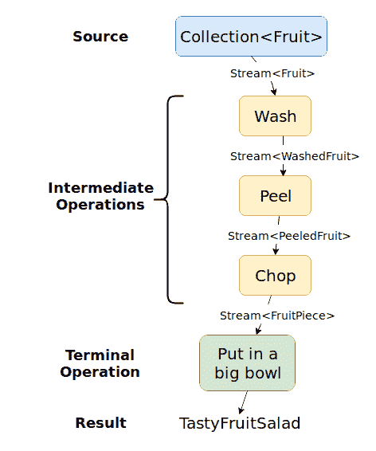
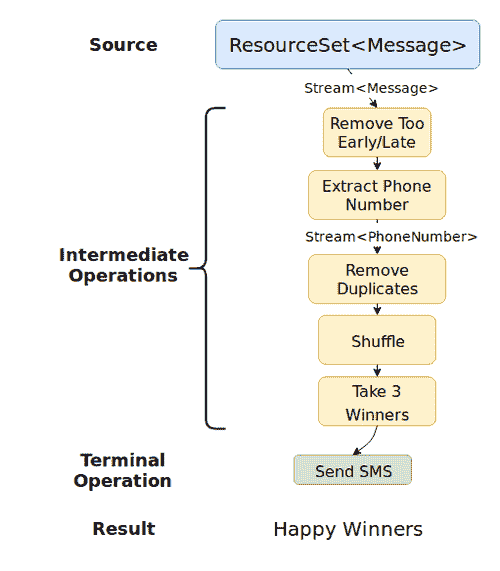

# Java Streams API 入门

> 原文：<https://dev.to/twilio/getting-started-with-the-java-streams-api-k4n>

[Streams API](https://docs.oracle.com/en/java/javase/11/docs/api/java.base/java/util/stream/package-summary.html) 是在 2014 年随着 Java 8 的发布而添加的，所以你几乎可以肯定今天就可以使用它了。它用于通过一系列操作传递一系列对象，因此我们可以用比普通迭代更具功能性的方式编程。尽管如此，当使用集合时，许多开发人员仍然使用经典的`for`循环。

在这篇文章中，我将介绍在谈论流时使用的术语，展示每个术语的一些例子，以及如何将它们结合起来创建紧凑的描述性代码。然后，我将展示我最近编写的一个真实的 Streams 代码示例，用于在抽奖中挑选获奖者。

## 什么是流？

一个**流**是一系列(可能永无止境)的对象。一个流从一个**源**开始。一个流中的对象流经**中间操作**，每个操作产生另一个流，并在结束时聚集在一个**终端操作**中。流是*惰性的*，这意味着源和中间操作什么都不做，直到终端操作需要对象。

如果我们使用 Streams API 制作一份水果沙拉，它可能看起来像这样:

[](https://res.cloudinary.com/practicaldev/image/fetch/s--m16pn5rk--/c_limit%2Cf_auto%2Cfl_progressive%2Cq_auto%2Cw_880/https://s3.amazonaws.com/com.twilio.prod.twilio-doimg/k1NXVLA2JsVUdulilMQfMFpc_R2UanKDNYb7NpjR4vx3lS.width-500.png)

### 流 vs 集合

乍一看，流可能看起来类似于集合——以下是一些不同之处:

**溪流**

*   可能是无限的
*   不允许您直接访问单个项目
*   可能包括按需创建更多元素的方法
*   只能读一次

**收藏**

*   设计用于容纳有限数量的现有对象
*   提供访问单个项目的有效方法
*   可以根据您的需要进行多次访问

使用流和集合的方式大不相同。正如您将在下面看到的，从集合创建流很简单，反之亦然。

## 溪流源头

流**源**是创建流的东西，那么有哪几种源呢？

### 收藏

流的一个常见来源是一个[集合](https://docs.oracle.com/en/java/javase/11/docs/api/java.base/java/util/Collection.html#stream())，比如一个[列表](https://docs.oracle.com/en/java/javase/11/docs/api/java.base/java/util/List.html)或者一个[集合](https://docs.oracle.com/en/java/javase/11/docs/api/java.base/java/util/Set.html)(你不能直接流一个[映射](https://docs.oracle.com/en/java/javase/11/docs/api/java.base/java/util/Map.html)，但是你可以流它的`entrySet`)。下面是列表中的一个流:

```
Stream<String> typesOfFruit = 
    List.of("apple", "banana", "clementine", "dragonfruit").stream(); 
```

### 输入输出

I/O(或输入/输出)涉及将数据移入或移出应用程序，例如通过网络读取数据，或从磁盘读取文件。可以从一个文件中生成一串行，如下所示:

```
Stream<String> lines = Files.lines(Path.of("my-fruit-list.txt")); 
```

### 发电机

通过使用`Stream.of(...)`预先提供内容，或者使用`generate`或`iterate`提供返回流的每个对象的函数，可以从头开始生成流，例如:

```
Random random = new Random();
Stream<Integer> randomNumbers = Stream.generate(random::nextInt); 
```

`Stream`类也有用于将多个流合并成一个流的`concat`。

## 中间流操作

**中间操作**是将一个流转换成另一个流，可能包含不同类型的对象。原始流中的每个元素将一次传递一个给操作，根据操作的工作方式，结果流的长度可能与原始流相同，但也可能更短或更长:

```
// Same length: returns a Stream of "APPLE", "BANANA", "CLEMENTINE", "DRAGONFRUIT"
typesOfFruit.map(String::toUpperCase);

// Shorter: this returns a Stream of "clementine", "dragonfruit"
typesOfFruit.filter(fruit -> fruit.length() > 7);

// Longer: returns a Stream of "a", "p", "p", "l", "e", "b", "a" ...
typesOfFruit.flatMap(fruit -> Stream.of(fruit.split(""))); 
```

注意到`.flatMap(...)`的工作方式很有趣。lambda 返回一个`Stream<String>`，所以如果这是一个常规的`.map(...)`，我们就会有一个`Stream<Stream<String>>`。`flatMap`所做的是将内部流连接在一起，再次形成一个`Stream<String>`。

请记住，您只能遍历一个流一次，因此您无法在同一个`typesOfFruit`流上完成所有这三个操作。如果你尝试一下，你会看到`java.lang.IllegalStateException: stream has already been operated upon or closed`。

### 链接中间操作

Streams API 的强大之处在于，**中间操作在一个流上工作，** *和* **返回另一个流，因此它们可以链接在一起** :

```
// These operations return a Stream of all the letters in the fruit names which 
// are after "G" in the alphabet, uppercased: "P", "P", "L", "N" ...
typesOfFruit
    .map(String::toUpperCase)
    .flatMap(fruit -> Stream.of(fruit.split("")))
    .filter(s -> s.compareTo("G") > 0); 
```

如果你试着不使用流来写，将会花费更多的代码。您将不得不创建许多变量来保存中间值，结果将会非常不紧凑和易读。

## 终端流操作

记住流是**懒惰的**，这意味着源和中间操作不做任何工作，直到它们需要做的时候。正是**码头运营**创造了这种需求。

另一种说法是，终端操作将流变回其他东西。直到你需要那个*别的东西*溪流只是静静地呆在那里，令人心寒。

有许多可能的终端操作，包括用于将流收集回一个集合(如列表或地图)的`Collectors`，用于对每个项目运行一些操作的`.foreach(...)`，以及用于从流中计算一些值的`.count()`和`.reduce(...)`等方法。这里有几个例子:

```
// Collecting the Stream elements into a List
List<String> fruitCount = typesOfFruit.collect(Collectors.toList());

// Doing something with each element of the Stream
typesOfFruit.forEach(System.out::println);

// How many elements are in the Stream?
long fruitCount = typesOfFruit.count(); 
```

## 流的真实世界的例子

到目前为止，您可能已经想到了在自己的代码中使用流的许多方法，但是我想以一个例子来结束，在这个例子中，我使用流来挑选抽奖的获胜者，我们决定在 JBcnConf 的 Twilio 展台上进行抽奖。人们可以通过向[发送短信来报名，这个电话号码是我和 Twilio](https://www.twilio.com/phone-numbers) 一起管理的，我们需要选出三个人来赢得太空主题的乐高玩具。Streams API 使得这段代码非常好写。

[](https://res.cloudinary.com/practicaldev/image/fetch/s---ry6UIn_--/c_limit%2Cf_auto%2Cfl_progressive%2Cq_auto%2Cw_880/https://s3.amazonaws.com/com.twilio.prod.twilio-doimg/sbSgAq_CfGE-4Nv5frdUJqAYxm55py1zHLYSQRp0mN50hd.width-500.jpg)

代码必须:

*   使用 [Twilio Java helper 库](https://www.twilio.com/docs/libraries/java)获取我们收到的所有消息
*   删除过早或过晚到达的条目
*   获取每条信息的发送号码
*   消除重复，这样每个人都有平等的机会获胜
*   随机洗牌
*   只拿我们有奖励的数字
*   向每位获奖者发送短信

这看起来像是 Streams API 的一个例子:

[](https://res.cloudinary.com/practicaldev/image/fetch/s--fsAoBjpl--/c_limit%2Cf_auto%2Cfl_progressive%2Cq_auto%2Cw_880/https://s3.amazonaws.com/com.twilio.prod.twilio-doimg/F2MVg-vmuTOldxMip8xQ2yfIJXAI45AMkoQMygLULd1WaG.width-500.png)

下面是代码(在 GitHub 上也是[):](https://gist.github.com/mjg123/438436cea8f9f05678b93550c06fbf2e)

首先，获取发送到`CONTEST NUMBER` :
的所有短信

```
Twilio.init(System.getenv("ACCOUNT_SID"), System.getenv("AUTH_TOKEN"));
ResourceSet<Message> allMessages = Message.reader().setTo(CONTEST_NUMBER).read(); 
```

`ResourceSet`是一个`Iterable`，所以我们可以通过`java.util.stream`中的`StreamSupport`类将其用作**源**。我以为`Iterable`可能有自己的`.stream()`方法，但是[没有](https://stackoverflow.com/questions/23114015/why-does-iterablet-not-provide-stream-and-parallelstream-methods) :

```
StreamSupport.stream(allMessages.spliterator(), false) 
```

现在进行**中间操作** :

```
.filter( m -> m.getDateSent().isAfter(DRAW_START))
.filter( m -> m.getDateSent().isBefore(DRAW_END))
.map(Message::getFrom) // returns a PhoneNumber
.distinct()
.collect(Collectors.collectingAndThen(toList(), list -> {
    Collections.shuffle(list);
    return list.stream();}))
.limit(NUMBER_OF_WINNERS) 
```

最棘手的操作是洗牌(第 5-7 行)。虽然 Streams 有`.sorted()`，但是它们没有`.shuffled()`，所以我使用了一个`.collect(...)`作为中间操作，收集到一个列表中，对其进行洗牌，然后返回该列表的一个流。

此时，我们有了一个`Stream<PhoneNumber>`,其中包含了正确数量的项目。最后，**终端操作**获取每一个电话号码，[使用 Twilio API](https://www.twilio.com/docs/sms/quickstart/java) 发送一条有人会乐意接收的消息:

```
.forEach( winner -> {
    Message.creator(winner, CONTEST_NUMBER, CONGRATULATIONS_YOU_WON_MESSAGE)
           .create();
}); 
```

GitHub 上的代码是[包括 Maven 配置。](https://gist.github.com/mjg123/438436cea8f9f05678b93550c06fbf2e)

## 包装完毕

Streams API 可以帮助您编写更短、更直接的代码来处理集合上的批量操作等等。在这篇文章中，我展示了一些基础知识——流还有更多，例如[并行流](https://docs.oracle.com/javase/tutorial/collections/streams/parallelism.html#executing_streams_in_parallel)、[原始流](https://www.baeldung.com/java-8-primitive-streams)(`int`、`double`或`long`的流)可以帮助提高性能。

如果你发现一些可以用 Streams 改进的代码，你的 IDE [甚至会为你建议重构](https://blog.jetbrains.com/idea/2016/12/intellij-idea-inspection-settings-for-refactoring-to-java-8/)，我很想听听你的进展。

[@MaximumGilliard](https://twitter.com/maximumgilliard?lang=en)

[mgilliard@twilio.com](mailto:mgilliard@twilio.com)