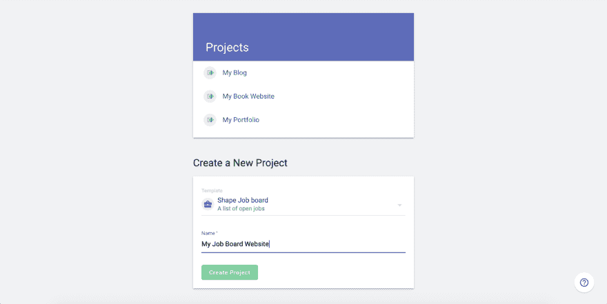
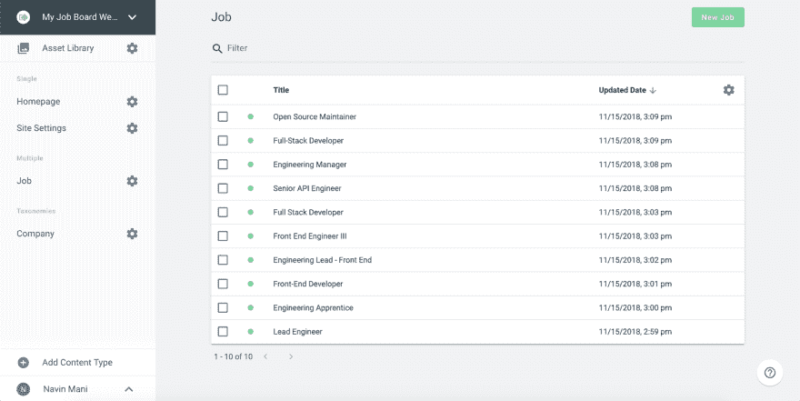
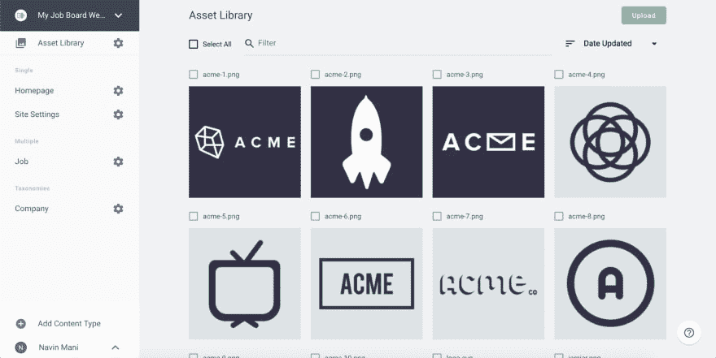
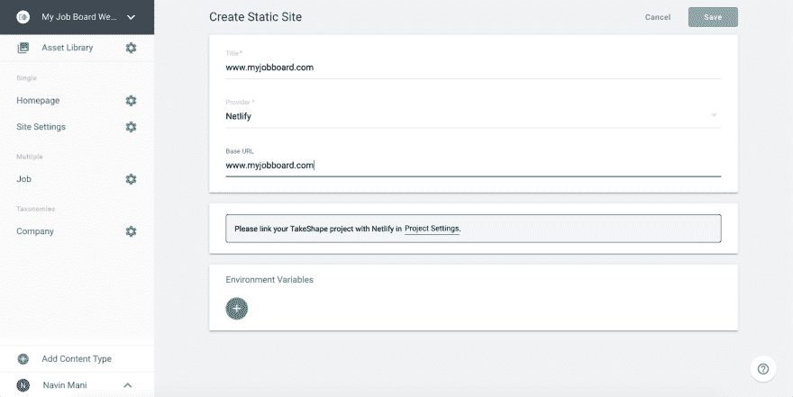
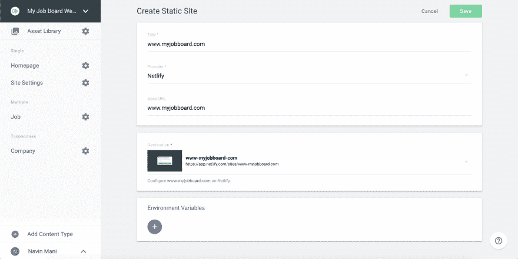
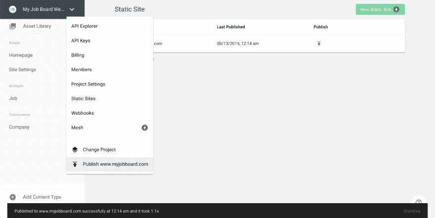
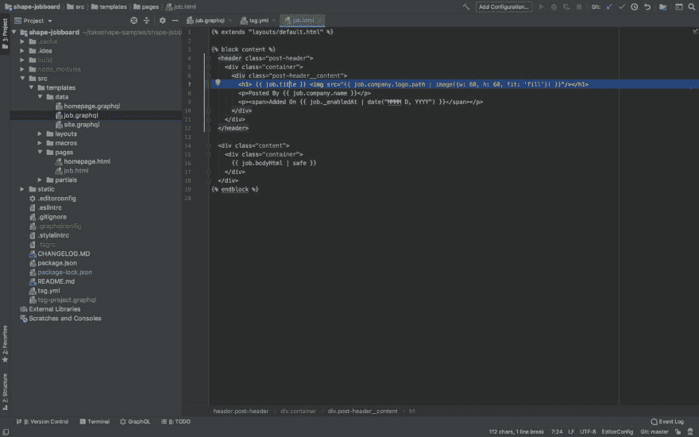
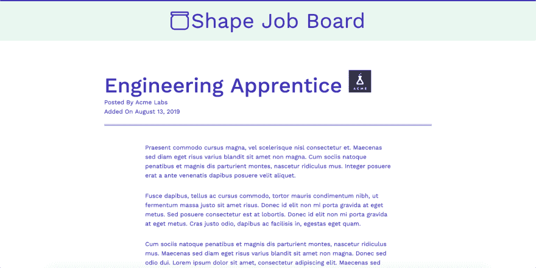

# 工作板模板入门！

> 原文：<https://dev.to/takeshape/getting-started-with-the-job-board-template-1goc>

### 让我们来看看如何使用 TakeShape 通过几个简单的步骤为你的求职板创建一个网页。此模板可用于列出所有可用的职务👩‍✈️👨‍🔬👩‍⚖️in 你的网络或你的组织。

1.  在[app.takeshape.io/signup](http://app.takeshape.io/signup)注册账户。通过 TakeShape 的 G-Suite 集成，这一过程只需点击两次鼠标即可完成。
    T3T5】

2.  有许多模板可以帮助你设计网页，我们很快就会用到它们。在本例中，让我们单击“塑造职务公告板”然后我们可以命名我们的项目，并单击“创建项目”
    [T3】](https://res.cloudinary.com/practicaldev/image/fetch/s--1zxXyfaS--/c_limit%2Cf_auto%2Cfl_progressive%2Cq_auto%2Cw_880/https://thepracticaldev.s3.amazonaws.com/i/f1l29aprtg54r7n1a106.png)

3.  如果我们转到左侧的导航栏，我们可以单击“Job”并浏览已经与模板集成的工单。您还可以通过点击右上角的“新建职务”来添加更多职务。
    [T3】](https://res.cloudinary.com/practicaldev/image/fetch/s--32LlOOlW--/c_limit%2Cf_auto%2Cfl_progressive%2Cq_auto%2Cw_880/https://thepracticaldev.s3.amazonaws.com/i/nsf2zql2b8s34l4b78n6.png)

4.  我们还可以通过单击导航栏顶部的“资源库”来浏览图片、视频和其他资源。我们可以通过简单地从桌面拖动或点击右上角的“上传”来上传更多资产。
    [T3】](https://res.cloudinary.com/practicaldev/image/fetch/s--EEQ5GiXP--/c_limit%2Cf_auto%2Cfl_progressive%2Cq_auto%2Cw_880/https://thepracticaldev.s3.amazonaws.com/i/w8424s190aipxrwi353o.png)

5.  我们有一个好看的网站，让我们让世界看到它。TakeShape 可以将你的网站部署到亚马逊 S3、谷歌云存储、FTP 和 Netlify。对于本例，我们将使用一键式集成部署到 [Netlify](https://www.netlify.com/) 。让我们导航到左上方的项目名称下拉菜单→“静态站点”→“新静态站点”。在这里，我们可以将我们的 TakeShape 项目链接到 Netlify。
    T3T5】

6.  这是它与 Netlify 连接时的样子。
    [T3】](https://res.cloudinary.com/practicaldev/image/fetch/s--zNEI8F-8--/c_limit%2Cf_auto%2Cfl_progressive%2Cq_auto%2Cw_880/https://thepracticaldev.s3.amazonaws.com/i/k3mm1upm4btmttpksicr.png)

7.  现在让我们点击“保存”并发布！
    [T3】](https://res.cloudinary.com/practicaldev/image/fetch/s--190n6Ocf--/c_limit%2Cf_auto%2Cfl_progressive%2Cq_auto%2Cw_880/https://thepracticaldev.s3.amazonaws.com/i/smvmwbazp1qykfz7qrp0.png)

8.  看看你的超赞网站！

9.  既然模板已经建立并运行了，是时候进行定制了。让我们克隆 Github 库，这样我们就可以个性化它了！

    ```
    git clone https://github.com/takeshape/takeshape-samples.git takeshape-samples && cd takeshape-samples/shape-jobboard 
    ```

10.  要安装所有依赖项，让我们运行`npm install`。仔细检查您的节点版本`node -v`，确保您使用的是`v10.16.2`。

11.  运行`npx tsg init`并按照命令提示设置本地环境和 TakeShape 之间的通信。

12.  运行`npm start`启动服务器。它将默认运行在 [http://localhost:5000](http://localhost:5000) 上。

13.  现在我们可以进行大量的定制来使用这个模板。对于每一个工作页面，我想移动的标志后的职位，我想让它更大。我们可以很容易地在`job.html`文件中模拟它的样子。这些变化可以立即在本地站点上看到！
    [](https://res.cloudinary.com/practicaldev/image/fetch/s--WPy-xOMD--/c_limit%2Cf_auto%2Cfl_progressive%2Cq_auto%2Cw_880/https://thepracticaldev.s3.amazonaws.com/i/kax94d9nsko188e690wz.png)

14.  运行`npx tsg deploy`将您的更改部署到 Netlify 上托管的站点。

15.  导航到该网站并实时查看您的更新！
    [T3】](https://res.cloudinary.com/practicaldev/image/fetch/s--73UIbgTG--/c_limit%2Cf_auto%2Cfl_progressive%2Cq_auto%2Cw_880/https://thepracticaldev.s3.amazonaws.com/i/1obwk8mawdr87d2bxx6c.png)

在这几个步骤中，我们建立了一个初具规模的网站🆙和跑步🏃‍♀️and:我们做了一些改动，可以在网站上看到。从这里开始，♾.的可能性是无限的我们很想看看你们用这个模板创建的网站！🤩