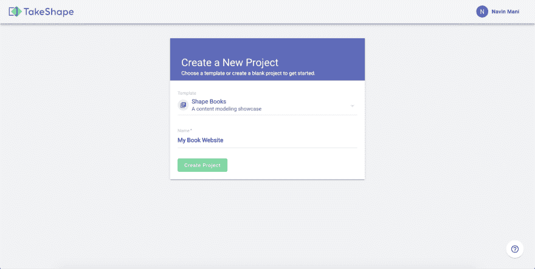
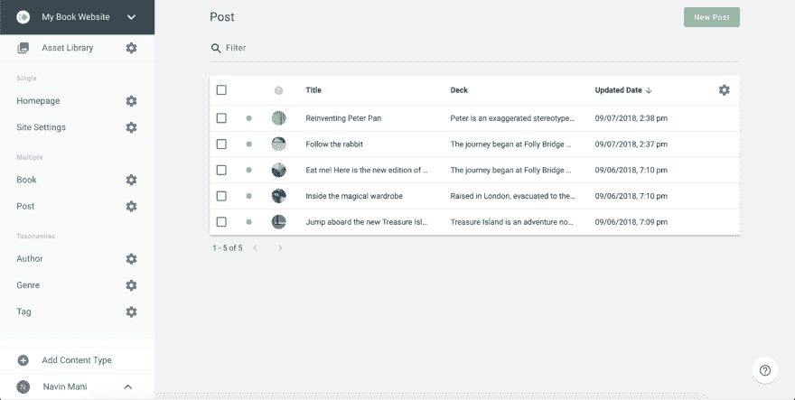
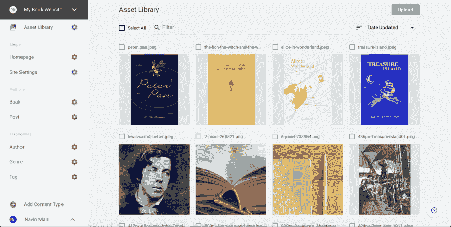
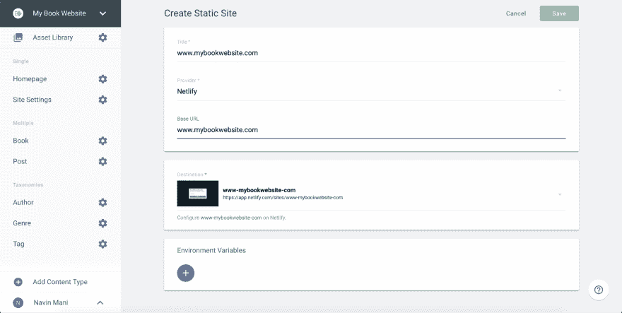
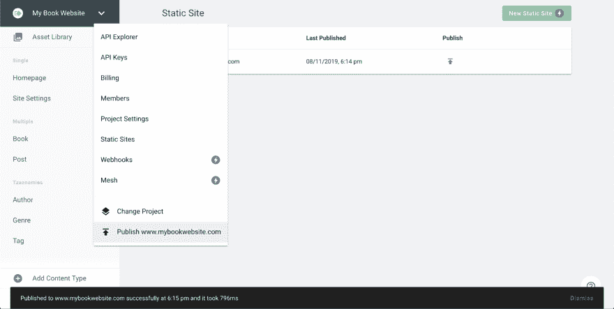
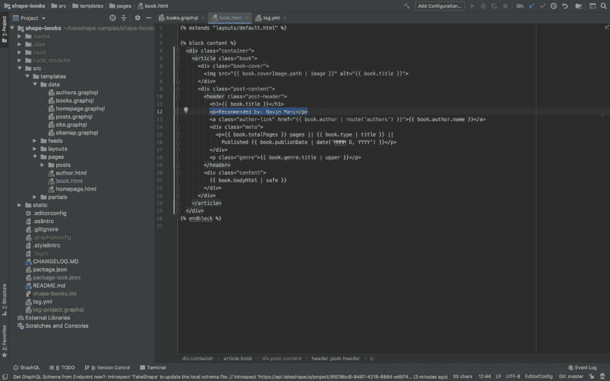
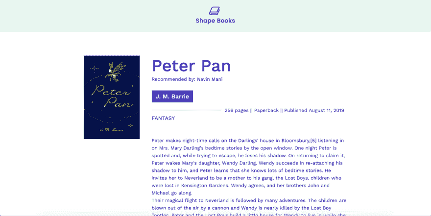

# 书籍模板入门！

> 原文：<https://dev.to/takeshape/getting-started-with-the-takeshape-books-template-29kd>

### 让我们来看看用 TakeShape 为你的书创建一个[网页。这个模板可以用来展示你想要的任何东西，从食谱🍲到电影评论🎥你可爱的小狗的照片🐶。](https://shape-books.takeshapesampleproject.com/)

1.  使用 TakeShape 的 G-Suite 集成在 app.takeshape.io/signup.注册一个帐户，这个过程只需点击两次即可完成。
    [T3】](https://res.cloudinary.com/practicaldev/image/fetch/s--_L95wX8V--/c_limit%2Cf_auto%2Cfl_progressive%2Cq_auto%2Cw_880/https://thepracticaldev.s3.amazonaws.com/i/tp277dd3qfnsulu2adao.png)

2.  有许多模板可以帮助你设计网页，我们很快就会用到它们。对于这个例子，让我们点击“形状书”然后我们可以命名我们的项目，并单击“创建项目”
    [T3】](https://res.cloudinary.com/practicaldev/image/fetch/s--mChx6a3D--/c_limit%2Cf_auto%2Cfl_progressive%2Cq_auto%2Cw_880/https://thepracticaldev.s3.amazonaws.com/i/p9hpdfn9mcl4g897ltdi.png)

3.  如果我们前往左边的导航栏，我们可以点击“文章”并浏览已经与模板集成的图书文章。你也可以点击右上角的“新帖子”来添加更多的帖子。
    [T3】](https://res.cloudinary.com/practicaldev/image/fetch/s--yR-jtekg--/c_limit%2Cf_auto%2Cfl_progressive%2Cq_auto%2Cw_880/https://thepracticaldev.s3.amazonaws.com/i/s938n0ok4fdivo12qfqm.png)

4.  我们还可以通过单击导航栏顶部的“资源库”来浏览图片、视频和其他资源。我们可以通过简单地从桌面拖动或点击右上角的“上传”来上传更多资产。
    [T3】](https://res.cloudinary.com/practicaldev/image/fetch/s--sMEpwTJw--/c_limit%2Cf_auto%2Cfl_progressive%2Cq_auto%2Cw_880/https://thepracticaldev.s3.amazonaws.com/i/gi989y6mat0z4pgti1u9.png)

5.  我们有一个好看的网站，让我们让世界看到它。TakeShape 可以将你的网站部署到亚马逊 S3、谷歌云存储、FTP 和 Netlify。对于本例，我们将使用一键式集成部署到 [Netlify](https://www.netlify.com/) 。让我们导航到左上方的项目名称下拉菜单→“静态站点”→“新静态站点”。在这里，我们可以将我们的 TakeShape 项目链接到 Netlify。
    T3T5】

6.  这是它与 Netlify 连接时的样子。
    [T3】](https://res.cloudinary.com/practicaldev/image/fetch/s--PTWPg2-7--/c_limit%2Cf_auto%2Cfl_progressive%2Cq_auto%2Cw_880/https://thepracticaldev.s3.amazonaws.com/i/ijhy9uirzxqi4u72hxpm.png)

7.  现在让我们点击“保存”并发布！
    [T3】](https://res.cloudinary.com/practicaldev/image/fetch/s--BVz_JNMS--/c_limit%2Cf_auto%2Cfl_progressive%2Cq_auto%2Cw_880/https://thepracticaldev.s3.amazonaws.com/i/ombcqe6564xigpclcxhq.png)

8.  看看你的超赞网站！
    [T3】](https://res.cloudinary.com/practicaldev/image/fetch/s--ZrMQbGTX--/c_limit%2Cf_auto%2Cfl_progressive%2Cq_auto%2Cw_880/https://thepracticaldev.s3.amazonaws.com/i/x1royz2x0n7xozm6ode6.png)

9.  既然模板已经建立并运行了，是时候进行定制了。让我们克隆 Github 库，这样我们就可以个性化它了！

    ```
    git clone https://github.com/takeshape/takeshape-samples.git takeshape-samples && cd takeshape-samples/shape-books 
    ```

10.  要安装所有依赖项，让我们运行`npm install`。仔细检查您的节点版本`node -v`，确保您使用的是`v10.16.2`。

11.  运行`npx tsg init`并按照命令提示设置本地环境和 TakeShape 之间的通信。

12.  运行`npm start`启动服务器。它将默认运行在 [http://localhost:5000](http://localhost:5000) 上。

13.  现在我们可以进行大量的定制来使用这个模板。我想加上推荐每本书的人的名字。我们可以很容易地在`book.html`文件中模拟它的样子。这些变化可以立即在本地站点上看到！
    [](https://res.cloudinary.com/practicaldev/image/fetch/s--Cd7QZd42--/c_limit%2Cf_auto%2Cfl_progressive%2Cq_auto%2Cw_880/https://thepracticaldev.s3.amazonaws.com/i/ts2e9uzmzuog1y2b8h0s.png)

14.  运行 npx tsg deploy 将您的更改部署到 Netlify 上托管的站点。

15.  导航到该网站并实时查看您的更新！
    [T3】](https://res.cloudinary.com/practicaldev/image/fetch/s--TwuqVtP6--/c_limit%2Cf_auto%2Cfl_progressive%2Cq_auto%2Cw_880/https://thepracticaldev.s3.amazonaws.com/i/fd0ldmn9ne0ssgz9h04i.png)

在这几个步骤中，我们建立了一个初具规模的网站🆙和跑步🏃‍♀️and:我们做了一些改动，可以在网站上看到。从这里开始，♾.的可能性是无限的我们很想看看你们用这个模板创建的网站！🤩