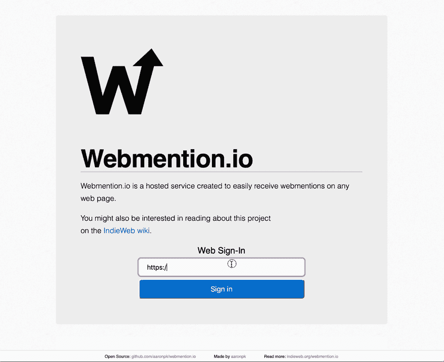
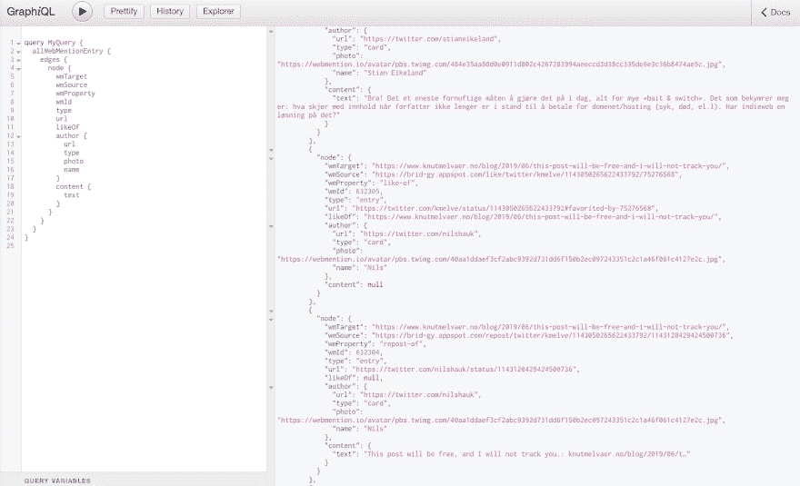

# 《盖茨比》中的网络提及入门

> 原文：<https://dev.to/kmelve/getting-started-with-webmentions-in-gatsby-15e7>

一段时间以来，我一直很好奇想了解更多关于网络提及和 IndieWeb 的信息。整理我的新博客似乎是一个了解更多的好机会。所以请记住，我是这方面的新手，只是分享我的学习过程。这至少是一个简短的教程，教你如何开始让你的网站对提及友好，如何用 twitter 连接它们，用 [Gatsby](https://www.gatsbyjs.org) 开始检索它们，以及当新的提及进来时，如何在 [Netlify](https://netlify.com) 上触发重建。我将在后面的教程中再次讨论如何发送它们。

我通过阅读克里斯的 [*构建盖茨比插件*](https://www.christopherbiscardi.com/post/building-gatsby-plugin-webmentions) 和查德的 *[拥抱 IndieWeb](https://www.chadly.net/embracing-the-indieweb/) 开始了我的 webmentions 之旅。这两部作品都有助于开始，但是它们遗漏了一些细节，这可能会使搜索变得更容易。我会告诉你所有的步骤，但是也要看看他们的东西。*

## 什么是 Webmentions？

你可以在 [IndieWeb wiki](https://indieweb.org/Webmention) 上读到更多关于它的内容，但简单来说:Webmentions 是一个开源项目，是一项在站点之间发送和接收消息以及 pingbacks 的服务。就像我们当年使用 Wordpress 一样。

区别在于 Webmentions 是联合的，这意味着您可以从多个来源收集和发送提及。在本教程中，我将首先通过一个名为 [brid.gy](https://brid.gy) 的服务引入 twitter 提及。

## 如何开始使用网络提及

要开始使用 web references，您需要登录 web reference . io。要登录，您需要进行身份验证。为了进行身份验证，您需要在 Gatsby 站点上放置一些标记，告诉 web reference . io 它可以使用哪个服务。根据说明，您可以使用 Twitter、GitHub、电子邮件、您的 PGP 密钥或您自己的 IndieAuth 服务器添加以下内容。我加了 Twitter 和 Github:

```
<p>
  Follow <a class="h-card" rel="me" href="https://www.knutmelvaer.no/">Knut</a> on <a href='https://twitter.com/kmelve' rel='me'>Twitter (@kmelve)</a>, <a href='https://github.com/kmelve' rel='me'>GitHub</a>, or send him an <a class="u-email" href='mailto:knut.melvaer@gmail.com' rel='me'>email</a>
</p> 
```

所以这看起来很像你的普通 HTML。如果你仔细观察，会发现有一些`rel="me"`属性和一些类名(`h-card`、`u-email`)。这些是微格式(TK ),这是让网络提及发挥作用的重要部分。当你用这种标记发布你的站点时，你告诉 webreference，那些社交账户与控制站点所在域的人绑定在一起，并允许你通过他们的 oAuth 集成登录。

[](https://res.cloudinary.com/practicaldev/image/fetch/s--84QkCY4l--/c_limit%2Cf_auto%2Cfl_progressive%2Cq_66%2Cw_880/https://cdn.sanity.img/ndjrels0/production/cdd3356565f50c8c9ce5301a409ee336406dcf8f-1071x874.gif)

正如你在上图中看到的，我有一个你可能还没有的网站提及列表。我们将回到如何用来自 twitter 的内容填充列表，但是首先，我们必须给我们的站点添加一些微格式，使它对 web reference 友好。

## 在帖子中添加微格式 2

Webmentions 使用一种称为[微格式 2](http://microformats.org/wiki/h-card) 的规范来理解网页上的内容。我们已经开始在上面的代码片段中实现它。对于微格式，我还有很多东西没有打包，但是很容易上手。您主要通过向 HTML 元素添加一些指定的类名来实现这一点，HTML 元素具有 web remote 用来填充其字段的特定内容。比如:

```
<article class="h-card">
  <header>
    
    <h1 class="p-name">The Title</h1>
  </header>
  <p class="p-summary e-content">The summary</p>
  <footer>
    <a class="u-url p-name" href="http://...">The author</a>
  </footer>
</article> 
```

你可以使用 [IndieWebify.me](https://indiewebify.me/) 或者【pin13.net】T2 来验证你的标记。我试了几次才把它做好。当一个 web reference 服务读取你的页面时，它会解析 HTML 并把这些信息提取到一个 JSON 结构中，可能看起来像这样:

```
{  "items":  [  {  "type":  [  "h-card"  ],  "properties":  {  "name":  [  "The Title",  "The author"  ],  "summary":  [  "The summary"  ],  "photo":  [  "http://..."  ],  "url":  [  "http://..."  ],  "content":  [  {  "html":  "The summary",  "value":  "The summary"  }  ]  }  }  ],  "rels":  {},  "rel-urls":  {}  } 
```

我最终在我的帖子模板中实现了这些“微格式化”的元素，并用`display: none`隐藏它们。主要是因为我不想在网站上看到一个 [ISO8601 格式的日期时间](https://en.wikipedia.org/wiki/ISO_8601)戳。我本可以使用像 [date-fns](https://date-fns.org/) 这样的库来格式化时间戳，但是这样做没有任何依赖性。例如，它在我的盖茨比博客的 React 代码中是这样的:

```
<time 
  className={styles.hidden + " dt-published"} 
  itemprop="datepublished" 
  datetime={publishedAt}
>
  {
    new Date(publishedAt)
      .toISOString()
      .replace('Z', '') + "+01:00"

  }
</time> 
```

现在，让我们进入有趣的部分，也就是让网络提及进入盖茨比。

## 安装`gatsby-plugin-webmention`

让 web references 进入 Gatsby 站点最简单的方法是安装 Gatsby-plugin-web reference 插件:

```
npm install gatsby-plugin-webmention
# or
yarn add gatsby-plugin-webmention 
```

现在您可以将下面的配置添加到`gatsby-config.js`中的`plugins`数组中(显然是用您自己的信息替换我的信息):

```
{
  resolve: `gatsby-plugin-webmention`,
  options: {
    username: 'www.knutmelvaer.no', // webmention.io username
    identity: {
      github: 'kmelve',
      twitter: 'kmelve' // no @
    },
    mentions: true,
    pingbacks: true,
    domain: 'www.knutmelvaer.no',
    token: process.env.WEBMENTIONS_TOKEN
  }
} 
```

当你登录到[https://webmention.io/settings](https://webmention.io/settings)时，你可以在“API key”下找到 webmentions 令牌。记住也要将它添加到您构建 Gatsby 站点以投入生产的环境中(例如在 Netlify 上的[)。如果一切顺利，您将能够在 Gatsby GraphQL API 中查询您的 web references。](https://www.netlify.com/docs/continuous-deployment/#environment-variables)

[](https://res.cloudinary.com/practicaldev/image/fetch/s--ASkPrAC8--/c_limit%2Cf_auto%2Cfl_progressive%2Cq_auto%2Cw_880/https://cdn.sanity.img/ndjrels0/production/d0993e90b5e5cb536f054433a3f96d81f364f873-2642x1606.png)

为了获得特定页面的网络提及，我做了两件事:

1.  从`gatsby-node.js`生成帖子的网址并放入 [`context`](https://www.gatsbyjs.org/docs/creating-and-modifying-pages/#pass-context-to-pages)
2.  使用 URL 过滤 allWebMentionEntry，也称为“永久链接”

可能有很多方法可以做到这一点，但我最终只在 gatsby-node.js 中生成完整的 URL，并通过 context 传递它，这样我就可以将它用作查询参数:

```
postEdges
  .filter(edge => !isFuture(edge.node.publishedAt))
  .forEach((edge, index) => {
    const { id, slug = {}, publishedAt } = edge.node
    const dateSegment = format(publishedAt, 'YYYY/MM')
    const path = `/blog/${dateSegment}/${slug.current}/`

    createPage({
      path,
      component: require.resolve('./src/templates/blog-post.js'),
      context: { 
        id, 
        permalink: `https://www.knutmelvaer.no${path}`
      }
    })

    createPageDependency({ path, nodeId: id })
  }) 
```

和 GraphQL 查询:

```
allWebMentionEntry(filter: {wmTarget: {eq: $permalink}}) {
  edges {
    node {
      wmTarget
      wmSource
      wmProperty
      wmId
      type
      url
      likeOf
      author {
        url
        type
        photo
        name
      }
      content {
        text
      }
    }
  }
} 
```

当您开始获取 web references 数据时，这个查询的属性将是不言自明的。您可以使用它来列出喜欢、回复或转发您帖子的人。

让一些网站被提及的最简单的方法是使用一个叫做 brid.gy 的服务，让你的网站在 Twitter 上被提及。

## 连接桥

前往 [brid.gy](https://brid.gy) 并连接你的账户，我认为 Twitter 最有意义，至少开始是这样。启用响应监听。需要有一些推文提到你的网站(通过域名)有回应。当然，你可以发微博让事情进展起来。

[](https://res.cloudinary.com/practicaldev/image/fetch/s--eqlKhIok--/c_limit%2Cf_auto%2Cfl_progressive%2Cq_auto%2Cw_880/https://cdn.sanity.img/ndjrels0/production/b7e4f7cbe80c2aee6a56866248f41e49c8d3e937-2588x1706.png)

如果您以开发模式(重新)启动 Gatsby 站点，您将能够在 GraphQL 层看到相同的响应数据。这将使它更容易在你的前端模板中实现。

## 在你的 Gatsby 前端实现 webmentions

我不打算在这里涵盖太多的细节，这是创造性的一部分！不过，这很简单。例如，要过滤掉所有的“喜欢”并显示一些带有“喜欢者”链接的头像，您可以按照以下思路做一些事情(并不是说这是确定的做法):

```
import React from 'react'

export default function WebMentions ({ edges }) {
  const likes = edges.filter(({ node }) => node.wmProperty === 'like-of')
  const likeAuthors = likes.map(
    ({ node }) => node.author && { wmId: node.wmId, ...node.author }
  )
  return (
    <div>
      <h4>
        <span>{`${likes.length} likes`}</span>
      </h4>
      <div>
        {likeAuthors.map(author => (
          <a href={author.url}>
            
          </a>
        ))}
      </div>
  )
} 
```

通过将`allWebMentionEntry`对象发送到`<WebMentions {...allWebmentionEntry} />`中，可以在查询 web references 时使用这个组件。

## 在新提及上触发新构建

如果你和我一样，你会很不耐烦，希望新的提及在发生时出现。如果你有耐心，每当你重新构建你的站点时，新的提及都会出现，这让你很满意。但是如果你用 Netlify 托管你的 Gatsby 站点，你可以使用一个构建触发器来自动重建站点，查询最新的提及。首先，您必须在 Netlify 上添加一个新的[构建触发器](https://www.netlify.com/docs/webhooks/#incoming-webhooks)。复制这个，并前往[网站上的网页挂钩设置](https://webmention.io/settings/webhooks)。将网络 URL 粘贴到框中(不需要密码)，然后点击保存。就是这样！(我意识到我们可以用这个 webhook 做一些有趣的事情，但是我们将在以后的帖子中再次讨论这个问题。)

我还建议在 Netlify 上设置一些构建通知，这样你就可以密切关注了。尤其是如果你真的把一些来自网络提及的内容放到你的网站上。这时候我会告诉你，你可以删除网上提及，并添加某人到你的黑名单，如果这是必要的。但愿不会如此。

## 祝贺你，你现在更独立了！

这个谜题还剩下一些碎片。我们尚未将网站设置为发送网络提及或 pingbacks。除了 Twitter 之外，我们还可以从更多的来源中获取信息。不过，我肯定会带着更多有趣的 indie web+web references 内容回来。同时，如果你有建设性的反馈，欢迎在 twitter 上回复我，或者试着在网上提一下这篇文章。我很乐意修改这篇文章，并提供有用的见解。