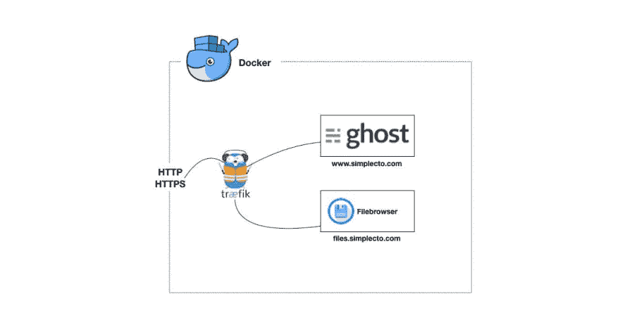
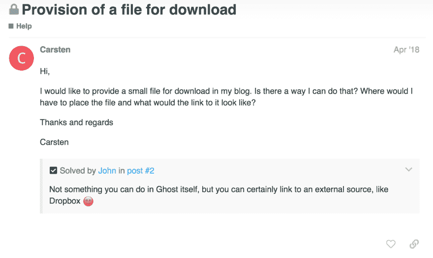
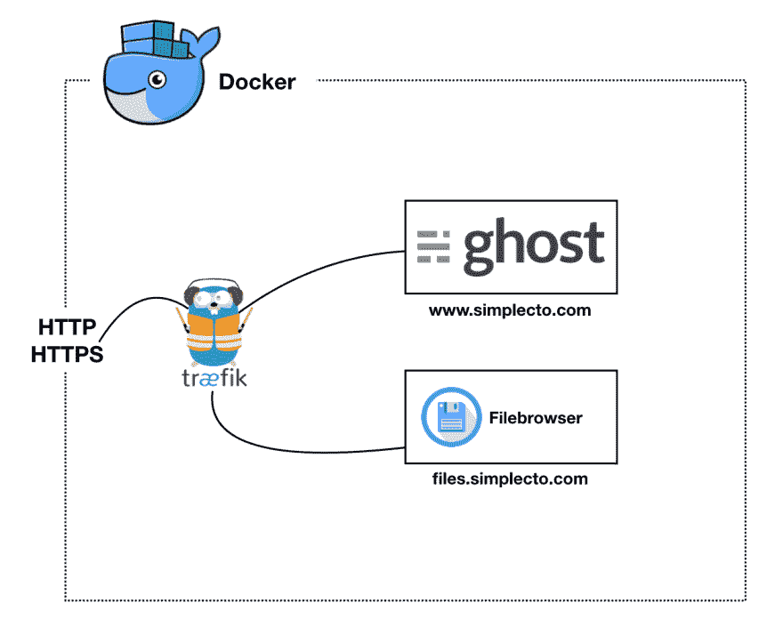

# 用 Docker 和 Filebrowser 下载 Ghost 文件

> 原文：<https://dev.to/simplecto/ghost-file-downloads-with-docker-and-filebrowser-4c93>

### [TLDR；](#tldr)

[](https://res.cloudinary.com/practicaldev/image/fetch/s--kjQfNOZh--/c_limit%2Cf_auto%2Cfl_progressive%2Cq_auto%2Cw_880/https://www.simplecto.com/conteimg/2019/07/simplecto-how-i-deploy-notes.001.jpeg)

Ghost 不提供文件下载，所以我发布了我的 docker-compose 文件，它添加了一个简单的文件管理器 sidecar。我称之为**鬼作曲**。

你可以在 github 上下载查看:

[https://github.com/simplecto/ghost-compose](https://github.com/simplecto/ghost-compose)

### 给我讲个故事

ghost.org 的天才们已经做了一个好看又简单的博客平台。它在需要拥有和美好拥有之间取得了正确的平衡，同时保持了用户友好的包装。

然而，这些选择是有后果的。好的产品管理和开发更多的是说“不”，而不是说“是”。一些功能可能需要等待。

### Ghost 不提供文件下载

显然，其中一个功能是文件下载。目前似乎还没有一个人能够上传 PDF 到一个帖子中，并让它可供下载(呃，至少我不能弄清楚)。咨询社区论坛建议一个简单的解决方案:使用 Dropbox、Google Drive 或其他文件主机。

[](https://res.cloudinary.com/practicaldev/image/fetch/s--5keYImvT--/c_limit%2Cf_auto%2Cfl_progressive%2Cq_auto%2Cw_880/https://www.simplecto.com/conteimg/2019/07/image-2.png) 

<figcaption>[幽灵论坛答案截图](https://forum.ghost.org/t/provision-of-a-file-for-download/769)</figcaption>

### 太好了，但是如果我不用 DropBox 或者 Google Drive 呢？

没问题。

有一个简单的 Golang 应用程序叫做 file hosting([file browser . XYZ](https://filebrowser.xyz))，他们方便地提供了一个 docker 图像。

想法是这样的:

[](https://res.cloudinary.com/practicaldev/image/fetch/s--PTs6N8RA--/c_limit%2Cf_auto%2Cfl_progressive%2Cq_auto%2Cw_880/https://www.simplecto.com/conteimg/2019/07/image-3.png)

1.  我使用 [Traefik](https://traefik.io) 作为我的 web 服务器，并反向代理到虚拟机中 docker 托管的服务。
2.  相关的容器将旋转起来，并通过 Docker 标签向 Traefik 发送它们的路由和 SSL 配置信息。
3.  一旦启动，Traefik 将通过 Letsencrypt 提供一个 SSL 证书，然后我们就准备好了。
4.  从现在开始，我只需通过网络界面将我的文件上传到文件浏览器，生成公共链接，然后根据需要粘贴到我的博客帖子中。

### 好了，代码是什么样子的？

这部分的内容在 docker-compose 文件中。让我们看一看。

```
version: '3'

services:

    filebrowser:
        image: filebrowser/filebrowser
        container_name: filebrowser
        restart: unless-stopped

        volumes:
            - /files:/srv
            - ./database.db:/database.db
            - ./filebrowser.json:/.filebrowser.json
        networks:
            - web
        labels:
            - "traefik.docker.network=web"
            - "traefik.enable=true"
            - "traefik.frontend.rule=Host:files.simplecto.com"
            - "traefik.port=80"
            - "traefik.default.protocol=http"
            - "traefik.backend=filebrowser"
            - "traefik.frontend.headers.SSLRedirect=true"
            - "traefik.frontend.headers.SSLHost=files.simplecto.com"
            - "traefik.frontend.headers.SSLForceHost=true"

    ghost:
        image: ghost:2-alpine
        container_name: simplecto
        restart: unless-stopped
        volumes:
            - "./ghostdata:/var/lib/ghost/content"

        environment: 
            url: https://www.simplecto.com

        networks:
            - web

        labels:
            - "traefik.docker.network=web"
            - "traefik.enable=true"
            - "traefik.frontend.rule=Host:www.simplecto.com,simplecto.com"
            - "traefik.port=2368"
            - "traefik.protocol=http"
            - "traefik.backend=simplecto"
            - "traefik.frontend.headers.SSLRedirect=true"
            - "traefik.frontend.headers.SSLHost=www.simplecto.com"
            - "traefik.frontend.headers.SSLForceHost=true"

networks:
    web:
        external: true 
```

名为 **labels** 的部分告诉 Traefik，它们希望在那些分配的域名上通过 http/s 访问外部世界。

在 github 上查看一下。[https://github.com/simplecto/ghost-compose](https://github.com/simplecto/ghost-compose)