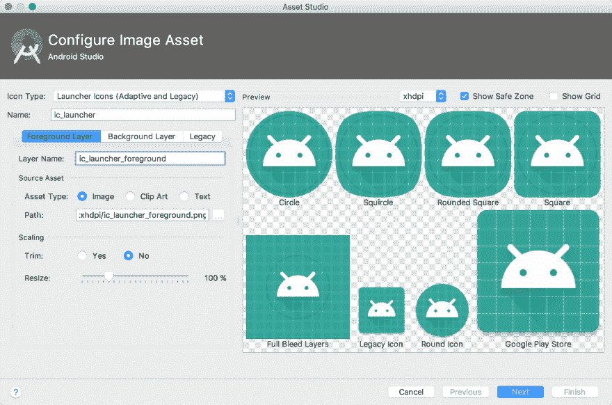
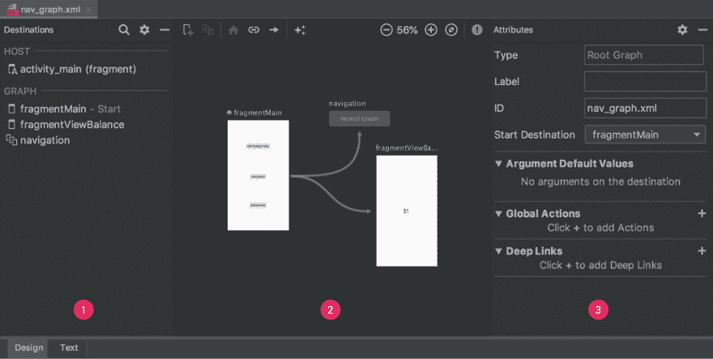

# git rm -缓存。/想法？

> 原文：<https://dev.to/redbassett/git-rm-cached-idea-4cec>

这篇文章最初是在 Droidcon NYC 2019 上发表的闪电演讲。

* * *

如果您使用 Android Studio 中构建的任何 Android 项目足够长的时间，您一定会遇到项目文件中的`.idea/`目录。您可能根本不知道这个目录，或者您可能认识到它包含一堆为 Android Studio 集成开发环境(IDE)提供支持的文件，并且它通常是包含更改的文件的目录，这些更改会污染您在 git 中的工作树。事实上，您遇到的许多项目可能在版本控制中完全忽略了整个`.idea/`目录，以避免在提交历史中出现持续的变化。

这个目录及其内容是什么？是否应该在版本控制下对其进行跟踪？你和你的团队如何利用 Android Studio 的优势来提高团队的效率和一致性？

这篇文章不是这些问题的唯一答案，但它旨在让任何使用 Android 的人，从新手到高级工程师和架构师，思考这个目录及其用途。我无法提供这个目录中所有内容的完整列表，即使我能提供，这篇文章也没有多大用处。相反，目的是给出一个广泛的介绍，希望你能围绕你和你的团队遇到的问题做进一步的研究。

# IntelliJ 和 Android Studio

我们的故事从 JetBrains 的智能开始。IntelliJ 是一个以 Java 为中心的 IDE，最初发布于 2001 年。长期以来，它一直是开发各种类型 Java 项目的开发人员的开发工具的行业领导者之一。当 Android 开发开始增长时，大多数开发人员使用某种形式的现有 Java IDE。2014 年，谷歌发布了第一个稳定版本的 Android Studio——这是一个专门为 Android 开发而构建的新 IDE，但构建在 IntelliJ 之上。作为 IntelliJ 项目的一个分支，Android Studio 继承了 IntelliJ 使用的所有底层机制，包括`.idea/`目录。

# `.idea/`？

这个目录到底是什么？在 IntelliJ 或 Android Studio 等 IDE 中构建的任何项目都有许多与之相关的配置选项。与 IDE 首选项(如编辑器主题和应用程序级行为，它们是使用 IDE 的单个开发人员的个人首选项)不同，项目设置在整个团队中通常是一致的，并且与特定产品和工具的需求(而不是编写代码的人员)的联系更紧密。这个特定于项目的配置是`.idea/`目录的域。

在早期版本的 IntelliJ 中，项目配置选项存储在一系列的`.ipr`、`.iml`和`.iws`文件中。这种遗留的项目结构使得很难确定具体的配置选项存储在哪里，并且大大增加了小的配置更改导致开发人员之间的合并冲突的机会。较新的项目现在使用“基于目录的项目结构”，以我们的新朋友`.idea/`目录为中心。在这个目录中，我们可以找到一系列子目录和文件，大部分是 XML 格式的，它们代表了我们的项目配置。

# 吉特和 VCS

如果你独自在一个项目上工作，你可能不会花太多时间考虑如何让新的开发人员加入进来。如果你在一个团队中，你的入职流程可能是 wiki 或共享文档中的一长串步骤，或者更糟，当新成员出现问题时，完全通过口头方式完成。尽管市场上有各种各样的工具，但入职和团队协作并不是解决的问题。但我们可以使用 Android Studio 的内置功能来使部分过程更快、更有效。现在给你的项目增加一个新的团队成员会涉及到什么？如果他们可以将项目从版本控制中签出，并且已经为他们完成了项目配置，那会怎么样？

虽然您的团队可能在使用 git 之外的另一个 VCS，但是本文提出的思想几乎适用于任何形式的版本控制。如果您还没有使用 VCS，请正确地共享。idea/ directory 可能是考虑采用它的另一个原因！

# `.gitignore`文件

如果您的项目使用 git，那么您的项目根目录中可能已经有了一个`.gitignore`文件(可能还有一些子目录)。这篇文章最初是在默认的`.gitignore`还有很大改进空间的时候构思的。从那时起，为新项目创建的默认文件已经有了很大的改进。查看项目中的 ignore 文件包含了什么，并使用本文中的思想来改进它！

默认的`.gitignore`文件如下所示。注意以`/.idea/` :
开头的行

```
.gradle
/local.properties
/.idea/caches
/.idea/libraries
/.idea/modules.xml
/.idea/workspace.xml
/.idea/navEditor.xml
/.idea/assetWizardSettings.xml
.DS_Store
/build
/captures
.externalNativeBuild
.cxx 
```

# 什么*不*要包括

让我们先来看看默认情况下忽略了什么，以及为什么:

## `libraries/`

`libraries/`目录是*大多是*自己解释的。虽然这里的目录不包含项目中使用的库的实际库代码，但它包含 IDE 用来正确显示这些库的元数据。这不应该在版本控制中，因为依赖项的配置在大多数 Android 项目中是由像 gradle 这样的构建工具来表示的。当项目 repo 的新本地副本被克隆时，gradle 应该负责下载和配置项目所有必要的依赖项，Android studio 将正确地重新创建所有需要的元数据文件。

## `modules.xml`

像`libraries.xml`目录一样，项目模块元数据应该从项目的梯度配置中构建。不需要与你的队友分享这个文件，因为它是多余的，应该由你的 Android Studio 本地副本创建。

## `workspace.xml`

这是我们将看到的第一个文件，我们实际上期望*应该在不同的计算机之间*不同。`workspace.xml`文件包含关于 IDE 当前使用状态的信息:当前打开了哪些编辑器标签，用户的光标在每个标签中的位置，等等。这个文件负责确保当您返回到一个项目时，您的编辑器在您离开的地方打开，因此，与您的团队成员无关，并且不应该在版本控制中。

## `assetWizardSettings.xml`

这是另一个 IDE 状态文件。每次在 Android Studio 中使用 asset studio 时，您在导入资产时使用的设置都会保存在此处，以便您下次打开导入窗口时可以预填充这些设置。存储在该文件中的信息对您的团队成员没有意义，请将其置于版本控制之外。

[](https://res.cloudinary.com/practicaldev/image/fetch/s--cmqGLGIR--/c_limit%2Cf_auto%2Cfl_progressive%2Cq_auto%2Cw_880/https://thepracticaldev.s3.amazonaws.com/i/1tk729417fihtcfl6al9.png)

## `caches/`

从名字上看，这个目录的用途并不完全清楚。它缓存什么？目前，在 Android Studio 中，这包含一个名为`build_file_checksums.ser`的文件。这是所有项目的 gradle 构建文件的校验和。当你在一个构建文件中更新一些东西时，将它与这里的校验和进行比较，Android Studio 就知道如何提示你重新同步你的 gradle 文件！

[](https://res.cloudinary.com/practicaldev/image/fetch/s--4cUD-ztw--/c_limit%2Cf_auto%2Cfl_progressive%2Cq_auto%2Cw_880/https://thepracticaldev.s3.amazonaws.com/i/92ixdhwpa3jlejnhyhob.png)

# 版本控制中应该有什么？

现在我们已经看到了一些被排除在版本控制之外的东西——许多开发人员在这一点上停下来并排除了整个`.idea/`目录——让我们看看你可能想要与你的团队分享什么。

## `codeStyles/`

您知道您可以将您的自定义代码样式和格式直接存储在您的项目 repo 中吗？这个子目录将包含您选择的任何项目特定的格式首选项，并允许新的团队成员免费获得与您的项目样式匹配的自动格式！

## `dictionaries/`

就像代码风格一样，任何使用不带元音的启动名称的产品的人都知道，您的代码很快就会充满错别字。当然，你可能已经找到了“添加到字典”菜单选项来阻止这些错别字被突出显示，但是你知道你可以与你的团队分享它们吗？在这个目录中，将为每个添加了自定义词典单词的开发人员提供一个文件，这些文件中的所有单词应该可以避免项目开发人员的拼写检查错误。

## `inspectionProfiles/`

就像`codeStyles/`和`dictionaries/`一样，您可以在这里与您的团队共享定制检测配置文件(皮棉检查)。

## `misc.xml`

从名字上看，这个文件的用途并不清楚。这是 Android Studio 跟踪项目元数据的地方，比如要使用的 Java 版本和项目类型。

## `runConfigurations.xml`

随着项目规模和复杂性的增长，它通常需要特定的设置才能正常运行。每当您在 Android Studio 中创建或更改运行配置时，它都会存储在这里。如果您想与您的团队共享这些配置，请将该文件添加到版本控制中！

## `navEditor.xml`

Android Studio 3.3 中添加的导航编辑器使用这个文件来存储编辑器窗口中导航组件的可视布局。这个文件实际上被添加到新项目的默认`.gitignore`中，但是您可能想要考虑将它添加到版本控制中，以便可视化编辑器布局与项目中的所有开发人员相匹配。

[](https://res.cloudinary.com/practicaldev/image/fetch/s--Mj7NzpHx--/c_limit%2Cf_auto%2Cfl_progressive%2Cq_auto%2Cw_880/https://thepracticaldev.s3.amazonaws.com/i/xrw6yqzu18z4bzr9i9na.png)

# 还有什么？

这篇文章远不是在`.idea`目录中可以找到的所有内容的完整列表，应该作为一个起点来研究您在里面找到的文件和目录，并自己决定什么应该和什么不应该与您的团队共享。

当您找到必须选择包含或忽略的文件时，可以使用一些标准来决定是否应该在版本控制中跟踪该文件:

1.  文件*不是*是你机器独有的吗？仅提交在每个开发人员的计算机上应该相同的文件。
2.  文件对你的队友有用吗？个人偏好和配置不应与团队共享。
3.  文件在提交过程中保持不变吗？`.idea`目录中的一些文件经常被重新生成或修改。如果文件在几乎每次提交时都发生更改，那么它可能不适合存储在版本控制中。
4.  文件描述了你项目的一个方面吗？项目的配置应该在版本控制中，而跨多个项目的整个 IDE 的配置不应该。

# 其他方式分享设置

您可能希望对您的工作环境进行的一些调整将是整个 IDE 的首选项，而不管您正在进行的项目是什么，例如编辑器主题、插件和个人代码片段。通过 Android Studio 应用程序设置访问的设置不会保存到`.idea`目录中。相反，大多数主题和插件可以通过设置屏幕从插件库中下载，个人偏好可以从 Android Studio 导入和导出，例如公司范围内的代码风格偏好，无论打开的是什么项目，都可以使用。

[](https://res.cloudinary.com/practicaldev/image/fetch/s--c0yQsvoK--/c_limit%2Cf_auto%2Cfl_progressive%2Cq_auto%2Cw_880/https://thepracticaldev.s3.amazonaws.com/i/2kr4olbrotztbpu6remu.png)