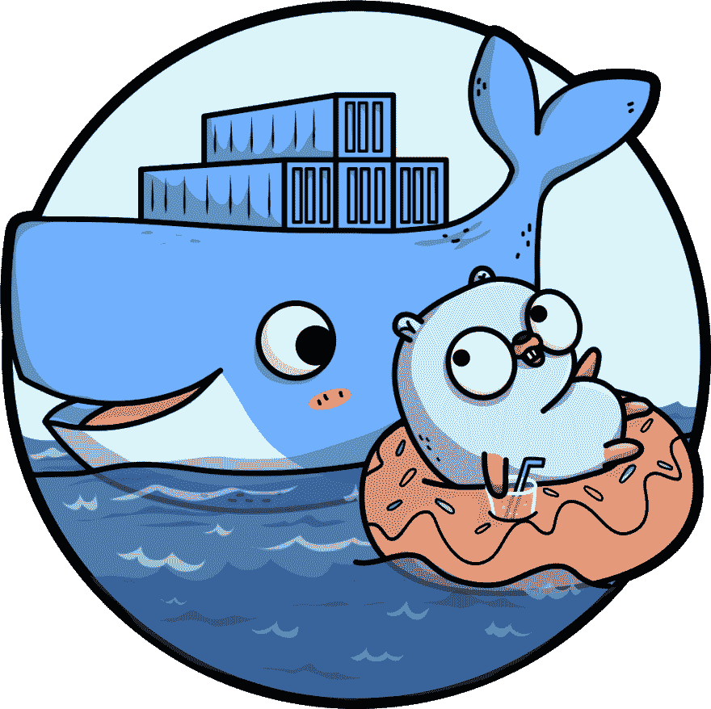

# 开始——只需三个步骤就能构建一个最小的 docker 映像

> 原文：<https://dev.to/ivan/go-build-a-minimal-docker-image-in-just-three-steps-514i>

<figure>[](https://res.cloudinary.com/practicaldev/image/fetch/s--J3E8KS70--/c_limit%2Cf_auto%2Cfl_progressive%2Cq_auto%2Cw_880/https://cdn-images-1.medium.com/max/1024/1%2AE33brkN6zivLSb-D9i-CdQ.png)

<figcaption>Docker&Go image by[github.com/ashleymcnamara/gophers](https://github.com/ashleymcnamara/gophers)</figcaption>

</figure>

### 开始——只需三个步骤即可构建一个最小的 docker 映像

当您为 docker 构建您的 Go 应用程序时，您通常从一些图像开始，如 golang:1.13。然而，在运行时实际使用该映像是对资源的浪费。让我们来看看如何将 Go 应用程序构建成一个绝对最小的 docker 映像。

* * *

### 1。选择 Go 版本

虽然使用 golang:latest 或 just golang 可能很有吸引力，但有许多原因说明这不是一个好主意，但其中最主要的原因是构建可重复性。无论是使用您已经开发和测试的相同版本进行生产部署，还是您发现自己需要修补旧版本的应用程序，最好将 Go 版本固定在特定的版本上，只有在您知道它可以与新版本一起使用时才更新它。

因此，请始终使用完整的规范，包括补丁版本号，甚至是映像所来自的基本操作系统，例如 1.13.0-alpine3.10

### 2。保持最小化

这有两个方面——缩短构建时间和保持生成的图像较小。

#### 快速构建

Docker 为您缓存中间层，因此如果您正确构建 docker 文件，您可以减少每次后续重建(在更改后)所花费的时间。经验法则是根据命令源(例如，副本源)的变化频率对命令进行排序。

此外，考虑使用. dockerignore 文件，这有助于保持较小的构建上下文——基本上，当您运行 docker 构建时，docker 需要将当前目录中的所有内容提供给构建守护进程(您在 docker 构建开始时看到的将构建上下文发送给 Docker 守护进程的消息)。简而言之，如果你的 repo 包含了很多构建你的应用所不需要的数据(比如测试，docs generator 的 markdown 等等)。dockerignore 将有助于加速建设。最起码可以从以下内容入手。Dockerfile 在那里，如果你复制。。(顺便说一句，您不应该这样做)当您只更改 docker 文件时，不必执行和无效下面所有内容。

```
.git
Dockerfile
testdata 
```

#### 小图像

非常简单——使用 scratch。其他任何东西都无法与之相比(因为它不能)。Scratch 是一个特殊的“基础”映像，因为它不是一个真正的映像，而是一个完全空的系统。注意:在 docker 的旧版本中，一个显式的暂存图像实际上被用作一个层，从 docker 1.5 开始就不再是这样了。

其工作原理是，在一个 other 文件中使用两步构建，实际上在一个名为 builder 的映像上构建应用程序(例如，它可以是您喜欢的任何名称)，然后将生成的二进制文件(和所有其他必需的文件)复制到一个基于 scratch 的最终映像。

### 3。把所有的放在一起

让我们看看完整的 docker 文件是什么样的，好吗？