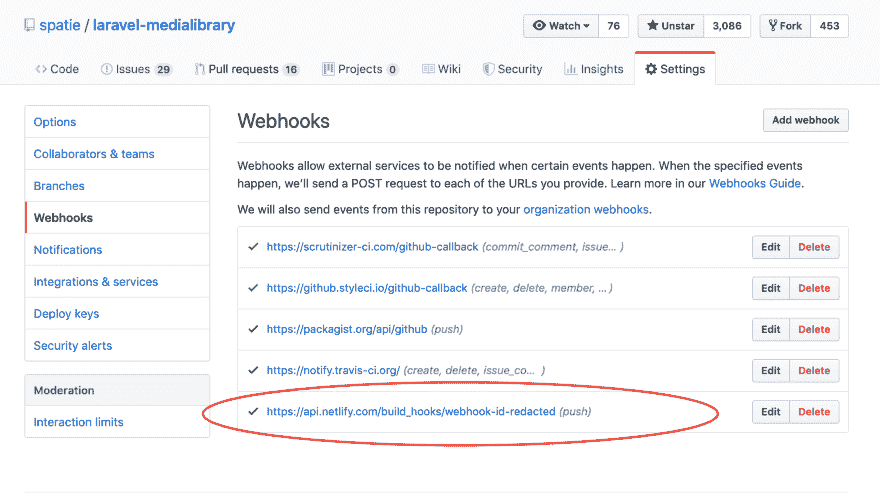
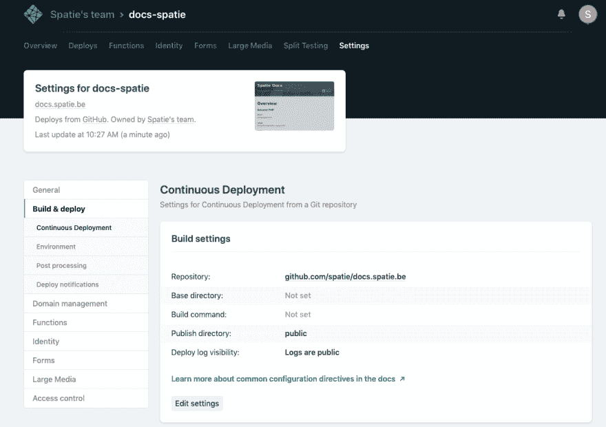

# ★和 Hugo 和 Netlify 一起去无服务器

> 原文：<https://dev.to/freekmurze/going-serverless-with-hugo-and-netlify-7eb>

[我们的团队](https://spatie.be)发布了很多[开源包](https://spatie.be/open-source/packages)。我们所有的包装都有详细的记录。对于较小的包，我们使用 GitHub 上的一个简单的 readme。更大的软件包，像[媒体库](https://docs.spatie.be/laravel-medialibrary/v7/introduction/)和[事件投影器](https://docs.spatie.be/laravel-event-projector/v2/introduction/)在[我们的文档网站](https://docs.spatie.be)上有文档。

我们最近将我们的网站从数字海洋服务器转移到了无服务器平台 [Netlify](https://netlify.com/) 。在这篇文章中，我想告诉你为什么以及我们是如何做到这一点的。

## 一款不错的老 Laravel 应用

直到几周前，我们的文档网站还是一个 Laravel 应用程序。所有内容都作为[一套降价文件](https://github.com/spatie/docs.spatie.be-old/tree/c35ca9cdbff9f6cee5c947d51aec71c024417baf/resources/views)包含在回购协议中。每当一个 markdown 文件被更新时，我们就让一个 webhook 通知我们的服务器，它将获取这些变化。

在很长一段时间里，这种方法对我们来说非常有效。有两个缺点。首先，包的文档不在包回购中，而是在 docs.spatie.be 回购中。当获得 PR 时，我们不得不要求贡献者发送额外的 PR 到 docs.spatie.be 来更新文档。其次，我们必须自己管理一个数字海洋服务器来托管网站。

## 移动到网络生活

几周前，我们完成了向网络生活的过渡。由于 Netlify 的无服务器特性，我们不再需要自己管理服务器来托管 docs.spatie.be。一个包的所有文档现在都保存在包本身的[docs 目录](https://github.com/spatie/laravel-medialibrary/tree/master/docs)中。

在每个有`docs`目录的包中，我们给 Netlify 添加了一个 webhook。

[](https://res.cloudinary.com/practicaldev/image/fetch/s--0ABphzwi--/c_limit%2Cf_auto%2Cfl_progressive%2Cq_auto%2Cw_880/https://freek.dev/uploads/media/docs-netlify/webhook.png)

所以每次提交东西时，Netlify 都会得到通知。那时，我们的部署和构建脚本将会运行。简而言之，该脚本将下载所有回购的 docs 目录，并使用一个名为 [Hugo](https://gohugo.io/) 的静态站点构建器来构建[docs . spatie . be 站点](https://docs.spatie.be)。让我们来看看它是如何工作的。

[新的 docs.spatie.be repo](https://github.com/spatie/docs.spatie.be) 不再包含 Laravel 应用程序，但包含 docs.spatie.be 的 Netlify 配置。

在 Netlify，我们已经将回购添加到“构建设置”中。

[](https://res.cloudinary.com/practicaldev/image/fetch/s--NUL10gxv--/c_limit%2Cf_auto%2Cfl_progressive%2Cq_auto%2Cw_880/https://freek.dev/uploads/media/docs-netlify/build-settings.png)

在回购协议中，有一个 [netlify.toml](https://github.com/spatie/docs.spatie.be/blob/ddcdac643f621e174005c8d5b303dd09886dd2f1/netlify.toml#L2) 文件，其中包含网站应该如何建设的说明。[这个](https://github.com/spatie/docs.spatie.be/blob/ddcdac643f621e174005c8d5b303dd09886dd2f1/netlify.toml#L2)是建立网站的命令。

```
command = "node fetch-content.js && hugo -b https://docs.spatie.be" 
```

我们来看看 [fetch-content.js](https://github.com/spatie/docs.spatie.be/blob/ddcdac643f621e174005c8d5b303dd09886dd2f1/fetch-content.js) 的内容。

```
const util = require("util");
const exec = util.promisify(require("child_process").exec);
console.log('Fetching repositories...');
console.time('Fetched repositories');

const repositories = require("./repositories.json");

function transformBranchToFolderName(branch) {
    return branch.startsWith('v') ? branch.substring(1) : branch;
}

(async function () {
    let promises = [];

    for (const repository of repositories) {
        for (const [branch, alias] of Object.entries(repository.branches)) {
            const folder = `content/${repository.name}/${alias}`;
            const url = `https://codeload.github.com/${repository.repository}/tar.gz/${branch}`;

            promises.push(exec(`mkdir -p ${folder} && curl ${url} \
             | tar -xz -C ${folder} --strip=2 ${repository.repository.split('/')[1]}-${transformBranchToFolderName(branch)}/docs \
             && echo "---\ntitle: ${repository.name}\ncategory: ${repository.category}\n---" > content/${repository.name}/_index.md`));

        }
    }

    await Promise.all(promises);
    console.timeEnd('Fetched repositories');
})(); 
```

上面的代码将遍历在 [repositories.json](https://github.com/spatie/docs.spatie.be/blob/ddcdac643f621e174005c8d5b303dd09886dd2f1/repositories.json) 中定义的每个存储库。对于每一次回购，我们都会承诺将回购的代码作为 zip 文件提取出来，并将其解压缩到本地的`content`目录中。你可能觉得像这样下载所有的回购很慢，但它非常快。只需要几秒钟。

在`node fetch-content.js`完成后，`hugo -b https://docs.spatie.be`将被执行。该命令将构建实际的站点。Hugo 默认安装在 Netlify 上。

本地创建的`content`目录的目录结构将用于确定 URL 结构。你可以在[雨果文档](https://gohugo.io/content-management/organization/)中读到更多。Hugo 将解析每个 markdown 文件，并使用[`layouts`目录](https://github.com/spatie/docs.spatie.be/tree/ddcdac643f621e174005c8d5b303dd09886dd2f1/layouts/_default)中的模板将它们转换成 HTML。我们感觉学习 Hugo 模板语言是这个项目中最难的事情之一。

在回购的每个`docs`目录下，都有一个 [`_index.md`](https://github.com/spatie/laravel-medialibrary/blob/master/docs/_index.md) 文件，里面有一些通用的设置。每个子目录也有一个 [`_index.md`](https://github.com/spatie/laravel-medialibrary/blob/master/docs/converting-images/_index.md) 来指定其标题和在导航中的顺序。

## 在关闭

通过迁移到 Netlify，我们不再需要为我们的 docs 站点管理服务器，这很酷。事实上，包的文档现在存在于包本身的 repo 中，这也是一个很好的胜利。

非常感谢我的同事 Rias 和 T2 Seb，他们研究了 Netlify 和 T4 Hugo，并把所有这些放在一起。