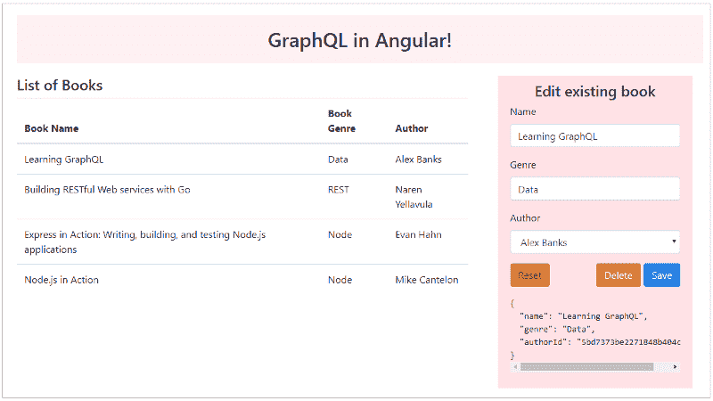

# GraphQL 是新的 REST —第 2 部分

> 原文：<https://dev.to/thisdotmedia/graphql-is-the-new-rest-part-2-1965>

在第一部分中，向您介绍了 GraphQL，并展示了如何基于 Node.js 和 [GraphQL.js](https://github.com/graphql/graphql-js) 构建 GraphQL 服务器 API。

在这一期中，我们将从第一部分停止的地方继续，继续构建 GraphQL Angular 客户端应用程序。

## 阿波罗客户端——什么东西？

Apollo GraphQL 提供了将 GraphQL 服务器 API 添加到应用程序中的工具和 API。它还提供了一组 [Apollo 客户端](https://www.apollographql.com/client)库，您可以在您的客户端应用程序中使用这些库来连接到 GraphQL 服务器 API。GraphQL 客户端 API 可用于 Angular、React、Vue.js 等。对于本文，我们将使用 Apollo Angular Client 将我们的 Angular 应用程序连接到我们构建的 GraphQL 服务器 API。您可以浏览 Apollo GraphQL 服务器和客户端，深入了解 Apollo 产品。

## 搭建 Angular 客户端 App

我们在本文中构建的 Angular 客户端应用程序使用[Apollo Angular](https://www.apollographql.com/docs/angular/)客户端连接到我们的 GraphQL 服务器 API。

这是您完成构建此应用程序后的最终结果:

[](https://res.cloudinary.com/practicaldev/image/fetch/s--3AD7URrB--/c_limit%2Cf_auto%2Cfl_progressive%2Cq_auto%2Cw_880/https://cdn-images-1.medium.com/max/2000/0%2AHUJ0QxMzd0L6j-A5)

有一个简单的表格列出了书籍，右边有一个表单可以添加/删除/编辑一本书。

创建应用程序并添加必要的 NPM 包

首先，让我们使用 [Angular CLI](https://angular.io/guide/quickstart) 创建一个新的 Angular 应用程序。

然后，让我们添加一些 NPM 包，以便能够在我们的应用程序中使用 Apollo Angular 客户端。

```
npm install apollo-angular apollo-angular-link-http apollo-cache-inmemory apollo-client --save 
```

此外，我们需要安装一些 GraphQL 包，以允许客户端应用程序理解 GraphQL 查询和变异等内容:

```
npm install graphql graphql-tag 
```

**定义从服务器接收的数据结构**

在 src/app 文件夹中，让我们添加一个名为 **types.ts.** 的类型脚本文件。该文件将定义我们将在 GraphQL 查询和变异中使用的对象类型。

```
export type Book = {
  id: string;
  name: string;
  genre: string;
  author: Author;
}

export type Author = {
  id: string;
  name: string;
  age: number;
  books: Book[];
}

export type BooksQuery = {
  books: Book[];
}

export type AuthorsQuery = {
  authors: Author[];
} 
```

**定义 GraphQL 查询**

要添加的第二个类型脚本文件是 **queries.ts** 文件。该文件包括我们将在整个应用程序中使用的所有查询和变化。现在，让我们看看我们将使用的查询，以便从 GraphQL 服务器 API 获得所有可用书籍的列表。

```
import gql from 'graphql-tag';

export const getBooksQuery = gql`
{
  books {
    id
    name
    genre
    author {
      id
      name
      age
      books {
        id
        name
      }
    }
  }
}`; 
```

**gql()** 函数从 **graphql-tag** 包中导入。我们已经看到了编写 GraphQL 查询的语法。这里没有区别。该查询请求检索所有带有 id、名称、流派和作者字段的书籍。对于 author 字段，查询请求检索该作者的 id、姓名、年龄和书籍列表。对于图书列表，这个查询只需要 id 和 name 字段。单个 GraphQL 查询中的查询组合！

**添加书目组件**

让我们添加书目角度组件。

```
<div class="books">
 <div class="row">
   <div class="col">
     <h2 class="h2 list">List of Books</h2>
     <table class="table table-hover">
       <thead>
         <tr>
           <th>Book Name</th>
           <th>Book Genre</th>
           <th>Author</th>
         </tr>
       </thead>
       <tbody>
         <tr *ngFor="let book of books" (click)="selectBook(book)">
           <td>{{ book.name }}</td>
           <td>{{ book.genre }}</td>
           <td>{{ book.author.name }}</td>
         </tr>
     </table>
   </div>
 </div> </div> 
```

上面的 HTML 标记期望在 BookList 组件类上定义一个名为 **books** 的变量。

书单组件类定义如下:

```
private querySubscription: Subscription;
books: Book[]; 
```

**querySubscription** 变量保存对 GraphQL 服务器 API 的实际 [RxJS 订阅](http://reactivex.io/rxjs/class/es6/Subscription.js~Subscription.html)，您很快就会看到。

**books** 变量保存从服务器检索的所有图书记录。

```
@Output()
bookSelected = new EventEmitter<Book>(); 
```

选择一本书时，组件将触发**books selected**事件。

```
import { Apollo } from ‘apollo-angular’;
constructor(private apollo: Apollo) { } 
```

Apollo 客户机(Angular 术语中的服务)被注入到组件的构造函数中，稍后将用于向 GraphQL 服务器发送查询。

接下来，代码挂钩到组件的 [OnInit](https://angular.io/guide/lifecycle-hooks#oninit) 生命周期挂钩，向 GraphQL 服务器发出请求，并订阅 Apollo 客户端返回的可观察对象，以便在结果准备就绪时对其进行处理。

```
ngOnInit() {
   this.querySubscription = this.apollo.watchQuery<BooksQuery>({
     query: getBooksQuery
   })
   .valueChanges
  .subscribe(({ data }) => {
     this.books = data.books;
   });
 } 
```

Apollo 客户机提供了 **watchQuery()** 函数来发出查询请求。该函数期望输入对象至少定义了**查询**属性。在这种情况下，查询属性保存查询名称。

通过 watchQuery()函数返回的 **valueChanges** Observable 属性，您可以订阅 1)发出请求，2)获得查看查询结果的机会。

无论何时检测到 Apollo 客户端本地缓存的图书列表可能已经发生了某种变化，watchQuery() 函数都会智能地重新发出一个新的请求。

watchQuery()函数是通用的，它期望一个类型声明在内部指导它如何处理来自服务器的结果。代码通过类型 BooksQuery，它是在 **types.ts** 类中定义的，如下所示:

```
export type BooksQuery = {
   books: Book[];
} 
```

响应应该有一个名为 **books** 的属性，一个 **Book** 类型的数组。

然后，组件局部变量 **books** 被填充到 **subscribe()** 函数的主体中，如下所示:

```
.subscribe(({ data }) => {
   this.books = data.books;
}); 
```

请记住，在 [OnDestroy](https://angular.io/guide/lifecycle-hooks#ondestroy) 生命周期挂钩:
内取消订阅是非常重要的

```
ngOnDestroy() {
   this.querySubscription.unsubscribe();
} 
```

BookList 组件处理单本书的选择，并通过发出事件来通知应用程序中的其他组件。

```
/// HTML ///
<tr *ngFor="let book of books" (click)="selectBook(book)">

/// Typyescript ///
selectBook(book: Book): void {
  this.bookSelected.emit(book);
} 
```

**将书单组件添加到 App 组件中**

然后，书单组件被嵌入到 App 组件中，如下所示:

```
<app-book-list (bookSelected)="book = $event"></app-book-list> 
```

注意应用程序组件是如何监听一个名为**books selected**的事件的，一旦用户选择了一本书，这个事件就会被 BookList 组件触发。事件处理程序将选中的书保存在一个名为 **book** 的本地变量中。

**添加 BookCreatEdit 组件**

该组件用于在应用程序中创建新书，编辑或删除现有的书。它显示一个 HTML 表单来管理一本书。

```
<div class="book-edit">
 <div class="row">
   <div class="col">
     <h2 class="h2">{{ title }}</h2>
     <form name="form" (ngSubmit)="f.form.valid && onSave()" #f="ngForm" novalidate>
       <div class="form-group">
         <label for="name">Name</label>
         <input required type="text" name="name" class="form-control"
          [(ngModel)]="model.name" #name="ngModel" [ngClass]="{ 'is-invalid': f.submitted && genre.invalid }">
         <div *ngIf="f.submitted && name.invalid" class="invalid-feedback">
             <div *ngIf="name.errors.required">Book Name is required</div>
         </div>
       </div>
       <div class="form-group">
         <label for="genre">Genre</label>
         <input required type="text" name="genre" class="form-control"
           [(ngModel)]="model.genre" #genre="ngModel" [ngClass]="{ 'is-invalid': f.submitted && genre.invalid }">
         <div *ngIf="f.submitted && genre.invalid" class="invalid-feedback">
             <div *ngIf="genre.errors.required">Book Genre is required</div>
         </div>
       </div>
       <div class="form-group">
         <label for="author">Author</label>
         <select required class="form-control" name="authorId"
         [(ngModel)]="model.authorId" #authorId="ngModel" [ngClass]="{ 'is-invalid': f.submitted && authorId.invalid }">
           <option value="">Please select an Author</option>
           <option *ngFor="let author of authors" [value]="author.id">
             {{ author.name }}
           </option>
         </select>
         <div *ngIf="f.submitted && authorId.invalid" class="invalid-feedback">
             <div *ngIf="authorId.errors.required">Author is required</div>
         </div>
       </div>
       <div class="form-group">
         <div class="controls">
           <div class="reset">
             <button class="btn btn-warning" type="reset">Reset</button>
           </div>
           <div class="manage">
             <button class="btn btn-danger" [disabled]="!enableDelete()" (click)="delete()">Delete</button>
             <button type="submit" class="btn btn-primary">Save</button>
           </div>
         </div>        </div>
     </form>
     <pre>{{f.value | json}}</pre>
   </div>
 </div> </div> 
```

该表单有名称、流派和作者字段的输入字段。另外，三个按钮位于表单的底部，分别是**重置**表单、**删除**一本书、**编辑/创建**一本书。

当组件加载时，它向 GraphQL 服务器 API 发出一个请求，以检索作者列表并将他们绑定到表单上的下拉字段。

```
ngOnInit(): void {
   this.querySubscription = this.apollo.watchQuery<AuthorsQuery>({
     query: getAuthorsQuery
   })
   .valueChanges
  .subscribe(({ data }) => {
     this.authors = data.authors;
   });
 } 
```

创建或编辑图书时，触发 **onSave()** 函数:

```
onSave(): void {
   let variables = {};
   let mutation = {};
   let msg = "";

   if (this.model.id) {
      // update
      variables = {
         id: this.model.id,
         name: this.model.name,
         genre: this.model.genre,
         authorId: this.model.authorId
      };
      mutation = updateBookMutation;
      msg = "Book updated";
    } else {
      // create
      variables = {
         name: this.model.name,
         genre: this.model.genre,
         authorId: this.model.authorId
      };
      mutation = addBookMutation;
         msg = "Book Added";
   }

   this.apollo.mutate({
      mutation: mutation,
      variables:variables,
      refetchQueries: [{
         query: getBooksQuery
      }]
    }).pipe(
      map ( results => mutation === updateBookMutation ? results.data['updateBook'] : results.data['addBook'] )
    ).subscribe( ({ id, name }) => {
        console.log(`${msg}:\n -Id (${id}) \n -Name (${name})`);
      });
   this.reset();
 } 
```

代码首先收集要发送到服务器的数据，并将它们存储在**变量**对象中。在编辑现有图书的情况下，图书 Id 也被发送到服务器。

Apollo 客户端用于发送一个**突变**请求，这次使用 **mutate()** 函数，并将突变的名称指定为 **addBookMutation** 或 **updateBookMutation** 。

mutate()函数期望突变的名称在 GraphQL 服务器 API 上运行。此外，请求的有效负载也被传递给 mutate()函数。最后，代码指示 Apollo 客户端刷新或重新执行**getbookquery**，这样，在添加或编辑图书后，图书列表将自动反映这些变化。

当删除一本书时，在 GraphQL 服务器 API 上调用另一个变种，代码为:

```
delete(): void {
   if (confirm('Are you sure you want to delete this book?')) {
     // delete
     this.apollo.mutate({
       mutation: deleteBookMutation,
       variables: { id: this.model.id },
       refetchQueries: [{
         query: getBooksQuery
       }]
     })
     .subscribe( (data: any) => {
     });
this.reset();
   }
 } 
```

如果用户确认他们想要删除这本书，那么代码会在 Apollo 客户机上发出一个调用，在 GraphQL 服务器 API 上执行 **deleteBookMutation** ，同时传递图书 Id。

就是这样！

## 结论

GraphQL 是一个新的标准，也是一个广泛的主题，只需在一篇文章中介绍。我试图通过构建一个 GraphQL 服务器来总结 GraphQL 的所有主要特性，然后演示如何在 Apollo Client for Angular 的帮助下通过 Angular 应用程序与 GraphQL 服务器进行通信。

*这篇文章是由[比拉勒·海达尔](https://www.twitter.com/bhaidar)写的，他是[这个圆点](http://thisdot.co/labs)的导师。*

需要 JavaScript 咨询、指导或培训帮助吗？在 [This Dot Labs](//thisdot.co) 查看我们的服务列表。