# Rails 中的 GraphQL 分页

> 原文：<https://dev.to/2nit/graphql-pagination-in-rails-1575>

## GraphQL 游标在 Rails 中分页。

因此，您实现了一些 graphQL 类型，但事实证明，每个查询返回大量记录会带来一些性能问题。“如果有一些分页就好了”你心里想。在这篇文章中，我们将构建基于 graphQL 光标的分页功能。这篇文章的目的是尽可能简单明了地展示如何在 graphql-ruby 中实现 graphQL 分页。我们也会报道一些讨厌的边缘情况，这样他们就不会在野外伏击你；)

### 设置

我假设您使用的是以下 ruby 和 gem 版本:

ruby 2.5
rails 5.2
graph QL-ruby 1 . 8 . 7

首先，让我们创建 post 模型:
 
并播种一些示例数据以供使用:
 
现在是 graphQL post 类型:
 
让我们将其附加到 graphQL 模式:
[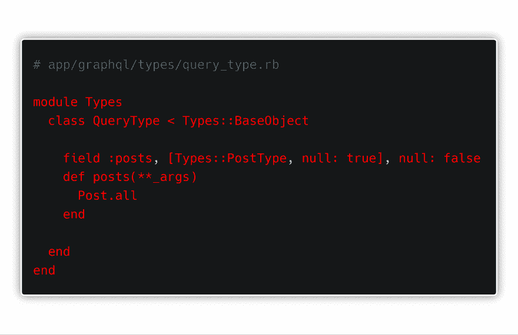](https://res.cloudinary.com/practicaldev/image/fetch/s--lbDx7lH8--/c_limit%2Cf_auto%2Cfl_progressive%2Cq_auto%2Cw_880/https://thepracticaldev.s3.amazonaws.com/i/n4vrz6lsqpv1dy9rcv72.png) 
现在，对该资源的查询如下:
[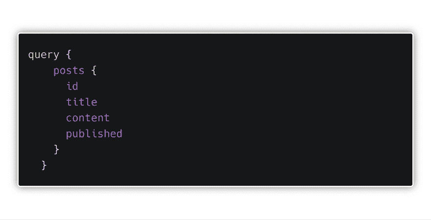](https://res.cloudinary.com/practicaldev/image/fetch/s--hd9cFgFV--/c_limit%2Cf_auto%2Cfl_progressive%2Cq_auto%2Cw_880/https://thepracticaldev.s3.amazonaws.com/i/ip2tqc9lu6mu7duk9gwq.png) 
和 graphQL

但这当然不是我们想要的。所以，让我们实现基本的光标分页。

### 分页

对于带有光标分页的类型——也就是脸书所称的连接——我们需要定义...联系。为此，我们将向查询类型添加另一个字段:
 
如您所见，这非常简单。这里有趣的部分是 connection_type 的调用，它将为 **Types::PostType** 创建**连接类型**。事实上，我们结束了！现在，对于这种连接类型，最简单的查询是这样的:
[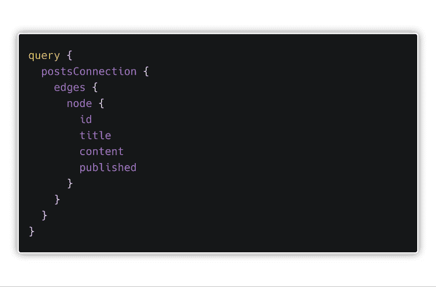](https://res.cloudinary.com/practicaldev/image/fetch/s--nK5kQc-V--/c_limit%2Cf_auto%2Cfl_progressive%2Cq_auto%2Cw_880/https://thepracticaldev.s3.amazonaws.com/i/dlcl3kxxf6ksrj9k3y9d.png) 
，它以如下形式返回记录:
[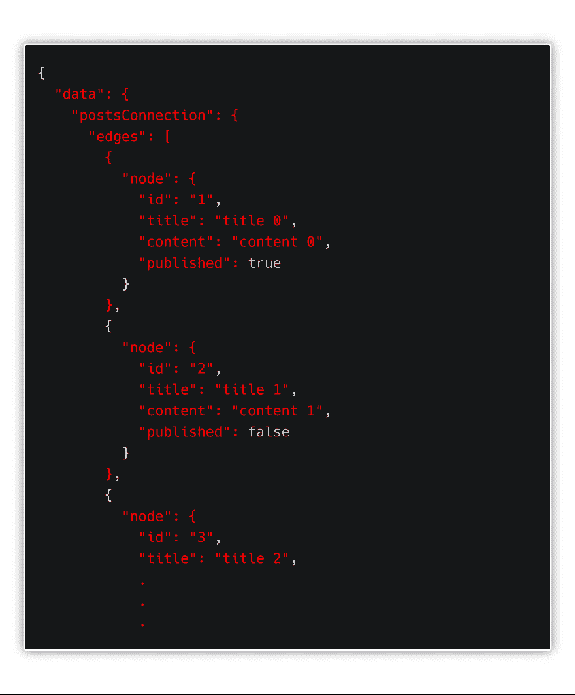](https://res.cloudinary.com/practicaldev/image/fetch/s--UGxMDNkd--/c_limit%2Cf_auto%2Cfl_progressive%2Cq_auto%2Cw_880/https://thepracticaldev.s3.amazonaws.com/i/2p67xe2eohekeyv3hze2.png)

查询及其结果看起来更复杂，这是肯定的，但是实际的分页在哪里呢？为此，graphql-ruby 在所有连接类型中公开了另一个名为 **pageInfo** 的字段。在**节点**下还有一个额外的**光标**字段，它将包含给定节点的唯一 id(它不同于 post 记录 id！).最终查询采用以下形式:
[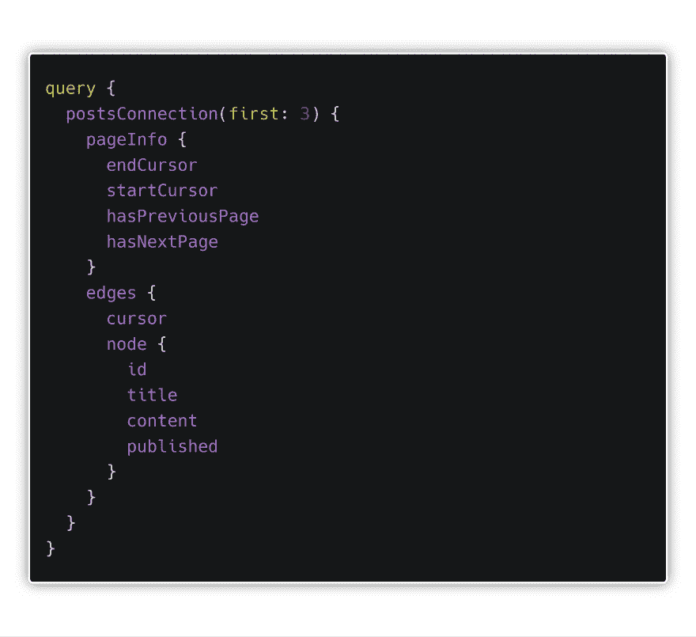](https://res.cloudinary.com/practicaldev/image/fetch/s--6aKFaV9B--/c_limit%2Cf_auto%2Cfl_progressive%2Cq_auto%2Cw_880/https://thepracticaldev.s3.amazonaws.com/i/dim0c4zdky57wy3aebud.png)

正如您可能注意到的那样，上面的 **postsConnection** 需要额外的参数: **first** ，这是一个不言自明的参数:“查询前 3 条边(记录)”。前述的 **pageInfo** 字段，顾名思义，为我们提供了与分页相关的信息。我相信它的字段是不言自明的。最终结果:
[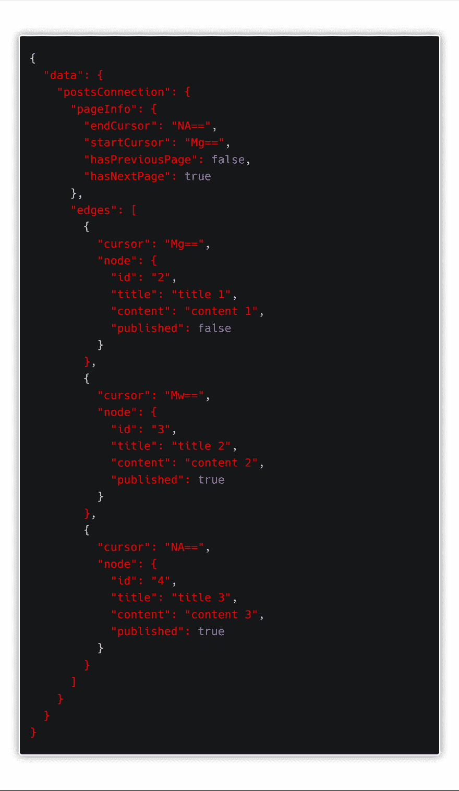](https://res.cloudinary.com/practicaldev/image/fetch/s--cXWdcVlB--/c_limit%2Cf_auto%2Cfl_progressive%2Cq_auto%2Cw_880/https://thepracticaldev.s3.amazonaws.com/i/gah37lfv2v82g20868an.png) 
要进入下一页，我们将为 postsConnection 提供附加参数:
[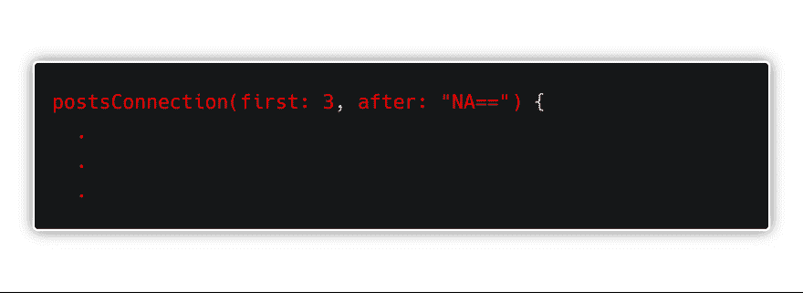](https://res.cloudinary.com/practicaldev/image/fetch/s--orbOgQc7--/c_limit%2Cf_auto%2Cfl_progressive%2Cq_auto%2Cw_880/https://thepracticaldev.s3.amazonaws.com/i/jxlq6wbpzc8nxqehowcv.png) 
...即:“用游标查询节点后的前 3 条记录(节点 id): **NA==** ”

### Gotcha 1: **有上一页**和**有下一页**

你可能会认为**有上一页**而**有下一页**会给你提供它的名字所暗示的信息。GraphQL 有一点令人讨厌的惊喜: **hasNextPage** 只有在你向前分页时才有有效信息，例如: **postsConnection(first: 3)** 。类比**后退时有前一页**:**posts connection(last:3)**。当你看下面的例子时，它会变得更清楚:

让我们查询前 5 个游标 id:
[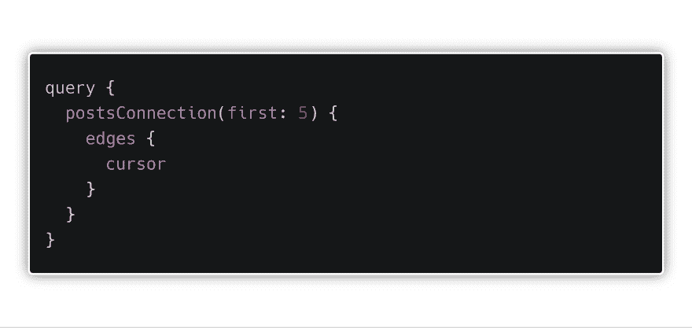](https://res.cloudinary.com/practicaldev/image/fetch/s--sGvtxkrz--/c_limit%2Cf_auto%2Cfl_progressive%2Cq_auto%2Cw_880/https://thepracticaldev.s3.amazonaws.com/i/3jeyfuwewamxj1bajvxo.png)
前 5 个游标:
 
现在让我们查询第二个之后的 2 条记录**Mg = =**:
[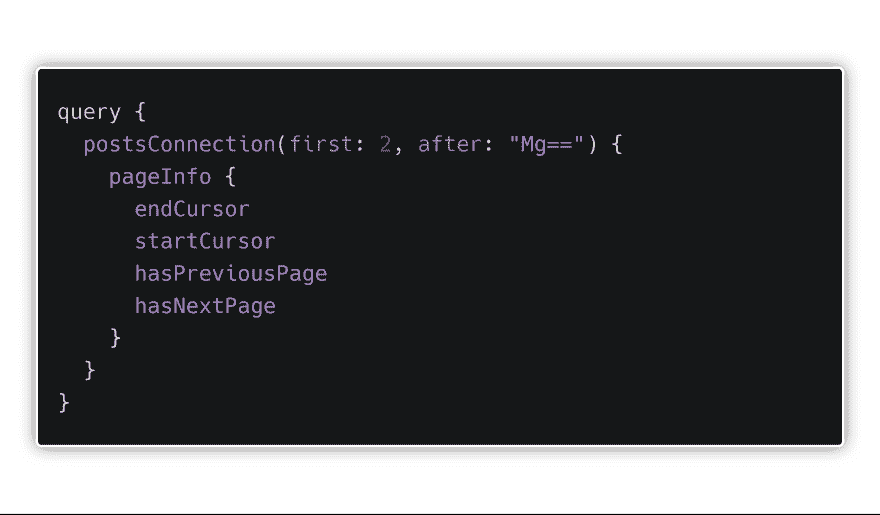](https://res.cloudinary.com/practicaldev/image/fetch/s--WiuHbFS5--/c_limit%2Cf_auto%2Cfl_progressive%2Cq_auto%2Cw_880/https://thepracticaldev.s3.amazonaws.com/i/rzdm9n2k1eshyagjitnx.png)
我们得到**pageInfo**:

尽管前一页上还有 2 条记录，我们仍然得到**“hasPreviousPage”:false**。没错:不是**空**或者**未定义**而是明显不正确**假**。而且不是 bug。是故意这样的。

对此的解释是，在 GraphQL 的发源地脸书，无限滚动是分页的一种方式(例如新闻提要)。为此，向下滚动时不需要关于上一页的信息。这只会引入不必要的性能开销。在目前的情况下，一个简单的方法来减轻这种情况(虽然不是很优雅...)是进行附加查询，只是为了检查是否有上一页。所以上面的查询应该是这样的:
 
..这一次为我们提供了正确的 **hasPreviousPage** 信息:
[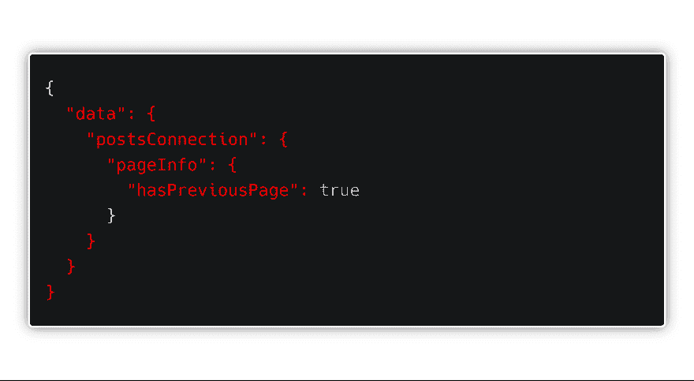](https://res.cloudinary.com/practicaldev/image/fetch/s--9DguWnIy--/c_limit%2Cf_auto%2Cfl_progressive%2Cq_auto%2Cw_880/https://thepracticaldev.s3.amazonaws.com/i/fum4urjaeyfagn97psu4.png)

### 逮到你 2: **页面计数**

所以，你可能想知道实际上有多少页。要对此进行计算，您可以执行以下操作:**total _ records _ count/records _ per _ page _ count**。所以你真正需要的是关于记录总数的信息。如果能这样查询它就好了:
 
不幸的是，运行这个查询会得到:
[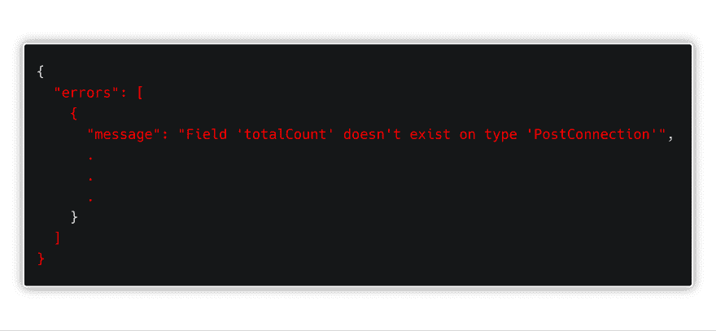](https://res.cloudinary.com/practicaldev/image/fetch/s--WRT2vWTS--/c_limit%2Cf_auto%2Cfl_progressive%2Cq_auto%2Cw_880/https://thepracticaldev.s3.amazonaws.com/i/4ae8yk6lt45ttiih9bm5.png)

事实上，没有办法从默认连接中获取这些信息。原因与上一页和下一页信息的情况相同:无限滚动分页并不真正需要记录总数，这只会带来性能开销。好消息是它很容易实现:)

首先，我们需要手动定义我们的自定义连接:
 
因此，为了定义我们的自定义连接，我们定义了一个继承自 graphql 连接基类的类:**graph QL::Types::Relay::base connection**。我们还必须手动定义一个 edge 类 **PostsEdgeType** ，然后指定我们将在我们的连接中使用它:**edge _ type(PostsEdgeType)**。最后，我们可以添加额外的字段，比如我们例子中的 total_count，就像你在其他类型类中做的一样，比如 **Types::PostType** 。

接下来，我们需要指定我们将要使用的**类型::PostsConnection** 作为 posts_connection 类型类:
[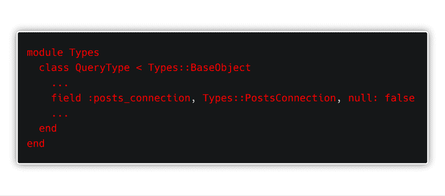](https://res.cloudinary.com/practicaldev/image/fetch/s--eK6wO7Rz--/c_limit%2Cf_auto%2Cfl_progressive%2Cq_auto%2Cw_880/https://thepracticaldev.s3.amazonaws.com/i/1dy74yy51js7w0zkuzob.png) 
现在，我们的带有总计数的查询按预期工作:

[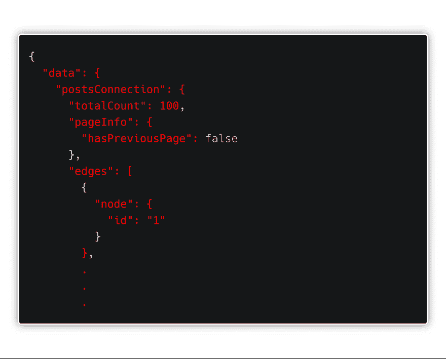](https://res.cloudinary.com/practicaldev/image/fetch/s--o9sNbjXk--/c_limit%2Cf_auto%2Cfl_progressive%2Cq_auto%2Cw_880/https://thepracticaldev.s3.amazonaws.com/i/taatwme2d908hm9v93ly.png)

当然，这种方法的缺点是，在使用 **totalCount** 的情况下，我们在连接中引入了 N+1。此外，请注意用于自定义连接的类名。它必须以**连接**结束(就像我们的例子中的**类型::PostsConnection** )才能被 graphql-ruby 视为连接。如果您需要不同的命名约定，您可以明确声明将在字段定义中使用的连接类型:

### 结论

GraphQL 及其实现(就像我们的 graphql-ruby)仍然是一项非常年轻的技术，正在快速发展中。因此，缺少被社区广泛接受的约定，就像我们在 Rails 世界中所习惯的那样。这也适用于 graphQL 分页，我们应该预料到它的规范和实现在未来会发生变化。但在此之前，这篇文章应该会对你的 graphQL 之路有所帮助；)

完整的应用程序代码可以在这里找到[。](https://github.com/KamilMilewski/graphql_examples_for_blog/tree/cursor_pagination)