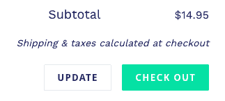
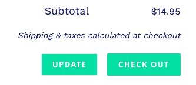

# 用两行 CSS 引导你的用户

> 原文：<https://dev.to/tygoulski/guide-your-users-with-two-lines-of-css-2jjf>

不管我们是否意识到这一点，我们经常会在页面上有多种选择。我们不断地被引导通过一个层级，在那里每个行为都有一个预先确定的重要性等级。在开发购物车中可以看到一个简单的例子！

T3】

good!

使用上面的例子，我们可以看到我们的主要动作是最**明显的**按钮。结账按钮！我们认为这是我们的主要动作，因为在这种情况下，用户点击 checkout 是最令人期待的。这是通过将`background-color`属性设置为#00e4ad 并将我们的`color`属性设置为 white 来实现的。我们的第二个动作在透明背景下不太明显。更新按钮。次要动作是两者中不太明显的选择。

T3】

bad!

如果我们举同一个例子，但是填充了两个按钮，我们不能确定哪个按钮具有更高的重要性，因为不清楚哪个按钮更明显。两个属性，`background-color`和`color`给这些按钮增加了如此重要的意义！

T3】

bad!

不要犯两个按钮互相竞争的错误！如您所见，这两个按钮都不明显，哪个是主要动作，哪个是次要动作。避免这种情况的一个策略是用透明的背景来弱化次要动作。

T3】

good!

React 网站上可以看到另一个真实的例子。英雄图像包含两个按钮，但是“开始”显然比透明背景的“学习教程”按钮更重要。

虽然这只是向用户显示主按钮和次按钮的一种方法，但是我们可以看到两个 CSS 属性`background`和`color`帮助我们指导用户是多么重要。