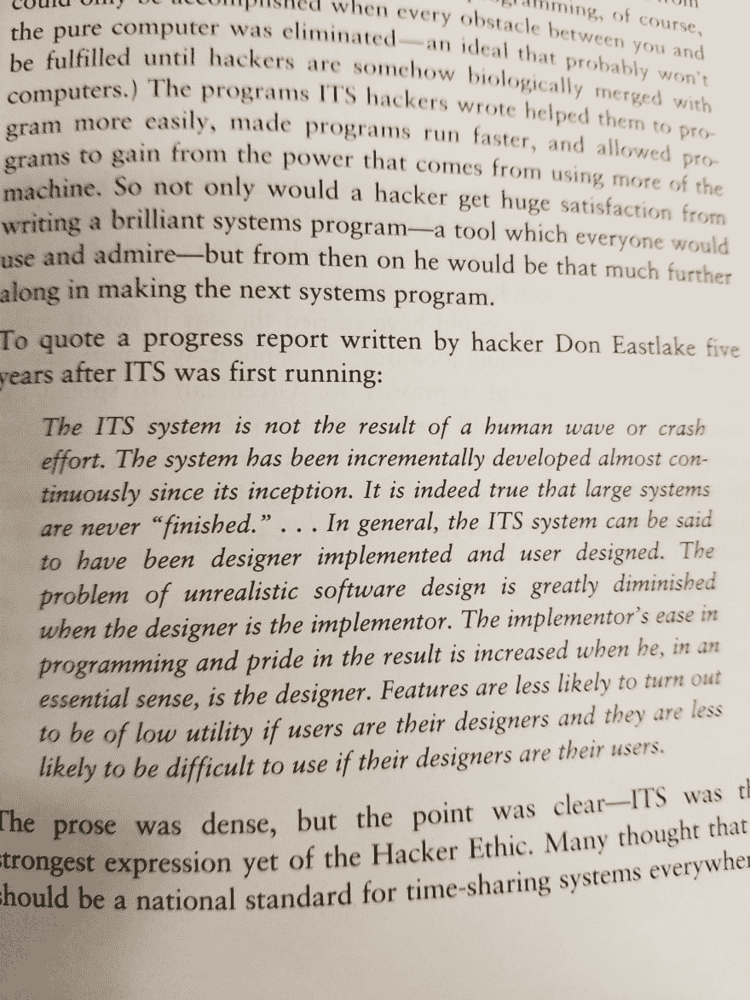

# 从 20 世纪 60 年代 ITS 系统的建立看黑客伦理

> 原文：<https://dev.to/coda/hacker-ethic-from-building-the-its-system-in-the-1960s-3de0>

我最近在读史蒂文·利维的《黑客》,看到了这句话，我认为值得分享。我认为它不仅体现了利维描述的[黑客伦理](https://en.wikipedia.org/wiki/Hacker_ethic)，也提供了对未来的一瞥。有一天，每个人都将成为自己的设计者、实施者和使用者。

以下是唐·伊斯特莱克的完整语录:

ITS 系统不是人类浪潮或撞击努力的结果。该系统从一开始就几乎一直在增量开发。的确，大型系统永远不会“完成”...总的来说，ITS 系统可以说是由设计者实施和用户设计的。当设计者是实现者时，不切实际的软件设计问题就大大减少了。从本质上讲，当实现者是设计者时，他在编程上的轻松和对结果的自豪感就会增加。如果用户是特性的设计者，特性就不太可能被证明是低效用的，如果设计者是用户，特性就不太可能难以使用。