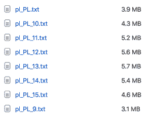
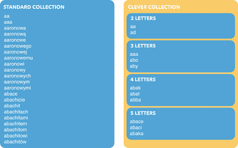
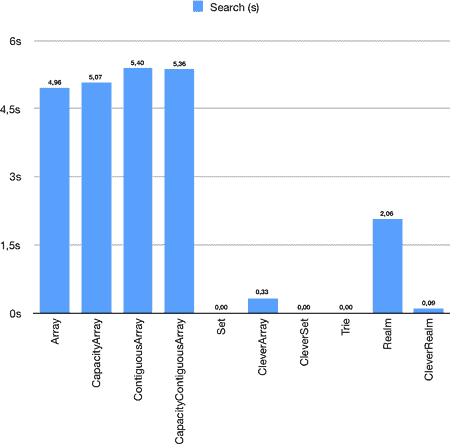
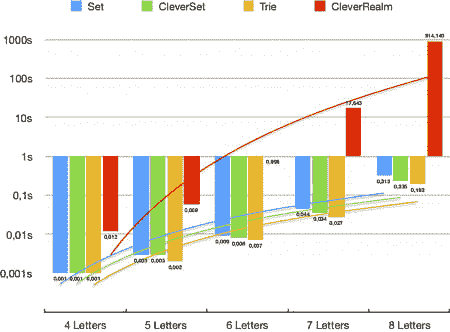

# 在 Swift 中处理大量集合类型

> 原文：<https://dev.to/netguru/handling-enormous-collection-types-in-swift-dfj>

通常选择数组或集合是没有区别的。如果您想要一个具有唯一无序元素的集合类型，您可以使用 Set。但是您并不关心性能或 RAM 的使用，因为它们通常是相似的。你有没有问过自己，如果你的集合必须存储近 300 万个像字符串这样的元素，会发生什么？

我有，因为我是非官方 iOS 拼字字典的作者。四本词典中有三本没有问题:两本英语(SOWPODS 和 TWL)和法语词典都很小，它们包含 178，691 到 386，264 个单词。波兰词典包含 2964259 个单词。没有简单的解决方案来处理这么大的集合。

这是我的第一个 iOS 应用程序，我在 2013 年用 Objective-C 编写了它。我记得它在 iOS simulator 上运行得非常好，但当我购买我的第一个开发者许可证时，它在真实设备上崩溃了很多，因为内存使用率太高。我通过将波兰语词典分成多个文件来解决这个问题:

*   一种基本的能持久存储并包含多达八个字符的单词，
*   附加文件，其中每个文件包含 9、10、11、12、13、14 或 15 个字母的单词，必要时加载。

[](https://res.cloudinary.com/practicaldev/image/fetch/s--ySqhahg1--/c_limit%2Cf_auto%2Cfl_progressive%2Cq_auto%2Cw_880/https://www.netguru.com/hs-fs/hubfs/scrabbdict_files.png%3Fwidth%3D300%26height%3D200%26name%3Dscrabbdict_files.png)

这是合理的，真的很快，尤其是对于短词。此外，内存使用是可以接受的。

我使用了数组，加载字典就像这样简单:

```
NSString *langCode;
NSArray *dictArray = [NSString stringWithContentsOfFile:[[NSBundle mainBundle] pathForResource:langCode ofType:@"txt"] encoding:NSUTF8StringEncoding error:nil] componentsSeparatedByCharactersInSet:[NSCharacterSet whitespaceAndNewlineCharacterSet]]; 
```

但是处理这种情况是不方便的，并且限制了可能性。

在进行 3.0 更新时，我决定实现更复杂的特性，比如所有单词的点和简单的正则表达式(空格)支持。我知道这其中的关键是更好的性能。现在我想和你分享不同的解决问题的方法，让你知道 Scrabbdict 实际上使用的是什么技术。

## 收藏类型

*   **数组**

*   标准`Array`

*   具有等于字符串计数的保留容量

*   `ContiguousArray`

*   具有等于字符串计数的保留容量

*   `CleverArray`这是标准的二维数组`Array`，其中数组内部包含单词，字母数等于数组的索引

*   **设置**

*   标准`Set`

*   这是标准`Sets`的标准`Array`，其中集合内部包含的单词的字母数等于集合的索引

*   **尝试**

*   由 Mauricio Santos 根据[铲斗-Swift](https://github.com/mauriciosantos/Buckets-Swift) 改装的`Trie`

*   **领域**数据库

*   带有`StringObject`的`List`的标准`Realm`数据库

*   `CleverRealm`具有多个`Lists`个`StringObject`的数据库，其中每个列表包含具有不同字母计数的单词

### 标准 vs 巧妙集合

为了展示“标准”和“智能”集合类型对象之间的区别，我创建了这个图形:

[](https://res.cloudinary.com/practicaldev/image/fetch/s--ECdCDNSQ--/c_limit%2Cf_auto%2Cfl_progressive%2Cq_auto%2Cw_880/https://www.netguru.com/hs-fs/hubfs/standard-clever.png%3Fwidth%3D500%26height%3D300%26name%3Dstandard-clever.png)

所以当我们讨论数组的时候，那么 standard 就是`Array<String>`，clever 就是`Array<Array<String>>`。

源代码

* * *

**免责声明:**我不打算在这里贴出所有的源代码，但是你可以看看[的资源库](https://github.com/netguru/swift-collections-performance)，这是我强烈建议的！

* * *

每个提到的集合类型都实现了`Validator`协议:

```
protocol Validator: class {
    init()

    /// Returns a Boolean value indicating whether
    /// the Polish dictionary contains the given word.
    /// - parameter word: The word to validate.
    func validate(word: String) -> Bool

    /// Returns an array of words that can be made from the given letters.
    /// - parameter letters: The letters.
    func words(from letters: String) -> [String]?
} 
```

更高级的集合(相当于更快的*)实现了`CleverValidator`协议，这也是允许的，但是它增加了简单的正则表达式查询。* 

```
protocol CleverValidator: Validator {
    /**
     Returns an array of words that fit the given regex query.

     An example of correct query:
     regex(phrase: "pr??lem") // ["preclem", "problem"]

     - parameter phrase: The simple regex query.
         Only letters and blanks (`?`) are allowed.
     */
    func regex(phrase: String) -> [String]?
} 
```

我相信这些都很清楚。

在让您看到结果之前，我想让您看看最基本的验证器类:

```
/// Simple word validator based on array of strings.
final class ArrayWordValidator: Validator {

    /// An array of strings.
    private let words: [String]

    init() {
        let string = try! String(contentsOf: fileURL, encoding: .utf8)
        words = string.components(separatedBy: .newlines)
    }

    func validate(word: String) -> Bool {
        return words.contains(word.lowercased())
    }

    func words(from letters: String) -> [String]? {
        let permutes = letters.lowercased()
            .map { String($0) }
            .permute()
        let predicate = NSPredicate(format: "SELF IN %@", permutes)

        return words.filter { predicate.evaluate(with: $0) }
    }
} 
```

初始化和验证函数是不言自明。返回由给定字母组成的单词的函数可能不是。

首先，它从给定的字母中获取所有可能的置换。为了使它更快，置换的最小长度是 2 个字符，因为单个字母的单词在拼字游戏中是无效的。然后，创建一个有点被遗忘的`NSPredicate`对象。你可能会问为什么，这是一个很好的问题。

这里至少有两种方法可以达到同样的结果:

```
let a = permutes.filter { words.contains($0) }
let b = words.filter { predicate.evaluate(with: $0) } 
```

不幸的是，第一种解决方案非常慢。当 permutes 计数为 86 个字符串(五个字母的查询会出现这种情况)并且使用第一种解决方案时，大约需要 170 秒才能返回结果。后一种解决方案需要不到八秒钟(原文如此！).置换次数越多，差异越大。

## 结果

我想向您展示针对不同集合类型的多个性能测试的结果。

让我们从简单但重要的事情开始…

### 初始化时间

[](https://res.cloudinary.com/practicaldev/image/fetch/s--zVQqqe4B--/c_limit%2Cf_auto%2Cfl_progressive%2Cq_auto%2Cw_880/https://www.netguru.com/hs-fs/hubfs/init.png%3Fwidth%3D400%26height%3D400%26name%3Dinit.png)

前四个数组差别不大，但是`CleverSet`和`Trie`初始化时间简直无法接受。由于境界的懒惰，`Realm`和`CleverRealm`的初始化时间都不明显。

### 字验证

只是简单的单词验证——结果是一个布尔值，它决定一个单词是否正确。每个验证器在这个测试中逐个验证 15 个单词。

[](https://res.cloudinary.com/practicaldev/image/fetch/s--PURO1RcH--/c_limit%2Cf_auto%2Cfl_progressive%2Cq_auto%2Cw_880/https://www.netguru.com/hs-fs/hubfs/search.png%3Fwidth%3D450%26height%3D450%26name%3Dsearch.png)

同样，前四个数组没有太大的区别。集合和 trie 非常快。Set 是因为对象的唯一性，trie 是因为它的结构。标准数组是最慢的，但是聪明的对象看起来真的很好。尤其是`CleverRealm`在计算初始化时间时。

### 由给定字母组成的词

那真的很有意思！

想象一下，我给字母 *I* 、 *T* 和 *L* ，并期待能从它们中造出单词。所以*亮了*，*直到*，*它的*，*李*和 *ti* 都应该返回。所以是一样的，但是用波兰语:)

[](https://res.cloudinary.com/practicaldev/image/fetch/s--Vi5mp2F7--/c_limit%2Cf_auto%2Cfl_progressive%2Cq_auto%2Cw_880/https://www.netguru.com/hs-fs/hubfs/letters.png%3Fwidth%3D450%26height%3D450%26name%3Dletters.png)

结果有点出乎意料。对于标准领域数据库，4 个字母和 5 个字母之间存在巨大差异。Sets，trie，`CleverArray`和`CleverRealm`在这个测试中确实很快，所以我决定对其中最快的四个进行更多的测试。

[](https://res.cloudinary.com/practicaldev/image/fetch/s--rUZtNmFO--/c_limit%2Cf_auto%2Cfl_progressive%2Cq_auto%2Cw_880/https://www.netguru.com/hs-fs/hubfs/letters-2.png%3Fwidth%3D450%26height%3D340%26name%3Dletters-2.png)

该图表具有对数刻度和幂趋势线。

Sets 和 trie 增长的时候字母多是合理的，但是`CleverRealm`超过六个字母就没用了！

### 简单的正则表达式

这个测试结果需要一段时间才能找到符合这些简单的空白正则表达式的单词。z？一个，*？？？*、*阿宝？？r* ， *pap？？？？*，*？？？？？？？*， *tele？？？*。

例:***【po】**？？ **r*** 应返回***【po】**【b】**【r】***、***【po】*【r】 **po**mo**r***，***【po】no*****【r】**，***

 **[](https://res.cloudinary.com/practicaldev/image/fetch/s--Snvm8qZh--/c_limit%2Cf_auto%2Cfl_progressive%2Cq_auto%2Cw_880/https://www.netguru.com/hs-fs/hubfs/regex.png%3Fwidth%3D450%26height%3D340%26name%3Dregex.png)

只有`CleverArray`、`CleverSet`、`Trie`、`Realm`和`CleverRealm`才有可能在合理的时间内完成。

`CleverRealm`最快，而`Realm`最慢。重要的是`Trie`比标准的 Swift 集合类型更快。

### RAM 使用情况

最后，但同样重要的是，它最终会让一些类型变得无用。

Xcode profiler 在运行示例应用程序的真实设备上测量的 RAM 使用情况:

*   RAM 使用量是初始化后的 RAM 使用量。
*   最高 RAM 使用率是初始化期间注意到的最高 RAM 使用率。

[](https://res.cloudinary.com/practicaldev/image/fetch/s--kSWkP7l9--/c_limit%2Cf_auto%2Cfl_progressive%2Cq_auto%2Cw_880/https://www.netguru.com/hs-fs/hubfs/ram.png%3Fwidth%3D450%26height%3D450%26name%3Dram.png)

正如你所看到的，trie 和 sets 的 RAM 使用率高得令人无法接受，因为它可能会导致崩溃，尤其是在旧设备上。阵列 RAM 使用率很高，但还可以接受，不幸的是，它们的性能并不令人满意。`Realm` RAM 使用率接近于零。

## 判断

真的很难说哪种收藏类型最好。没有人是完美的，这同样适用于这里。

我相信最好的解决方案是同时使用多种技术，这就是 Scrabbdict 的工作方式。通常它使用类似于`CleverRealm`数据库的解决方案——对于单词验证和简单的正则表达式来说，它很快。但当应用程序启动时，它会在后台创建一个最多包含 8 个字母的单词的 trie，并使用它来查找由给定字母组成的单词。在拼字游戏中，你手上的牌不能超过七张，所以八个字母的限制还是可以的，trie 真的很快。

这种有限的 trie(在波兰语中不到 50 万个单词，最多 8 个字母)初始化相当快(但这真的没关系，因为它发生在后台)，是最快的解决方案之一。**