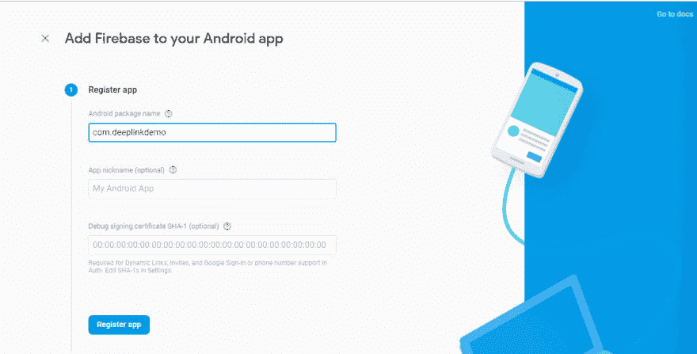
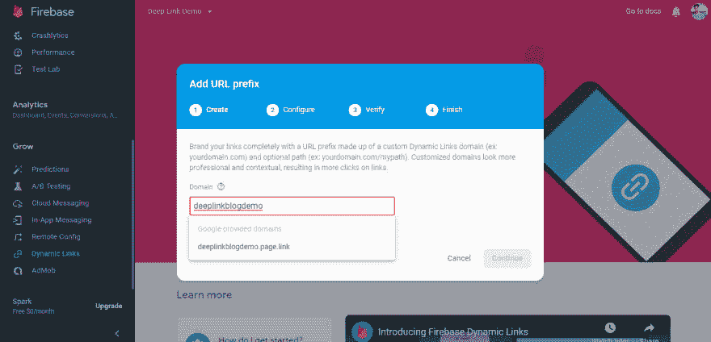
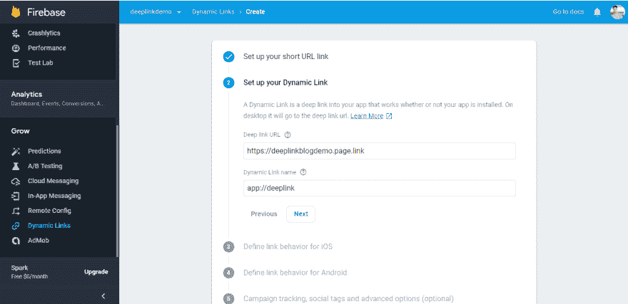

# 处理传入的动态链接

> 原文：<https://dev.to/iamshadmirza/handling-incoming-dynamic-links-1gge>

这是 React Native 深度链接简化系列的第 2 部分，在第 1 部分中，我们学习了*如何添加深度链接*。

在这篇文章中，我们的目标是学习如何像专业人士一样处理外来链接。

我们还将看到如何根据传入的链接将用户路由到特定的屏幕。

> 术语**用于`https`方案，而**动态链接**用于`app`方案。我们可以用这两个词来导航我们的用户，所以不要混淆这两个词。**

 **让我们开始吧。

# 目录

本文分为两个主要部分。我们将按如下方式讨论这些问题:

1.  项目设置
2.  测试设备上的动态链接

# 项目设置

我们将使用`react-native-firebase`模块在 React 本地项目中配置动态链接。它包括 4 个简单的步骤:

### 涉及的步骤:-

1.  创建一个 React 本地项目
2.  在 firebase 控制台上创建应用程序
3.  添加 react-native-firebase
4.  添加 Firebase 动态链接模块

## 第一步。创建一个 React 本地项目

按照本系列第 1 部分中的步骤，添加深度链接。我们将通过之前创建的同一动态/深度链接添加`firebase-invites`支持。

## 第二步。在 firebase 控制台上创建应用程序

让我们在 firebase 控制台上创建一个应用程序来使用 Firebase SDK。跟随这个[链接](https://console.firebase.google.com/)并创建一个应用程序。

*   点击**添加项目**创建一个项目。

*   按照步骤添加 Android/iOS 应用。确保**注册应用**部分中的项目名称与您的 react-native 项目匹配(在我们的例子中为`com.deeplinkdemo`)。
    [T6】](https://res.cloudinary.com/practicaldev/image/fetch/s---5WJZxYI--/c_limit%2Cf_auto%2Cfl_progressive%2Cq_auto%2Cw_880/https://raw.githubusercontent.com/iamshadmirza/BlogsByShad/master/blogs/deep-linking/create-application.png)

*   下载`google-services.json`粘贴到`/deeplinkdemo/android/app/`里面。确保位置正确。
    T3[T5](https://res.cloudinary.com/practicaldev/image/fetch/s--L0Czz4S1--/c_limit%2Cf_auto%2Cfl_progressive%2Cq_auto%2Cw_880/https://raw.githubusercontent.com/iamshadmirza/BlogsByShad/master/blogs/deep-linking/image.png)

*   按照说明添加库并同步项目。它看起来会像这样

    *   项目级 build.gradle

```
 dependencies {
  classpath("com.android.tools.build:gradle:3.4.1")
  classpath 'com.google.gms:google-services:4.3.0' //Add this line
 } 
```

*   应用级 build.gradle

```
 dependendies {
  //...
  implementation 'com.google.firebase:firebase-core:17.0.1' // Add this line
 }
 //Add to the bottom of the file
 apply plugin: 'com.google.gms.google-services' 
```

> 请使用最新的 firebase 依赖项。您也可以从 Android Studio 添加它，方法是转到:
> 
> 文件- >项目结构- >依赖项

## 第三步。添加 react-native-firebase

转到您的项目根目录并运行这个命令:

```
npm install react-native-firebase --save 
```

(可选)如果您的 react-native 版本低于 0.60，请链接该模块。

```
react-native link react-native-firebase 
```

> React 原生版本(> 0.60)支持[自动链接](https://facebook.github.io/react-native/blog/2019/07/03/version-60#native-modules-are-now-autolinked)

如果你对链接`react-native-firebase`有任何问题，或者你正在使用 React Native 的早期版本，请遵循手动链接指南。

## 手动链接为 React Native( < 0.60)

查看官方[文档](https://rnfirebase.io/docs/v5.x.x/installation/android)了解更新方法。

### 安卓

*   将`react-native-firebase`添加到应用级`build.gradle`

```
dependencies {
 //...
 implementation project(':react-native-firebase') //Add this line
} 
```

*   编辑`settings.gradle`

```
//Add these lines
include ':react-native-firebase'
project(':react-native-firebase').projectDir = new File(rootProject.projectDir, '../node_modules/react-native-firebase/android') 
```

*   编辑`MainApplication.java`

```
 ...
 import io.invertase.firebase.RNFirebasePackage; // import this

 @Override
 protected List<ReactPackage> getPackages() {
 return Arrays.<ReactPackage>asList(
 new MainReactPackage(),
 new RNFirebasePackage(), // Add this line
 );
 } 
```

*   同步项目，我们准备好了。

## 第四步。添加 Firebase 动态链接:

我们必须包含其他模块，因为我们之前导入的`RNFirebasePackage`只提供核心特性。

如果你去 [Firebase 邀请文档](https://firebase.google.com/docs/invites)，你会看到一个警告。

> Firebase Invites 已弃用。您可以使用 Firebase 动态链接创建跨平台的邀请链接，这些链接在应用程序安装后仍然有效。有关更多详细信息，请参见迁移指南。

这意味着我们最终将在我们的项目中使用 [Firebase 动态链接](https://firebase.google.com/docs/dynamic-links/)模块。

*   将依赖关系添加到`android/app/build.gradle`文件:

```
dependencies {
 // ...
 implementation "com.google.firebase:firebase-dynamic-links:19.0.0"
} 
```

*   编辑`MainApplication.java`:

```
import ...
//import this package
import io.invertase.firebase.links.RNFirebaseLinksPackage;
@Override
protected List<ReactPackage> getPackages() {
 return Arrays.<ReactPackage>asList(
 new MainReactPackage(),
 new RNFirebasePackage(),
 new RNFirebaseLinksPackage() // Add this line
 );
} 
```

*   同步项目，我们就完成了。让我们转到第二部分。

如果你遇到一些依赖问题，那么`Migrate to AndroidX`。查看本文末尾的**如何解决依赖问题**。

> 更新方法见[正式文件](https://rnfirebase.io/docs/v5.x.x/links/android#Configure-Android-Project)。

# 测试设备上的动态链接

这一部分包括两个步骤

1.  创建一个动态链接。
2.  处理传入链接。

## 第一步。创建动态链接

让我们在 Firebase 控制台上生成一个链接，并更新我们的意图过滤器。这个链接必须是唯一的，由 *firebase* 本身提供。遵循以下简单步骤:

*   在 Firebase 控制台上选择你的应用，点击**开始**
    [](https://res.cloudinary.com/practicaldev/image/fetch/s--MTVb4gVQ--/c_limit%2Cf_auto%2Cfl_progressive%2Cq_auto%2Cw_880/https://raw.githubusercontent.com/iamshadmirza/BlogsByShad/master/blogs/deep-linking/get-started.png)

*   添加一个**域名**。可能需要几次尝试才能找到一个独特的域名。当你找到一个的时候把它记下来。
    *(我的例子:`https://deeplinkblogdemo.page.link`*
    [](https://res.cloudinary.com/practicaldev/image/fetch/s--PkUXNv9C--/c_limit%2Cf_auto%2Cfl_progressive%2Cq_auto%2Cw_880/https://raw.githubusercontent.com/iamshadmirza/BlogsByShad/master/blogs/deep-linking/add-domain.png)

*   编辑`AndroidManifest.xml`并用您刚刚创建的*域*:
    更新`intent-filter`中的`<data>`标签

```
 <data android:scheme="https"
 android:host="deeplinkblogdemo.page.link" /> 
```

*   点击**新动态链接**并按照步骤操作。在*设置您的动态链接*部分，提供*深度链接 URL* 和*动态链接名称*。

现在我们已经创建了我们的动态链接，我们可以继续下一步。

## 第二步。处理传入链接

项目的根文件`App.js`是添加处理逻辑的最佳位置。所以让我们开始编辑根文件。
遵循以下三个简单的步骤

1.  导入 firebase 模块。

```
import firebase from 'react-native-firebase'; 
```

1.  添加在挂载根文件时监视传入链接的代码。

```
async componentDidMount() {
 let url = await firebase.links().getInitialLink();
 console.log('incoming url', url);
} 
```

1.  用任意浏览器打开创建的*动态链接*，查看日志。如果你能看到进来的网址，欢呼吧。

我们可以在这里添加条件来检查 url 中的某个匹配。在此基础上，我们可以根据需要编写函数。例如:

```
async componentDidMount() {
 let url = await firebase.links().getInitialLink();
 if(url === 'some_condition_here'){
 //code to execute
 }
} 
```

添加导航路径或任何你需要的东西，你就可以开始了。我们将使用这一逻辑在 React 本地应用中构建一个推荐系统，因为这将是展示动态链接的完美用例。所以不要错过这个系列的第三部分也是最后一部分。

## 如何解决依赖问题

由于最近发生在`AndroidX`库上的变化，你可能会遇到一些依赖问题(因为我就是这么做的),下面是我解决这些问题的方法:

1.  用 Android Studio 打开你的*项目*，选择`app`文件夹。
2.  去*折光仪- >迁移到安卓- >做折光仪*。
3.  同步项目。如果问题仍然存在，请执行步骤 4 和 5。
4.  您可能会在下面的*构建输出*中看到一个*构建问题列表*。仔细检查每一个，找到冲突的变量。
5.  按`ALT + ENTER`键，导入依赖关系。去掉已经存在的旧的，我们就完成了。

我希望你能够解决这些问题，并成功地实现 firebase 的动态链接。

如果觉得有帮助就分享这篇文章。

下篇见。河鲱**