# Hasura，云中的 GraphQL 后端——第 1 部分

> 原文：<https://dev.to/thisdotmedia/hasura-graphql-backend-in-the-cloud-part-1-364o>

你是第一次接触 [Hasura GraphQL 引擎](https://hasura.io/)吗？你想了解更多吗？

请加入我关于 Hasura GraphQL 引擎的三部分系列的第一部分。我们将从学习基本的 Hasura 概念开始。然后，我们将继续探索 Hasura 如何扩展标准的 [GraphQL](https://graphql.org/) ，允许您查询和改变后端数据库。

最后，我们将演示一个使用 [Auth0](https://auth0.com/) 进行认证/授权的 Vue.js 应用程序，该应用程序在一个部署在 [Heroku](https://heroku.com/) 上的 Hasura 引擎实例中进行通信，以管理食物食谱。好吃！

Hasura GraphQL Engine 是一个高性能的 GraphQL 服务器，它通过 Postgres 数据库为您提供即时的实时 GraphQL APIs。这是一个打包的解决方案，它包装了一个 Postgres 数据库，并将每个表/视图公开为 GraphQL 服务器 API 上的一个端点。

你可以认为哈苏拉既是一个 PaaS 又是一个 BaaS。平台即服务(PaaS ),因为 Hasura 是以这种方式提供的，可以在云中或内部托管。例如，Heroku 允许您通过几个简单的步骤将其部署到云中！事实上，这是 Hasura 团队在 Heroku 上部署它的推荐方法。

另一方面，Hasura 可以作为后端服务(BaaS)来帮助开发人员为他们的解决方案构建可扩展的、可靠的后端。例如，当你将 Hasura 部署到 Heroku 上的新应用程序时，Hasura 会确保你获得自己的专用后端，包括 Postgres 数据库、GraphQL 服务器 API 和浏览器 IDE 中的 graph QL。这个后端完全独立于为其他应用程序创建的任何其他后端。

## 特性

为了帮助更好地理解 Hasura，让我们从探索 Hasura 提供的主要特性开始:

## Postgres 后端数据库

有了 Hasura，你可以在 Postgres 数据库上快速构建后端应用。Hasura 可以被认为是一个 Postgres 管理工作室。您可以创建表和视图，添加它们之间的关系，管理它们的权限，并为它们提供数据。

## GraphQL 紧密集成

除了管理 Postgres 数据库之外，它还将数据库中的每个表或视图公开为 GraphQL 服务器 API 的根查询中的一个字段。因此，您可以通过 GraphQL 查询或改变任何表。反过来，您将花时间管理您的 Postgres 数据库，而 Hasura 将完成在数据库之上准备和公开 GraphQL 服务器所需的其余艰苦工作。

## 使用 Postgres 数据库

您可以将 Hasura 连接到一个新的 Postgres 数据库，甚至是一个现有的数据库。通过在现有数据库上使用 Hasura，您有机会将应用程序后端从使用传统的标准 Postgres 数据库迁移到 GraphQL 服务器后端。

## 导入已有的 Postgres 数据库

如果您决定在一个新的 Postgres 数据库上部署 Hasura，您仍然可以通过单击将您的数据库模式从现有的或以前的 Postgres 数据库导入到 Hasura 中。同样，Hasura 给了你一个将现有应用程序后端迁移到 GraphQL 的机会。

## 图形 live queries

Hasura 可以通过 GraphQL 订阅将任何 GraphQL 查询转换为实时查询。你可以阅读更多关于 [Hasura 订阅](https://docs.hasura.io/1.0/graphql/manual/subscriptions/index.html)的信息。

## 动态门禁系统

Hasura 提供了一个动态访问控制系统来保护你的 Postgres 数据库，并集成了第三方授权服务，如 [Auth0](https://auth0.com/) 和 [Firebase](https://firebase.google.com/) 。通过使用[角色和会话变量](https://docs.hasura.io/1.0/graphql/manual/auth/roles-variables.html)，Hasura 让您在添加表的动态权限和用户可以进行的操作方面占上风。它基于一些动态变量，这些变量的值与来自授权服务的值进行比较。本系列的第三部分展示了如何将 Vue.js 应用程序与 Auth0 和 Hasura GraphQL 引擎连接起来。

## 用新的运算符和表达式扩展 GraphQL

Hasura 使用额外的强大操作符扩展了标准的 GraphQL 查询语言，从而在灵活性和生产率方面提供了丰富的开发人员体验。本系列的第二部分介绍了 GraphQL 语言的大部分新增功能，并通过示例代码演示了如何在查询和变异中使用它们。

## Hasura 管理控制台 UI

最后，Hasura 提供了一个开箱即用的丰富的管理控制台 UI，它公开了以下内容:

*   **API Explorer:** 这是浏览器 IDE 中的**GraphQL 的一个实例，用于连接到 Hasura，并针对后端 graph QL 服务器 API 发出查询和变异。**

*   **数据**:这是 Postgres 管理工作室，管理你的 Postgres 数据库。

*   **事件触发器**:每当数据库发生变化时，Hasura 给你机会定义 [webhooks](https://en.wikipedia.org/wiki/Webhook) 。例如，您可以定义一个事件，以便在向数据库的表中添加新行时触发 webhook。

## 演示

在本演示中，我们将在 Heroku 上部署 Hasura GraphQL 引擎，并设置我们将在本系列中使用的数据库。

## 在 Heroku 上创建一个帐户

在 [Heroku](https://signup.heroku.com/) 注册一个新账户(如果你还没有的话)。一旦你注册，你将能够使用 [Heroku 免费云服务](https://www.heroku.com/free)并在你的免费 [dynos](https://www.heroku.com/dynos) 时段部署应用程序。

## 在 Heroku 部署哈苏拉

现在您已经登录，是时候部署 Hasura GraphQL 引擎了。哈苏拉在 Heroku 上设置为 [Heroku 按钮](https://elements.heroku.com/buttons/hasura/graphql-engine-heroku)。沿着链接，找到按钮**部署到 Heroku，**并点击它来启动这个过程。

Heroku 将您转到下图所示的**创建新应用**表单。

[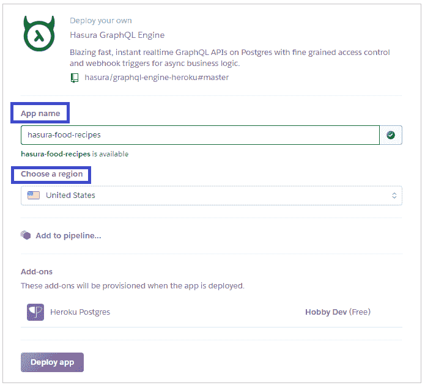](https://res.cloudinary.com/practicaldev/image/fetch/s--rBzJESlv--/c_limit%2Cf_auto%2Cfl_progressive%2Cq_auto%2Cw_880/https://cdn-images-1.medium.com/max/2000/0%2Ah1lcfgqgLmWQeOTy)

为您的新应用程序选择一个名称，并选择您希望 Heroku 部署您的应用程序的地区。只有两个可用:美国和欧洲。

在本演示中，我选择了 **hasura-food-recipes** 作为应用程序的名称。**美国**为该地区。

完成后，点击**部署应用**按钮。

Heroku 开始部署应用程序的过程，然后为您提供两个链接来管理或查看应用程序。

[](https://res.cloudinary.com/practicaldev/image/fetch/s--6D6CXmvv--/c_limit%2Cf_auto%2Cfl_progressive%2Cq_auto%2Cw_880/https://cdn-images-1.medium.com/max/2000/0%2A-sHz_ya_py-3FXWz)

要开始管理您的应用程序，请点击**管理应用程序**按钮。

## 保护 Heroku 上的 GraphQL 端点

现在，您已经登陆了 Heroku 上的应用程序仪表板，让我们通过提供一个密钥来保护 Hasura GraphQL 端点，您以后在访问 Hasura 管理控制台 UI 时将需要这个密钥。

点击仪表板页面上的**设置**按钮。

[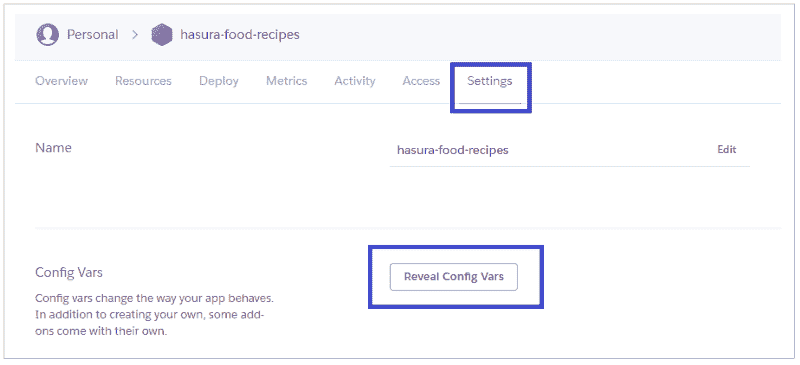](https://res.cloudinary.com/practicaldev/image/fetch/s--BymVzY83--/c_limit%2Cf_auto%2Cfl_progressive%2Cq_auto%2Cw_880/https://cdn-images-1.medium.com/max/2000/0%2AQmt9uQ7rS8-ouz5F)

在**配置变量**部分，点击**显示配置变量**按钮。Config Vars 部分允许您定义可以在应用程序的其他地方使用的应用程序级变量。

现在显示了配置变量部分，输入以下信息:

*   在**键**输入栏中输入**HASURA _ graph QL _ ACCESS _ KEY**的值。

*   在**值**输入字段中输入您选择的密钥。一定要把它放在安全的地方，因为你以后会用到它。

*   点击**添加**按钮保存您的数据。

当您访问 Hasura 管理控制台 UI 时，系统会提示您输入您的密钥来授予或拒绝访问权限。

点击页面顶部的**打开应用**按钮。Heroku 将您转到 Hasura 管理控制台 UI。

[](https://res.cloudinary.com/practicaldev/image/fetch/s--fkQMcDy0--/c_limit%2Cf_auto%2Cfl_progressive%2Cq_auto%2Cw_880/https://cdn-images-1.medium.com/max/2000/0%2AnulXNA0dPblXw9nQ)

输入您的密钥以访问管理控制台 UI。

## 介绍 Hasura 管理控制台 UI

管理控制台 UI 是 Hasura GraphQL 引擎的主界面。下面就来详细探究一下。

[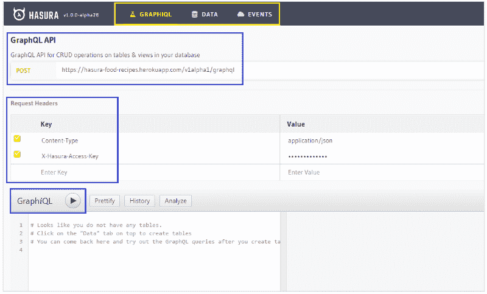](https://res.cloudinary.com/practicaldev/image/fetch/s--HciRIcfB--/c_limit%2Cf_auto%2Cfl_progressive%2Cq_auto%2Cw_880/https://cdn-images-1.medium.com/max/2000/0%2AuJMsKIkPGJhm7wUk)

管理控制台 UI 主页可以分为四个主要部分:

*   主导航菜单，可用于导航至图形、数据库和事件触发器部分。

*   表示 GraphQL URL 的 GraphQL API，在从客户端应用程序连接到 Hasura 时使用。在本系列的第三部分中会有更多的介绍。

*   Request Headers 部分，用于指定与 Hasura 通信所需的请求头。例如，管理控制台 UI 发送 **X-Hasura-Access-Key** 请求头来访问 Hasura 后端。

*   GraphQL 浏览器内 IDE，让您有机会通过 graph QL 查询和变异来测试您的 Postgres 后端。

## 创建 Postgres 数据库表

让我们创建在 Hasura 系列中需要的表格。点击工具栏上的**数据**菜单项。

[](https://res.cloudinary.com/practicaldev/image/fetch/s--1QwG0yQs--/c_limit%2Cf_auto%2Cfl_progressive%2Cq_auto%2Cw_880/https://cdn-images-1.medium.com/max/2000/0%2AVev6LElRLJVJXVJD)

屏幕左侧列出了所有现有的表或数据库视图。在右侧，点击**创建表格**来创建您的第一个表格。

[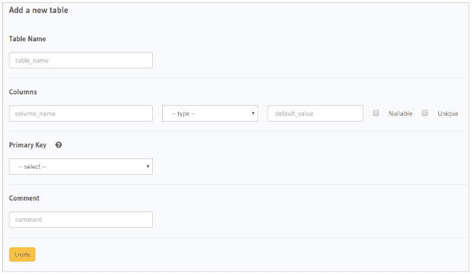](https://res.cloudinary.com/practicaldev/image/fetch/s--UFVNyPqL--/c_limit%2Cf_auto%2Cfl_progressive%2Cq_auto%2Cw_880/https://cdn-images-1.medium.com/max/2000/0%2AgIvRpeynqYH4kBfc)

通过给一个表名来创建一个表。然后开始添加属于该表的**列**。对于每一列，您指定要存储在该列中的数据的**类型**，一个**默认值，**如果有的话，该列是否允许 **Null** 值，最后，该列值在表中是否是唯一的**。您可以根据需要添加任意多的列。**

 **然后指定哪一列是**主键**。

最后，点击 **Create** 按钮，在数据库中实际创建表。

让我们为这个系列创建第一个表，即**食谱**表，如下所示:

[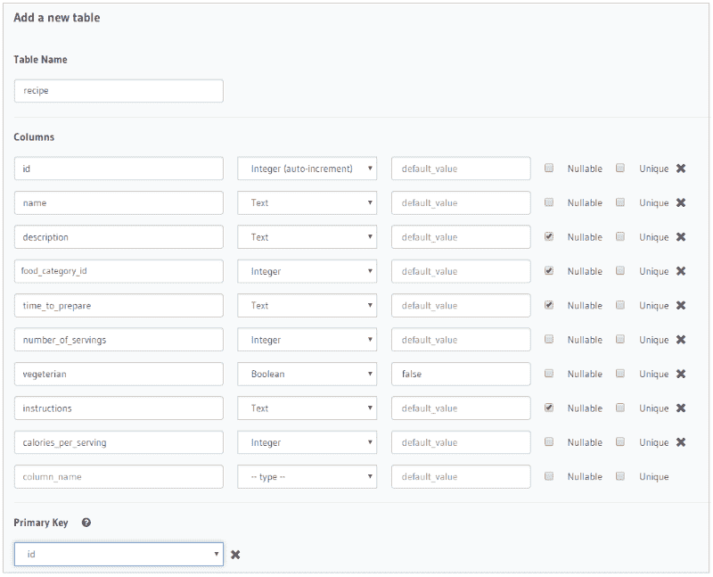](https://res.cloudinary.com/practicaldev/image/fetch/s---jfFqRze--/c_limit%2Cf_auto%2Cfl_progressive%2Cq_auto%2Cw_880/https://cdn-images-1.medium.com/max/2000/0%2ArE4isk64Hr72A083)

一旦创建了配方表，Hasura 会为您提供几个选项来管理该表:

*   浏览行

*   插入行

*   修改

*   关系

*   许可

让我们修改配方表并添加**配方源**列。

点击**修改标签**。

[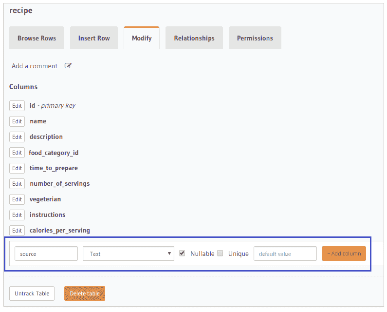](https://res.cloudinary.com/practicaldev/image/fetch/s--9RXiAtUK--/c_limit%2Cf_auto%2Cfl_progressive%2Cq_auto%2Cw_880/https://cdn-images-1.medium.com/max/2000/0%2ADzGgo_5yRr_xd1Qk)

你可以**编辑**一个现有的列或者**添加**一个新列。对于这个场景，让我们添加 source 列，如上图所示。然后，点击**添加列**按钮。现在配方表有了一个新的列，标记为**源**。

让我们使用**插入行**部分插入一个新配方。点击**插入行**选项卡。

[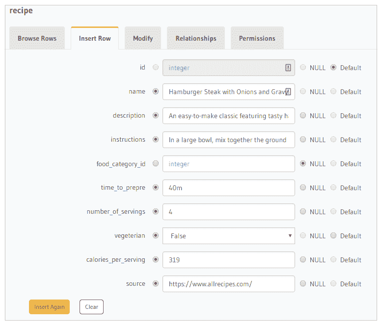](https://res.cloudinary.com/practicaldev/image/fetch/s---HU6WQvj--/c_limit%2Cf_auto%2Cfl_progressive%2Cq_auto%2Cw_880/https://cdn-images-1.medium.com/max/2000/0%2A7Oo6t9frQWj-R1FV)

您现在可以点击**浏览行**来查看新插入的行。

我将创建本系列所需的其余表格。这些表格是:

*   食物 _ 类别

*   原料

*   食谱 _ 配料

通过 Hasura 创建的所有表都是实际的 Postgres 数据库表。

当我们在 Postgres 数据库中创建表和视图时，Hasura GraphQL 引擎会自动创建 GraphQL 模式对象类型和相应的带有解析器的查询/变异字段。

例如，Hasura 自动生成了模式/根查询类型中的**配方**字段，如下所示:

```
recipe(
    limit: Int
    offset: Int
    order_by: [recipe_order_by!]
    where: recipe_bool_exp
): [recipe!]! 
```

在根查询对象上定义了**配方**字段，应用程序可以通过执行**配方查询**并向其传递一个**形式的过滤表达式来发出检索单个配方的请求，其中:recipe_bool_exp** ，通过 **limit** 和 **offset** 表达式应用分页，并使用 **order_by: [recipe_order_by！】**表情。

此外，配方表也会产生突变:

```
delete_recipe(where: recipe_bool_exp!): recipe_mutation_response

insert_recipe(objects: [recipe_insert_input!]!on_conflict: recipe_on_conflict): recipe_mutation_response

update_recipe(
    _inc: recipe_inc_input
    _set: recipe_set_input
    where: recipe_bool_exp!
): recipe_mutation_response 
```

**recipe_mutation_response** 是由 Hasura 定义的对象类型，具有两个属性:

```
affected_rows: Int!
The number of affected rows by the mutation
returning: [recipe!]!
The data of the affected rows by the mutation 
```

通过导航到 Hasura 管理控制台 UI 上的 GraphiQL 部分，并浏览页面右侧的 documentation 选项卡，可以检查生成的模式对象类型以及模式上的所有查询和突变字段。

[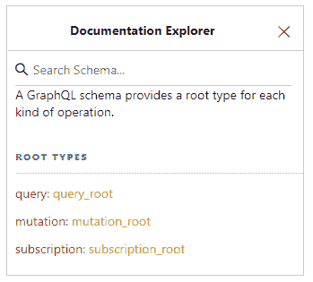](https://res.cloudinary.com/practicaldev/image/fetch/s--NeuNo_vZ--/c_limit%2Cf_auto%2Cfl_progressive%2Cq_auto%2Cw_880/https://cdn-images-1.medium.com/max/2000/0%2AIfoJv36iB-ThKluM)

## 添加数据库表之间的关系

数据库表之间的关系由 Hasura GraphQL 引擎作为 GraphQL 嵌套对象来处理。Postgres 数据库或任何其他关系数据库中有三种类型的[表关系:](https://launchschool.com/books/sql_first_edition/read/multi_tables)

### [一对一的关系](https://docs.hasura.io/1.0/graphql/manual/schema/relationships/database-modelling/one-to-one.html)

有了这样的关系，Hasura 将在表的每一侧添加一个嵌套对象。

### [一对多关系](https://docs.hasura.io/1.0/graphql/manual/schema/relationships/database-modelling/one-to-many.html#)

食谱表与食品类别表有一对多的关系。使用**数据**部分下的**关系选项卡**，您可以通过点击**手动添加关系**按钮来手动定义该关系，或者通过修改食谱表本身并将 **food_category_id** 列标记为与 **food_category** 表相关的**外键**字段。让我们遵循后者，并相应地修改该表。导航到**修改**标签**标签**，点击 **food_category_id** 栏附近的**编辑**按钮。

[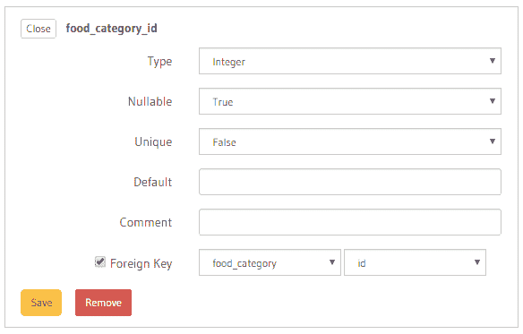](https://res.cloudinary.com/practicaldev/image/fetch/s--9hPDNMws--/c_limit%2Cf_auto%2Cfl_progressive%2Cq_auto%2Cw_880/https://cdn-images-1.medium.com/max/2000/0%2AFx9McH68Xgna26L8)

选择**外键**复选框，然后选择关系另一端的表，最后选择关系所基于的列。在本例中，**食品 _ 类别**表和 **id** 列分别出现。最后，点击**保存**按钮保存修改。

让我们再次访问**关系选项卡**。Hasura 推断出与 **food_category** 表的关系，并建议您添加它:

[](https://res.cloudinary.com/practicaldev/image/fetch/s--R0Y63oO_--/c_limit%2Cf_auto%2Cfl_progressive%2Cq_auto%2Cw_880/https://cdn-images-1.medium.com/max/2000/0%2AQoEDBDYbVCaTWZgF)

点击**添加**按钮。现在，系统会提示您为此关系命名。在我们的例子中，我们称之为**食品类别**。

### [多对多关系](https://docs.hasura.io/1.0/graphql/manual/schema/relationships/database-modelling/many-to-many.html)

一个配方可以有一种或多种配料。同时，一种配料可以添加到多个配方中。因此，检测到多对多关系。通常，在关系数据库中，多对多关系是通过创建第三个带有主键的数据库表来描述的，它带来了食谱表的主键和配料表的主键。因此，你可以添加任意多的配方成分组合。

在本系列中，我已经通过添加第三个名为 Recipe 配料表的表，将 Recipe 和配料表配置为多对多关系。

现在所有的数据库表和关系都已经添加好了，让我们看看由 Hasura 为我们生成的 **recipe 对象类型**:

```
 calories_per_serving: Int
description: String

food_category_id: Int
food_category: food_category
An object relationship

id: Int!
instructions: String
name: String!
number_of_servings: Int

recipe_ingredients(
    limit: Int
    offset: Int
    order_by: [recipe_ingredient_order_by!]
    where: recipe_ingredient_bool_exp
): [recipe_ingredient!]!
An array relationship

source: String
time_to_prepre: String
vegetarian: Boolean! 
```

## 使用 API Explorer 查询和变异 Postgres 数据库

让我们切换到 Hasura 管理控制台 UI 上的 GraphiQL 部分，并开始发布一些变化和查询。

在添加食谱之前，我们将先添加一些配料和食物类别。

Hasura API Explorer 有一个集成的实时智能感知机制，可以在输入 GraphQL 查询或变异时提供选项建议。

[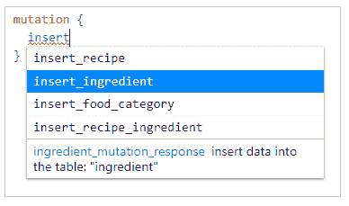](https://res.cloudinary.com/practicaldev/image/fetch/s--VkHX8KSt--/c_limit%2Cf_auto%2Cfl_progressive%2Cq_auto%2Cw_880/https://cdn-images-1.medium.com/max/2000/0%2AayDvAW1a2-rajeXy)

一旦您选择了突变字段，您将得到两个关于该突变的输入参数的建议:要么是变量**对象**列出要插入的数据记录(一个或大部分记录),要么是 **on_conflict** 定义该突变在 [upsert 突变](https://medium.com/@JaisonTitus/upsert-queries-on-postgres-using-hasuras-graphql-apis-248bc6b2519a)中的行为。

[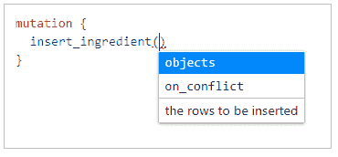](https://res.cloudinary.com/practicaldev/image/fetch/s--lxF2F2kI--/c_limit%2Cf_auto%2Cfl_progressive%2Cq_auto%2Cw_880/https://cdn-images-1.medium.com/max/2000/0%2Ab5AByn_Ykxsbzcbs)

所以我们的第一个突变是这样的:

```
 mutation {
    insert_ingredient(objects: [{
        name: "Bread Crumbs"
    }]) {
        affected_rows,
        returning {
            name
        }
    }
} 
```

变异是通过指定成分的**名称**来插入新的成分。此外，它请求返回受影响行的数量和新插入记录的名称**。**

您可以使用 API Explorer 来执行上述变异，并从 Hasura GraphQL 引擎接收以下响应:

```
 {
    "data": {
        "insert_ingredient": {
            "affected_rows": 1,
            "returning": [
                {
                    "name": "Bread Crumbs"
                }
            ]
        }
    }
} 
```

我主动加了一些配料。现在让我们查询 Postgres 数据库中的所有配料，并只返回它们的名称。

```
 query return_ingredients {
    ingredient {
        name
    }
} 
```

收到的响应是:

```
 {
    "data": {
        "ingredient": [
            {
                "name": "Ground Beef"
            },
            {
                "name": "Eggs"
            },
            {
                "name": "Bread Crumbs"
            }
        ]
    }
} 
```

在本系列的第二部分中，我们将练习更多的查询和变异。

## 结论

在这篇介绍 Hasura GraphQL 引擎的文章中，我们发现了 Hasura 提供的主要特性。我们还处理了 Postgres 数据库表，创建了一些表，添加了表之间的关系，最后利用 Hasura API Explorer 查询和修改了数据库。

在本系列的第 2 部分中，我们将探索 Hasura 的更多特性，包括 GraphQL 查询和变异的所有扩展，以及由 Hasura 定义和使用的认证和访问控制系统。

祝你快乐！

*这篇文章是由[比拉勒·海达尔](https://www.twitter.com/bhaidar)写的，他是[这个圆点](http://thisdot.co/labs)的导师。*

需要 JavaScript 咨询、指导或培训帮助吗？在 [This Dot Labs](//thisdot.co) 查看我们的服务列表。**