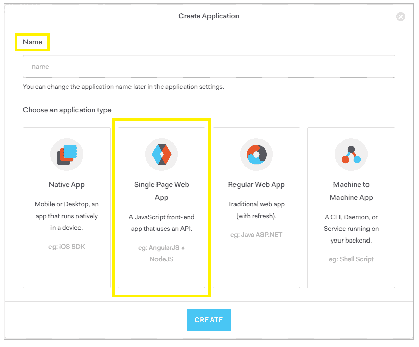
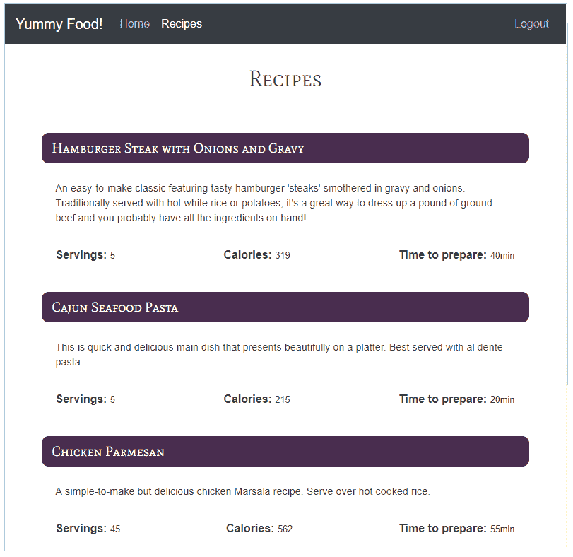

# Hasura，云中的 GraphQL 后端——第 3 部分

> 原文：<https://dev.to/thisdotmedia/hasura-graphql-backend-in-the-cloud-part-3-506b>

> 布丁好不好，吃了才知道！

在 Hasura GraphQL 引擎的最后一部分中，我们将构建一个 Vue.js 客户端应用程序，通过 auth0 进行身份验证和授权，连接到 Hasura GraphQL 引擎来构建一个食物食谱管理系统。

在本系列的第一和第二部分中，您了解了 Hasura GraphQL 引擎，如何将其部署到 Heroku，以及如何管理其 Postgres 数据库。您还充分展示了它的查询和变异能力。

如果您还没有阅读第一部分或第二部分，需要加快速度，我建议您返回，然后在这里继续。

本文假设您具备以下方面的基本知识:

*   vista . js

*   [Vuex](https://vuex.vuejs.org/)

*   [检视路由器](https://router.vuejs.org/)

本文的源代码存放在 GitHub [repo](https://github.com/thisdot/hasura-crud-app) 上。

## 创建 Vue.js app

我将使用 Vue CLI 3 生成一个新的 Vue.js 应用程序。发出以下命令，开始使用一个新的 Vue.js 应用程序。

```
vue create hasura-crud-app 
```

该命令提示您一组问题，以帮助定制应用程序。对于本演示，请确保遵循以下步骤:

*   请选择一个预设:选择**手动选择功能**选项。

*   检查您的项目所需的特性:选择 **Babel** 、 **Router** 、 **Vuex** 和 **Linter / Formatter** 选项。

*   对路由器使用历史模式？键入 **Y.**

*   选择一个 linter / formatter 配置:我个人更喜欢 **ESLint + Airbnb 配置**。如果那是你想要的，你可以选择另一个。

*   挑选附加皮棉特征:选择**皮棉保存时**选项。

*   你更喜欢把 Babel，PostCSS，ESLint 等的配置放在哪里？？选择专用配置文件中的**选项。**

*   最后，您可以决定将上述选项保存为模板，以便下次创建新的 Vue.js 应用程序时使用。

Vue CLI 开始创建您的应用程序文件，并需要几秒钟完成工作。完成后，您可以使用命令 **yarn serve** 运行您的应用程序。如果一切顺利，您应该能够看到类似如下的内容:

[](https://res.cloudinary.com/practicaldev/image/fetch/s--VBIfzf8G--/c_limit%2Cf_auto%2Cfl_progressive%2Cq_auto%2Cw_880/https://cdn-images-1.medium.com/max/2000/0%2A9EL2W6VwGT_lisrF)

查看 Vue CLI 3 官方文档,更深入地了解如何创建应用程序。

## 创建 Auth0 app

要创建新的应用程序，请访问 [Auth0 网站](https://auth0.com/)并登录或创建新的应用程序。

进入 Auth0 仪表板后，点击**新应用**按钮。

[](https://res.cloudinary.com/practicaldev/image/fetch/s--sisZHNkg--/c_limit%2Cf_auto%2Cfl_progressive%2Cq_auto%2Cw_880/https://cdn-images-1.medium.com/max/2154/0%2AgljRMVJ1_3k8V8DY)

为您的应用程序命名并选择应用程序类型。

*   **App 名称**:你可以自由选择你想要的名称。就我而言，我选择了 Hasura Crud App。

*   **应用类型**:选择**单页 Web App** 来补充我们正在构建的 Vue.js app。

[](https://res.cloudinary.com/practicaldev/image/fetch/s---THVzWto--/c_limit%2Cf_auto%2Cfl_progressive%2Cq_auto%2Cw_880/https://cdn-images-1.medium.com/max/2000/0%2AyMKQg2txctUe-O2c)

点击**创建**开始创建您的新 Auth0 应用。

接下来，系统会提示您选择正在使用的客户端技术。在这种情况下，选择 **Vue** 。

仅此而已！您按照说明将 Auth0 添加并集成到 Vue.js 应用程序中。

## 将 Vue.js app 与 Auth0 集成

我将介绍将 Auth0 添加和集成到 Vue.js 应用程序中所需的最低要求。然而，我们非常欢迎你去探索 Auth0 给你的说明，甚至看看 Github 上提供的示例应用程序，即 [auth0-vue-samples](https://github.com/auth0-samples/auth0-vue-samples/tree/master/01-Login) repo。

导航到新应用程序的设置，并为**允许的回拨 URL**字段提供一个 URL。现在输入如下:**[http://localhost:8080/callback](http://localhost:8080/callback)**。

当 Auth0 完成对用户的身份验证时，它会将有关用户的身份验证信息发送回 vue . js app——因此它需要一个本地 URL 来调用和转发所有信息。

接下来，记下以下三条重要信息的值:

*   领域

*   客户端 ID

*   允许的回拨 URL

我们将在 Vue.js 应用程序中配置 Auth0 客户端时使用上述内容。

回到 Vue.js 应用程序，添加一个新的 AuthService.js 文件来保存与 Auth0 通信所需的所有样板代码。

现在，您需要通过发出以下命令将客户端工具包 Auth0 API [npm](https://www.npmjs.com/package/auth0-js) 包安装到您的应用程序上:

```
npm i auth0-js 
```

AuthService.js 通过提供一些字段开始创建一个新的 Auth0 客户机。确保用上面收集的正确信息替换模板占位符。

```
function handleAuthentication() {
  return new Promise((resolve, reject) => {
    auth0Client.parseHash((err, authResult) => {
      if (authResult && authResult.accessToken && authResult.idToken) {
        setSession(authResult).then(userInfo => {
          resolve(userInfo.sub);
        });
      } else if (err) {
        logout();
        reject(err);
      }
    });
  });
}

function setSession(authResult) {
  return new Promise((resolve, reject) => {
    const userInfo = {
      accessToken: authResult.accessToken,
      idToken: authResult.idToken,
      expiresAt: authResult.expiresIn * 1000 + new Date().getTime(),
      sub: authResult.idTokenPayload.sub
    };
    localStorage.setItem('user_info', JSON.stringify(userInfo));

    resolve(userInfo);
  });
} 
```

然后，该服务定义主要的公共接口，并列出可供 Vue.js 应用程序调用的函数:

```
export const authService = {
  login,
  logout,
  handleAuthentication,
  getUserId 
} 
```

在回调组件内部调用 **handleAuthentication()** 函数来处理对 Auth0 身份验证质询的响应。

```
function handleAuthentication() {
  return new Promise((resolve, reject) => {
    auth0Client.parseHash((err, authResult) => {
      if (authResult && authResult.accessToken && authResult.idToken) {
        setSession(authResult).then(userInfo => {
          resolve(userInfo.sub);
        });
      } else if (err) {
        logout();
        reject(err);
      }
    });
  });
}

function setSession(authResult) {
  return new Promise((resolve, reject) => {
    const userInfo = {
      accessToken: authResult.accessToken,
      idToken: authResult.idToken,
      expiresAt: authResult.expiresIn * 1000 + new Date().getTime(),
      sub: authResult.idTokenPayload.sub
    };
    localStorage.setItem('user_info', JSON.stringify(userInfo));

    resolve(userInfo);
  });
} 
```

该函数传递 Auth0 响应，提取所需的信息，并通过 setSession()私有函数将它们存储在 LocalStorage 中。LocalStorage 现在保存了包含关于认证用户的所有信息的 **user_info** 密钥。

```
function login() {
  auth0Client.authorize();
} 
```

**login()** 函数通过调用 Auth0 客户端上的 authorize()函数，向 Auth0 发起身份验证质询。

**getUserId()** 函数返回当前登录用户的 **sub** 声明(用户 Id)。

```
function getUserId() {
  const userInfo = getUser();
  return userInfo ? userInfo.sub : null;
} 
```

它利用帮助功能从本地存储中提取用户信息，并验证信息以确保身份验证令牌尚未过期。

```
const getUser = function() {
  const userInfo = JSON.parse(localStorage.getItem('user_info'));
  return userInfo && new Date().getTime() < userInfo.expiresAt
    ? userInfo
    : null;
}; 
```

最后，logout()函数清除 LocalStorage 并最终注销用户。

```
function logout() {
  localStorage.removeItem('user_info');
} 
```

让我们创建**回调** **Vue 组件**。您可以构建一个非常有创意的组件，在收到 Auth0 的响应时向您的用户展示。我将保持简单，只调用 AuthService 上的 **handleAuthentication()** 来完成认证挑战。

```
<template>
    <div></div> </template> 
<script>

export default {
  name: 'callback',
  mounted() {
    this.$store.dispatch('account/handleAuthenticationResponse');
  }
};
</script> 
<style scoped>
</style> 
```

该组件注册 Vue.js **挂载的**()生命周期挂钩，并在 Vuex 存储上调度一个动作，该动作最终将调用 handleAuthentication()函数并更新应用程序的状态。

让我们来看看这个应用程序中的商店设置。我已经把 Veux 商店分成了[个模块](https://vueschool.io/lessons/vuex-modules)来更好地组织代码。

账户状态定义如下:

```
 const user = authService.getUserId();

const state = user
  ? { status: { loggedIn: true }, user }
  : { status: {}, user: null }; 
```

该代码根据用户当前是否登录到应用程序来提供一些初始化信息。

账户操作定义如下:

```
const actions = {
  login({ commit }) {
    commit('loginRequest', user);
    authService.login();
  },
  async handleAuthenticationResponse({ dispatch, commit }) {
    try {
      const userInfo = await authService.handleAuthentication();
      commit('loginSuccess', userInfo);
    } catch (e) {
      authService.logout();
      commit('loginFailure', e);
    }
  },
  logout({ commit }) {
    authService.logout();
    commit('logout');
  }
}; 
```

有一个登录用户、处理身份验证响应并最终注销用户的操作。每个动作在 AuthService 上发出一个 API 调用，获取结果响应，并将其提交给 Veux 存储。

账户突变定义如下:

```
 const mutations = {
  loginRequest(state, user) {
    state.status = { loggingIn: true };
    state.user = user;
  },
  loginSuccess(state, user) {
    state.status = { loggedIn: true };
    state.user = user;
  },
  loginFailure(state) {
    state.status = {};
    state.user = null;
  },
  logout(state) {
    state.status = {};
    state.user = null;
  }
}; 
```

跟踪用户信息和应用程序所需的一些标志的基本变化。简单的 Vuex 的东西！

账户获取者定义如下:

```
 const getters = {
  getUser(state) {
    return state.user && authService.getUserId();
  },
  getReturnUrl(state, getters) {
    return getters['getUser'] && authService.getReturnUrl();
  }
}; 
```

返回当前登录用户的用户 ID 的 getter。另一个用于返回返回 URL，以便路由器在成功的身份验证质询后为用户导航。

最后，账户模块导出如下:

```
 export default {
  namespaced: true,
  state,
  mutations,
  actions,
  getters
}; 
```

将 Auth0 集成到应用程序的最后一步是配置路由器来保护 Recipes 页面(我们将在下面的小节中构建),并在访问页面的用户尚未通过身份验证时发出身份验证质询。

路由器代码从将路由器组件注入 Vue.js 系统开始:

```
Vue.use(Router); 
```

然后，它将应用程序中的路由定义如下:

```
import Home from '@/components/home/Home.vue';
import Callback from '@/components/auth/Callback.vue';
import RecipeList from '@/components/recipes/RecipeList.vue';

export const router = new Router({
  mode: 'history',
  routes: [
    {
      path: '/',
      name: 'home',
      component: Home
    },
    {
      path: '/callback',
      name: 'callback',
      component: Callback
    },
    {
      path: '/recipes',
      name: 'recipes',
      component: RecipeList
    },
    // otherwise redirect to home
    { path: '*', redirect: '/' }
  ]
}); 
```

最后，路由器定义了一个全局防护，以确保用户在访问受保护的页面之前得到验证。

```
router.beforeEach((to, from, next) => {
  // redirect to login page if not logged in and trying to access a restricted page

  const publicPages = ['/login', '/', '/home', '/callback'];
  const authRequired = !publicPages.includes(to.path);
  const loggedIn = store.getters['account/getUser'];

  if (authRequired && !loggedIn) {
    authService.setReturnUrl(to.fullPath);
    store.dispatch('account/login');
  }

  next();
}); 
```

**beforeEach()** 是全局守卫，在导航启动时开火。它将代表用户正在导航的页面的**到**参数、代表用户正在导航的页面的**到**参数以及最后的 **next()** 回调作为输入，用于保持移动和导航。在实际导航到页面本身之前，这是处理此类代码的最佳位置。查看[导航卫士文档](https://router.vuejs.org/guide/advanced/navigation-guards.html#global-guards)了解更多信息。

该代码利用白名单技术来排除不需要验证的页面。

查询存储以检索当前登录的用户。

只有在以下情况下，防护才会调度登录操作:

*   用户导航到的页面需要身份验证

*   用户当前未登录

最后，如果用户已经通过了身份验证，警卫调用 next()继续当前的导航请求。

现在，该应用程序已经与 Auth0 完全集成，您可以开始验证您的用户，并进入下一步。

## 集成 Hasura GraphQL 引擎和 Auth0 Webhook

第二部分有一节专门讨论高级访问控制。到目前为止，您已经知道我们需要托管一个 Auth0 Webhook，并配置 Hasura 引擎，以便在 Hasura 想要授权请求时调用这个 Webhook。

Hasura 团队提供了一个示例 [Auth0 Webhook](https://github.com/hasura/sample-auth-webhook) ，我们可以立即将其部署到 Heroku 并与 Hasura 应用程序集成。

让我们访问上面的 GitHub repo，点击 **Deploy to Heroku** 按钮，获取应用程序 URL，并导航到我们在 Heroku 上的 Hasura 应用程序。

进入设置，然后点击**显示配置变量**按钮。最后，添加这个新的键/值组合:

*   关键点:HASURA_GRAPHQL_AUTH_HOOK

*   值:AUTH0 WEBHOOK 应用程序 URL **/auth0/webhook**

默认情况下，一旦 webhook 验证了从 Hasura 收到的身份验证令牌(从客户端的请求传递过来),它就会对请求进行授权，并返回以下信息:

*   由 Auth0 用户 ID (sub)填充的 X-Hasura-User-Id。

*   X-Hasura-Role 由默认值 **user 填充。**

仅此而已！现在，Hasura 将调用配置好的 webhook 来验证请求。

## 对 Postgres 数据库表配置适当的权限

现在 Hasura 将授权所有的查询和突变请求，让我们配置配方表上的 **select** 权限，只允许授权用户。

打开您的 Hasura 部署应用程序，并导航至配方表**权限选项卡。**

[](https://res.cloudinary.com/practicaldev/image/fetch/s--k5mW9NyS--/c_limit%2Cf_auto%2Cfl_progressive%2Cq_auto%2Cw_880/https://cdn-images-1.medium.com/max/2000/0%2Ac738P3CiP4QbPTuF)

**选择**权限现在被配置为允许角色为**用户**的用户选择行。您还可以更具体地指定一个**自定义检查。**此外，您可以挑选用户可以访问和检索的列。

让我们切换回 Vue.js 应用程序并配置 Apollo 客户端，这样我们就可以开始查询 Hasura 数据了。

## 为 Vue.js 添加 Apollo 客户端

在我关于 GraphQL 的文章第二部分中，我使用了 Angular 的 [Apollo 客户端。在本文中，我们将为 Vue.js](https://www.apollographql.com/docs/angular/) 配置 [Apollo 客户端，并使用它与 Hasura GraphQL 引擎进行通信。](https://akryum.github.io/vue-apollo/)

首先，发出下面的命令来安装一些在我们的应用程序中使用 Apollo 客户端所需的 npm 包。

```
yarn add vue-apollo graphql apollo-client apollo-link apollo-link-http apollo-cache-inmemory graphql-tag 
```

然后，让我们配置并创建一个 Apollo 客户机，如下所示:

[https://gist . github . com/bhai Dar/c 8b 9800 c 9 b5 bfba 5 e 26 C4 c 4014 f 896 EC](https://gist.github.com/bhaidar/c8b9800c9b5bfba5e26c4c4014f896ec)

代码首先通过指向 Heroku 上的 Hasura API URL 创建一个新的 **HttpLink** 。

然后，它创建一个授权中间件，并配置 Apollo 客户机来使用它。这个中间件只是将用户的令牌添加到每个指向 Hasura 应用程序的请求中。

```
const authMiddleware = new ApolloLink((operation, forward) => {
  const token = authService.getAccessToken();

  // add the authorization to the headers
  operation.setContext({
    headers: {
      authorization: token ? `Bearer ${token}` : null
    }
  });

  return forward(operation);
}); 
```

该代码使用 AuthService 提供的另一个助手函数来检索用户的访问令牌。

```
 function getAccessToken() {
  const userInfo = getUser();
  return userInfo ? userInfo.accessToken : null;
} 
```

最后，代码导出一个新的已配置的 **ApolloClient** 实例。

```
const defaultOptions = {
  watchQuery: {
    fetchPolicy: 'network-only',
    errorPolicy: 'ignore'
  },
  query: {
    fetchPolicy: 'network-only',
    errorPolicy: 'all'
  }
};

// Create the apollo client
export default new ApolloClient({
  link: concat(authMiddleware, httpLink),
  cache: new InMemoryCache(),
  defaultOptions: defaultOptions
}); 
```

客户端被配置为没有本地缓存机制。

就是这样！现在您已经成功地为 Vue.js 创建并配置了 Apollo 客户机。

## 构建菜谱列表组件

让我们改变思路，构建菜谱列表组件。这将通过 GraphQL 查询 Hasura Postgres 数据库，并显示包含一些细节的食谱列表。

[](https://res.cloudinary.com/practicaldev/image/fetch/s--quCAY0U---/c_limit%2Cf_auto%2Cfl_progressive%2Cq_auto%2Cw_880/https://cdn-images-1.medium.com/max/2000/0%2AYsLwwZ4XSby4vyiZ)T3】

```
<script>
import { mapState } from 'vuex';

export default {
  name: 'RecipeList',
  computed: {
    ...mapState('recipes', { recipes: 'all', isLoading: 'isLoading' })
  },
  mounted() {
    this.$store.dispatch('recipes/findAll');
  },
  methods: {
    goToRecipe($event) {
      this.$store.dispatch("recipes/selectRecipe", +$event);
    }
  }
};
</script> 
```

该组件在 **mounted()** Vue 生命周期钩子中调度一个动作，从数据库中获取所有的配方记录。

然后，它利用 Vuex 定义的 **mapState()** ，为状态上的两个字段生成计算属性:配方数据和 isLoading 标志。

最后，它定义了 **gotoRecipe()** 函数，该函数调度一个操作以导航到 EditRecipe 组件。

让我们来看看食谱 Vuex 模块。

该模块首先定义要在应用程序中跟踪的食谱状态。现在，状态定义 **all** 来保存来自 Hasura 服务器的所有食谱数据。此外，它定义了 **isLoading** 标志来显示/隐藏一些微调器，这些微调器是有用的 UI 指示器。

```
import { router } from '@/router';
import gqlClient from '@/services/apollo';
import { authService } from '@/services/auth/AuthService';

import {
  RECIPES_QUERY,
} from '@/queries';

let state = {
  all: [],
  isLoading: false
}; 
```

现在定义一个单独的 **findAll()** 动作来从 Hasura 中检索配方数据。

```
 const actions = {
  async findAll({ commit }) {
    commit('setLoading', true);
    const response = await gqlClient.query({
      query: RECIPES_QUERY
    });
    commit('setRecipeList', response.data.recipe);
  }
}; 
```

该动作通过改变 Vuex 状态并将 **isLoading** 设置为真开始。然后，它调用在 Apollo 客户机上定义的 **query()** 函数，并向它提供要在服务器上执行的查询的名称。

RECIPES_QUERY 定义如下:

```
 export const RECIPES_QUERY = gql`
  query {
    recipe(order_by: { id: asc }) {
      id
      name
      description
      instructions
      number_of_servings
      vegetarian
      calories_per_serving
      source
      food_category_id
      food_category {
        id
        name
      }
      created_by
      time_to_prepare
      recipe_ingredients {
        id
        ingredient {
          id
          name
        }
        quantity
        comments
      }
    }
  }
`; 
```

该查询通过遵循 Hasura 查询语言扩展来定义 GraphQL 的结构，以检索配方记录及其细节的列表。

一旦从 Hasura 服务器接收到数据，findAll()动作就将数据提交到 Vuex 存储中。突变定义如下:

```
 const mutations = {
  setRecipeList(state, recipeList) {
    state.all = [...recipeList];
    state.isLoading = false;
  },
  setLoading(state, isLoading) {
    state.isLoading = isLoading;
  }
}; 
```

突变函数接收配方列表，并简单地用数据更新 **state.all** 字段。

**selectRecipe()** 动作将选择的配方 ID 保存在存储中，并将用户路由到 EditRecipe 组件。

```
 selectRecipe({ commit }, recipeId) {
   commit('setRecipe', recipeId);
   router.push({ name: 'editRecipe', params: { recipeId: recipeId } });
}, 
```

EditRecipe 组件稍后将使用保存的配方 ID 来查询要编辑的配方。

最后，模块导出状态、突变和动作。

```
 const getters = {};

export default {
  namespaced: true,
  state,
  mutations,
  actions,
  getters
}; 
```

为了简洁起见，我没有包括完整的 RecipeList 组件 HTML 代码。不过，你总是可以在 GitHub [repo](https://github.com/thisdot/hasura-crud-app/blob/master/src/components/recipes/RecipeList.vue) 上查看。

## 建立编辑配方屏幕

用户通过单击 RecipeList 组件上的单个配方来导航到 EditRecipe 组件。

[](https://res.cloudinary.com/practicaldev/image/fetch/s--kMqiVHLz--/c_limit%2Cf_auto%2Cfl_progressive%2Cq_auto%2Cw_880/https://cdn-images-1.medium.com/max/2122/0%2ASQQ4O6wyrp6bN1AR)

该组件提供了一个简单的配方编辑屏幕。

一个**返回配方**按钮，用于导航回配方列表。

一个**保存**按钮，保存配方上的任何更改。

一个**单行表单**允许用户添加更多的配方成分。

让我们看看 EditRecipe 组件背后的源代码。

该组件定义一个新的数据对象来保存添加到配方中的新配方成分记录。

```
export default {
  name: 'EditRecipe',
  data() {
    return {
      recipe_ingredient: {
        ingredient_id: '',
        quantity: 0,
        comments: ''
      }
    };
  }, 
```

为了与存储进行通信，该组件定义了一些计算属性，表示与该组件相关的状态部分。

基本上，该组件需要访问:

*   正在编辑的配方

*   食品类别记录列表

*   配料记录列表

*   isLoading 标志

注意到使用了 **mapGetters** 来调用一个 getter 并检索正在编辑的 Recipe 对象吗？

```
 computed: {
    ...mapState('recipes', {
      foodCategoryList: 'foodCategoryList',
      ingredientList: 'ingredientList',
      isLoading: 'isLoading'
    })
    ...mapGetters('recipes', { recipe: 'selectedRecipe' })
  }, 
```

与该组件相关的状态在配方模块存储中定义。

```
 let state = {
  foodCategoryList: [],
  ingredientList: [],
  isLoading: false
}; 
```

组件在 **mounted()** 函数中调度一些动作来请求数据。

```
 mounted() {
    this.$store.dispatch('recipes/fetchFoodCategoryList');
    this.$store.dispatch('recipes/fetchIngredientList');
  }, 
```

让我们来看看上面动作的商店实现。

**selectedRecipe()** getter 在状态中查找并返回一个 Recipe 对象。

```
selectedRecipe(state) {
     return state.all.find(item => item.id == state.one);
} 
```

**fetchFoodCategoryList()** 函数与 Hasura 后端 API 通信，使用 Apollo 客户端并执行**Food _ Category _ RECIPE _ QUERY**来检索可用食物类别记录的列表。

```
 async fetchFoodCategoryList({ commit }) {
    const response = await gqlClient.query({ query: FOOD_CATEGORY_RECIPE });
    commit('setFoodCategoryList', response.data.food_category);
  }, 
```

一旦检索到数据，它通过调用 **setFoodCategoryList** 变异将数据提交到存储中。

```
 setFoodCategoryList(state, foodCategoryList) {
    state.foodCategoryList = [...foodCategoryList];
 }, 
```

食品 _ 类别 _ 食谱 _ 查询定义如下:

```
 export const FOOD_CATEGORY_RECIPE_QUERY = gql`
  query {
    food_category(order_by: { id: asc }) {
      id
      name
    }
  }
`; 
```

**fetchIngredientList()** 函数与 Hasura 后端 API 通信，使用 Apollo 客户端并执行**配料 _ 查询**来检索可用配料记录的列表。

```
 export const FOOD_CATEGORY_RECIPE_QUERY = gql`
  query {
    food_category(order_by: { id: asc }) {
      id
      name
    }
  }
`; 
```

配料 _ 查询定义如下:

```
 export const INGREDIENTS_QUERY = gql`
  query {
    ingredient(order_by: { id: asc }) {
      id
      name
    }
  }
`; 
```

回到 EditRecipe 组件:它定义了两个由 UI 调用的方法来更新食谱和添加新的食谱配料。

**updateRecipe()** 方法准备有效负载，并在商店上调度 **updateRecipe** 动作。

```
 updatRecipe($event) {
      const {
        id,
        name,
        description,
        instructions,
        food_category_id,
        number_of_servings,
        time_to_prepare,
        calories_per_serving,
        source,
        vegetarian
      } = this.recipe;
      this.$store.dispatch('recipes/updateRecipe', {
        id,
        name,
        description,
        instructions,
        food_category_id,
        number_of_servings,
        time_to_prepare,
        calories_per_serving
      });
    }, 
```

**addIngredient()** 方法准备有效负载，并在存储上调度 **InsertRecipeIngredient** 动作。

```
 addIngredient($event) {
      const payload = {
        ...this.recipe_ingredient,
        quantity: +this.recipe_ingredient.quantity,
        recipe_id: this.recipe.id
      };
      this.$store.dispatch('recipes/insertRecipeIngredient', payload);
      this.recipe_ingredient = {
        ingredient_id: '',
        quantity: 0,
        comments: ''
      };
    }
  } 
```

现在，让我们看看商场中的行动实施情况。

**insertrecipingredient**动作执行**RECIPE _ INGREDIENT _ MUTATION**并传递所需的有效载荷。然后，它通过调用**dispatch(‘find all’)**action，调度一个新的动作来刷新应用程序中的配方数据。这样，你会立即在你面前的列表中看到添加的配方成分。

```
 async insertRecipeIngredient({ dispatch, commit }, recipeIngredient) {
    const response = await gqlClient.mutate({
      mutation: RECIPE_INGREDIENT_MUTATION,
      variables: {
        ...recipeIngredient
      }
    });

    dispatch('findAll');
  }, 
```

**更新配方**动作定义如下:

```
 async updateRecipe({ dispatch, commit }, recipe) {
    const response = await gqlClient.mutate({
      mutation: RECIPE_UPDATE_MUTATION,
      variables: {
        ...recipe,
        created_by: authService.getUserId()
      }
    });

    window.location.assign('/recipes');
  } 
```

它简单地执行一个突变来更新配方记录，然后它改变**窗口。位置**以返回配方列表。代码可以使用 Vue 路由器导航回食谱页面，但是这样做，会清除本地 Apollo 缓存数据库并检索数据的新副本。这只是使用阿波罗 **update()** 函数的一种替代方法。

为了简明起见，我在这里没有包括完整的 EditRecipe 组件 HTML 代码。不过，你可以在 GitHub [repo](https://github.com/thisdot/hasura-crud-app/blob/master/src/components/recipes/EditRecipe.vue) 上查看一下。

## 结论

现在，您已经对 Hasura GraphQL 引擎有了一些了解，知道如何在 Heroku 上部署 Hasura，如何操作查询和变异，以及如何构建 Vue.js 客户端应用程序，是时候开始了！

因此，我现在让你继续学习你的技能和知识，以加强你对 Hasura GraphQL 的理解。这个由三部分组成的系列设计得尽可能简单，即使是最新的开发人员也能掌握。就像他们说的，熟能生巧。

*这篇文章是由[比拉勒·海达尔](https://www.twitter.com/bhaidar)写的，他是[这个圆点](http://thisdot.co/labs)的导师。*

需要 JavaScript 咨询、指导或培训帮助吗？在 [This Dot Labs](//thisdot.co) 查看我们的服务列表。