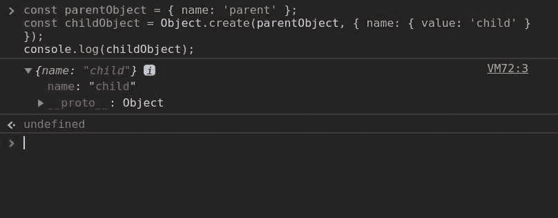
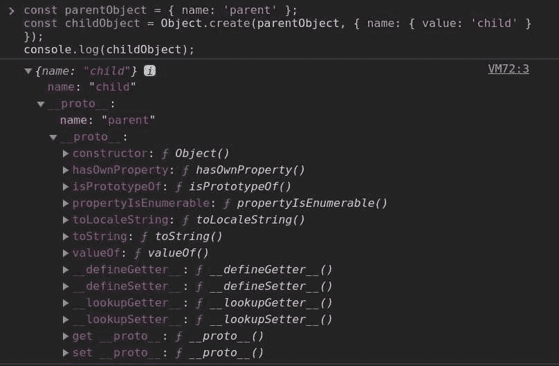

# 你用过 React 对象组件吗？

> 原文：<https://dev.to/thorning_m/have-you-used-react-object-components-191p>

随着 React Hooks 的发布，我看到了很多比较类组件和功能组件的帖子。功能组件在 React 中并不是什么新东西，但是在 16.8.0 版本之前，只使用一个函数来创建访问生命周期挂钩的有状态组件是不可能的。或者是吗？

叫我学究(很多人已经这么叫了！)但是当我们谈论类组件时，我们在技术上谈论的是由函数创建的组件。在这篇文章中，我想用 React 来演示当我们用 JavaScript 写一个类时实际发生了什么。

## 类 vs 函数

首先，我想简单地展示一下，通常所说的功能组件和类组件是如何相互联系的。这里有一个简单的组件被写成一个类:

```
class Hello extends React.Component {
  render() {
    return <p>Hello!</p>
  }
} 
```

这里它被写成一个函数:

```
function Hello() {
  return <p>Hello!</p> } 
```

请注意，功能组件只是一个呈现方法。正因为如此，这些组件在它们的生命周期中从来不能保持它们自己的状态或者执行任何副作用。自从 React 16.8.0 以来，由于钩子的存在，创建有状态的功能组件已经成为可能，这意味着我们可以像这样转换组件:

```
class Hello extends React.Component {

  state = {
    sayHello: false
  }

  componentDidMount = () => {
    fetch('greet')
      .then(response => response.json())
      .then(data => this.setState({ sayHello: data.sayHello });
  }

  render = () => {
    const { sayHello } = this.state;
    const { name } = this.props;

    return sayHello ? <p>{`Hello ${name}!`}</p> : null;
  }
} 
```

变成这样的功能组件:

```
function Hello({ name }) {

  const [sayHello, setSayHello] = useState(false);

  useEffect(() => {
    fetch('greet')
      .then(response => response.json())
      .then(data => setSayHello(data.sayHello));
  }, []);

  return sayHello ? <p>{`Hello ${name}!`}</p> : null; } 
```

这篇文章的目的不是争论谁优谁劣，已经有数百篇关于这个话题的帖子了！展示上面两个组件的原因是为了让我们清楚 React 实际上对它们做了什么。

在类组件的情况下，React 使用`new`关键字:
创建类的一个实例

```
const instance = new Component(props); 
```

此实例是一个对象；当我们说一个组件是一个类时，我们实际上的意思是它是一个对象。这个新的对象组件可以有自己的状态和方法，其中一些可以是生命周期方法(render、componentDidMount 等。)会在应用程序生命周期中的适当时间点调用。

有了函数组件，React 只是像调用普通函数一样调用它(因为是普通函数！)并返回 HTML 或更多的 React 组件。如果需要的话，现在需要导入在组件生命周期中处理组件状态和触发效果的方法。这些工作完全基于使用它们的每个组件调用它们的顺序，它们不知道是哪个组件调用了它们；这就是为什么你只能在组件的顶层调用钩子，而不能有条件地调用它们。

## 构造函数

JavaScript 没有类。我知道它看起来像有类，我们刚刚写了两个！但是在本质上，JavaScript 不是基于类的语言，它是基于原型的。ECMAScript 2015 规范(也称为 ES6)中添加了一些类，它们只是现有功能的一种更简洁的语法。

让我们在不使用类语法的情况下重新编写一个 React 类组件。这是我们将要重新创建的组件:

```
class Counter extends React.Component {

  constructor(props) {
    super(props);
    this.state = {
      count: 0
    }
    this.handleClick = this.handleClick.bind(this);
  }

  handleClick() {
    const { count } = this.state;
    this.setState({ count: count + 1 });
  }

  render() {
    const { count } = this.state;
    return (
      <>
        <button onClick={this.handleClick}>+1</button>
        <p>{count}</p>
      </>
    );
  }

} 
```

这将呈现一个按钮，当点击时，它将增加一个计数器，这是一个经典！我们需要创建的第一件事是构造函数，它将执行与我们类中的`constructor`方法相同的动作，除了对`super`的调用，因为这是一个类特有的事情。

```
function Counter(props) {
  this.state = {
    count: 0
  }
  this.handleClick = this.handleClick.bind(this);
} 
```

这是 React 将使用关键字`new`调用的函数。当用`new`调用一个函数时，它被视为一个构造函数；一个新的对象被创建，`this`变量被指向它，函数被执行，新的对象被用在任何提到`this`的地方。

接下来，我们需要为`render`和`handleClick`方法找到一个家，为此我们需要讨论一下原型链。

## 原型链

JavaScript 允许通过称为原型链的东西在对象之间继承属性和方法。我说的是继承，但实际上我指的是授权。不像其他有类的语言，属性从一个类复制到它的实例，JavaScript 对象有一个指向另一个对象的内部原型链接。当你调用一个方法或试图访问一个对象的属性时，JavaScript 首先检查对象本身的属性，如果找不到它，那么它检查对象的原型(到另一个对象的链接)，如果仍然找不到它，那么它检查原型的原型，以此类推，直到找到它或没有要检查的原型。

一般来说，JavaScript 中的所有对象在其原型链的顶端都有`Object`；这就是你如何在所有对象上访问像`toString`和`hasOwnProperty`这样的方法。当到达以`null`为原型的物体时，链条结束，这通常是在`Object`。

让我们试着用一个例子把事情弄清楚。

```
const parentObject = { name: 'parent' };
const childObject = Object.create(parentObject, { name: { value: 'child' } });
console.log(childObject); 
```

首先我们创建`parentObject`。因为我们使用了 object literal 语法，这个对象将被链接到`Object`。接下来我们使用`Object.create`创建一个新的对象，使用`parentObject`作为它的原型。

现在，当我们使用`console.log`打印我们的`childObject`时，我们应该看到:

[](///static/3a80162e10c030c59c48b848f0edba00/a7957/childObject.jpg)

对象有两个属性，一个是我们刚刚设置的`name`属性，另一个是`__proto___`属性。`__proto__`不像`name`那样是一个实际的属性，它是对象内部原型的一个访问器属性。我们可以展开这些来查看我们的原型链:

[](///static/4b8b5b52e183b31a0f9fe103a2a8f4a2/a7957/childObject_expanded.jpg)

第一个`__proto___`包含`parentObject`的内容，T1 有自己的`__proto___`，包含`Object`的内容。这些都是`childObject`可以使用的属性和方法。

原型是在一个叫做`__proto__`的地产上发现的，这让人很困惑！重要的是要认识到`__proto__`只是对链接对象的引用。如果你像上面那样使用`Object.create`，被链接的对象可以是你选择的任何东西，如果你使用`new`关键字调用一个构造函数，那么这个链接会自动发生在构造函数的`prototype`属性上。

好了，回到我们的组件。因为 React 用关键字`new`调用我们的函数，我们现在知道要使方法在组件的原型链中可用，我们只需要将它们添加到构造函数的`prototype`属性中，就像这样:

```
Counter.prototype.render = function() {
  const { count } = this.state;
  return (
    <>
      <button onClick={this.handleClick}>+1</button>
      <p>{count}</p>
    </>
  );
},

Counter.prototype.handleClick = function () {
  const { count } = this.state;
  this.setState({ count: count + 1 });
} 
```

## 静态方法

这似乎是提及静态方法的好时机。有时，您可能希望创建一个函数来执行一些与您正在创建的实例相关的操作，但是让该函数在每个对象的`this`上都可用并没有什么意义。当与类一起使用时，它们被称为静态方法，当不与类一起使用时，我不确定它们是否有名字！在我们的例子中，我们没有使用任何静态方法，但是 React 有一些静态生命周期方法，我们在前面的`Object.create`中使用了一个。在一个类上声明一个静态方法很容易，你只需要在方法前面加上`static`关键字:

```
class Example {
  static staticMethod() {
    console.log('this is a static method');
  }
} 
```

给构造函数加一个也同样简单:

```
function Example() {}
Example.staticMethod = function() { 
  console.log('this is a static method');
} 
```

在这两种情况下，您都像这样调用函数:

```
Example.staticMethod() 
```

## 延伸反应。成分

我们的组件几乎准备好了，只剩下两个问题需要解决。第一个问题是，React 需要能够确定我们的函数是构造函数还是普通函数，因为它需要知道是否用`new`关键字调用它。Dan Abramov 写了一篇关于这个的很棒的博文[，但是长话短说，React 在组件上寻找一个名为`isReactComponent`的属性。我们可以通过将`isReactComponent: {}`添加到`Counter.prototype`来解决这个问题(我知道，你会认为它是一个布尔值，但`isReactComponent`的值是一个空对象，如果你想知道为什么，你必须阅读他的文章！)但那只会欺骗系统，并不能解决第二个问题。](https://overreacted.io/how-does-react-tell-a-class-from-a-function/)

在`handleClick`方法中，我们调用了`this.setState`。这个方法不在我们的组件上，它是从`React.Component`和`isReactComponent`一起“继承”来的。如果您还记得前面的原型链部分，我们希望组件实例首先继承`Counter.prototype`上的方法，然后继承`React.Component`上的方法。这意味着我们想要将`React.Component.prototype`上的属性链接到`Counter.prototype. __proto__`。幸运的是，`Object`上有一个方法可以帮助我们:

```
Object.setPrototypeOf(Counter.prototype, React.Component.prototype); 
```

## 管用！

这就是我们在不使用类语法的情况下让这个组件与 React 一起工作所需要做的一切。如果您想复制它并亲自试用，这里有该组件的代码:

```
function Counter(props) {
  this.state = {
    count: 0
  };
  this.handleClick = this.handleClick.bind(this);
}

Counter.prototype.render = function() {
  const { count } = this.state;
  return (
    <>
      <button onClick={this.handleClick}>+1</button>
      <p>{count}</p>
    </>
  );
}

Counter.prototype.handleClick = function() {
  const { count } = this.state;
  this.setState({ count: count + 1 });
}

Object.setPrototypeOf(Counter.prototype, React.Component.prototype); 
```

如你所见，没有以前好看了！除了使习惯于使用传统的基于类的语言的开发人员更容易理解 JavaScript 之外，类语法还使代码可读性更好。我并不是建议您应该以这种方式开始编写您的 React 组件(事实上，我会积极地阻止它！)，我只是认为这将是一个有趣的练习，它将提供一些关于 JavaScript 继承如何工作的见解。

* * *

虽然你不需要理解这些东西来编写 React 组件，但这肯定不会有什么坏处，而且我希望当你在修复一个棘手的 bug 时，理解原型继承是如何工作的会有所不同。我希望你觉得这篇文章有趣和/或令人愉快，如果你对这个主题有任何想法，请让我知道。😃