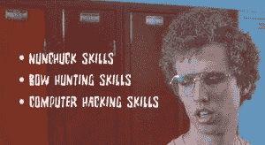
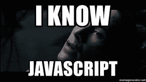

# 如果我没有经验，如何找到软件工作

> 原文：<https://dev.to/the_power_coder/how-can-i-land-a-job-if-i-have-no-experience-1d12>

# 这是大家的故事吧？

1.)从 A 级学校毕业，并在 17 岁时成为编程俱乐部的队长。
2。)以最优异的成绩从麻省理工学院毕业，获得计算机科学学士学位，三年后辅修数学。
3。)成为谷歌的实习生，一年后转为全职。

这个故事，虽然看起来很老套，但当涉及到软件工程师的背景时，它并不是最重要的。游戏中的一些名人(比尔·盖茨、史蒂夫·乔布斯、马克·扎克伯格)没有完成大学学业，但在科技领域取得了巨大的成功。

然而，技术领域竞争激烈，如果你没有合适的技能或以正确的方式包装它们，你可能会发现自己处于最底层。如果你还没有任何技能呢？如果你上不了传统的实体学校怎么办？如果你没有任何人脉呢？这篇文章是为那些发现自己在面试过程中处于劣势的人提供一些建议。

# 我没有技能

成为工程师的道路是一条充满主题、技术、项目、合作等的曲折道路。作为一名工程师，你永远不会停止学习。总会有一些新技术出现，一些更适合创建应用程序的新模式，一些新的构建工具可以更好地自动化这个过程。随之而来的是继续磨练你的技艺并为你的工具箱添加新工具的责任。

现在，在旅程的开始，选择你想成为什么样的工程师可能会很困难。有软件工程师、QA 工程师、测试自动化工程师、开发运营工程师、数据工程师等等。弄清楚你想要构建什么，并分解它，这可能对你更有帮助。这有助于建立一条学习的途径。

## 举例

未来工程师:我想建立下一个亚马逊。
我们来细分一下:
亚马逊是一个`web site`。是一个`e-commerce` app。它有一个`catalog`的物品。为了这个目标，我可以看到一些有用的技能。Web 开发、数据库管理、API 开发等等。这些都是可能的途径。

## 那 Edjamacation 呢

有这么多受教育的途径，要找出最适合你的情况的途径是相当困难的。有大学和学院、MOOCs、训练营、聚会、书籍、一次性在线课程和许多其他途径来学习如何使用代码构建东西。那么你应该怎么做呢？虽然我不能为你做出选择，但我可以给你一些问题，你可以问自己，以帮助评估哪种学习形式最适合你。

### 提问

1.)我能有效自学吗？
2。)我需要教室环境的结构吗？
3。)如果我上不起课，我有资格获得经济资助吗？
4。)如果我遇到困难，我需要求助于教授或导师吗？
5。)我的时间表允许每周上多少课？
6。)完成培训后，我还需要学位或证书吗？
7。)我可以自己调整学习进度还是需要别人来调整？
8。)我在家是否有不受干扰的学习时间，或者我需要离开去一个机构吗？
9。)我家里有足够好的软件或硬件，还是需要使用公共设施？
10。)毕业后，我是愿意自己找工作，还是希望得到教育机构的帮助？

当然，每种学校教育都有利弊。我根据自己的亲身经历制作了一张图表:

| 学校教育类型 | 赞成的意见 | 骗局 |
| --- | --- | --- |
| 大学/学院 | 获得学位。最期待的受教育方式。 | 可能教授过时的技巧和技术。价格昂贵。需要很多时间和很长时间。选修无关课程的必要性。 |
| 大规模开放在线课程(MOOC) | 自定进度。只教与跟踪相关的内容。对任何人开放。没有入学考试。与大学和训练营相比相对便宜。 | 当麻烦出现时，帮助有限。需要能够自学。作业可以少。很可能没有完成证书。 |
| 训练营 | 仍然可以联系到教师和导师的综合课程。能够认识其他学生。可提供完工证明。比大学少 100 美元. | 非常紧凑的课程意味着每周有大量的时间在教室里。可能不如大专或大学受人尊敬。找到一个好的可能是一个挑战，因为有太多了。不灵活的时间表。对某些人来说还是很贵。 |
| 一次性在线课程 | 自定进度。经常在网上有学生社区。通常不贵。经常更新课程。需要学习的大量主题。帮助购买决策的课程评论。 | 课程之间的大量差异。先决条件并不总是定义良好。必须能够在提供的格式学习。 |

# 我得到了技能！现在怎么办？

给我们看看！建啊，丹吉！像以前从未建造过的那样建造！软件开发非常有趣，因为它是少数几个如果你不能在面试过程中证明你能胜任这份工作，证书就没有太大意义的行业之一。

如果你有一些公共代码或者来自这些代码的工件与你采访的任何人分享，这将会有很大的帮助。话虽如此，你应该建立什么？很高兴你问了！如果缺乏应用程序创意，有许多举措可以提供帮助。

1.) **30 天 30 款应用(或其变种)**
将网络搜索和社交媒体作为你的优势。许多人都经历过在一定天数内开发一定数量的应用程序的挑战(例如，在 30 天内开发 30 个应用程序)，并记录了他们这样做的过程。你可以看看他们的一些应用创意，也可以尝试一下这个挑战。

2.)**开源项目**
许多大公司把他们的代码放在那里，让贡献者来帮忙。GitHub、微软、脸书、Elastic、Mozilla 等。这些公司的项目是公开的，问题被跟踪，以帮助那些希望有所贡献的人发现它们。

您还可以通过查找项目并找到他们聚集的地方来加入不同项目的社区。可能是通过 IRC，Slack，Discord 或其他。

[这个回购](https://github.com/MunGell/awesome-for-beginners#javascript)也是一个为良好的第一拉需求寻找项目的好方法。

3.)**关于它的博客！**
尝试了一种构建 web app 的新方法？写写吧。使用教程启动您自己的 CI 服务器？写写吧。发现你的大学课程没什么意思？写写吧。如果你正在做感兴趣的事情....你该怎么办？写写吧。明白这是怎么回事了吗？这将帮助你记住你所学的，更好地表达自己，等等。

# 开始面试

一旦你把自己做过的工作、写过的文章、参与过的项目组合在一起，就该开始面试了。在你的面试中，你可能会从建筑、博客等方面调用你的经验。即使有些面试最终没有得到工作机会，也要把这些面试当成提高的机会。向面试官寻求可行的反馈。进行以编码访谈中的概念为特色的练习。最重要的是，坚持下去！通过迭代的坚持和提炼，一定会有成果。

# 总之

当你没有经验时，获得工作机会的道路可能会充满挑战。这很难，但可行。我已经分享了一些关于如何在没有经验的开发者和 Jr. Developer 之间架起桥梁的技巧。如果这能帮助到哪怕一个人，我认为这个深夜的写作是成功的。