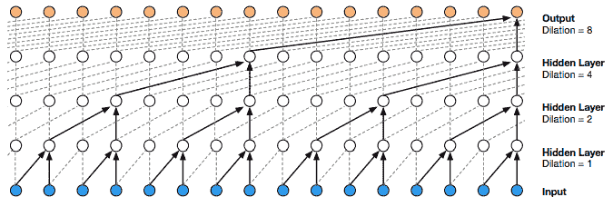
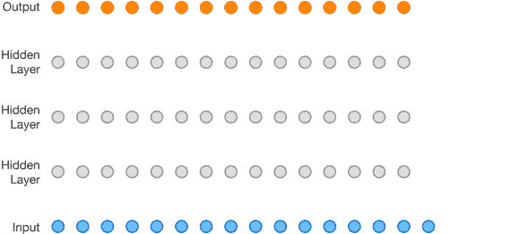

# 基于文本到语音转换技术，您的助手设备是如何工作的？

> 原文：<https://dev.to/makcedward/how-does-your-assistant-device-work-based-on-text-to-speech-technology-2bdg>

#### 语音合成

 

<figcaption>照片由[霍华德劳伦斯 B](https://unsplash.com/@howardlawrenceb?utm_source=medium&utm_medium=referral) 在 [Unsplash](https://unsplash.com?utm_source=medium&utm_medium=referral)</figcaption>

语音合成是人类语音的人工产物。文本到语音(TTS)是一种将语言转换为人类声音(或语音)的方法。TTS 的目标是为助手设备(谷歌的助手、亚马逊的 Echo、苹果的 Siri)等下游呈现自然发声的语音信号。这个故事将讲述我们如何能够产生类似人类的声音。拼接 TTS 和参数 TTS 是生成音频的传统方法，但是有一些限制。谷歌发布了一个生成模型 WaveNet，这是对 TTS 的突破。它可以产生非常好的音频，克服了传统方法的局限性。

本故事将讨论 [WaveNet:原始音频的生成模型](https://arxiv.org/pdf/1609.03499.pdf) (van den Oord 等人，2016 年)，并将涵盖以下内容:

*   文本到语音转换
*   经典语音合成技术
*   小浪
*   实验

### 热门 AI 文章:

> [1。神经网络基础知识](https://becominghuman.ai/basics-of-neural-network-bef2ba97d2cf)
> 
> [2。制作一个简单的神经网络](https://becominghuman.ai/making-a-simple-neural-network-2ea1de81ec20)
> 
> [3。你是不是用错了“AI”这个词？](https://becominghuman.ai/are-you-using-the-term-ai-incorrectly-911ac23ab4f5)
> 
> [4。从感知器到深度神经网络](https://becominghuman.ai/from-perceptron-to-deep-neural-nets-504b8ff616e)

### 文本转语音(TTS)

从技术上来说，我们可以将 TTS 视为一个序列到序列的问题。它包括文本分析和语音合成两个主要阶段。文本分析与通用自然语言处理(NLP)步骤非常相似(尽管我们在使用深度神经网络时可能不需要升沉预处理)。比如，句子切分，分词，词性(POS)。第一阶段的输出是字形到音素(G2P)，这是第二阶段的输入。在语音合成中，它接收第一级的输出并产生波形。

### 古典语音合成技术

拼接 TTS 和参数 TTS 是通过输入文本来生成音频的传统方式。如前所述，拼接 TTS 将一个短片拼接起来形成一个语音。由于短片是由人录制的，所以质量好，声音清晰。然而，如果抄本被改变，限制是记录和重新记录的巨大人力。参数化 TTS 可以很容易地生成语音，因为它存储了所有的基本信息，如基频、幅度谱。随着语音的生成，语音比拼接的 TTS 更不自然。

### WaveNet

WaveNet 是由 van den Oord 等人推出的，它可以从文本中生成音频，并取得非常好的效果，你可能无法区分生成的音频和人声。另一方面，扩展的因果卷积架构被用来处理长范围的时间依赖性。此外，一个模型可以生成多种声音

它基于 PixelCNN ( van den Oord 等人，2016)架构。通过利用扩展的因果卷积，它有助于增加感受野，而不会大大增加计算成本。扩展卷积类似于普通卷积，但过滤器应用于大于其长度的区域，导致某些输入值被跳过。它类似于更大的滤波器，但计算成本更低。

从下图中，你注意到第二层(隐藏层，膨胀=2)得到当前输入和前一个输入。在下一层(隐藏层，膨胀=4)，当前输入和 4 个先前输入。在实验过程中，范·登·奥尔德等人将每一层增加一倍，直到达到一个极限，然后重复进行。所以膨胀顺序是

> 1, 2, 4, 8, 512, 1, 2, 4 ….

 

<figcaption>扩张因果卷积(摘自范登奥尔德等人，2016)</figcaption>

下面的动画展示了扩展因果卷积的操作。先前的输出成为输入，它结合先前的输入产生新的输出。

 

<figcaption>扩张因果卷积(来自 [DeepMind](https://deepmind.com/blog/wavenet-generative-model-raw-audio/) )</figcaption>

### 实验

van den Oord 等人进行了四个实验来验证这个模型。第一个实验是多说话者语音生成。通过利用 CSTR 语音克隆工具包数据集，它可以生成多达 109 个说话人的声音。更多的说话者训练数据导致更好的结果，因为 WaveNet 的内部表示在说话者声音之间共享。

第二个实验是 TTS。van den Oord 等人使用 Google 的北美英语和汉语普通话 TTS 系统作为训练数据来比较不同的模型。为了公平地进行比较，研究人员使用隐马尔可夫模型(HMM)和基于 LSTM-RNN 的统计参数模型作为基线模型。平均意见得分(MOS)用于衡量绩效。它是一个五分制的分数(1:差，2:差，3:一般，4:好，5:优秀)。从下面来看，虽然 WaveNet 的评分仍然低于人类的自然语音，但它比那些基线模型要好很多。

 

<figcaption>车型性能对比(范登奥尔德等人，2016)</figcaption>

第三和第四个实验是音乐生成和语音识别。研究人员

下图显示了最新的谷歌 DeepMind 的 WaveNet 性能。

[https://www.youtube.com/embed/JjK8apEishQ](https://www.youtube.com/embed/JjK8apEishQ)

 

<figcaption>美国英语和汉语普通话不同型号对比结果(来自 [DeepMind](https://deepmind.com/blog/wavenet-generative-model-raw-audio/) )</figcaption>

### 带走

*   谷歌在谷歌助手上应用了 WaveNet，这样它就可以响应我们的语音命令，而不用存储所有的音频，而是实时生成音频。

### 喜欢学习？

我是湾区的数据科学家。专注于数据科学的最新发展，[人工智能](https://becominghuman.ai/)，尤其是 NLP 和平台相关领域。欢迎在 [LinkedIn](https://www.linkedin.com/in/edwardma1026) 上与 [me](https://makcedward.github.io/) 联系，或者在 [Medium](http://medium.com/@makcedward/) 或 [Github](https://github.com/makcedward) 上关注我。我提供关于[机器学习](https://becominghuman.ai/)问题或数据科学平台的简短建议，收取少量费用。

### 延伸阅读

*   DeepMind 的 WaveNet

### 引用

*   Aaron van den Oord，Sander Dieleman，Heiga Zen，卡伦·西蒙扬，Oriol Vinyals，Alex Graves，Nal Kalchbrenner，Andrew Senior，Koray Kavukcuoglu。 [WaveNet:原始音频的生成模型](https://arxiv.org/pdf/1609.03499.pdf)。2016
*   Aaron van den Oord，Nal Kalchbrenner，Oriol Vinyals，Lasse Espeholt，Alex Graves，Koray Kavukcuoglu。[使用 PixelCNN 解码器的条件图像生成](https://arxiv.org/pdf/1606.05328.pdf)。2016

### 别忘了给我们你的👏！

[https://medium . com/media/c 43026 df 6 fee 7 CDB 1 aab 8 AAF 916125 ea/href](https://medium.com/media/c43026df6fee7cdb1aab8aaf916125ea/href)

* * *