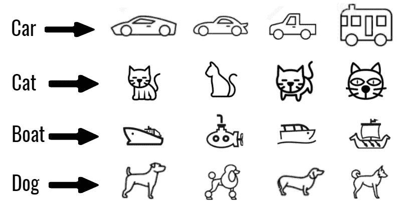

# 我如何使用 ml5.js 和 React 在浏览器中尝试图像分类

> 原文：<https://dev.to/atapas/how-i-attempted-image-classification-in-the-browser-using-ml5-js-and-react-1lj3>

# 动机

自从我的[机器学习之旅](https://blog.greenroots.info/my-machine-learning-journey-so-far-cjv13atsb0015fhs1sd9xuc52)开始，我就深深地迷失在 *Python* 、 *TensorFlow* 、理解*深度学习*和*神经网络*的人群中。

虽然所有这些都是纯粹的乐趣和紧张的学习，我错过了一些类似的浏览器中运行。此外，机器学习(ML)用例有一个巨大的方面，即个人不必学习 ML 的所有底层事实，而是可以利用其他人所做的所有艰苦工作来做一些很酷的事情。这就是我们将在接下来的 3-4 分钟内看到的一个例子。

放松，作为这个故事的读者，你不需要任何机器学习或任何相关的经验。继续读下去，你会喜欢的。

# 从珠穆朗玛峰(29029 英尺)之巅理解影像分类

`Image Classification`是一个机器学习问题，我们定义了一组**目标**(像汽车、猫、狗、船等物体。为了在图像中识别)，**训练**一个**型号**使用**标注的**示例(样本)照片来识别它们。

要理解这种更简单的方法，

*   我们首先需要教会计算机(基本上就是机器)汽车、猫、狗或船是什么样子。这个阶段叫做，`Training`。
*   车、猫、船、狗等被称为`Labels`。
*   汽车、猫、船、狗等各种类型的样品称为`Labeled Examples`。
*   计算机看到的这种物体越多，它就越有可能识别出更多类似的物体。例如，如果我们训练计算机更多地显示*船*的图像，它可能会在以后更好地识别*船*的图像。这就是所谓的[监督学习](https://en.wikipedia.org/wiki/Supervised_learning)。
*   所有这些机器的教学-学习-预测都是通过各种算法来实现的，这些算法被称为`Machine Learning Algorithm`。
*   我们将训练数据(图像)提供给机器学习算法进行学习，并生成机器学习`Model`。

[](https://res.cloudinary.com/practicaldev/image/fetch/s--c9M1epyg--/c_limit%2Cf_auto%2Cfl_progressive%2Cq_auto%2Cw_880/https://cdn.hashnode.com/res/hashnode/image/upload/v1563338545799/6SMLJnPKl.png)

# 我们的图像分类问题

有了目前所获得的知识，让我们深入研究手头的问题。我们将建立一个网络应用程序，

*   使用图像选择器选择我们选择的图像。- BYOI:带上你自己的形象！
*   从一些现成的图像列表中选择图像。
*   对这些图像执行前 3 个预测。
*   发布预测结果，其中包含与真实对象匹配的概率百分比。

[](https://res.cloudinary.com/practicaldev/image/fetch/s--wcXg5_TF--/c_limit%2Cf_auto%2Cfl_progressive%2Cq_auto%2Cw_880/https://cdn.hashnode.com/res/hashnode/image/upload/v1563356090151/qcT-PqypE.png)
[T6】](https://res.cloudinary.com/practicaldev/image/fetch/s--YbBevl_r--/c_limit%2Cf_auto%2Cfl_progressive%2Cq_auto%2Cw_880/https://cdn.hashnode.com/res/hashnode/image/upload/v1563354666862/9HJ7JLfl8.png)

此外，我们将最不担心模型是如何创建的，在后面运行什么算法来实现它等等。这些都很重要，但对我们在这里关注的用例来说没那么重要。

# 演示

都很兴奋吗？

让我们在这里看看它的作用=> [ml-greenroots-info](https://ml-greenroots-info.netlify.com/ML5ImageClassification/)

# 我们来谈谈技术

有很多选择可以尝试基于 JavaScript 的 ML 库或工具包，在浏览器中进行机器学习。有些是为了解决基本问题，很少是像, [TensorFlow 这样的高级。JS](https://www.tensorflow.org/js) 。

*   对于我的用例，我选择了一个友好的机器学习库，名为 [ml5.js](https://ml5js.org/) 。该库在浏览器中提供对机器学习算法和模型的访问，构建在 TensorFlow.js 之上，没有其他外部依赖性👍。
*   仅仅因为我喜欢它😄！您可以使用自己选择的任何其他 UI 库或框架。

# 潜得更深

以下是一些关键步骤，将有助于用`react`设置`ml5.js`并开始使用它:

*   你可以使用 *[create-react-app](https://facebook.github.io/create-react-app/docs/getting-started)* 或者使用 *[Gatsby.js](https://www.gatsbyjs.org/)* 或者通过任何其他方式开始一个 react 项目。
*   使用 npm 安装`ml5.js`，开始使用它

```
 npm i ml5 
```

Enter fullscreen mode Exit fullscreen mode

*   将`ml5.js`导入到 React 组件中

```
 import * as ml5 from "ml5"; 
```

Enter fullscreen mode Exit fullscreen mode

*   有了`ml5.js`，你可以利用各种开源的`Model`提供商，比如，**、**等。不用太担心潜在的事实。对于这个项目，我使用的是 *MobileNet* 。
*   我们将得到一个分类器来执行图像分类，如下所示:

```
 // Initialize the Image Classifier method with MobileNet
    const classifier = ml5.imageClassifier('MobileNet', modelLoaded);
    // When the model is loaded
    function modelLoaded() {
      console.log('Model Loaded!');
    } 
```

Enter fullscreen mode Exit fullscreen mode

正如您在上面看到的，当模型从`MobileNet`成功加载时，我们得到一个分类器并处理一个回调。

*   一旦我们有了分类器，下一个动作就是*对图像*进行分类，并执行*预测*。这将会变得超级简单！看看这段代码:

```
 // Make a prediction with a selected image
    classifier.predict(image, 3, function(err, results) {
      if(err) {
        console.log(err);
      }
      return results;
    }).then((results) => {
      // set the prediction in state and off the loader
      this.setLoader(false);
      this.setPredictions(results);
    }); 
```

Enter fullscreen mode Exit fullscreen mode

整洁，对不对？我们通过传递图像、所需的预测数(在本例中为 3)和预测完成后要处理的回调来调用`predict`方法。

一旦预测完成，我们只需在 React 组件中设置一些状态，并使用它进行渲染。以上就是关于代码的机器学习部分。剩下的，只是与 react 组件相关的方法和样式。

# 关注码和，投稿

您可以在我的 GitHub 资源库中查看代码:

*   [https://github.com/atapas/ml-greenroots](https://github.com/atapas/ml-greenroots)

该项目基于* [GatsbyJS](https://www.gatsbyjs.org/) *并得到了与* [Netlify](https://www.netlify.com/) *建立的构建-部署-工作流挂钩。如果您对代码有任何重要的修改或建议，请随时发送请求。

您还可以添加自己的组件来在浏览器中执行 ML 用例。谢谢大家！

# 告诫

如果不提到一些注意事项，这篇博文将是不完整的:

*   浏览器中的机器学习正在兴起。然而，ML 算法在浏览器中的性能不会很好。人们应该根据手头的用例以及头脑中的目标角色来决定使用它。

有了支持它的工具和库，我们都被鼓励去尝试它。对我来说，像这样的项目是一个切入点，可以一层一层地深入学习机器学习。

*   如果你访问上面提到的 github repo，你会发现一个名为`ML5ImageClassification.js`的文件，它是 React 组件完成所有这些神奇的事情。

然而，这可能不是你看到的最好的代码，这是故意的。因为我打算使用 [react 钩子](https://reactjs.org/docs/hooks-intro.html)重写代码，以展示如何使用*钩子*和 effectively✨✨✨.轻松修改现有的 react 项目敬请期待！

# 信用和资源

*   由 Soragrit Wongsa 在 Unsplash 上拍摄的封面照片
*   使用 TensorFlow.js 对[图像分类的精彩阅读](https://medium.com/@tifa2up/image-classification-using-deep-neural-networks-a-beginner-friendly-approach-using-tensorflow-94b0a090ccd4)
*   ml5.js 的 [GitHub 页面](https://github.com/ml5js/ml5-library)

如果你已经通读并达到目前为止，太好了！

谢谢您们。希望你喜欢这篇文章。请评论分享。

你也可以在 [GreenRoots](https://blog.greenroots.info/) 上关注我的博客