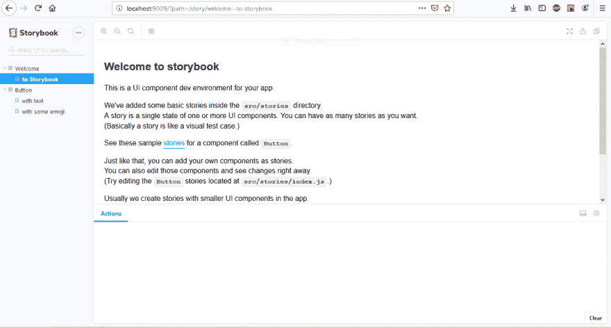
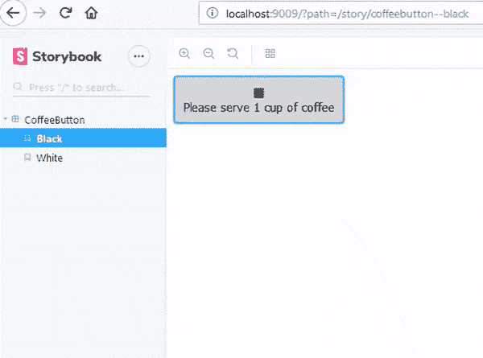
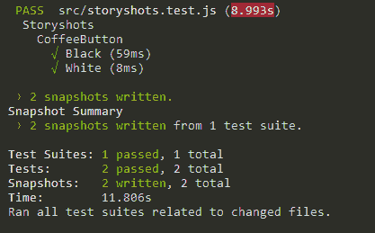
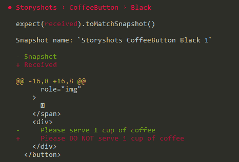
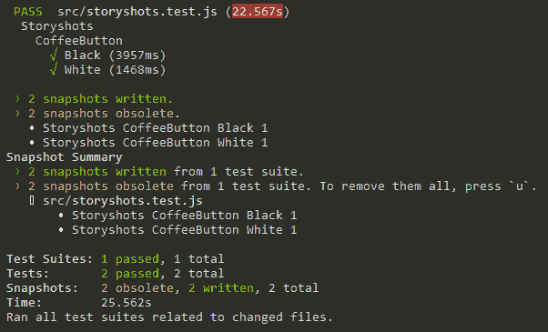

# React Storybook 如何简化组件测试

> 原文：<https://dev.to/bnevilleoneill/how-react-storybook-can-simplify-component-testing-1l8m>

[](https://res.cloudinary.com/practicaldev/image/fetch/s--XdJfnBtj--/c_limit%2Cf_auto%2Cfl_progressive%2Cq_auto%2Cw_880/https://thepracticaldev.s3.amazonaws.com/i/5hwijbpj55rjmxgqb247.png)

## 简介

每个开发人员都想构建有效的软件。我们可以通过隔离软件并在一系列测试中展示其行为来确保软件代码完美运行。对于我们的组件来说就不一样了，因为它们是在我们的应用程序环境中测试的。

Storybook 允许您以隔离的方式查看组件并与之交互。这就像单元测试一样，只是针对 UI 组件。用 [Storybook 的文档](https://storybook.js.org/docs/basics/introduction/)的话说:

Storybook 是一个用户界面开发环境和 UI 组件的游乐场。该工具使开发人员能够独立创建组件，并在一个隔离的开发环境中交互展示组件。

在这篇文章中，我们将了解 Storybook 如何帮助我们创建 UI 组件并改进我们的组件测试。

[](https://logrocket.com/signup/)

## 故事书入门

让我们从引导一个新的 React 项目开始，在这个项目中，我们将通过 CLI 安装 story book:

```
npx create-react-app my-storybook-app
cd my-storybook-app
#install storybook
npx -p @storybook/cli sb init yarn storybook 
```

Enter fullscreen mode Exit fullscreen mode

当运行`yarn storybook`时，你应该在本地地址`http://localhost:9009/`上看到 Storybook 的测试页面:

[](https://res.cloudinary.com/practicaldev/image/fetch/s--CZdvc78c--/c_limit%2Cf_auto%2Cfl_progressive%2Cq_auto%2Cw_880/https://i0.wp.com/blog.logrocket.com/wp-content/uploads/2019/07/storybookui.png%3Fresize%3D1366%252C733%26ssl%3D1)

出于测试的目的，我们将创建一个基本组件——一个名为`CoffeeButton`的按钮。它显示要供应的咖啡杯数。

```
// /src/stories/CoffeeButton.js
import React, { useState } from 'react';
const ButtonStyle = {
    backgroundColor: 'lightgrey',
    padding: '10px',
    borderRadius: '5px',
    fontSize: '15px',
    border: '#66c2ff 3px solid',
    cursor: 'pointer'
};
const CoffeeButton = ({children}) => {
    const [count, setCount] = useState(1);
    return (
        <button style = {ButtonStyle} onClick = {() => setCount(count + 1)} >
        {new Array(count).fill(children)}
        {(count < 2)
        ? <div> Please serve 1 cup of coffee </div>
        : <div> Please serve {count} cups of coffee </div>
        }
        </button>
    );
};
export default CoffeeButton; 
```

Enter fullscreen mode Exit fullscreen mode

故事书是用“故事”来起作用的。一个**故事**是一个函数，它包含一个组件的单一状态，并将该组件呈现到屏幕上用于测试目的。让我们为我们的`CoffeeButton`组件写一个故事。在`src/stories`中创建一个文件，命名为`CoffeeButtonStory.js` :

```
import React from 'react';
import { storiesOf } from '@storybook/react';
import CoffeeButton from './CoffeeButton';
storiesOf('CoffeeButton', module)
  .add('Black', () => (
    <CoffeeButton>
      <span role="img" aria-label="without-milk">
         🏿
      </span>
    </CoffeeButton>
  ))
  .add('White', () => (
    <CoffeeButton>
      <span role="img" aria-label="with-milk">
        🏼
      </span>
    </CoffeeButton>
)); 
```

Enter fullscreen mode Exit fullscreen mode

下面是我们的组件在 Storybook 中的样子:

[](https://res.cloudinary.com/practicaldev/image/fetch/s--ACN1ubVz--/c_limit%2Cf_auto%2Cfl_progressive%2Cq_66%2Cw_880/https://thepracticaldev.s3.amazonaws.com/i/nccu3yoohccikek8pp2e.gif)

## UI 测试

Storybook 提供了不同的测试 UI 组件的技术。出于各种原因，组件需要接受测试，其中一些原因包括:

*   bug 检测
*   测试可以被记录下来，作为从事该项目的其他开发人员的指南
*   为了防止在新的提交过程中数据被破坏

让我们继续检查 Storybook 可以使组件测试无缝的一些方法。

## 结构测试

结构测试包括基于组件内部实现知识的组件测试。Storybook 通过`storyshots`实现结构测试，这是一个通过比较代码快照来工作的附加组件。安装`storyshots`运行:

```
npm i -D @storybook/addon-storyshots react-test-renderer 
```

Enter fullscreen mode Exit fullscreen mode

`react-test-renderer`将 React 组件渲染为纯 JavaScript 对象，而不依赖于 DOM。这使得抓取由 React DOM 呈现的 DOM 树的截图成为可能。

安装后，让我们创建一个测试文件`storyshots.test.js`，在其中我们将初始化`storyshots` :

```
// src/storyshots.test.js
import initStoryshots from '@storybook/addon-storyshots';  
initStoryshots({ /* configuration options */ }); 
```

Enter fullscreen mode Exit fullscreen mode

为了测试一个组件，我们运行`npm test`。这将生成一个快照，您可以在其中检查组件的输出。每次运行测试时，都会自动生成一个快照，并与之前测试生成的快照进行比较。如果`storyshots`发现任何差异，测试将失败。下面是第一次测试时生成的快照:

[](https://res.cloudinary.com/practicaldev/image/fetch/s--P-dJfAQ7--/c_limit%2Cf_auto%2Cfl_progressive%2Cq_auto%2Cw_880/https://i2.wp.com/blog.logrocket.com/wp-content/uploads/2019/07/successfultest.png%3Fresize%3D417%252C259%26ssl%3D1)

我们的测试是成功的，现在让我们试着改变我们的`CoffeeButton`组件。将`CoffeeButton.js`的第 16 行改为:

`? <div> Please DO NOT serve 1 cup of coffee </div>`

在运行测试时，我们得到以下错误:

[](https://res.cloudinary.com/practicaldev/image/fetch/s--8xhWQu9f--/c_limit%2Cf_auto%2Cfl_progressive%2Cq_auto%2Cw_880/https://i2.wp.com/blog.logrocket.com/wp-content/uploads/2019/07/failedtest.png%3Fresize%3D333%252C100%26ssl%3D1)

更详细的视图:

[](https://res.cloudinary.com/practicaldev/image/fetch/s--dsZAArzO--/c_limit%2Cf_auto%2Cfl_progressive%2Cq_auto%2Cw_880/https://i1.wp.com/blog.logrocket.com/wp-content/uploads/2019/07/failedtestdetailed.png%3Fresize%3D466%252C317%26ssl%3D1)

## 自动化视觉测试

自动化视觉测试包括自动验证我们的用户界面在视觉上是否如预期的那样出现。这在跨浏览器测试中很有用，因为它可以检测出开发人员没有注意到的失误。Storybook 通过一个名为`storyshot-puppeteer`的插件对 UI 进行可视化测试。与`storyshots`相同，这个插件通过对比截图来工作——只不过这次它截取的是浏览器的截图，而不是代码。安装`storyshot-puppeteer`运行:

```
npm i -D @storybook/addon-storyshots-puppeteer 
```

Enter fullscreen mode Exit fullscreen mode

安装后，为了让它比较 UI 而不是代码，我们需要用来自`puppeteer`插件的`imageSnapshot`覆盖测试比较。我们可以通过编辑我们在进行结构测试时创建的`initStoryshots`函数来做到这一点。我们还需要指定运行故事书的 URL:

```
// src/storyshots.test.js
import initStoryshots from '@storybook/addon-storyshots';
import {imageSnapshot} from '@storybook/addon-storyshots-puppeteer';
initStoryshots({
    test: imageSnapshot({storybookUrl: 'http://localhost:9009/'}),
}); 
```

Enter fullscreen mode Exit fullscreen mode

下面是我们第一次测试图像时生成的快照:

[](https://res.cloudinary.com/practicaldev/image/fetch/s--yqlDYqrp--/c_limit%2Cf_auto%2Cfl_progressive%2Cq_auto%2Cw_880/https://i2.wp.com/blog.logrocket.com/wp-content/uploads/2019/07/passedtestdetailed.png%3Fresize%3D602%252C365%26ssl%3D1)

如果我们改变组件中的任何 UI 属性，我们的测试将会失败,`puppeteer`将以快照的形式返回差异。让我们改变我们 UI 的一部分。在`CoffeeButton.js`的第 3 行，将背景颜色从`lightgrey`更改为`lightblue` :

```
backgroundColor: 'lightblue', 
```

Enter fullscreen mode Exit fullscreen mode

当我们进行测试时:

[](https://res.cloudinary.com/practicaldev/image/fetch/s--h8O9Dnv3--/c_limit%2Cf_auto%2Cfl_progressive%2Cq_auto%2Cw_880/https://i1.wp.com/blog.logrocket.com/wp-content/uploads/2019/07/test2.png%3Fresize%3D408%252C132%26ssl%3D1)

下面是在我们的 UI 中由`puppeteer`注意到的差异的快照:

[](https://res.cloudinary.com/practicaldev/image/fetch/s--z9-Ddbxl--/c_limit%2Cf_auto%2Cfl_progressive%2Cq_auto%2Cw_880/https://i1.wp.com/blog.logrocket.com/wp-content/uploads/2019/07/coffeebutton.png%3Fresize%3D2173%252C180%26ssl%3D1)

在上面的区分中，原始图像在左边，修改后的图像在右边，两者之间的差异在中间。

## 交互测试

通过交互测试，Storybook 允许您在 DOM 中显示测试及其结果以及您的故事。它通过一个插件来完成这个任务。要安装这个插件，运行:

```
npm install -D storybook-addon-specifications 
```

Enter fullscreen mode Exit fullscreen mode

然后将这一行添加到您的`addons.js`文件:

```
import 'storybook-addon-specifications/register'; 
```

Enter fullscreen mode Exit fullscreen mode

`react-storybook-specifications`不能单独工作，我们还需要安装以下:

`enzyme` : JavaScript 的 React 测试工具。

`enzyme-adapter-react-16`:对应您正在使用的 React 版本的酶适配器。

`expect` : Jest 的内置方法，用于在编写测试时检查值是否满足特定条件。

要安装这些附加组件，请运行:

```
npm install -D enzyme expect enzyme-adapter-react-16 
```

Enter fullscreen mode Exit fullscreen mode

在我们的`config.js`文件中，我们将从`enzyme`和`enzyme-adapter-react-16`导入`configure`和`Adapter`。注意，我们现在有两个`configure`的实例，所以我们需要像这样指定它们:

```
import { configure as configure1 } from '@storybook/react';
import {configure as configure2} from 'enzyme';
import Adapter from 'enzyme-adapter-react-16';
function loadStories() {
  require('../src/stories');
}
configure1(loadStories, module);
configure2({ adapter: new Adapter() }); 
```

Enter fullscreen mode Exit fullscreen mode

让我们通过测试`CoffeeButton`组件的一部分来看看这是如何工作的。在`CoffeeButtonStory.js`中，输入以下代码块:

```
import React from 'react';
    import { storiesOf } from '@storybook/react';
    import { action } from '@storybook/addon-actions';
    import { specs, describe, it } from 'storybook-addon-specifications';
    import {mount} from "enzyme";
    import expect from "expect";
    import CoffeeButton from './CoffeeButton';
    const stories = storiesOf('CoffeeButton', module)
    stories
    .add('Black', () => {
        const story =
        <CoffeeButton onMouseOver={action('click')}>
        <span role="img" aria-label="without-milk">
        🏿
        </span>
      </CoffeeButton>;
      specs(() => describe('Black', () => {
         it('Should have the following text: 🏿Please serve 1 cup of coffee', () => {
             let output = mount(story);
             expect(output.text()).toContain('🏿Please serve 1 cup of coffee');
         }); 
      }));
      return story;
    }) 
```

Enter fullscreen mode Exit fullscreen mode

现在保存并运行应用程序。在我们的浏览器中，我们应该会看到:

[](https://res.cloudinary.com/practicaldev/image/fetch/s--Gq5YafUh--/c_limit%2Cf_auto%2Cfl_progressive%2Cq_66%2Cw_880/https://thepracticaldev.s3.amazonaws.com/i/c9eps8k6m8ka92p5eegw.gif)

让我们改变我们的测试期望。将`CoffeeButtonStory.js`的第 20 行改为:

```
expect(output.text()).toContain('🏿Please serve a cup of coffee'); 
```

Enter fullscreen mode Exit fullscreen mode

现在，当我们运行应用程序并检查我们的浏览器时，我们会看到以下内容:

[](https://res.cloudinary.com/practicaldev/image/fetch/s--WKZ38oOS--/c_limit%2Cf_auto%2Cfl_progressive%2Cq_66%2Cw_880/https://thepracticaldev.s3.amazonaws.com/i/zi1zvjqddm45vmq663ki.gif)

可以看出，更改我们的预期输出会给 DOM 带来一个错误。通过`storybook-addon-specifications`的交互测试使我们能够有一个`living`文档，在那里我们可以与我们的组件和它们的测试结果并排交互。

## 结论

Storybook 提供了一个测试 UI 组件的好方法。看起来我们似乎在抛弃单元测试，但事实并非如此。单元测试旨在找出代码中的错误。在这种情况下，我们正在测试 React 组件，如果我们的 UI 出了问题，我们仍然会询问需要修复哪些标记。

这意味着集成和快照测试与单元测试一样好——在这种情况下。如果你想玩代码，你可以在 Github 的这里查看源代码。

* * *

## Plug: [LogRocket](https://logrocket.com/signup/) ，一款适用于网络应用的 DVR

[](https://res.cloudinary.com/practicaldev/image/fetch/s--6FG5kvEL--/c_limit%2Cf_auto%2Cfl_progressive%2Cq_auto%2Cw_880/https://i2.wp.com/blog.logrocket.com/wp-content/uploads/2017/03/1d0cd-1s_rmyo6nbrasp-xtvbaxfg.png%3Fresize%3D1200%252C677%26ssl%3D1)

[log rocket](https://logrocket.com/signup/)是一个前端日志工具，让你重放问题，就像它们发生在你自己的浏览器中一样。LogRocket 不需要猜测错误发生的原因，也不需要向用户询问截图和日志转储，而是让您重放会话以快速了解哪里出错了。它可以与任何应用程序完美配合，不管是什么框架，并且有插件可以记录来自 Redux、Vuex 和@ngrx/store 的额外上下文。

除了记录 Redux 动作和状态，LogRocket 还记录控制台日志、JavaScript 错误、stacktraces、带有头+体的网络请求/响应、浏览器元数据、自定义日志。它还使用 DOM 来记录页面上的 HTML 和 CSS，甚至为最复杂的单页面应用程序重新创建像素级完美视频。

[免费试用](https://logrocket.com/signup/)。

* * *

帖子【React Storybook 如何简化组件测试最先出现在 [LogRocket 博客](https://blog.logrocket.com)上。