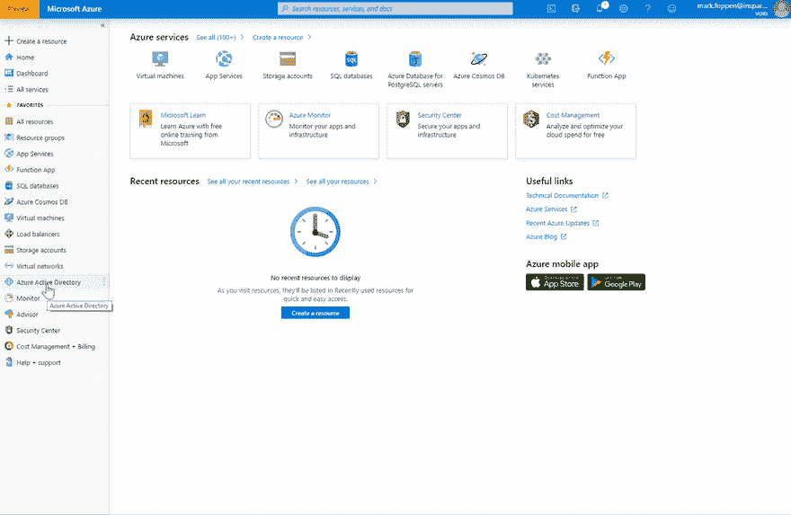
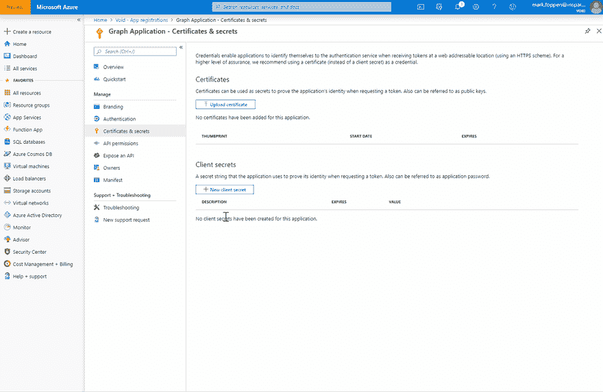

# 如何从 Graph API 的 beta 通道访问数据

> 原文：<https://dev.to/foppenma/how-to-access-data-from-the-beta-channel-of-graph-api-od5>

[](https://res.cloudinary.com/practicaldev/image/fetch/s--Va2QV8Qs--/c_limit%2Cf_auto%2Cfl_progressive%2Cq_auto%2Cw_880/https://www.re-mark-able.net/conteimg/2019/07/stockvault-mesh-a-network-of-relations-between-entities202555.jpg)

Microsoft Graph API 的所有新功能首先在测试版中提供。通过使用测试版，您可以提前获得新功能。微软经常添加新功能，这可以在他们的 GitHub changelog [这里](https://github.com/microsoftgraph/microsoft-graph-docs/blob/master/concepts/changelog.md)看到。

在这篇文章中，我们将做三件事:

*   创建 Azure Active Directory 应用程序注册
*   通过注册的应用程序获取访问令牌
*   在测试版上调用图形 API

这都是通过使用 Azure 门户和实现代码来调用 C#中的 Graph API 来完成的。

## 向您的 Azure Active Directory 添加应用程序

为了访问 Graph API，我们需要在 Azure Active Directory (AAD)中注册一个应用程序。此应用程序可用于添加权限。然后，该 AAD 的管理员可以同意您选择的权限。让我们一步一步来。

打开 Azure 门户，转到要添加应用程序的 AAD。现在，您可以像这样添加新的应用程序

[](https://res.cloudinary.com/practicaldev/image/fetch/s--YYicMd1R--/c_limit%2Cf_auto%2Cfl_progressive%2Cq_66%2Cw_880/https://www.re-mark-able.net/conteimg/2019/07/AddApplication.gif)

创建应用程序注册后，您可以看到我们在稍后阶段需要的两个重要 id。这是**应用程序(客户端)Id** 和**目录(租户)Id** 。

[](https://res.cloudinary.com/practicaldev/image/fetch/s--cBAkJcan--/c_limit%2Cf_auto%2Cfl_progressive%2Cq_auto%2Cw_880/https://www.re-mark-able.net/conteimg/2019/07/ids.png)

下一步是向应用程序注册添加权限。这些权限赋予应用程序访问资源的能力。在我们的例子中，这是 Graph API。让我们添加**目录。Read.All** 允许我们读取这个 AAD 中的所有内容，但不能修改它。

[](https://res.cloudinary.com/practicaldev/image/fetch/s--eXBlmh9k--/c_limit%2Cf_auto%2Cfl_progressive%2Cq_66%2Cw_880/https://www.re-mark-able.net/conteimg/2019/07/AddPermission.gif)

正如您可能已经看到的，有两种类型的权限:

*   **委托权限** -这些权限在有登录用户时使用。通常用于具有 AD 认证的门户或 Azure 功能。
*   **应用许可** -应该只在后台服务上使用。这些权限只能由管理员授予。

现在应用注册有了我们想要的权限，还是没有授予。要授予对此广告的权限，我们需要一个管理员帐户给予同意。这可以在我们刚刚添加新权限的“API 权限”页面上完成。

[](https://res.cloudinary.com/practicaldev/image/fetch/s--AyYzhG0e--/c_limit%2Cf_auto%2Cfl_progressive%2Cq_auto%2Cw_880/https://www.re-mark-able.net/conteimg/2019/07/grant.png)

同意许可后，只剩下一件事要做，那就是给应用程序添加一个秘密。这基本上和给你使用应用程序的密码是一样的。只有在这种情况下，你可以有多个秘密，每个不同的到期时间。你也可以删除这些秘密。要添加密码，我们需要进入“证书和密码页”。

[](https://res.cloudinary.com/practicaldev/image/fetch/s--epzfq8pS--/c_limit%2Cf_auto%2Cfl_progressive%2Cq_66%2Cw_880/https://www.re-mark-able.net/conteimg/2019/07/AddSecret.gif)

请记住，你只能看到这个秘密一次。现在我们已经完成了这项工作，我们需要在下一步中使用以下数据:

租户 Id:' 5d 1821 a3-a004-4c 0-95 D5-cb2e 797 ceaf 1 '

App Id 或客户端 Id:' 42903 c50-6fc 9-40db-a131-87f 4522 DCF 56 '

App Secret 或客户端 Secret: 'fe_？' xg+VhSxe_iq4RSw9TE4AUlddktg8 '

我们只为单个租户创建了一个应用程序注册，大部分是默认设置。如果您想了解更多关于多租户应用程序的详细信息，您可以访问微软文档[此处](https://docs.microsoft.com/nl-nl/azure/active-directory/develop/quickstart-register-app)。

## 获取访问令牌

为了访问 Graph API，我们首先需要获得一个访问令牌。这个令牌可以在以后用作承载授权报头。为此，我使用了微软的 NuGet 包。Identity.Client 版本 4.0。

```
private async Task<string> GetAccessToken(
    string tenantId,
    string clientId,
    string clientSecret)
{
    var builder = ConfidentialClientApplicationBuilder
        .Create(clientId)
        .WithClientSecret(clientSecret)
        .WithTenantId(tenantId)
        .WithRedirectUri("http://localhost/")
        .Build();

    var acquiredTokenResult = builder.AcquireTokenForClient(
        // Here we set the scope to https://graph.microsoft.com/.default
        new List<string> { "https://graph.microsoft.com/.default" });
    var tokenResult = await acquiredTokenResult.ExecuteAsync();
    return tokenResult.AccessToken;
} 
```

## 调用图形 API

通常你只需要使用微软的图形 API 客户端软件开发套件。图表但是即使是预览版也没有所有可用的呼叫。因此，我不使用这个 NuGet。相反，通过使用一个简单的 HttpClient，我们可以达到同样的效果。

下面的代码将执行以下操作:

*   检索访问令牌
*   将版本设置为 beta
*   设置端点和我们想要执行的操作
*   创建 HTTP 客户端
*   设置包括授权承载报头的报头
*   发送实际上是 HTTP get 的请求
*   将结果作为字符串读取，因为响应将采用 JSON 格式

```
private async Task CallGraphApiBetaChannel()
{
    // Retrieve the access token
    var accessToken = await GetAccessToken(
        "5d1821a3-a004-4cc0-95d5-cb2e797ceaf1",
        "42903c50-6fc9-40db-a131-87f4522dcf56",
        "fe_?xg+VhSxe_iq4RSw9TE4AUlddktg8");

    // Set the version to beta
    var graphApiVersion = "beta"; // 'beta' or 'v1.0'

    // Set the endpoint and the action we want to execute
    var endpoint = $"https://graph.microsoft.com/{graphApiVersion}";
    var action = "/applications";

    // Create the http client
    using (var client = new HttpClient())
    using (var request = new HttpRequestMessage(HttpMethod.Get, endpoint + action))
    {
        // Set the headers including the authorization bearer header
        request.Headers.Accept.Add(new MediaTypeWithQualityHeaderValue("application/json"));
        request.Headers.Authorization = new AuthenticationHeaderValue("Bearer", accessToken);

        // Sending the request which actually is a http get
        using (var response = await client.SendAsync(request))
        {
            if (response.IsSuccessStatusCode)
            {
                // Read the result as string, since the response will be json
                var result = await response.Content.ReadAsStringAsync();
                // Do something with the result
            }
        }
    }
} 
```

获得结果后，您可以按照自己的方式解析响应。请记住，如果您从 JSON 生成了一个类模型，它可能会在任何时候被破坏，因为他们会定期更新测试版。

如果一切顺利，你应该能够在 Azure Active Directory 中检索到所有可用的应用程序。在我看来，这非常容易使用，你可以将 action 变量改为你在 beta 参考文档中找到的任何方法。同样，通过使用这个，您可以控制如何解析响应。

感谢阅读！