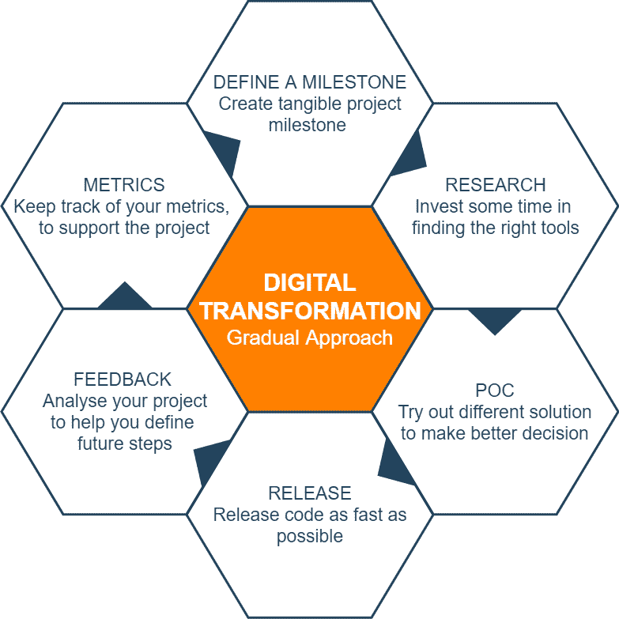

# 如何实现渐进式数字化转型

> 原文：<https://dev.to/thisdotmedia/how-to-achieve-progressive-digital-transformation-36m0>

网络上充满了精彩的文章，涵盖了新技术提供的奇妙特性。不幸的是，由于遗留代码和僵化的基础设施，企业级公司中的数千名开发人员被排除在这一数字化转型之外。

在今天的文章中，我将描述我在*数字化转型*中的经历，提供有见地的例子和建议，以帮助企业看到增强其技术堆栈的好处。

我现在已经参与了几个这样的项目，并开始了创造技术进步的旅程。这不仅为开发人员创造了闪亮的新工具。它还*间接地*产生了以下副作用，从长远来看，这些副作用大大超过了实施转型所涉及的成本:

*   **增加工作需求:**众所周知，一家提供从事新技术工作可能性的公司对开发人员来说是一个巨大的卖点。
*   **提高候选级别:**这是采用新代码的未知结果。申请工作的开发人员不仅增加了，而且质量也提高了。
*   **降低开发成本:**当今的大多数技术都旨在支持开发人员花更少的时间完成更多的工作
*   **增加内部功能:**花式工具自带花式功能
*   **提高员工士气:**在我之前的一个项目中，引入新技术提高了员工的整体士气，并支持个人发展(提供新的学习工具)

## 什么是“数字化转型”？

“数字化转型”有不同的定义，取决于它们所用于的行业。在技术行业，定义可以是:

> 数字化转型是使业务技术和流程现代化所需的过程。这些变化将使公司从僵化的遗留代码过渡到现代技术堆栈，这将不可避免地支持业务增长和灵活性。

看到公司坐在他们的旧代码基础上，享受他们提供的稳定性是很常见的。不幸的是，众所周知，IT 行业的发展速度非常快，所以保留古老的代码是失败的原因(因为新的竞争加入了市场)。

## 如何拥抱转型

实现这一转变不是一项简单的任务。这需要大量的计划，和有经验的工程师一起经历这一过程通常是有益的。

许多公司试图通过重写完整的代码库来实现迁移。人们通常更喜欢这种“干净的画布”方法，而不是通过逐步改进来实现转换。

我们现在要定义两种不同的方法:*清洁画布*和*渐进增量*:

### 清洁画布的方法

我认为从零开始会增加失败的风险。遗留代码之所以被称为遗留代码，是因为它是用不再维护的工具编写的，或者是由已经离开公司的员工开发的。在这种情况下，我反对“干净画布”的方法，因为隐藏*功能的可能性会给整个项目带来风险。*

总之，干净画布方法有一些负面后果:

*   它不能逐步部署
*   在项目持续期间，需要维护两个代码库(遗留的和灵活的)
*   在完全完成(和部署)之前，它不会产生“改进”
*   它可能会被遗留代码中的*隐藏的*特性阻塞
*   很难正确估计
*   在重写发生之前，可能需要大量的计划

### 逐渐递增的方法

使用渐进的方式实现数字化转型有许多不同的好处。对于我工作过的大多数公司来说，这些好处使其风险更小，价格更实惠。

使用这种方法，整个转换项目被分割成“更小的”独立里程碑。实现所有这些“迷你项目”，将提供与完全重写相同的最终结果。

采用这一过程的想法通常被许多经理和高级工程师抛弃，因为它可能需要比前面提到的方法更多的步骤。实际上，我认为这些额外的步骤有利于项目的整体成功，因为它们可以帮助开发人员做出更好的决策。

我对渐进方法的意见是:

*   由于渐进的方法，它提供了快速的反馈(对士气、项目成本、涉众和项目架构有用)
*   它允许项目是敏捷的，并且适应可能的*隐藏的*特性
*   由于其灵活的方法，它应该产生一个更好的最终结果
*   它需要一个单一的代码库(易于管理)

## 现实生活中的例子

开始这段转型之旅并不简单，找到合适的时机真的很复杂。当转换与公司范围的项目相关联时，我体验到了最好的结果。例如，逐步迁移可以与应用程序的整体“安全性增强”相结合，或者与第三方集成工作中的“品牌重塑”项目相一致。然后，它可以搭配一个“大功能发布”。

将转换与另一个项目相结合通常会给它一个明确的期限，证明其成本，并定义在给定的时间表内可以采取的步骤的范围。

在这篇文章中，我们将结合一个*品牌重塑*项目，定义实现网络应用数字化转型的步骤和改进。

### 公司

我们的示例公司在这个领域已经领先 8 年了，它的大部分代码都是用普通的 PHP 4 编写的，托管在专用的、昂贵的服务器上。它还有一个用普通 CSS 编写的前端，带有一点 jQuery 的味道。

它的创建者已经在 4 年前离开了公司，大部分新代码都是在旧代码的基础上编写的。为了避免意外行为，没有可用的单元测试或端到端测试。

上面描述的技术栈对许多开发人员来说并没有真正的吸引力，不幸的是，这是我们整个行业的普遍情况。

上面提到的公司正在经历一个内部*品牌重塑*项目，所有业务部门都被要求修改他们的“形象”,以符合新创建的风格。

我们将通过增强 UI 技术栈、使用新的框架和移除冗余技术来利用这个项目。

### 定义你的项目

我反对*过度的*项目规划。但是由于所涉及的新技术，以及项目对整个公司的重要性，预先定义整个项目范围和需求是有益的。

我说的不是一份详细的 50 页文件，但是做出正确的选择是很重要的，有时做一点研究是必要的。

例如，在我们的案例中，公司必须在 React、VUE 和 Angular 之间做出选择。这一选择将塑造公司的未来，而且不应该仅仅从技术角度出发。

Angular 开发者在该地区似乎很稀缺，所以主要选择将在 React 和 Vue 之间。进一步的研究表明，其中一名高级开发人员似乎非常擅长 React，他愿意帮助这个项目，而另一方面，在该公司的家乡有一个不错的 VUE 聚会，一些最近参加过的开发人员热衷于学习 Vue。

在一种全新的方法中，这个决定，以及许多其他技术上的决定，应该在项目开始日期之前做出。然而，在渐进的方法中，有空间让*尝试*不同的路径，并根据收到的反馈定义项目。(这些是上面“逐步增加方法”一节中提到的额外步骤)。

最后的决定是尝试为每个框架执行一个非常小的项目。

### 第一步

第一步总是最难做的，因此，我通常建议从相对较小的项目开始。我做过这样的项目，“开始”意味着在当前代码库中添加一个脚本标签，或者实现一个对新云服务的 API 调用。

在我们的例子中，我们将通过使用框架提供的基于组件的架构创建一个所谓的风格指南来开始创建我们的新品牌。

在我们的第一步中，我们将在两个框架中创建一个小型的概念验证(POC ),并使用从这些实现中获得的反馈来推进我们的转型。

> 提示:让第一步尽可能的小，让你可以在几周内发布。这将帮助你“认真”对待数字化转型。

### 反馈回路

“渐进方法”的主要优点是能够获得一个紧密的、主动的反馈回路。这必须经常使用，以确保项目的成功。

我并不是说实施一个小型的 POC 就一定能帮助您做出正确的决定。然而，在某些情况下，它确实能产生巨大的影响。重要的是要记住，当这种转变仅由房屋开发商开发时，大多数技术对大多数员工来说都是新的。

继续我们上面的例子，该公司已决定使用 VUE 框架，因为它似乎产生更好的结果，并提供一个简单的学习曲线。

> VUE 使用起来非常简单，因此对迁移项目非常有益，因为它允许现有的“遗留”开发人员快速学习它。

### 发布

和所有敏捷项目一样，尽可能快地尝试和发布是很重要的。获得内部反馈很好，但开始感受真实世界是另一回事。

我们的开发人员已经开始将现有的样式从遗留的 CSS 结构“移植”到基于组件的架构中。这项工作风险很低(因为它主要需要移动代码)，但它将加速未来实现整体品牌重塑所需的 UI 更改。

### 指标和结果

多年来，我一直参加会议，既戴着开发人员的帽子，也戴着经理的帽子。我很清楚，当开发人员快乐的时候是很好的，但是不幸的是，仅仅快乐并不能支付账单(即使快乐的员工被认为更有生产力)。

因此，定义一组可用于支持成本和投资的有形指标是非常重要的，这是将迁移推进到下一个级别所必需的。

收集这些信息通常比听起来简单，但是需要在项目开始之前完成。

## 结论

在我的下一篇文章中，我们将定义实现*数字化转型*所必需的技术步骤。这将使用上面介绍的例子，解释开始的所有必要步骤，并将遗留代码迁移到面向未来的技术堆栈。

以上所有信息都来自个人经验，应该持保留态度，因为不同公司和组织的结果可能会有所不同。

数字世界在不断进步，因此，用于实现数字化转型的工具和方法也在不断变化。创建灵活敏捷的环境是不断适应不断变化的技术标准的最佳方式。

这篇文章是由西蒙·科莫写的，他是[这个点](https://thisdot.co)的高级软件工程师。

你可以在推特上关注他，号码是 [@zelig880](https://dev.to/zelig880) 。

需要 JavaScript 咨询、指导或培训帮助吗？在 [This Dot Labs](https://thisdot.co) 查看我们的服务列表。