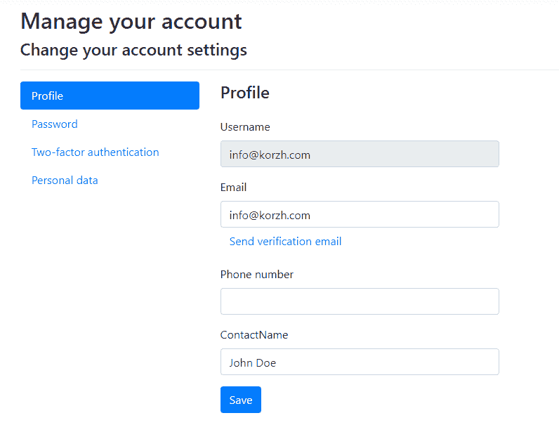
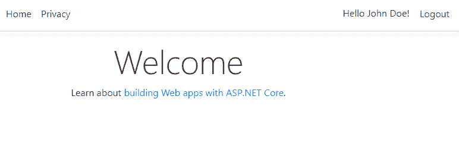

# 如何在 ASP.NET 核心网络应用程序中添加额外的用户声明

> 原文：<https://dev.to/korzh/how-to-add-extra-user-claims-in-asp-net-core-web-app-770>

## 简介

ASP.NET 核心已经开发了足够的工具，用于在您的项目中实现认证和授权机制。这些工具都是现成可用的，而且配置相当简单。即使是用 Visual Studio 向导创建的 web 项目，也已经包含了授权子系统的所有必要部分(注册/登录/用户配置文件表单、重置密码过程等)。)

然而，有些乍一看简单的任务需要对 ASP.NET 核心身份的内部结构有更深入的了解。

在本文中，我们将讨论其中一项任务，并使用基于[声明的方法](https://docs.microsoft.com/en-us/aspnet/core/security/authorization/claims)提出一个解决方案。

## 问题

假设我们使用一个默认模板创建了一个新的 ASP.NET 核心项目，并选择了“个人用户帐户”选项作为“身份验证”。

[](https://res.cloudinary.com/practicaldev/image/fetch/s--8k0BrUbT--/c_limit%2Cf_auto%2Cfl_progressive%2Cq_auto%2Cw_880/https://korzh.com/static/blogs/net-tricks/anc22-add-extra-claim01.png)

现在，当我们启动新创建项目并注册新用户时，我们将在索引网页的右上角看到类似于`Hello YourEmailAddress@YourCompany.com`的内容。

显然，这种问候在现实世界的应用程序中是没有用的，您可能希望看到当前登录用户的名字(例如`Hello John Doe`)。

让我们想想怎么做吧。

## 解

在这里，我们猜想您已经熟悉了 ASP.NET 核心身份认证中使用的声明和基于声明的方法。如果没有——请先阅读【ASP.NET T2】核心安全文章。

为了实现我们的目标，我们需要做两件事:

1.  向附加到用户身份的声明列表中添加必要的信息。
2.  需要时，有一个简单的方法来获取信息。

但是在实现这两个任务之前，我们需要向我们的模型类添加一个新的 ContactName 字段，并相应地更新我们的注册和用户管理页面。

## 0。准备

在我们可以向用户对象(可以通过`HttpContext.User`访问的对象)添加新的声明之前，我们需要一个地方来存储额外的信息。
在这里，我将描述如何为一个由默认模板构建的新 ASP.NET 核心项目完成这项工作。

如果你从事一些现实世界的项目——很可能你以前已经做过类似的改变。在这种情况下，您可以跳过“准备”部分，直接进入下一部分。

### 1。新应用程序用户类

添加一个具有“ContactName”属性的新的`ApplicationUser`类:

```
public class ApplicationUser : IdentityUser
{
    public string ContactName { get; set; }
} 
```

当然，您可以添加更多的属性来存储用户帐户的一些附加信息。
例如:`FirstName`、`LastName`、`Country`、`Address`等。所有这些都可以像我们在这里讨论的`ContactName`一样进行索赔。

### [2](#2-replace-endraw-identityuser-raw-with-endraw-applicationuser-raw-)。将`IdentityUser`替换为`ApplicationUser`

现在您需要在项目中的任何地方用`ApplicationUser`替换`IdentityUser`。

默认的 ASP.NET 核心模板到处使用预定义的`IdentityUser`类型。
因为我们要用`ApplicationUser`来代替它——我们需要在你的项目中搜索`IdentityUser`的所有包含，并用`ApplicationUser`替换。

它将包括你的 DbContext 类，一行在`Startup`类中(在`ConfigureServices`方法中),两行在`_LoginPartial.cshtml`视图中带有`@inject`指令。

这是您的新`ApplicationDbContext`类在此之后的样子:

```
public class ApplicationDbContext : IdentityDbContext<ApplicationUser, IdentityRole, string>
{
    public ApplicationDbContext(DbContextOptions<ApplicationDbContext> options)
        : base(options)
    {
    }
} 
```

### 3。更新您的数据库。

现在您需要添加一个新的迁移，然后更新您的数据库。只需从项目文件夹中运行以下两个命令:

```
dotnet ef migrations add AddUserContactName

dotnet ef database update 
```

### 4。更新“用户资料”页面

最后，我们需要将我们的新字段添加到“用户资料”页面，以便用户可以修改它。

默认的 ASP.NET 核心模板直接使用来自一个特殊的 Razor UI 库(`Microsoft.AspNetCore.Identity.UI`)的所有身份相关页面。
好消息是:如果我们愿意，我们可以覆盖其中的任何页面。以下是我们需要完成的步骤:

1.  在 VS 中右键单击您的项目，并选择 Add | New Scaffolding item。

2.  在“添加脚手架”对话框中，选择左侧树上的`Identity`，然后选择主列表中的`Identity`，点击“添加”。

3.  在出现的对话框中，仅选择`Account\Manage\Index`页面，然后点击“添加”。
    当这个过程完成后，你会在`Areas/Identity/Pages`文件夹中找到一个新的页面“Index.cshtml”。

4.  之后，对该`Index`页面进行以下更改:

在 Index.cshtml 本身中，在`update-profile-button`按钮之前添加以下标记。

```
<div class="form-group">
  <label asp-for="Input.ContactName"></label>
  <input asp-for="Input.ContactName" class="form-control" />
  <span asp-validation-for="Input.ContactName" class="text-danger"></span>
</div> 
```

然后，在代码隐藏文件`Index.cshtml.cs`中，我们需要修改视图模型:

```
public class InputModel
{
    .   .   .   .   .   .

    public string ContactName { get; set; }
} 
```

然后是`OnGetAsync`法:

```
public async Task<IActionResult> OnGetAsync()
{
    .   .   .   .   .   .

    Input = new InputModel
    {
        Email = email,
        PhoneNumber = phoneNumber,
        ContactName = user.ContactName //add this line
    };

    .   .   .   .   .   .

} 
```

而`OnPutAsync`:

```
public async Task<IActionResult> OnPostAsync()
{
    .    .    .    .    .    .    .

    if (Input.ContactName != user.ContactName) {
        user.ContactName = Input.ContactName;
        await _userManager.UpdateAsync(user);
    }

    await _signInManager.RefreshSignInAsync(user);
    StatusMessage = "Your profile has been updated";
    return RedirectToPage();
} 
```

因此，经过上述所有更改后，注册后您的用户资料页面将如下所示:

[](https://res.cloudinary.com/practicaldev/image/fetch/s--7bRN3Nal--/c_limit%2Cf_auto%2Cfl_progressive%2Cq_auto%2Cw_880/https://korzh.com/static/blogs/net-tricks/anc22-add-extra-claim02.png)

现在，所有的准备工作都完成了，我们可以继续我们的主要任务了。

## 1。将联系人姓名添加到索赔中

一个搞笑的事情:主要任务比我们之前做的所有准备都要轻松很多。:)
此外，由于 ASP.NET 核心 2.2 版本中的一些变化，它变得更加容易(与我们在之前描述的[2.0 版本相比)](https://korzh.com/blogs/net-tricks/aspnet-identity-store-user-data-in-claims)

只有两个简单的步骤:

### 创建自己的索赔委托工厂

我们需要一个实现`IUserClaimsPrincipalFactory`，它将向用户声明添加必要的信息(在我们的例子中是`ContactName`)。
最简单的方法是从`IUserClaimsPrincipalFactory`的默认实现中派生出我们的新类，并覆盖一个方法:`GenerateClaimsAsync`:

```
public class MyUserClaimsPrincipalFactory : UserClaimsPrincipalFactory<ApplicationUser>
{
    public MyUserClaimsPrincipalFactory(
        UserManager<ApplicationUser> userManager,
        IOptions<IdentityOptions> optionsAccessor)
        : base(userManager, optionsAccessor)
    {
    }

    protected override async Task<ClaimsIdentity> GenerateClaimsAsync(ApplicationUser user)
    {
        var identity = await base.GenerateClaimsAsync(user);
        identity.AddClaim(new Claim("ContactName", user.ContactName ?? "[Click to edit profile]"));
        return identity;
    }
} 
```

### 在 DI 容器中注册新类

然后我们需要在依赖注入容器中注册我们的新类。
最好的方法——使用`AddClaimsPrincipalFactory`扩展方法:

```
public void ConfigureServices(IServiceCollection services) 
{
    .     .     .     .      .
    services.AddDefaultIdentity<ApplicationUser>()
        .AddDefaultUI(UIFramework.Bootstrap4)
        .AddEntityFrameworkStores<ApplicationDbContext>()
        .AddClaimsPrincipalFactory<MyUserClaimsPrincipalFactory>();  //<---- add this line
} 
```

## 2。从视图中访问新索赔

现在，我们有了一个与用户身份相关联的新声明。那很好。但是我们如何获得它并在我们的视图上呈现呢？
容易。应用程序中的任何视图都可以访问作为`ClaimsPrincipal`类实例的`User`对象。

这个对象实际上保存了与当前用户相关的所有声明的列表，您可以调用它的`FindFirst`方法来获取必要的声明，然后读取该声明的`Value`属性。

所以，我们只需要打开`Pages/Shared/`(或`Views/Shared/`)文件夹中的`_LoginPartical.cshtml`文件，替换下面一行:

```
<a asp-area="" asp-controller="Manage" asp-action="Index" title="Manage">Hello @User.Identity.Name!</a> 
```

有了这个:

```
<a asp-area="" asp-controller="Manage" asp-action="Index" title="Manage">Hello @(User.FindFirst("ContactName").Value)!</a> 
```

现在你应该看到这样的东西，而不是像`Hello john.doe@yourcompany.com`一样出现在你的网页顶部:

[](https://res.cloudinary.com/practicaldev/image/fetch/s--4dtk95_F--/c_limit%2Cf_auto%2Cfl_progressive%2Cq_auto%2Cw_880/https://korzh.com/static/blogs/net-tricks/anc22-add-extra-claim03.png)

目前就这些。尽情享受吧！

> 这篇文章最初发表在 Korzh.com 的博客上。