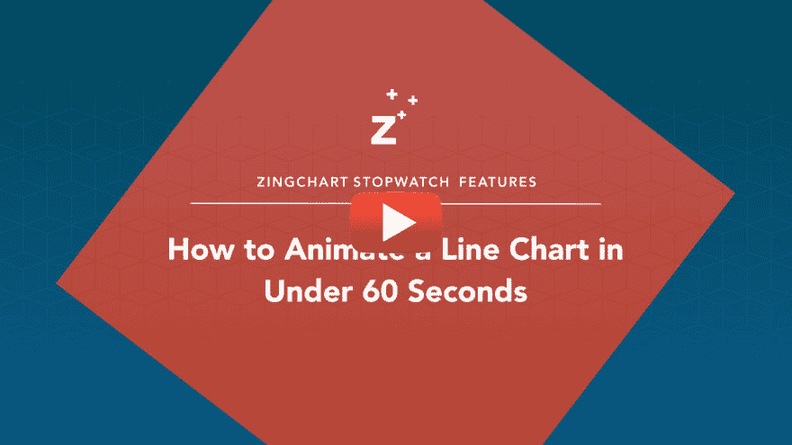

# 如何在 60 秒内制作出动画折线图

> 原文：<https://dev.to/zingchartinc/how-to-animate-a-line-chart-in-under-60-seconds-10hg>

* * *

这是 ZingChart 的秒表功能系列的第一篇文章。在本系列中，解释 ZingChart 的许多特性，这些特性可以快速实现，使您的图表具有动态性、交互性和动画效果。

观看下面的短片，了解如何快速轻松地向折线图添加动画。如需逐步总结，请滚动视频。

[](https://www.youtube.com/watch?v=1Zss2FIacr0)

作为一个快速指南，以下是我将为您的折线图制作动画的要点:

1.  创建一个基本的 HTML 布局来呈现您的图表
2.  在 JavaScript 中添加一个对象来包含数据、属性和动画
3.  调用 ZingChart 将图表呈现到您的页面上

虽然你当然可以使用自己的数据和设计，但为了这个演示的目的，我将使用下面的图表和 3 个绘图分组。

[](https://res.cloudinary.com/practicaldev/image/fetch/s--5Lz_Y5Ex--/c_limit%2Cf_auto%2Cfl_progressive%2Cq_auto%2Cw_880/https://firebasestorage.googleapis.com/v0/b/zingchart-marketing.appspot.com/o/Blog%2520Assets%252Fanimate%2520a%2520line%2520chart%2520in%252060%2520seconds%252FLinechartexample.png%3Falt%3Dmedia%26token%3Da483cf42-6952-4b27-80c0-22957a983ae9)

## 在我开始之前…

我强烈推荐注册 ZingChart 的免费网络应用程序“ZingSoft Studio”。

这将使您在类似沙盒的环境中完全访问 ZingChart 库。该工作室将允许您创建功能齐全的图表和网格，同时添加您的动画。

查看工作室并开始制图！

## 1。创建您的布局

首先，您需要创建一个基本的 HTML 布局。请随意复制下面的一个。

```
<!DOCTYPE html>
<html>
   <head>
   <meta charset="utf-8">
   Line Chart Animation Demo
   <script src="<https://cdn.zingchart.com/zingchart.min.js>">
</script>
   </head>
   <body>
      <div id='myChart'></div>
   </body>
</html> 
```

请注意，我已经包含了引用 ZingChart 的 CDN 的`script`标签以及呈现图表的`div`。

## 2。添加您的 JavaScript

一旦你完成了 HTML 的设置，你将需要添加你的 JavaScript。

要么在设置图表`div`的下方创建一个`script`标签，要么引用一个新的 JavaScript 文件。虽然我只是简单介绍了 ZingChart 的功能，但是要制作图表动画，您只需添加两个 JavaScript 组件:一个变量和一个呈现方法。

### 创建您的变量

您将首先在 JavaScript 文件或`script`标签中创建并命名一个变量作为对象。在这个对象中，您将希望包含 3 个主要属性:`type`、`series`和`plot`。参考下面的格式。

```
var myConfig = {
   "type": "line",
   "series": [
      {"values": [20,40,25,50,15,45,33,34] },
      {"values": [5,30,21,18,59,50,28,33] },
      {"values": [30,5,18,21,33,41,29,15] }
   ],
   "plot": {
   }
}; 
```

`type`属性指定了您要利用的图表类型。ZingChart 有超过 35 种图表类型，但是在这篇文章中，我将浏览折线图，因此`type`属性的属性值为`line`。

属性是你存储数据、改变线条颜色、添加悬停效果和更多定制的地方。注意`series`属性的格式。为了添加多条绘制的线，我将`series`制作成一个以多个对象为属性的数组。

如果您保存这个文件并在浏览器中打开您的 HTML，您将看到一个功能齐全的折线图。

### 添加动画

要制作现在呈现的图表的动画，只需向您的`plot`对象添加一些属性即可。

你要做的第一件事是给你的`plot`对象一个名为`animation`的属性。`animation`将是一个对象，它接受所有用于动画图表的 ZingChart 属性。

您将添加到`animation`的第一个属性是`effect`。它可以接受一个字符串或一个数字作为值。出于演示的目的，我将使用数字。您的 JavaScript 应该看起来像下面的代码，但是尝试用 1 到 13 之间的任何数字来切换值。我在下面提供了数值 1 - 13 的动画。

```
var myConfig = {
   "type": "line",
   "series": [
      {"values": [20,40,25,50,15,45,33,34] },
      {"values": [5,30,21,18,59,50,28,33] },
      {"values": [30,5,18,21,33,41,29,15] }
   ],
   "plot": {
      "animation": {
         "effect":1
      }
   }
}; 
```

*   1 =淡入
*   2 =从中心垂直扩展
*   3 =从顶部展开
*   4 =从底部展开
*   5 =从左向右扩展
*   6 =从右向左扩展
*   7 =从中心水平扩展
*   8 =从左侧滑动
*   9 =从右侧滑动
*   10 =从顶部滑动
*   11 =从底部滑动
*   12 =水平展开
*   13 =垂直展开

您可以添加到`animation`的下一个属性是`sequence`。该属性可以接受 1 到 3 之间的值。

`sequence`决定图表上线条的动画顺序。我鼓励您尝试 1 到 3 之间的不同属性值，以更好地了解它们如何影响动画本身。

```
var myConfig = {
   "type": "line",
   "series": [
      {"values": [20,40,25,50,15,45,33,34] },
      {"values": [5,30,21,18,59,50,28,33] },
      {"values": [30,5,18,21,33,41,29,15] }
   ],
   "plot": {
      "animation": {
         "effect": 1,
         "sequence": 1
      }
   }
}; 
```

*   1 =线按地块组显示
*   2 =线条按节点组显示
*   3 =线条按单个节点显示

最后，`speed`是决定动画整体速度的属性。请尝试使用 1 到 100 之间的值。

```
var myConfig = {
   "type": "line",
   "series": [
      {"values": [20,40,25,50,15,45,33,34] },
      {"values": [5,30,21,18,59,50,28,33] },
      {"values": [30,5,18,21,33,41,29,15] }
   ],
   "plot": {
      "animation": {
         "effect": 1,
         "sequence": 1, 
         "speed": 10
      }
   }
}; 
```

## 3。呈现您的图表

您需要添加的最后一部分 JavaScript 是`zingchart.render()`方法。

添加之后，完整的 JavaScript 文件应该如下所示:

```
var myConfig = {
   "type": "line",
   "series": [
      {"values": [20,40,25,50,15,45,33,34] },
      {"values": [5,30,21,18,59,50,28,33] },
      {"values": [30,5,18,21,33,41,29,15] }
   ],
   "plot": {
      "animation": {
         "effect": 1,
         "sequence": 1, 
         "speed": 10
      }
   }
};
zingchart.render({
   id: 'myChart',
   data: myConfig,
   height: "100%",
   width: "100%"
}); 
```

就动画而言，你已经完成了！

你可以利用`effect`、`sequence`和`speed`的许多不同组合。我鼓励你尝试各种组合，看看哪种最适合你的需求。还有[许多其他属性](https://www.zingchart.com/docs/events/plot)可以包含在`plot`对象中，以增加图表的交互性。你可以在这里玩这个演示。

* * *

作为数据可视化领域的先驱，ZingChart 是一个强大的 JavaScript 库，以大数据为设计理念。ZingChart 拥有超过 35 种图表类型，并可与您的开发堆栈轻松集成，允许您轻松创建交互式响应图表。