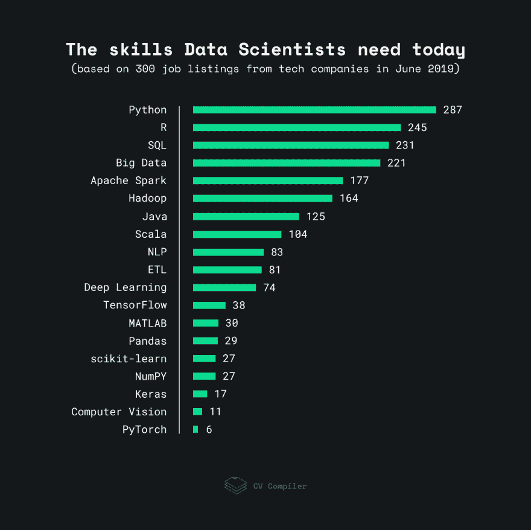

# 如何在 2019 年成为更有市场的数据科学家

> 原文：<https://dev.to/stetsenko_me/how-to-become-more-marketable-as-a-data-scientist-in-2019-fl9>

这个标题对你来说可能有点奇怪。毕竟，如果你是 2019 年的数据科学家，你已经**有市场**。由于数据科学对当今的企业有着巨大的影响，对 DS 专家的需求也在增长。在我写这篇文章的时候，仅 LinkedIn 上就有 144，527 个数据科学职位。

但是，重要的是要把握行业脉搏，了解最快、最有效的数据科学解决方案。为了帮助你，我们痴迷于数据的 [CV 编译器](https://cvcompiler.com/?utm=13c829bcc1c91210)团队分析了一些空缺职位，并定义了 2019 年数据科学就业趋势。

## 2019 年最抢手的数据科学技能

下图显示了 2019 年雇主对数据科学工程师的技能要求:

为了进行这项分析，我们查看了 StackOverflow、AngelList 和类似网站的 300 个数据科学职位空缺。一些术语可能在一个职务列表中重复多次。

**注意:**请记住，这项研究代表了雇主的偏好，而不是数据科学工程师本身。

## 关键要点和数据科学趋势

显然，数据科学更多的是关于基础知识，而不是框架和库，然而仍然有一些趋势和技术值得注意。

### 大数据

根据 [2018 年大数据分析市场研究](https://www.forbes.com/sites/louiscolumbus/2018/12/23/big-data-analytics-adoption-soared-in-the-enterprise-in-2018/#622709b9332f)，企业大数据采用率从 2015 年的 17%飙升至 2018 年的 59%。因此，大数据工具也越来越受欢迎。如果不把 Apache Spark 和 Hadoop 考虑在内，(下一节我们会详细讲后者)，最受欢迎的是 **MapReduce** (36)，和**红移** (29)。

### Hadoop

尽管 Spark 和云存储很受欢迎，[Hadoop](https://0x0fff.com/hadoop-the-end-of-an-era/)的“时代”还没有结束。因此，一些雇主仍然希望候选人熟悉**阿帕奇猪** (30)、 **HBase** (32)，以及类似的技术。HDFS (20 岁)仍然在空缺职位中被提及。

### 实时数据处理

随着各种传感器、移动设备和**物联网** (18)的使用越来越多，公司正致力于从实时数据处理中获得更多见解。因此，像 **Apache Flink** (21)这样的流分析平台在一些雇主中很受欢迎。

### 特征工程和超参数调谐

准备数据和选择模型参数是任何数据科学家工作的关键部分。数据挖掘这个术语在雇主中非常流行。一些雇主也非常重视**超参数调优** (21)。但是，作为一名数据科学家，你需要[首先关注特征工程](https://towardsdatascience.com/why-you-should-do-feature-engineering-first-hyperparameter-tuning-second-as-a-data-scientist-334be5eb276c)。为模型选择最佳特征至关重要，因为它们决定了模型在创建的最初阶段能否成功。

### 数据可视化

处理数据并从中提取有价值的见解的能力至关重要。然而，**数据可视化** (55)对于任何数据科学家来说都是一项同样重要的技能。重要的是，你可以用一种任何团队成员或客户都能理解的格式来表示你的工作成果。至于数据可视化工具，雇主更喜欢 **Tableau** (54)。

### 大势所趋

在空缺中，我们遇到了 **AWS** (86)、 **Docker** (36)、 **Kubernetes** (24)这样的术语。因此，软件开发行业的一般趋势也适用于数据科学领域。

## 专家怎么说

> 这一评级中的技术不相上下。然而，在数据科学中，有些东西和编码一样重要。它是从“数据输出”中收集见解的能力，如最终数据集和趋势、可视化以及用这些数据讲述故事。此外，它是以一种可以理解的方式展示发现的能力。了解你的听众——如果他们是博士，以适当的方式与他们交谈，但是如果他们是 C 语言的，他们不会关心编程——只关心结果和投资回报率。

*卡拉·金特里，
数据科学家/所有者[分析解决方案](http://analytical-solution.com/MyRant.html)
[LinkedIn](https://t.co/L9M6kSSaef?amp=1)|[Twitter](https://twitter.com/data_nerd)*

> 快照数据有助于了解市场的当前状态，但它并不代表趋势，因此很难仅根据快照来规划未来。我想说，R 的使用将继续稳步下降(MATLAB 也是如此)，而 Python 在数据科学家中的受欢迎程度将继续上升。Hadoop 和大数据上榜是因为行业有一些惯性:Hadoop 会消失(再也没有人认真投资它)大数据不再是热门趋势。人们是否必须投入时间学习 Scala 还不清楚:Google 官方支持 Kotlin(也是一种 JVM 语言)，学习起来更简单，而 Scala 的学习曲线很陡。我也对 TensorFlow 的未来持怀疑态度:学术界已经转向 PyTorch，与其他行业相比，学术界在数据科学领域的影响力最大。(这些观点是我的，可能不代表 Gartner 的观点。)

*Andriy Burkov，
Gartner 机器学习主管，
百页机器学习书籍[的作者](http://themlbook.com/)。
[领英](https://www.linkedin.com/in/andriyburkov/)*

> PyTorch 是用 GPU 对 CUDA 张量进行数学运算的强化学习的驱动力。它也是一个更强大的框架，可以同时在多个 GPU 上并行化代码，不像 TensorFlow 需要将每个操作打包到一个设备上。PyTorch 还构建了对递归神经网络有效的动态图。基于 ano 的 TensorFlow 生成静态图表，与基于 Torch 的 PyTorch 相比，学习起来更复杂。张量流反映了更大的开发人员和研究人员社区。PyTorch 在构建 TensorBoard 等机器学习仪表盘可视化工具时会表现出更大的势头。PyTorch 用 matplotlib 和 seaborn 在调试和数据可视化库方面更 Pythonic 化。Python 的大多数调试工具也可以用来调试 PyTorch。TensorFlow 自带调试工具 tfdbg。

【Ganapathi Pulipaka 博士，
埃森哲首席数据科学家，
50 大技术领袖奖获得者。
[LinkedIn](https://www.linkedin.com/in/dr-ganapathi-pulipaka-56417a2/)|[Twitter](https://twitter.com/gp_pulipaka)

> 我认为数据科学“工作”不同于数据科学“职业”工作列表提供了对市场现在需要的特定技能的洞察，但对于职业来说，我见过的最重要的技能之一是学习能力。数据科学是一个快速发展的领域，如果你想取得长期的成功，你需要能够轻松地掌握新的技术、工具和领域知识。通过挑战自己来做到这一点，避免过于舒适。

*朗·里斯伯格，
[数据灵丹妙药](https://dataelixir.com/)，
的创始人/策展人，前美国宇航局局长。
[Twitter](https://twitter.com/lonriesberg?s=09)|[LinkedIn](https://www.linkedin.com/in/lonriesberg/)*

数据科学是一个快速发展的复杂行业，一般知识和特定技术的经验同样重要。希望这篇文章能帮助你获得有价值的见解，了解你需要什么样的技能才能在 2019 年保持市场竞争力。祝你好运！

**额外提示**:有没有想过你的数据科学家简历有多强？[点击此处](https://cvcompiler.com/?login&utm=76bb81dd05594846)进行编译，看看它与行业最佳实践相比如何。学习你的分数是免费的！