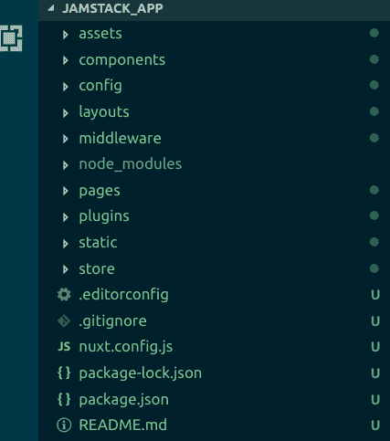
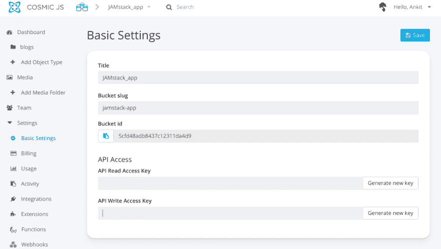

# 如何用 Vue.js，Nuxt.js，Cosmic JS 搭建一个 JAMstack 网站

> 原文：<https://dev.to/a9kitkumar/how-to-build-a-jamstack-website-using-vue-js-nuxt-js-and-cosmic-js-l62>

在本教程中，我们将使用 Cosmic JS 构建一个 JAMstack 网站。先定义我们的 JAMstack: 'J '代表 JavaScript，我们的应用使用 Vue.js，' A '代表 API，我们使用的是 [Cosmic JS](https://cosmicjs.com/) 的强大 API。‘m’代表标记，在这个例子中是 Nuxt.js。对于本教程，我们将建立一个简单的健身工作室网站。最后，我们将把它部署在 Netlify 上，它提供无服务器的后端服务和托管。让我们开始吧。

## TL；速度三角形定位法(dead reckoning)

[检验演示](https://cosmicjs.com/apps/jamstack-fitness-website)

[下载代码库](https://github.com/cosmicjs/nuxt-jamstack-website)

## 简介

我们正在用 Cosmic JS 的强大 API 建立一个 JAMstack 网站。这个网站是关于健身和身体的。第一页是动态的，带有 Vue.js 提供的一些导航。在左侧导航中，您会找到博客的链接，其数据也是通过 Cosmic JS APIs 来自 Cosmic JS。现在让我们从需求开始。

## 要求

唯一的需求是 [Node.js](https://nodejs.org/en/) 。在您的系统上安装它以运行 npm 命令。

## 入门

这里我们使用 npm，但是你也可以使用 yarn 来安装包。因此，如果你已经安装了上述软件，运行以下命令快速启动:

*npx create-nuxt-app jam stack _ app*

这里，jamstack_app 是您希望的应用程序名称。现在转到创建的文件夹的根目录，运行以下命令在开发中运行它:

*npm 运行开发*

现在访问: [http://localhost:3000/](http://localhost:3000/) 以开发模式查看项目。

在这里了解更多关于 Nuxt.js 快速入门套件的信息: [Nuxt.js 入门套件](https://nuxtjs.org/guide/installation/)

## 文件夹结构

创建应用程序后，您将获得如图所示的相同文件夹结构:

让我们解释一下这个结构的主要文件夹和文件。package.json 文件包含项目中安装的所有模块的记录。静态文件夹包含项目中使用的静态文件，如徽标和图像。Pages 文件夹包含主页和博客等页面。node_modules 安装了所有模块，布局包含项目的样式。Config 文件夹是我们创建的，用来保存 config.js 文件，该文件将在动态请求 Cosmic JS 服务器时使用。

## 配置

我们已经用应用程序生成器生成了 Nuxt.js 应用程序，但主要配置有待完成，以使我们的应用程序成为一个完整的 JAMstack 应用程序。随着应用程序的创建，应用程序的 JavaScript 和标记部分也完成了。现在我们正在配置应用程序的 API 部分，也就是宇宙 JS 部分。

为此，您需要一个宇宙 JS 帐户。[报名宇宙 JS](https://cosmicjs.com/signup) 官网，完全免费。然后创建一个自由桶，并创建您的第一个对象类型:“博客”。或者您可以导入一个内置的存储桶，导入方法在下面的标题中给出。

现在点击你的仪表板中的基本设置选项，它将打开你的基本设置页面，如上所示。记下你的桶段塞，bucket_id。现在生成读写密钥，并将它们保存在您的计算机上。现在也将它们保存到您的项目中。为此，创建一个 config 文件夹，并在其中创建一个 config.js 文件，然后保存，如下所示: