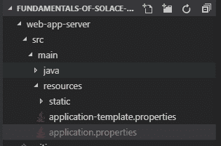
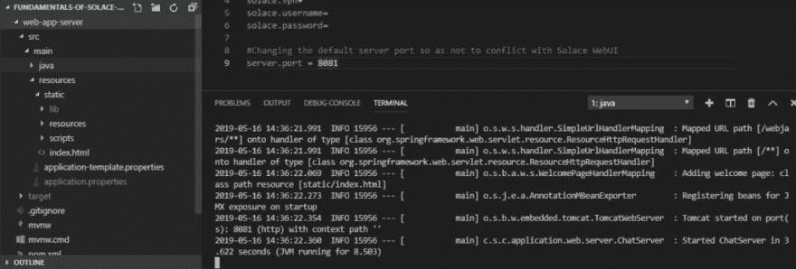
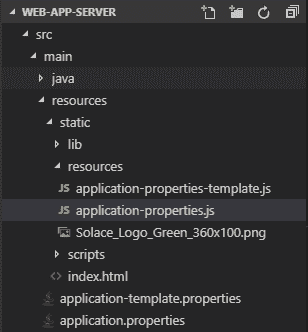
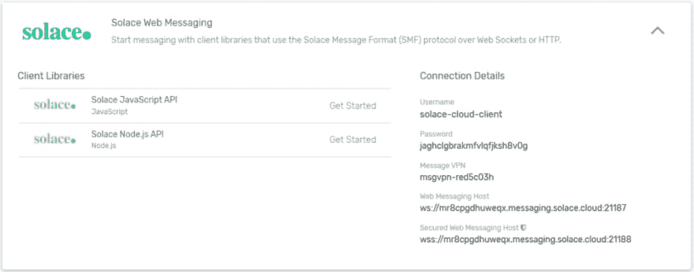
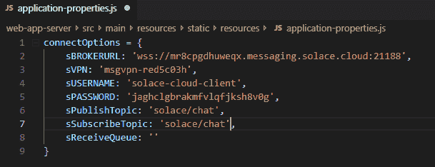
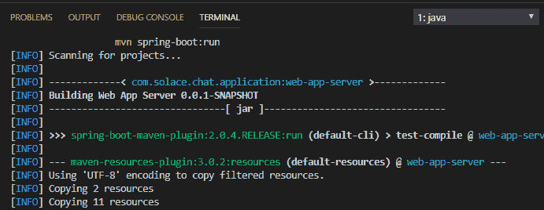
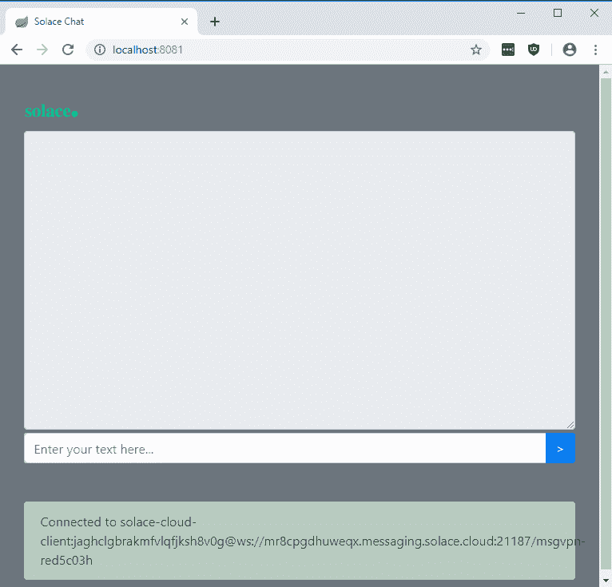
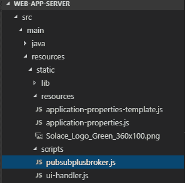
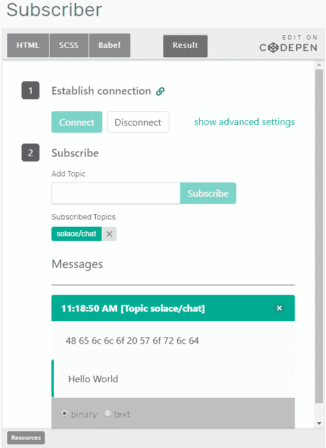
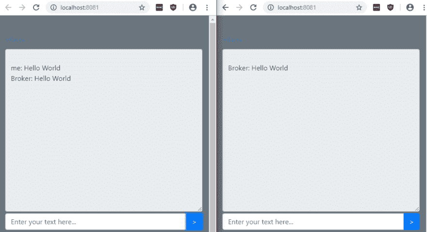

# 如何用 Solace 构建一个简单的聊天应用程序(第 1 部分)

> 原文：<https://dev.to/solacedevs/how-to-build-a-simple-chat-app-with-solace-part-1-3c9e>

在本教程中，您将学习如何构建一个简单的聊天浏览器应用程序。在本教程结束时，应用程序将能够通过直接主题订阅发送和接收消息。具体来说，您将学习如何构建应用程序，将它连接到 Solace PubSub+ Cloud，并开始发布/接收消息。

#### 先决条件

*   将 Git 下载到您的电脑上
*   [安装 Apache Maven](https://maven.apache.org/install.html%20)
*   [注册 Solace PubSub+ Cloud](https://console.solace.cloud/login)

#### 级别

*   新手

## 构建应用程序

1.  在 [Solace Training 页面](https://github.com/SolaceTraining/fundamentals-of-solace-dev/tree/developer-exercise-1)上，从 Branch 下拉菜单中选择 master，打开 Clone 或 download 选项卡，复制 URL。
2.  在命令行中，键入以下代码行，将存储库克隆到您的计算机上。`git clone https://github.com/SolaceTraining/fundamentals-of-solace-dev.git`
3.  在代码编辑器中，检查 developer-exercise-1 分支，或者在命令行中输入`git checkout remotes/origin/developer-exercise-1`
4.  在 src > main > resources 下，复制文件 application-template . properties，并将其重命名为 application.properties. 
5.  下载 Solace JavaScript 消息传递 API。
6.  将下载的 JavaScript API 的 lib 目录复制到 src > main > resources 下克隆的存储库的静态目录中。
7.  如果您还没有下载 Maven ，请下载。
8.  在命令行中，输入`mvn clean install`来编译应用程序。
9.  键入`mvn spring-boot:run`运行网络服务器。确保您位于\web-app-server 目录中。

## 连接 PubSub+云服务

您已经创建了您的应用程序。但是，它需要连接到 PubSub+云服务才能工作。

1.  在 static > resources 下，复制 application-properties-template . js 文件，并将其重命名为 application-properties.js. 
2.  [登录 Solace PubSub+ Cloud](https://console.solace.cloud/login) 。
3.  点击**创建服务**按钮创建服务。
4.  点击**连接**选项卡。
5.  打开 Solace Web 消息部分。
6.  将连接详细信息复制到 application-properties.js 文件，添加“solace/chat”作为发布和订阅主题，并保存文件。 *注意:因为我们需要安全的 WebSocket 连接，所以请确保您使用安全的 Web 消息主机作为 sBROKERURL，而不是 Web 消息主机。*
7.  键入`mvn spring-boot:run`运行应用程序。
8.  在您的网络浏览器中，键入`localhost:8081`查看应用程序。您应该会看到一条消息，提示您已连接到您的 PubSub+云服务。

## 发布和接收消息

虽然该应用程序连接到您的 PubSub+云服务，但它还不能发布和订阅。在本节中，您将修改示例代码，将消息发布到 Solace broker，以便连接到它的人可以接收到它们。

1.  在脚本目录下，打开 pubsubplusbroker.js 文件。
2.  键入如下所示的代码行来创建消息，定义主题目的地，并设置传递模式和消息正文。 [了解消息传递模式。](https://docs.solace.com/Messaging-Basics/Core-Concepts-Message-Delivery-Modes.htm) [了解话题和话题支持。](https://docs.solace.com/Messaging-Basics/Topic-Support-and-Syntax.htm) [了解上面每一行代码的作用。](https://docs.solace.com/API-Developer-Online-Ref-Documentation/js/solace.Message.html)
3.  键入如下所示的代码行来调用代理会话并发送消息。
4.  取消对 oResultCallback 和 console.debug 命令行的注释，以便可以查看消息是否实际发布。
5.  运行应用程序。
6.  登录你的 Solace PubSub+ Cloud，点击**试试我！**选项卡。
7.  在订阅部分，点击**连接**按钮，添加话题“安慰/聊天”，点击**订阅**按钮。
8.  在您的 Web 浏览器中，键入 localhost:8081 或刷新浏览器(如果您已经在那里)。
9.  在应用程序中，键入“Hello World”并单击箭头。您应该看到订户已经收到了消息。
10.  在 pubsubplusbroker.js 文件的“建立订阅”部分中，键入以下代码行来创建主题、生成事件、传入事件的相关键，并定义在停止将订阅添加到连接之前等待的毫秒数。
11.  运行应用程序。
12.  在浏览器的应用程序中，键入一条消息并发送出去。
13.  在 localhost:8081 打开另一个浏览器。您应该看到消息已经收到。

## 恭喜恭喜！

您刚刚用 Solace 创建了一个聊天应用程序，并通过它发送和接收消息。在下一部分(即将推出)，您将学习如何修改示例代码，以便应用程序使用队列中的消息，而不是通过直接的主题订阅。

要了解更多关于 Solace PubSub+的编码，请查看 Udemy 课程*[Solace 开发基础](https://www.udemy.com/fundamentals-of-solace-development/)。*

帖子[如何用 Solace(第一部分)](https://solace.com/blog/build-chat-app-solace-1/)最早出现在 [Solace](https://solace.com) 上。