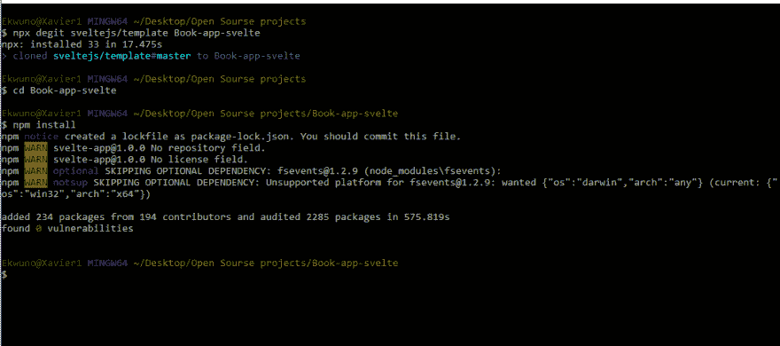

# 如何构建一个简单苗条的 JS 应用程序

> 原文：<https://dev.to/bnevilleoneill/how-to-build-a-simple-svelte-js-app-2090>

**作者:[奥比纳](https://blog.logrocket.com/author/obinnaekwuno/)埃克乌诺** ✏️

在 JavaScript 的世界里，每天都有新的框架出现，这些进步背后的想法几乎总是相同的，但有一些非常重要的改进。现代基于组件的框架包括 [ReactJS](https://reactjs.org) 、 [VueJS](https://vuejs.org) 、 [EmberJS](https://emberjs.com) 、 [Angular](https://angularjs.org) 等等。

在本文中，我们将关注这些新框架中的一个，称为 [SvelteJS](https://svelte.dev/) 。它建立在 HTML、CSS 和 JavaScript 基础知识的基础上，提供了一种独特且易于理解的方法来构建 web 平台。

Svelte 作为一个中间地带，是一种在熟悉现代概念的同时开始学习基础知识的方法，比如组件驱动开发、[作用域 vs 层叠 CSS](https://css-tricks.com/saving-the-day-with-scoped-css/) 、[模板](https://medium.com/@BuildMySite1/javascript-templating-what-is-templating-7ff49d97db6b)、[声明函数](https://blog.hellojs.org/declarative-programming-is-it-a-real-thing-e59fe5e893fd)等。

## 先决条件

在我们进一步讨论之前，本文假设:

*   [Node.js ≥v6](https://nodejs.org/) 安装在您的机器上
*   您的机器上安装了 npm
*   熟悉 HTML、CSS 和 JavaScript
*   对基于组件的框架有一个基本的理解，比如， [ReactJS](https://reactjs.org) 是很好的，但不是必需的

[](https://logrocket.com/signup/)

## 瘦框架和基于组件的框架的区别

Svelte 对于那些刚接触编码的人来说更容易理解，它避免了迷失在热重载和组件的世界中，因为它允许 DOM 类型操作的应用。Svelte 将所有生成的文件编译成一个文件(bundle.js)。Svelte 是一个框架，这意味着它不与虚拟 DOM 一起工作，而是编写代码，当应用程序的状态改变时，以外科手术的方式更新 DOM。

## 用 Svelte 搭建书店 app

### 入门

有几种方法可以让你苗条起来并开始一个项目。你可以在这里阅读更多关于如何开始的方法[。出于本文的目的，我们将使用软件搭建工具](https://svelte.dev/blog/the-easiest-way-to-get-started) [degit](https://github.com/Rich-Harris/degit) 。首先，运行以下命令:

*   npx degit sveltejs/template {项目名称}:在这种情况下，我称它为 Book-app-svelte

```
npx degit sveltejs/template Book-app-svelte 
```

Enter fullscreen mode Exit fullscreen mode

*   Cd 到项目目录
*   运行 npm 安装
*   通过运行`npm run dev`运行应用程序

[](https://res.cloudinary.com/practicaldev/image/fetch/s--0y31OZBm--/c_limit%2Cf_auto%2Cfl_progressive%2Cq_auto%2Cw_880/https://blog.logrocket.com/wp-content/uploads/2019/09/svelteinstall-nocdn.png)

设置完成后，在`main.js`中，我们应该会看到一个渲染到`app.svelte`中的“hello world”——这将是一个很好的时机来注意到 Svelte 中的组件是用`.svelte`扩展名保存的。

```
import App from './App.svelte';
const app = new App({
    target: document.body,
    props: {
        name: 'world'
    }
});
export default app; 
```

Enter fullscreen mode Exit fullscreen mode

上面的代码显示了一个简单的设置，其中 app 组件接受一个名称属性，并以 HTML 文件中的一个位置为目标。

在`app.svelte`中，我们可以看到某种 VueJS 格式:

```
<script>
    export let name;
</script>
<style>
    h1 {
        color: purple;
    }
</style>
<h1>Hello {name}!</h1> 
```

Enter fullscreen mode Exit fullscreen mode

这就是通过导出名称变量来处理`main.js`的地方，以允许从外部操纵它。

## 创建动态图书组件

在创建我们的组件时，有一些关于苗条身材的事情值得注意:

*   样式的作用域在组件中——所以一个组件中的`h1`样式不会影响另一个组件中的样式
*   我们可以定义动态连接的函数

在这一节中，我们将着眼于用 Svelte 创建一个动态事件，并将`book.svelte`组件与`app.svelte`和 passing props 链接起来。

第一步是设置 book 组件并导出变量，这些变量可以从`app.svelte` :
中的父标签设置

```
<script>
    export let bookTitle;
    export let bookPages;
    export let bookDescription;
</script>
<style>
    div{
        margin: 1rem;
        box-shadow: 0 2px 8px rgba(0, 0, 0, 0.26)
    }
    h1{
        font-size: 1.25rem;
        margin: 0.25rem 0;
    }
    h2{
        font-size: 1rem;
        margin: 0.25rem 0;
        color: aqua;
    }
    p{
        margin: 0.25rem 0;
    }
    button{
        font : larger;
        padding: 0.15rem 0.5rem;
        background-color: #1b1a1a;
        border: 1px solid  aliceblue ;
        cursor: pointer;
        color: white;
    }
</style>

<div>
    <h1> {bookTitle} </h1>
    <h2> {bookPages}</h2>
    <p> {bookDescription}</p>
    <button> Add </button>
</div> 
```

Enter fullscreen mode Exit fullscreen mode

从上面的代码块中，我们可以看到变量被动态传递给了`div`中的标签。它们的值来自于`app.svelte`,我们接下来会看到，这里是大多数动态操作发生的地方。

在`app.svelte`中，我们已经导入了 book 组件，这是我们将进行大量动态操作的地方。

```
<script>
    import Book from './book.svelte'
    let title = '';
    let pages = 0;
    let description = '';
    function setTitle(event){
        title = event.target.value;
    }
</script>
<style>
    h1 {
        color: purple;

    }
    section{
        margin: auto;
        width :30rem;

    }
    label,input,textarea{width: 100%}
</style>
<section>
    <div> 
        <label for="title">Title</label>
        <input type="text" id="title" value={title} on:input={setTitle}/>
    </div>
    <div>
        <label for="pages"> pages</label>
        <input type="number" id="price" value={pages} bind:value={pages}/>
    </div>
    <div>
        <label for="description">Description</label>
        <textarea rows="3" id="description" bind:value ={description}/>
    </div>
</section>
<Book bookTitle={title} bookPages={pages} bookDescription={description}/> 
```

Enter fullscreen mode Exit fullscreen mode

从上面的代码示例中，我们可以看到，在我们的脚本标记中，我们还将变量设置为空" "。这些是自动更新的值，我们还可以注意到一个函数`setTitle`，这个函数用于设置一个标题，以指向在`on:`中调用它的对象。

请注意，我们调用函数时没有括号，因为我们不想立即执行它。相反，我们试图建立一个引用，以便 Svelte 可以在每次击键时调用该函数。

我们使用`on:`来添加事件监听器。我们可以用这个来监听输入事件，花括号用来显示动态输入。因为我们的函数使用双向绑定，所以我们可以在其他标签上使用它，使用`bind:`绑定 value 属性，然后绑定 price 变量。我们这样做也是为了描述。

最后传递回`Book`标签是我们更新 book 组件中导出的道具的部分。我们通过使用花括号`{}`动态传递标题、页面和描述的值来做到这一点。

## 显示图书信息

现在我们已经在输入值时更新了卡片，下一步是确保我们能够向书店添加书籍。我们要做的第一件事是使我们的按钮成为一个独立的组件，以便能够在其他两个组件中使用它。我们通过创建一个`button.svelte`并将其分别导入到 book 和 app 组件中来实现这一点。

```
<style>
  button{
        font : larger;
        padding: 0.15rem 0.5rem;
        background-color: #1b1a1a;
        border: 1px solid  aliceblue ;
        cursor: pointer;
        color: white;
    }

</style>

<button on:click >
    <slot/>
</button> 
```

Enter fullscreen mode Exit fullscreen mode

您可能会注意到 button 标签中的一个`on:click`属性，它用于在按钮的原始调用中触发事件监听器，以便其他导入能够实际处理 onclick 事件。

例如:`app.svelte`

```
<Button on:click={addBook}>ADD Book</Button> 
```

Enter fullscreen mode Exit fullscreen mode

这涉及到一个`addBook`函数，该函数允许按钮将书籍动态添加到一个数组:

```
let books =[]

function addBook(){
        const newBook = {
            title : title,
            pages : pages,
            description: description
        };
        books = books.concat(newBook)
    } 
```

Enter fullscreen mode Exit fullscreen mode

上面的代码存在于脚本标记中，它的作用是从表单中调用书的所有属性，并将它们连接起来。我们使用了一个`concat`,因为 push 不会改变 book 变量。它只改变数组，但是将`concat`赋值给一个新值，并触发一个变化。

我们现在有一个书籍数组，它使用 Svelte 给我们的特殊标记来有条件地显示:

```
{#if books.length === 0}
    <p>
       Add a new book 
    </p>
    {:else}
    {#each books as book}
        <Book bookTitle={book.title} bookPages={book.pages} bookDescription={book.description}/>
    {/each}
{/if} 
```

Enter fullscreen mode Exit fullscreen mode

它的作用是提示用户添加新书，然后将每个新块显示为一张新卡片:

[](https://res.cloudinary.com/practicaldev/image/fetch/s--hw2ssTKZ--/c_limit%2Cf_auto%2Cfl_progressive%2Cq_auto%2Cw_880/https://blog.logrocket.com/wp-content/uploads/2019/09/bookstoreform-nocdn.png)

并在用户更新后显示卡上的信息:

[](https://res.cloudinary.com/practicaldev/image/fetch/s--e9oTyxhT--/c_limit%2Cf_auto%2Cfl_progressive%2Cq_auto%2Cw_880/https://blog.logrocket.com/wp-content/uploads/2019/09/bookstoreui-nocdn.png)

## 添加图书的价格

为了实现这一点，我们必须制作另一个名为`purchase.svelte`的组件。在脚本标签中，我们想要导出 books 变量，这样它就可以被 book 标签更新，通过在`app.svelte`中将信息作为道具传递。

在`app.svelte`中，我们在脚本中添加了一个空数组来保存购买的书籍。现在，我们如何将书籍添加到这些购买中呢？我们将使用 book 组件中的 buy 按钮，然后将`purchaseBook`函数添加到脚本中，并使用`on:{purchaseBook}`绑定到按钮。

然后，我们从 Svelte 的自定义库中使用创建调度功能。

然后，我们可以通过添加从我们的`purchaseBook`函数发出的`on:buy = {purchaseBook}`事件，将该函数链接到 Book 标签。

```
function purchaseBook(event){
        const selectedTitle= event.detail;
        purchases = purchases.concat({
            ...books.find(book => book.title === selectedTitle )
        });
    } 
```

Enter fullscreen mode Exit fullscreen mode

## 结论

在本文中，我们试图通过创建一个书店演示来理解 Svelte 的基本用法。我希望这篇文章能帮助你理解 SvelteJS 的力量，并向你展示如何创建令人敬畏的应用程序。这里有一个[演示](https://github.com/Ekwuno/Book-app-svelte)的链接。编码快乐！【T2

* * *

**编者按:**看到这个帖子有问题？你可以在这里找到正确的版本。

## Plug: [LogRocket](https://logrocket.com/signup/) ，一款适用于网络应用的 DVR

[](https://res.cloudinary.com/practicaldev/image/fetch/s--6FG5kvEL--/c_limit%2Cf_auto%2Cfl_progressive%2Cq_auto%2Cw_880/https://i2.wp.com/blog.logrocket.com/wp-content/uploads/2017/03/1d0cd-1s_rmyo6nbrasp-xtvbaxfg.png%3Fresize%3D1200%252C677%26ssl%3D1)

[log rocket](https://logrocket.com/signup/)是一个前端日志工具，让你重放问题，就像它们发生在你自己的浏览器中一样。LogRocket 不需要猜测错误发生的原因，也不需要向用户询问截图和日志转储，而是让您重放会话以快速了解哪里出错了。它可以与任何应用程序完美配合，不管是什么框架，并且有插件可以记录来自 Redux、Vuex 和@ngrx/store 的额外上下文。

除了记录 Redux 动作和状态，LogRocket 还记录控制台日志、JavaScript 错误、stacktraces、带有头+体的网络请求/响应、浏览器元数据、自定义日志。它还使用 DOM 来记录页面上的 HTML 和 CSS，甚至为最复杂的单页面应用程序重新创建像素级完美视频。

[免费试用](https://logrocket.com/signup/)。

* * *

帖子[如何构建一个简单苗条的 JS 应用](https://blog.logrocket.com/how-to-build-a-simple-svelte-js-app/)首先出现在[的 LogRocket 博客](https://blog.logrocket.com)上。