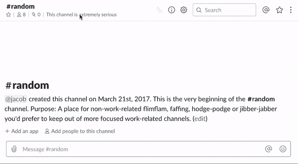
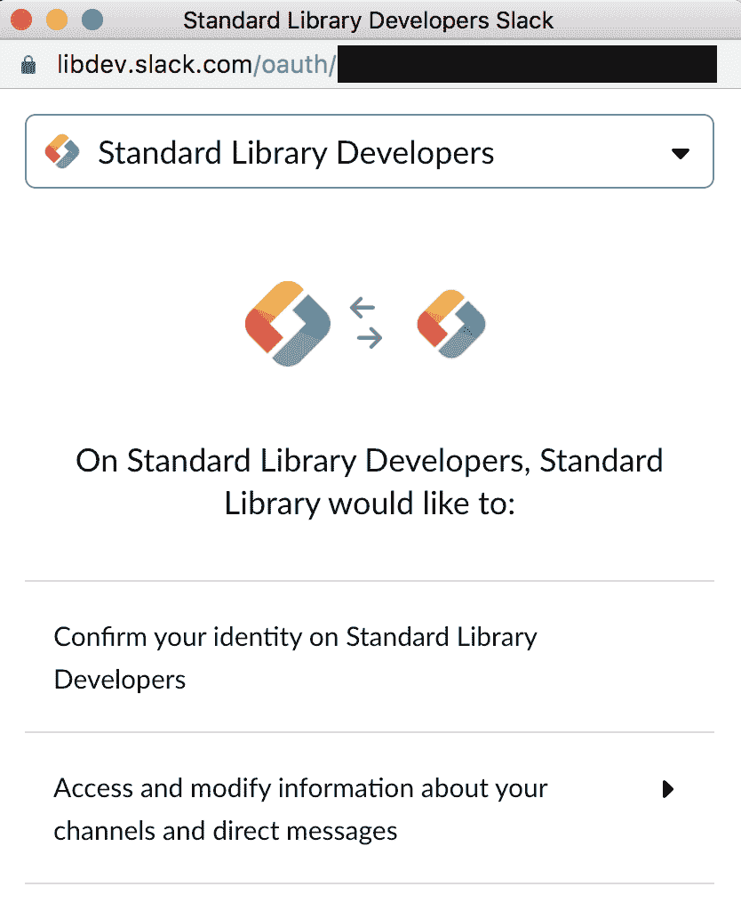
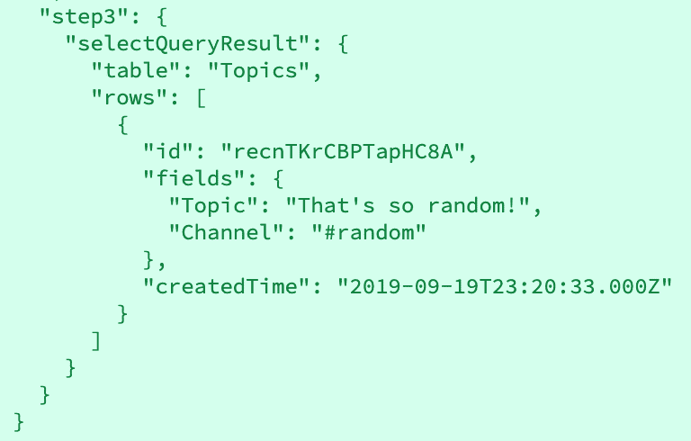
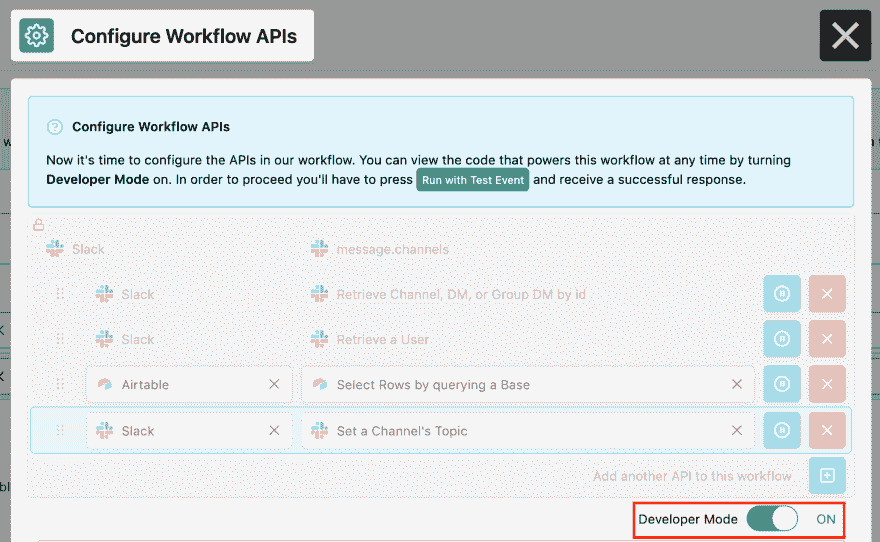

# 如何用 Airtable 和标准库构建一个 Slack App 来保持 Slack 频道主题锁定

> 原文：<https://dev.to/stdlibhq/how-to-build-a-slack-app-to-keep-a-slack-channel-topic-locked-with-airtable-and-standard-library-59pf>

[你有没有想过锁定自己的松弛频道话题？](https://medium.com/@brimm_reaper/how-to-build-a-slack-app-to-keep-a-slack-channel-topic-locked-with-airtable-and-standard-library-dddea4b9ca03)我们的一位朋友本·托塞尔最近在推特上提出了这个问题:

> 本托塞尔[@本托塞尔](https://dev.to/bentossell)那么如何阻止会员在 [@SlackHQ](https://twitter.com/SlackHQ) 上更改频道话题呢？
> 
> [get.slack.help/hc/en-gb/artic…](https://t.co/WYYpWiOVUR)似乎任何人都可以改变它...😬2019 年 9 月 18 日上午 07:1502

确实是个好问题。

如果你正在读这篇文章，那么很可能你在工作的时候会利用 [Slack](https://slack.com/) 进行内部交流。您可能还知道，松散的渠道主题可以为给定渠道中的用户互动方式定下基调。它们不断提醒着我们，一个频道是严肃的商业频道，是为胡闹保留的，或者介于两者之间。虽然它们不可否认地重要，但它们也是极其脆弱的，受制于组成该频道的大众的意志。在任何时候，你的话题都可能被频道的任何成员所取代，不管你愿不愿意，你都无力阻止。也就是说，直到现在。

 总有一个。

今天我们将看看如何通过在[标准库](https://stdlib.com/)上部署一个 Slack 机器人来重新控制 Slack 频道主题，该机器人使用 [Airtable](https://www.airtable.com/) 将频道主题锁定到一个存储值。所以让我们开始吧！

对于那些只想部署一个已完成项目的人来说，可以浏览这个 [Github repo](https://github.com/stdlib-examples/project-slack-topic-bot) 。您仍然需要设置 Airtable 并拥有一个标准的 Library 帐户，但是您不需要进行其他设置。

## 你事先需要什么

1x 航空表账户—[https://www.airtable.com](https://www.airtable.com)
1x 备用账户—[https://www.slack.com](https://www.slack.com)T5】1x 标准库账户—[https://www.stdlib.com](https://www.stdlib.com)

## 第一步:设置 Airtable

最重要的是。我们想建立一些方法来保持我们想要的频道主题。虽然 Airtable 看起来像一个电子表格，但它的工作方式很像一个数据库，并且易于使用和设置。通过[点击此处](https://www.airtable.com/)获得一个免费账户，然后点击[将我们的模板](https://airtable.com/addBaseFromShare/shruHRGfYKFcyU4U4)添加到您的工作区。您应该得到类似这样的结果，只是您的代码只有一行:

 高亮显示:表名

您可以在这里随意添加任意数量的频道！对于本教程，我建议将#random channel 和您选择的主题添加到基础中(这将在我们稍后的测试活动中使用)。请注意，您*必须*在第一列的所有频道名称前包含 *#* ，并且**主题限于 250 个字符。**您现在可以开始设置您的工作流程了。

# 第二步:设置您的工作流& Link Airtable

前往[构建标准库](https://build.stdlib.com/)并开始设置您的项目。为您的项目选择以下选项:

**事件:**

松弛时间→消息.通道

**动作:**

Airtable →通过查询基数选择行

松弛→设置频道主题

它应该是这样的:

 你已经准备好**创建工作流了！**

您看到的下一个屏幕将要求您链接 Airtable 和 Slack 资源。在上一步中，我们已经设置了一个 Airtable 帐户，所以让我们从这里开始。点击 Airtable 旁边的蓝色**链接资源**按钮。在下面的对话框页面中，点击**链接新资源**来选择您的新表。如果您以前使用过 Airtable 和标准库，请点击**完成**链接您以前的帐户。如果您是 Airtable 的新手，您会看到一个不同的对话框，要求您**输入您的帐户名称**(我推荐您的帐户电子邮件)并**从您的帐户页面**(在此处找到)检索 API 密钥。屏幕应该是这样的:

 点击完成继续！

点击**完成**，在下一个屏幕上找到并选择我们之前创建的基地**频道话题**，在这里也点击**完成**。Airtable 到此为止。让我们继续松弛！

# 第三步:设置你的 Slack 机器人

首先，单击可宽延时间旁边的**链接资源**按钮。如果您已经在想要的工作区中设置了一个 bot，那么在第一个对话框中找到并选择它。就是这样！你已经准备好进入下一步了。如果您当前没有在期望的工作空间中设置 bot，那么请继续本节中的内容。
一旦您点击**链接新资源，**您将到达我们新的松弛工作区链接流程。您的屏幕应该是这样的:

 选择安装标准库 App 继续。

选择 Standard Library Bot 选项，一个弹出窗口会要求您将 Standard Library 安装到 Slack 工作空间中。

 松弛工作区 OAuth 页面。

在接下来的页面中，您可以选择定制您的机器人。在这里，您可以尽情发挥自己的创造力，但请记住，如果您选择为您的机器人添加额外的功能，您频道中的其他用户可能会看到您的机器人的名称和缩略图。

 我们的话题机器人。

点击**完成**，你应该会看到一个绿色的圆圈，在你的两个资源下面有一条消息**身份生成**。如果是，点击对话框底部的蓝色**下一个**，进入第 4 步。

# 第四步:设置你的工作流程

对于这一步，我们将使用 Build on Standard Library 的直观接口来生成 Node.js 代码，这些代码将驱动我们的 bot 的功能。第一项工作是设置我们的 Airtable 查询。填写以下详细信息:

表格→主题

其中→频道→等于→ #${result.step1.channel.name}

我们现在可以试运行一下。点击我们工作流程中**设置频道话题**行旁边的**暂停**按钮，如下图所示，点击绿色**带测试事件运行**按钮:

 在 Airtable 中查找我们的频道。

向下滚动到测试结果的最底部，找到包含**“步骤 3”的部分。**应该是这样的:

 你的话题可能会有所不同。

如果你看到这个，那么我们准备好进入下一步了！取消暂停我们之前暂停的行，并单击工作流中 Set a **Channel 的 Topic** 步骤旁边的六个点。按如下方式填写两个字段:

channel→$ { result . step 3 . selectqueryresult . rows[0]. fields . channel }

topic→$ { result . step 3 . selectqueryresult . rows[0]. fields . topic }

它应该是这样的:

 我们准备换一些话题！

点击**运行测试事件**按钮，观看你的机器人运行！检查您的 Slack workspace 的#random channel，您应该会看到一条消息，通知您该频道的主题已经更改为您在 Airtable 中输入的值。相当整洁！

# 第五步:点睛之笔

就目前的情况而言，我们的机器人将尝试在它接收任何消息的任何通道中改变主题。但是，我们实际上只想在用户更改我们正在监控的频道中的频道主题时执行此操作，而不是每当会计部的 Janice 要求每个人提交他们的费用报告时。为此，点击工作流程下的**开发者模式**按钮，查看我们已经生成的代码的幕后情况。
 开发者模式:开。

这里，您需要用下面的代码片段替换所有的代码，以确保一切顺利运行。

这看起来很多，所以让我们仔细看看我们正在做什么。

-我们正在设置一些条件逻辑来告诉我们的项目，如果收到的消息不是频道主题已更改的警报，则在我们的日志中返回一条消息(“状态未更改”))

-如果消息是状态已经改变的警告，那么我们执行我们所写的查询，并且在更新通道主题之前执行一个更多的条件检查

-我们的条件检查查看频道是否是我们的 Airtable 库的一部分，然后验证主题长度。如果该通道正在被监控，并且主题有效，那么我们使用存储在 Airtable 中的值为相应的通道执行设置主题操作

如果您现在用测试事件运行**，项目应该简单地返回一条消息，通知您状态没有改变。**

 你应该会看到一条“状态未改变”的消息。

您还会注意到，您在#random Slack 频道中没有收到任何关于主题更改的消息。这意味着我们的检查工作正常。点击蓝色的**下一个**按钮，给你的应用取一个名字，然后点击**好的，发货！**这就是你要做的一切！请随意测试。巡逻愉快，话题机器人！

Kevin Brimmerman 是标准图书馆的一名软件工程师。工作之余，他是一名狂热的跑步爱好者，也是一名铁杆芝加哥体育迷。小熊队加油。*