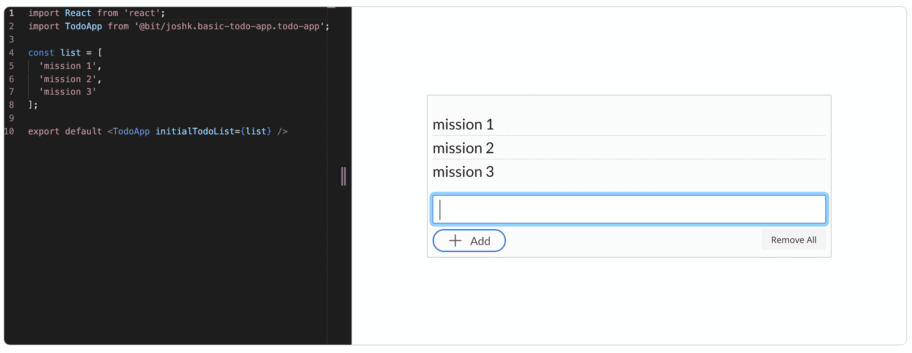

# 如何用 React 和 Bit 组件构建超级模块化的 Todo App

> 原文：<https://dev.to/joshk2/how-to-build-a-super-modular-todo-app-with-react-and-bit-components-18j9>

如何用来自 5 个不同库的可重用组件组成一个高度模块化的 React 应用程序。

[ ](https://res.cloudinary.com/practicaldev/image/fetch/s--GOeXeUN9--/c_limit%2Cf_auto%2Cfl_progressive%2Cq_auto%2Cw_880/https://cdn-images-1.medium.com/max/2594/1%2A4XJPGFQtX3EmP0ZZBG1w7Q.png) *最终待办事宜带位作文*

模块化编程从 60 年代就已经出现了，这个术语本身是由拉里·康斯坦丁于 1968 年提出的，并一直延续至今。

今天，在像 [React](https://github.com/facebook/react) 这样的基于组件的库的技术世界里，有了像 [Bit](https://github.com/teambit/bit) 这样的工具，应用模块化可以被带到一个全新的水平。

我们将使用来自 5 个流行库的可重用组件，如 [Material-UI](https://bit.dev/mui-org/material-ui) 、 [Grommet](https://bit.dev/grommet/grommet) 和 [Semantic-UI](https://bit.dev/semantic-org/semantic-ui-react) ，来构建一个简单的 React Todo 应用程序。多亏了 Bit，我们可以快速地将这些组件隔离并组合成一个应用程序。

完成后，我们不仅将由可重用组件组成一个高度模块化的应用程序，而且我们将拥有一个组件集合，我们可以重用它来构建更多的应用程序。整个应用程序作为可重用组件共享，可以扩展并与其他组件组合以构建更大的应用程序。

这非常令人兴奋，因为这是一个完整的模块化应用程序组合的现场实现，具有类似乐高的体验。

这是待办事项应用程序的结果:

[](https://res.cloudinary.com/practicaldev/image/fetch/s--3OX_QzJR--/c_limit%2Cf_auto%2Cfl_progressive%2Cq_auto%2Cw_880/https://cdn-images-1.medium.com/max/2036/1%2AcAylrEutkQWspFHEuR8ewg.png)

这是这个应用的 GitHub 回购:

##  [乔什科 2 ](https://github.com/JoshK2) / [基础-待办事项-应用-使用-位](https://github.com/JoshK2/basic-todo-app-using-bit)

### 一个高度模块化的 React todo 应用程序，由来自 5 个不同集合的可重用组件组成。成熟的软件模块化。

<article class="markdown-body entry-content container-lg" itemprop="text">

# 由可重用的位组件 [](https://bit.dev/joshk/basic-todo-app) 构建的高度模块化的 React Todo 应用程序

一个基本的 React todo 应用程序由来自 5 个不同的流行 React UI 库的[位](https://bit.dev)组件组成，包括[索环](https://github.com/grommet/grommet)、[语义 UI React](https://github.com/Semantic-Org/Semantic-UI-React) 、 [Primereact](https://github.com/primefaces/primereact) 和 [Lodash](https://github.com/lodash/lodash) 。

用于构建这个应用的所有可重用组件都在这个集合中可用最终的 todo 应用也是作为可重用位组件可用的[，它可以扩展并与其他组件组合以构建更大的应用。](https://bit.dev/joshk/basic-todo-app/todo-app)

[](https://bit.dev/joshk/basic-todo-app)

## 动机

用 React 和 Bit 展示组件时代的软件模块化。

## 辅导的

请参阅完整教程——用可重用组件构建您自己的模块化应用程序。

**[用 React 和 Bit 组件](https://blog.bitsrc.io/build-a-super-modular-todo-app-with-react-and-bit-components-aa06bbac4084)** 搭建超级模块化的 Todo App。

## 我使用了哪些组件？

### 语义 UI 反应

[语义-界面-反应列表组件](https://bit.dev/semantic-org/semantic-ui-react/list)
[语义-界面-反应图标组件](https://bit.dev/semantic-org/semantic-ui-react/icon)
[语义-界面-反应 css 链接组件](https://bit.dev/semantic-org/semantic-ui-react/internal/style-links)

### premiereact

[primereact inputtextarea 组件](https://bit.dev/primefaces/primereact/inputtextarea)
[primereact 按钮组件](https://bit.dev/primefaces/primereact/button)
[primereact css 链接组件](https://bit.dev/primefaces/primereact/internal/stylelinks)

### 索环

[索环按钮组件](https://bit.dev/grommet/grommet/button)

### 索环图标

[索环图标增加](https://bit.dev/grommet/grommet-icons/add) …

</article>

[View on GitHub](https://github.com/JoshK2/basic-todo-app-using-bit)

## 3 个组件

为了创建应用程序，我决定将应用程序的代码分为 3 个部分:

1.  [TodoItem 组件](https://bit.dev/joshk/basic-todo-app/todo-item)，带移除选项的文本。

2.  [AddItem 组件](https://bit.dev/joshk/basic-todo-app/add-item)，用 add 按钮输入文本区，用 remove all 按钮。

3.  TodoApp 组件，这是应用程序的主要代码，包括 TodoItem 和 AddItem，因此将有一个简单的代码列表来管理所有组件选项，如删除、全部删除和添加。

组件 1+2 由从不同库中隔离和共享的组件模块化组成——使用[位](https://github.com/teambit/bit)帮助我们隔离、共享和管理可重用组件，以构建模块化应用程序。

## 验证

该组件接收一个简单的文本和 id，用于从主列表中删除正确的 todo 项作为道具，并使用来自 [semantic-ui-react](https://bit.dev/semantic-org/semantic-ui-react) 组件集合的 [remove 图标](https://bit.dev/semantic-org/semantic-ui-react/icon?example=5c920bc8c634f0001a931747)。

要安装该组件，首先将 [bit.dev](https://bit.dev) 配置为一个作用域注册表(一次性操作),然后使用 Yarn 安装该组件:

```
npm config set '@bit:registry' [https://node.bit.dev](https://node.bit.dev)

yarn add @bit/semantic-org.semantic-ui-react.icon 
```

这是组件的代码，添加了一些帮助代码来显示 remove 图标，并在单击 remove 时将 remove 作为一个事件发送到主组件。