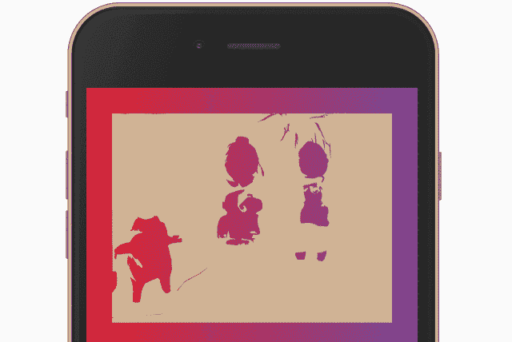
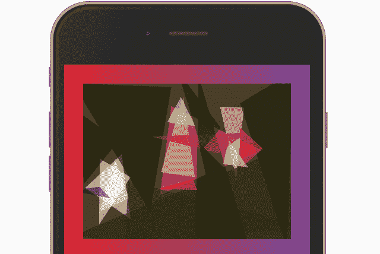
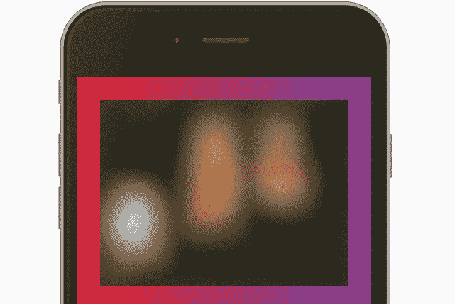

# 如何用 LQIP 创建一个很棒的图像预览

> 原文：<https://dev.to/dsheiko/how-to-create-a-kick-ass-image-preview-with-lqip-3e6a>

HTML 中的图片，还有比这更简单的吗？然而，当你在一个页面上有很多这样的图标时，它们不会立即出现。这取决于缓存策略和带宽，但如果你不特别小心，它可能看起来很难看。基本上，我们需要在加载图像时用适当的东西填充插槽。换句话说，我们需要占位符。这里最突出的技术可能是 LQIP ( [低质量图像占位符](https://www.guypo.com/introducing-lqip-low-quality-image-placeholders))。它被谷歌、脸书、Pinterest、Medium 和其他公司采用。这个想法是加载页面最初与低质量的图像，一旦页面完全加载替换为高质量的图像。作为占位符，可以使用嵌入的透明 SVG，旋转动画图像，纯色，模糊和缩小的原始图像。但更重要的是，有了现代工具，我们可以做一些真正新奇的事情。例如，我们可以使用图像形状或轮廓作为占位符。此外，我们可以在构建过程中根据 IMG 标签生成具有预期效果的数据 URL 和地址。

## 基础知识

让我们一步一步地到达那里。首先我们回到基础。HTML IMG 标签在过去的 30 年里没有太大的变化:

```
  
```

然而，我们现在有了`srcset`属性来处理响应式网页设计:

```
  
```

这里我们列出了每种显示密度(1x，2x)的图像源。因此，浏览器将在 Retina 设备上加载双倍大小的版本(test-2x.jpg)。或者我们可以更具体一点:

```
  
```

现在，我们指定图像源宽度(320 瓦、480 瓦、800 瓦),浏览器将使用该信息选择最合适的源。注意，我们仍然使用`src`属性来指定回退源，这将被遗留浏览器使用。

现在，说重点。我们能做些什么来美化图像加载？最简单的事情是添加一个动画旋转器作为图像槽的背景。因此，当图像加载时，我们可以看到动画。加载完成后，我们看到图像覆盖了背景。

但是如果一些图像加载失败怎么办？不同的浏览器呈现“破碎”图像的方式不同，但同样糟糕。要解决这个问题，你可以用 CSS 来定位其中的一些。然而，我认为最通用的方法是使用 JavaScript:

```
 Array.from( document.querySelectorAll( "img:not(.is-processed)" ) ).forEach( img => {
        img.classList.add( "is-processed" );
        img.addEventListener( "error", () => {      
          img.style.opacity = 0;
        }, false );
      }); 
```

## 懒散

或者，我们可以使用加载程序库[lazy zes](https://github.com/aFarkas/lazysizes)来实现更好的感知性能。它开启了新的选择。例如，我们可以实现像这样的空图像占位符:

```
  
```

因此，浏览器将显示嵌入的占位符(透明或低质量图像)，直到它从`data-srcset`加载对应于视窗的图像。

Lazysizes 将`lazyloaded` CSS 类添加到`load`事件的图像元素中，我们可以用它来实现模糊占位符:

```
 <style>
        .blur-up {
            -webkit-filter: blur(5px);
            filter: blur(5px);
            transition: filter 400ms, -webkit-filter 400ms;
        }

        .blur-up.lazyloaded {
            -webkit-filter: blur(0);
            filter: blur(0);
        }
    </style>
     
```

因此，低质量的图像(test-lqip.jpg)将被模糊，直到原始图像(test.jpg)加载。

在文章[如何使用 SVG 作为占位符和其他图像加载技术](https://www.freecodecamp.org/news/using-svg-as-placeholders-more-image-loading-techniques-bed1b810ab2c/)中，您可以找到基于形状和轮廓的 LQIP 技术的见解。为什么不付诸实践呢？因此，我们必须生成一个低质量的图像，确切地说，是一个带有 SVGO 的数据 URL，并在 IMG 标签的`src`或`srcset`属性中指定它，而高质量的图像源我们在`data-srcset`中设置，就像我们上面检查的那样。实现这一目标最便捷的方式是使用 [Webpack](https://webpack.js.org/) 。该工具在构建过程中转换导入的图像。因此我们可以在应用程序代码中直接引用结果(例如生成的 SVGO)。让我们在实践中看看。

首先，我们安装依赖项:

```
 npm i -S lazysizes react react-dom 
```

如你所见，我们将使用 Lazysizes 库和 React.js。

现在轮到安装开发者依赖项了。我们从巴别塔包开始:

```
 npm i -D @babel/cli @babel/core @babel/node @babel/preset-env @babel/preset-react babel-loader 
```

然后去 Webpack one:

```
 npm i -D webpack webpack-cli clean-webpack-plugin   file-loader image-webpack-loader 
```

[文件加载器](https://github.com/webpack-contrib/file-loader)插件使 Webpack 解析导入的图像， [image-webpack-loader](https://github.com/tcoopman/image-webpack-loader) 优化导入

由于我们有依赖关系，我们可以为 React.js/Babel 应用程序创建[基本 webpack 配置](https://github.com/dsheiko/boilerplate/blob/master/webpack-sqip/webpack.base.js)。我们放入`src/img`test-1x.jpg 和双倍大小的 test-2x.jpg 演示图像，并放入`src/index.jsx`参赛脚本:

```
 import React from "react";
    import { render } from "react-dom";
    import Image from "./component/Image";
    import "lazysizes";    
    import productImg1x from "./img/test-1x.jpg";
    import productImg2x from "./img/test-2x.jpg";

    render(
      <Image
          placeholder={ productImg1x }
          srcSet={[ productImg1x, productImg2x ]}
          alt="A farm"
          ></Image>,
      document.getElementById( "app" )
    ); 
```

在这里，我们加载 lazysizes 库，导入两个图像并将其传递给图像组件。HTML 文件可能看起来像

```
 <div id="app"></div>
    <script src="build/index.js"></script> 
```

## 剪影

我们可以用[图像跟踪加载器](https://github.com/EmilTholin/image-trace-loader)生成轮廓占位符。该插件提取图像轮廓，并将其作为 SVGO 返回。

我们必须用以下内容扩展我们的 Webpack 配置:

```
module: {
  rules: [
    {
      test: /\.(gif|png|jpe?g)$/i,
      use: [
        {
          loader: "image-trace-loader"
        },
        {
          loader: "file-loader",
          options: {
            name: "src-[name].[ext]"
          }
        },
        {
          loader: "image-webpack-loader",
          options: {
            bypassOnDebug: true, // webpack@1.x
            disable: true // webpack@2.x and newer
          }
        }
      ]
    }
  }
] 
```

现在在代码中我们可以接收导入的图像:

```
 import { src, trace } from './image.png'; 
```

其中跟踪生成 SVGO 数据 URL 和 src 全质量图像。它为我们提供了以下图像组件:

[src/component/image . jsx](https://github.com/dsheiko/boilerplate/blob/master/webpack-sqip/src/component/Image.jsx)

```
 import React from "react";

    export default function Image({ placeholder, alt, srcSet }) {
        return  `${ img.src }  ${ inx + 1}x` ).join( ", " ) }
          data-sizes="auto"
          />;
    } 
```

现在我们运行 Webpack 并获得以下加载帧:

[](https://res.cloudinary.com/practicaldev/image/fetch/s--OmUOwYDK--/c_limit%2Cf_auto%2Cfl_progressive%2Cq_66%2Cw_880/http://dsheiko.com/download/000000293/silhouette.gif)

## 形状

Sqip-loader 将给定的图片分割成任意数量的图元形状，如三角形、矩形、椭圆形、圆形、多边形等。

对于 Webpack 配置中基于形状的占位符，加载器规则可能如下:

```
{
  loader: "sqip-loader",
  options: {
    numberOfPrimitives: 20,
    mode: 1,
    blur: 0
  }
} 
```

这里我们需要 20 个基于三角形的形状，没有模糊。这使得图像导入在如下代码中可用:

```
 import { src, preview } from './image.png'; 
```

其中预览是产生 SVGO 数据网址和 src 的全质量图像。所以我们要修改 [src/component/Image.jsx](https://github.com/dsheiko/boilerplate/blob/master/webpack-sqip/src/component/Image.jsx) 。我们用{ placeholder.preview }代替{ placeholder.trace }。

好吧，让我们运行 Webpack 并在浏览器中检查页面:

[](https://res.cloudinary.com/practicaldev/image/fetch/s--HpfkBpfa--/c_limit%2Cf_auto%2Cfl_progressive%2Cq_66%2Cw_880/http://dsheiko.com/download/000000293/shapes.gif)

## 模糊起来

这种技术通常被称为 SQIP。当图像加载时，我们看到一个模糊的低质量占位符，类似于它在[介质](https://medium.com/@jmperezperez/how-medium-does-progressive-image-loading-fd1e4dc1ee3d)上的工作方式。占位符也可以由 [Sqip-loader](https://github.com/EmilTholin/sqip-loader) 生成。然而这一次我们将设置模糊:

```
{
  loader: "sqip-loader",
  options: {
    numberOfPrimitives: 20,
    mode: 1,
    blur: 30
  }
} 
```

结果看起来是这样的:

[](https://res.cloudinary.com/practicaldev/image/fetch/s--dC8zP8co--/c_limit%2Cf_auto%2Cfl_progressive%2Cq_66%2Cw_880/http://dsheiko.com/download/000000293/blurup.gif)

## 重述

我们复习了`src`和`srcset`图像属性。我们学会了如何将它们与它们的数据副本一起使用，并利用 LQIP 技术来简化库。我们设置了 Webpack 和一个简单的 React.js 示例来处理三种 SQIP 方法:剪影、形状和模糊。

该示例的完整源代码可在此处找到:

*   [https://github . com/dsheiko/boilerplate/blob/master/web pack-sqip/](https://github.com/dsheiko/boilerplate/blob/master/webpack-sqip/)