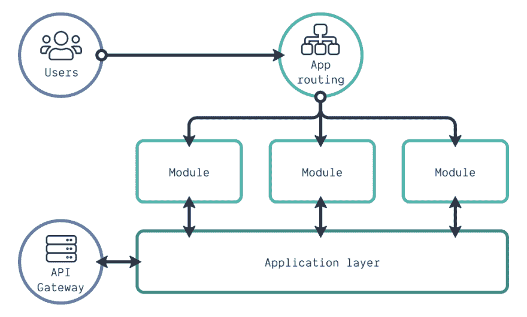
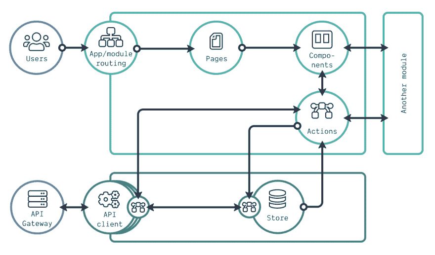

# 如何创建可扩展和可维护的前端架构

> 原文：<https://dev.to/kevtiq/how-to-create-a-scalable-and-maintainable-front-end-architecture-4f47>

现代前端框架和库使得创建[可重用 UI 组件](https://dev.to/kevtiq/interfacing-your-ui-components-5c52)变得容易。这是朝着创建可维护的前端应用程序的良好方向迈出的一步。然而，在过去几年的许多项目中，我发现制造可重用的组件通常是不够的。随着需求的变化或者新需求的出现，我的项目变得不可维护。找到正确的文件或调试许多文件需要越来越长的时间。

变革需要发生。我可以提高我的搜索技能，或者更熟练地使用 Visual Studio 代码。但是，我经常不是唯一一个在前端工作的人。所以，我们需要我们的前端项目的设置。我们需要使它们具有可维护性和可伸缩性。这意味着我们可以在当前功能中应用更改，还可以更快地添加新功能。

## 高层建筑

在后端开发中，我们有许多[架构模式](https://en.wikipedia.org/wiki/Software_design_pattern)可以遵循。目前使用的两个概念是[领域驱动开发(DDD)](https://martinfowler.com/bliki/BoundedContext.html) 和[关注点分离(SoC)](https://en.wikipedia.org/wiki/Separation_of_concerns) 。这两个概念为前端开发增加了巨大的价值。在 DDD，你试图将相似的特性分组，并尽可能地将它们从其他组中分离出来(例如模块)。而对于 SoC，我们，例如，分离逻辑、视图和数据模型(例如，使用 MVC 或 MVVM 设计模式)。

我们希望现代前端应用能够承担越来越多的繁重工作。随着复杂性的增加，bug 变得越来越频繁。因为用户与前端交互，我们需要一个可靠的架构，既可维护又可扩展。我在这方面的首选架构是模块化和领域驱动的。请注意，我的观点可能会改变，但这是我目前的首选方法。

[](https://res.cloudinary.com/practicaldev/image/fetch/s--2BrGE2nA--/c_limit%2Cf_auto%2Cfl_progressive%2Cq_auto%2Cw_880/https://kevtiq.co/img/high-level-architecture.png)

当用户与我们的应用程序交互时，他或她会被应用程序路由指引到正确的模块。每个模块都是完全包含的。但是，由于用户希望使用一个应用程序，而不是几个小应用程序，所以会存在一些耦合。这种耦合存在于特定的功能或业务逻辑上。我们可以在模块之间共享几个特性。你可以把这个逻辑放到应用层。这意味着每个模块都可以选择与应用层交互。一个很好的例子是需要通过客户端 API 连接到我们的后端或 API 网关的设置。

当查看项目结构时，我们可以遵循如下所示的内容。应用层的所有代码都在`app`目录中。而所有模块都有一个目录在`modules`目录下。不依赖于业务逻辑的可重用 UI 组件(如表格)位于`components`目录中。

```
app/
assets/
components/
lib/
modules/
styles/ 
```

Enter fullscreen mode Exit fullscreen mode

其余的目录保存我们的静态`assets`(例如图像)或`lib`中的帮助函数。助手功能可以非常简单。它们可以将某些东西转换成某种格式，或者帮助处理对象。但是更复杂的代码可以存在于`lib`目录中。使用模式或图形(例如检查有向图中的循环的算法)也不例外。

许多人使用类似于`CSS-in-JS`或[风格化组件](https://www.styled-components.com/)的东西，但是我更喜欢普通的 CSS。为什么？我们可以使用 CSS 和 HTML 而不是 JavaScript 来解决许多 UI 问题。对我来说，当我们应用 SoC 的概念时，这变得更容易做到。此外，在一个地方维护 CSS 使它更容易维护，因为您复制的更少。这需要一个坚实的 CSS 架构。虽然我会在另一篇博文中讨论这个问题，但我的 CSS 架构是基于哈利·罗伯特的 ITCSS 。

## 填写申请明细

有了高层和项目架构，我们开了个好头。但是，我们需要各方面的更多细节来实现这一前端架构。首先，让我们看一个更详细的架构图，如下所示。在此图中，我放大了应用层，也放大了模块。应用层是我们前端应用的核心，先讨论这个。

[](https://res.cloudinary.com/practicaldev/image/fetch/s--vTljSrfp--/c_limit%2Cf_auto%2Cfl_progressive%2Cq_auto%2Cw_880/https://kevtiq.co/img/detailed-architecture.png)

应用层包括两个部分:商店和客户端 API。商店是我们的全局应用程序状态。这种状态保存不同模块同时可访问的数据。即使屏幕上不需要这些数据，它们也会保存在存储区中。正如您所看到的，发送到商店的每个更新请求都会经过一个逻辑链。这就是我们所说的中间件。这是用于例如 [Redux](https://redux.js.org/advanced/middleware) 的模式。中间件的一个简单例子是记录商店的传入请求。

有时，需要使用来自外部服务的数据来增强传入的存储请求。对于 Redux，我们使用一个`Promise`来处理这个调用。这可以是我们的后端服务，但也可以是公共的第三方 API。只使用浏览器`fetch` API 进行单一目的的 REST 调用就足够了。当您希望对不同的调用使用相同的 API 时，创建 API 客户端定义可能是个好主意。

一个基本的 API 客户端处理外部请求、响应和错误。您甚至可以让它为您提供关于请求状态的信息(例如加载)。然而，更复杂的 API 客户端处理的要多得多。一些 API 通过 web 套接字连接，甚至连接到 GraphQL API。在这种情况下，您有更多的配置选项，如下所示。

[](https://res.cloudinary.com/practicaldev/image/fetch/s--F5e1xwb3--/c_limit%2Cf_auto%2Cfl_progressive%2Cq_auto%2Cw_880/https://kevtiq.co/img/api-client.png)

在更复杂的 API 客户端中，我们可以通过中间件改变所有的输出请求(例如，添加认证头)。可以使用软件修改响应(例如改变数据结构)。更改响应后，我们将它存储在客户端的缓存中，就像我们的应用程序商店一样。区别？缓存只处理传入的 API 数据，而我们可以将任何数据放入您的应用程序商店。

许多前端应用程序会有一个专用的后端服务与之对话。无论是一个位于拥有许多微服务的 Kubernetes 集群之上的 API 网关，还是一个单一的后端。但是有时我们需要连接到不同的外部服务。有了这个架构，我们可以创建许多 API 客户端。每个 API 客户端都可以有一个缓存、中间件和中间件。我们应用程序的不同部分应该能够与这些 API 客户端进行交互。

`app`目录对应的项目结构可以是这样的:

```
app/
  api/
config/
  store/
pubsub/
  schemas/
  index.js 
```

Enter fullscreen mode Exit fullscreen mode

现在，`app`中的两个目录听起来应该很熟悉:`api`和`store`。这些包含了所有已经描述过的用例。`config`保存在整个应用程序中使用的静态定义和配置(如常量)。一个`schema`描述了 JavaScript 对象的特定数据结构。这在使用 TypeScript 或 JavaScript 时都可以使用。应用程序的所有通用模式都存储在`schemas`目录中。

`pubsub`是扩展我们前端基本架构的一个很好的例子。我们可以使用`pubsub`进行模块通信或管理预定的任务。因为它对应用程序的核心至关重要，所以它位于`app`目录中。最后，我们有`index.js`文件。在这个文件中，我们可以从`app`目录中添加所有的函数和常量。这意味着这个文件的功能是我们通向应用程序逻辑的入口点。

## 一个模块的架构

描述完我们的应用层后，我们只剩下模块了。详细的架构图已经显示了模块的内部结构。当应用程序路由指向特定模块时，该模块确定路由应该如何继续。模块路由决定了应该显示哪个页面。一个页面包含许多 UI 组件，这就是用户将在屏幕上看到的内容。

这个上下文中的页面与 UI 组件没有什么不同。它是一个很大的 UI 组件。但是，其他模块可以与组件(和动作)交互，但不能与页面交互。不同模块的页面相互交互的唯一方式是嵌套路由。这意味着您将模块路由放在来自不同模块的页面中。

组件通过动作与应用层交互。这些动作可以以不同的形式出现。它们可以是普通的 JavaScript 函数、Redux 相关函数或 React 钩子。有时你有一些特定于模块的小的实用函数。在这种情况下，您可以将它们放在`actions`目录中，或者为一个模块创建一个专用的`utils`目录。项目的模块结构如下所示。

```
users/
  actions/
  components/
config/
    constants.js
    routes.js
    tables.js
    forms.js
  pages/
gql/
  schemas/
  index.js 
```

Enter fullscreen mode Exit fullscreen mode

像应用层一样，我们可以拥有只与我们的模块相关的静态代码(例如常量或模式定义)。在这种情况下，我们将代码放在`config`或`schema`目录中。当使用 GraphQL 时，我们可以有查询和变异定义。这些应该在`gql`目录中(或者有类似目的的目录)。在使用该模块的应用程序商店时，添加一个`interfaces.js`文件。该文件描述了如何访问存储中的数据。

`index.js`充当`app`目录的`index.js`。这里我们描述了其他人可以访问的所有组件、动作和常量。

## 模块通讯

并不是每个模块都需要所有的目录和文件。例如，一些模块不需要页面，因为它们只包含组件和动作。一个很好的例子是“文件”模块。这个模块可以结合组件和动作来查看和上传文件。一个例子是将结果上传到 blob 存储的文件拖放区。这可能是一个可重用的组件。然而，文件的实际上传取决于我们可以使用的服务。通过将 UI 组件和上传文件的实际操作结合起来，我们创建了一个小的包含模块。当我们将组件与业务逻辑相结合时，我们就将它们转换成了模块。

但是其他模块如何使用文件模块中的组件或动作呢？模块的`index.js`文件描述了其他组件可以访问哪些组件、动作和常量。因此，我们可以使用文件拖放区或文件模块中的上传操作。但是，有时我们必须选择向其他模块公开什么。它是一个动作，还是我们把动作组合成一个组件？

让我们看看用户下拉列表的例子。我们可以创建一个动作，为我们提供可以从不同模块中选择的所有用户。但是，我们现在需要在所有其他模块中创建一个特定的下拉菜单。这可能不需要太多的努力就可以拥有一个通用的下拉组件。但是这个组件可能无法在表单中工作。创建一个我们可以使用的组件可能是值得投资的。当用户周围发生变化时，我们现在只改变一个组件。所以有时候我们需要选择暴露什么:动作还是组件。

[](https://res.cloudinary.com/practicaldev/image/fetch/s--cprnogDv--/c_limit%2Cf_auto%2Cfl_progressive%2Cq_auto%2Cw_880/https://kevtiq.co/img/pubsub.png)

我们可以在组件之间使用的一种高级模式是使用`pubsub`。在这种模式下，共享组件是不可能的，但是我们可以共享数据。上图显示了它是如何工作的。同样，这是一种高级模式，只有当您想走微前端路线，或者当您需要它时，才使用它。

## UI 组件剖析

还缺少最后一个细节层次，那就是 UI 组件的架构。在之前的一篇博客文章中，我已经描述了这一点。当你看这个解剖图时，你会看到一些我们在更大范围内应用的概念。

[](https://res.cloudinary.com/practicaldev/image/fetch/s--eNHK-K7N--/c_limit%2Cf_auto%2Cfl_progressive%2Cq_auto%2Cw_880/https://kevtiq.co/img/ui-component-anatomy.png)

前端是我们用户的第一入口。随着我们的前端项目在功能上的增长，我们也会引入更多的 bug。但是我们的用户希望没有 bug，新功能也能很快出现。这是不可能的。然而，通过使用一个好的架构，我们只能尽可能地做到这一点。

*本文原载于[kevtiq.co](https://crinkle.dev/writing/scalable-front-end-architecture/)T3】*