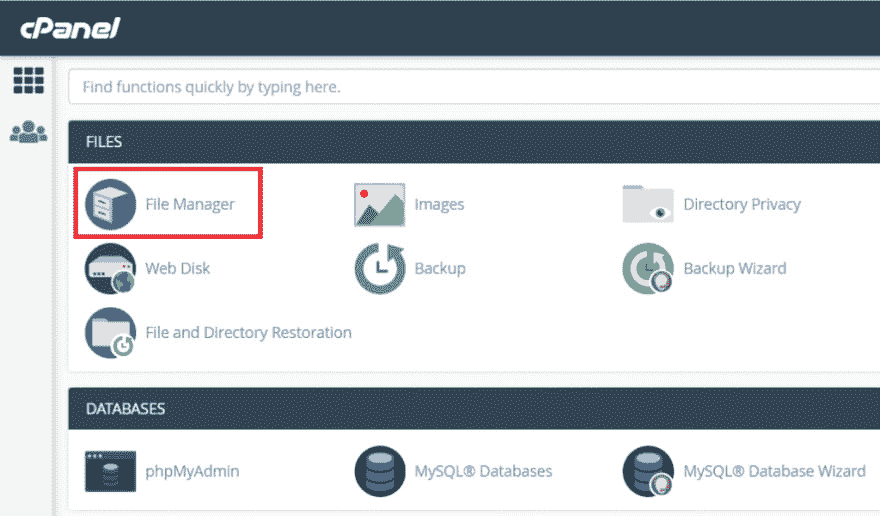
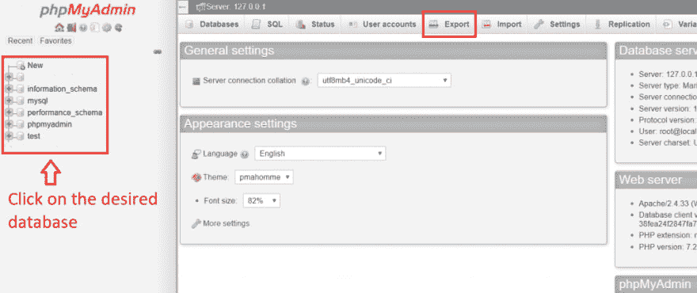
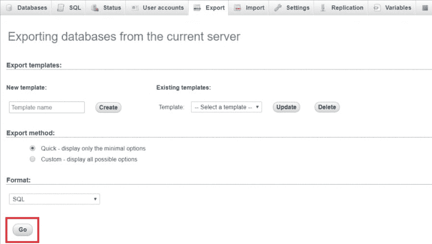
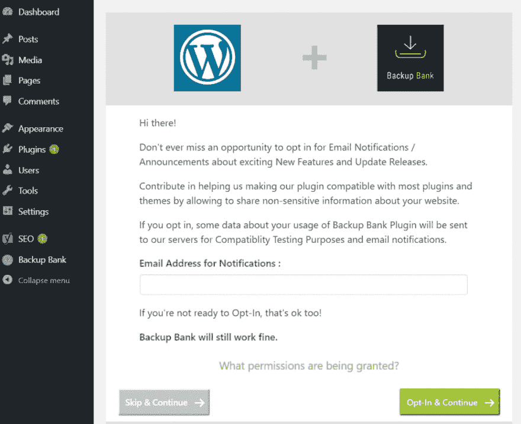
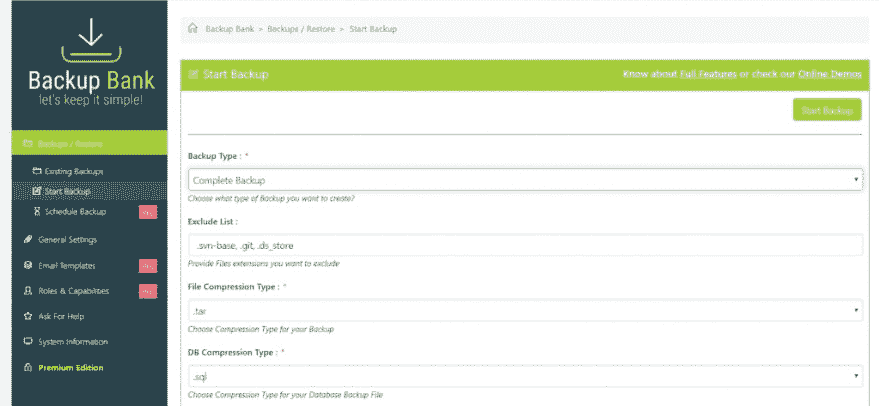
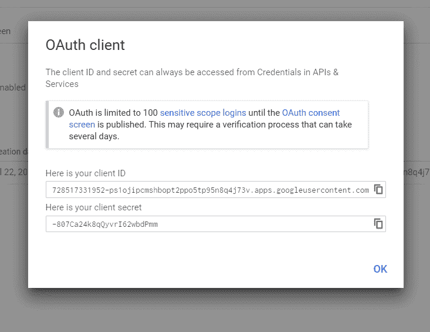
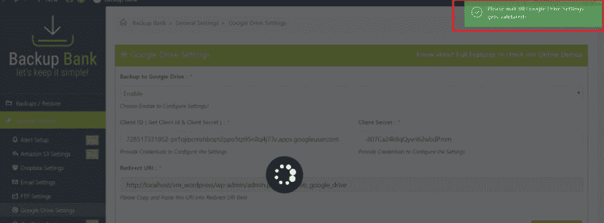
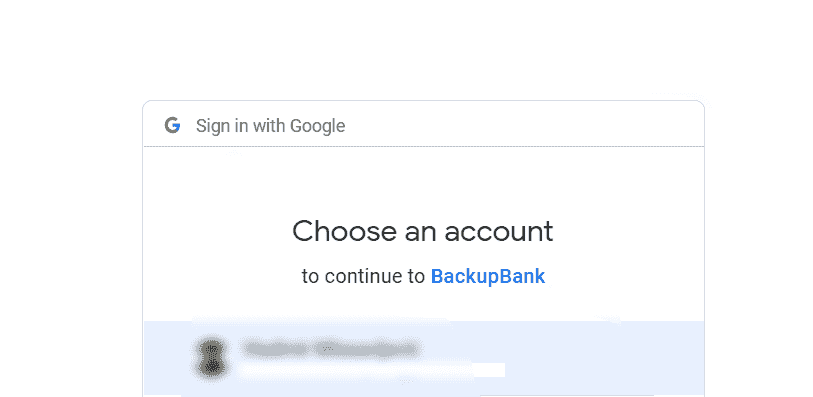
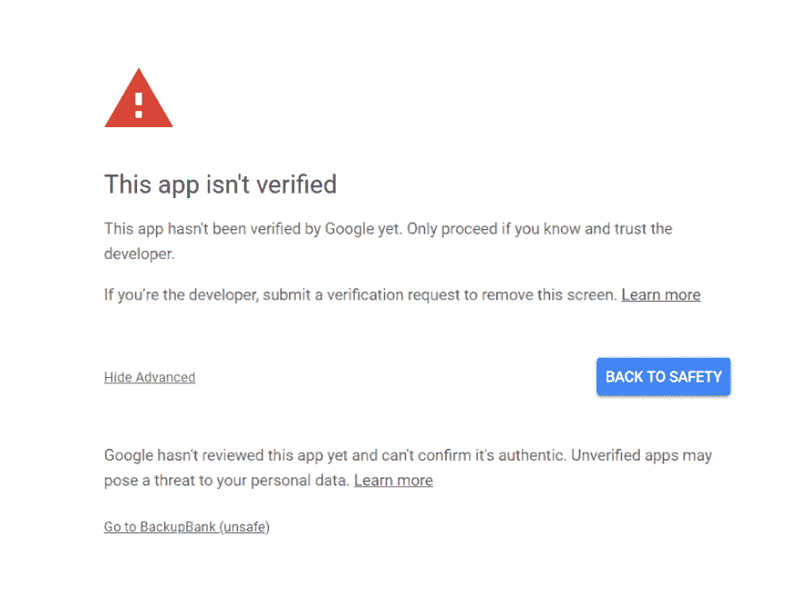

# 如何创建按需和自动的 WordPress 备份

> 原文：<https://dev.to/bitofwp/how-to-create-an-on-demand-and-automatic-wordpress-backup-4hg8>

## 设置防故障 WordPress 备份的初学者指南

下面我们将向您展示如何使用 cPanel 主机控制面板运行**按需 WordPress 备份**，在本指南中，我们将使用 cPanel 内置备份功能和文件管理器手动备份，使用归档选项和 phpMyAdmin 数据库导出选项。我们也将向你展示如何**使用 [WP 备份银行免费和高级功能](https://wordpress.org/plugins/wp-backup-bank/)来自动化你的 WordPress 备份**。

网站所有者最容易忽视的任务之一是确保他们总是有一个最新的备份可用并且易于访问。备份你的 WordPress 站点应该是设置好 WordPress Vanilla 安装后的第一件事。如果你认为这是一个一劳永逸的任务，那么你应该三思而行，因为你必须首先检查备份运行没有任何问题，并且生成的文件实际上已经准备好用于恢复你的 WordPress 站点。如果你使用自动化服务来支持你的 WordPress 站点，那么你也需要经常检查它们是否如预期的那样运行和工作。

### 我真的需要备份我的 WordPress 站点文件和数据库吗？

如果有一个建议的话，我们会给我所有的客户，那就是确保他们已经为他们的 WordPress 站点建立了每日运行备份。如果他们这样做了，那么他们就不必担心由于黑客攻击、主机故障甚至因维护任务出错而停机而丢失网站内容或重要配置。当我们开始[清理 WordPress 被黑网站](https://bitofwp.com/wordpress-malware-removal/)时，我们做的第一件事和最后一件事是创建 WordPress 站点文件和数据库的备份，这样我们确保他们的站点内容得到充分保护和维护。

### 我应该多久运行一次 WordPress 备份？

建议每天备份你的 WordPress 站点文件和数据库。你可以保留一整周或一整月的备份，这完全取决于你想把它们存储在哪里，以及你的网站空间有多大。此外，你应该在升级或维护任务之前创建一个 WordPress 备份。

### 我应该在哪里存储我的 WordPress 备份

你可以把它们存储在本地一个不公开的目录下，但是你也应该考虑一个远程服务，比如 [Dropbox](https://www.dropbox.com) 或者 [Google Drive](https://drive.google.com) 。后一种选择更可取，因为如果你的网站离线或者你的主机提供商禁止你访问你的主机账户，那么你可以使用远程备份来恢复你的 WordPress 网站。这也满足了另一个重要的原则；避免你的 WordPress 站点基础设施中的单点故障(SPOF)。

### 我应该为我的 WordPress 站点运行手动备份还是自动备份？

我们强烈建议设置一个系统，使用 WordPress 插件或其他第三方服务如 [ManageWP](https://managewp.com/features/backup) 自动运行备份。在重大升级或维护任务之前，按需备份也很有用。

## cPanel 中手动备份

任何一个 WordPress 站点都由两部分组成:文件和数据库。

**文件**包含图片、插件、主题、任何其他媒体或上传的脚本、WordPress 核心、配置文件等。

**数据库**包含用户及其凭证、帖子、页面、设置等。(例如，WooCommerce 订单存储在数据库中)。

创建 WordPress 备份时，你需要正确地备份文件和数据库。但是，您不需要备份所有的站点文件。你只需要存档并下载“wp-content”目录，然后导出数据库。以下是如何做的逐步说明。

### 访问文件

登录到您的 cPanel 仪表板，点击“文件管理器”。您将看到不同目录的列表。输入“public_html”目录。你应该会看到以下目录: *wp-admin* 、 *wp-content* 、 *wp-includes* 和一些 WordPress 核心文件(像*wp-config.php*)。

WordPress 核心由以“wp-”开头的目录和文件组成。您不需要创建这些文件的备份。几乎没有任何定制或信息存储在核心文件中，它们从来没有以任何方式被修改过(或者至少不应该被修改)。

### 备份你的 WordPress 核心配置文件

你会在你的 WordPress 安装中看到很多配置文件，以下是最重要的，必须保存在备份中:

**。htaccess**–这是 Apache 服务器配置文件。它可以控制重定向、缓存头和永久链接。如果您在这个文件中有定制，创建一个副本并保存它并不是一个坏主意。

**wp-config.php**–主要的 WordPress 配置文件。它控制 WordPress 文件和数据库之间的连接。

**The。ini 文件**–这些是配置文件，可以控制服务器上的 PHP 设置:内存限制、上传的最大文件大小等。它可以命名为“. user.ini”或“php.ini”(对于较旧的 php 版本，也可以命名为 php5.ini 和 php56.ini)。同样，如果这个文件中有重要的定制内容，请制作一份副本。

### 创建一个“WP-content”WordPress 目录的. zip 存档

接下来，找到“wp-content”目录，右键单击并选择“压缩”。您将看到许多选项，包括将要使用的压缩类型。我建议用。虽然你可以使用其他类型的压缩，如果你对它们感到舒服的话。

从备份中排除一些目录是明智的。例如，您不需要包括“缓存”或任何备份插件目录(如“上升”)。我建议进入“wp-content”目录并创建一个部分备份。你可以选择“插件”、“主题”和“上传”目录并压缩它们。

在某些特殊情况下，您可能希望从“上传”目录中排除一些内容。这个目录用于存储图像和插件数据，但是一些备份插件也在这个目录中存储备份。

### 下载压缩备份文件

右键单击您刚刚创建的归档文件，并将其下载到您的本地机器。你可以将备份保存在硬盘上，或者上传到 DropBox 或类似的云服务。

### 导出数据库

返回到 cPanel 仪表板的主页。您将在“数据库”部分看到“phpMyAdmin”图标。单击图标，将会打开一个带有 phpMyAdmin dashboard 的新选项卡。

服务器上可能有多个数据库。为了确定哪一个是正确的，检查 wp-config.php。会有一行看起来像这样:

 `define('DB_NAME','xxxxxxxxxxxxxxxxxx');` 

x 当然是您应该寻找的数据库名称。

单击所需的数据库，然后在右侧单击“导出”选项卡。

通常，不需要对默认设置进行任何更改。只需点击“Go”并等待数据库下载。

就是这样。您已经成功创建了文件和数据库的备份。

## 自动 WordPress 备份

备份银行插件是最容易使用的 WordPress 插件之一，它将帮助你自动备份你的 WordPress 网站。下面我们创建了一个小指南，告诉你如何在几分钟内设置和使用这个备份插件。

### BackupWP 插件安装和使用说明

备份银行有免费的和专业的两种形式。我们将回顾免费版本中可用的功能，并在之后讨论 Pro 版本的一些优势。

你需要做的第一件事是安装插件。转到“插件->添加新插件”并搜索“备份银行”插件。安装插件后，激活它并访问插件仪表板。首先你会看到的是电子邮件通知和更新的选择。如果您同意这一点，一些关于插件使用的数据将被发送给作者。如果这带来了一点偏执，请随意点击“跳过并继续”。

### 配置 WordPress 备份插件选项

当你点击插件面板中的“开始备份”时，你会看到几个选项可供选择。对于大多数目的，使用默认设置是最好的选择。您可以更改的设置有:

*   * *备份类型**–您可以选择完全备份或部分备份(插件、主题、主题+插件等)。)
*   * *排除列表—**您可以排除备份中不需要的文件(如。zip 文件)
*   * *文件压缩类型-**zip、tar 等。选择你喜欢的
*   * *DB 压缩类型-**它可能是最好的选择。但是同样，这是一个偏好问题

此外，您可以从数据库备份中排除某些表。只有当您确定数据库表中缺少数据不会导致网站宕机时，才这样做。不必要数据的一个例子是来自某些插件的 404 重定向表。如果不确定，不要排除任何表。

最后但同样重要的是，选择备份的* *目标** 。从上面的截图可以看出，免费版中可用的目的地有:

*   本地文件夹–意思是服务器上托管您的站点的文件夹
*   电子邮件——不推荐，因为大多数电子邮件提供商将数据大小限制在 25MB，而你的网站很可能会比这个大
*   FTP–您可以使用 FTP 凭据将备份存储在不同的服务器上
*   Dropbox——这将需要从 Dropbox 获取 API 密钥(本文没有涉及)
*   Google Drive——这将需要从 Google 获得 Cliend ID 和客户端密码(在本文中有介绍)

## 在 Google Drive 上存储备份

要遵循本节中的说明，您需要一个 Google 帐户。如果你有一个 Gmail 地址，你就可以使用了。

#### 访问 Google API 库

在前面的截图中，你会注意到有一个链接，标签为“配置！”“Google Drive”单选按钮旁边。单击它，您将被带到如下所示的配置页面:

点击“获取客户 Id 和客户密码”。这将带你到谷歌开发者控制台。不要被令人困惑的谷歌吓倒，我们将在接下来的步骤中解决它。只要坚持下去，几分钟后你就可以搞定了。

#### 找到&启用 Google Drive API

API 将位于库中。只需在搜索栏中输入“Google Drive API”(见上面的截图)，然后点击“启用”。如果您已经激活了它，您会看到蓝色的“管理”按钮。没必要马上点开。继续下一步。

#### 创建项目

我们已经创建了一个项目。您应该单击新项目并输入其名称。这就足够了。继续下一步。

#### 创建凭证和 API 密钥

您需要做的第一件事是创建 OAuth 客户端 ID。单击左侧边栏中的“凭据”,然后从下拉列表中单击 OAuth 客户端 ID。

在下一个屏幕上，选择“应用程序类型”下的“其他”，并将其命名为您想要的任何名称。单击 create 后，您将看到需要复制并粘贴到 BackupBank 插件中相应字段的客户端 ID 和客户端密码。

之后，点击插件页面上的“保存更改”,您将被带到验证页面。

选择您创建凭据的 Google 帐户。

为了简单起见，我们没有完成验证连接所需的所有步骤，因此，这将导致一个警告。单击“高级”，然后单击“转到备份银行”。

之后，系统会提示您允许访问。点击“允许”,您就可以将备份直接存储到 Google Drive。

#### 专业版功能

专业版中有一些功能可以让您更容易及时正确地运行备份。这些功能是:

*   不同的云存储服务 OneDrive、微软 Azure、亚马逊 S3 和 Rackspace 仅在 Pro 版本中可用
*   计划备份–这可能是 Pro 最重要的功能。这样，您就可以计划备份，而不必每次都手动启动它们
*   警报和通知–专业版将在备份或恢复生成、完成或失败时通知您，这也是一项重要功能
*   角色和功能——这允许您控制用户需要具有何种级别的访问权限来访问和控制备份

如果你没有这些功能，那么免费版就可以了。如果这听起来对你来说太麻烦了，你可能想考虑订阅我们的 [WordPress 维护服务](https://bitofwp.com/wordpress-support-services/)，除了其他功能，例如恶意软件扫描和清理，我们还为我们的客户保留他们 WordPress 站点的每日备份。

帖子[如何创建按需和自动的 WordPress 备份](https://bitofwp.com/blog/how-to-create-a-wordpress-backup/)首先出现在由 BitofWP 提供的 [WordPress 支持服务上。](https://bitofwp.com)