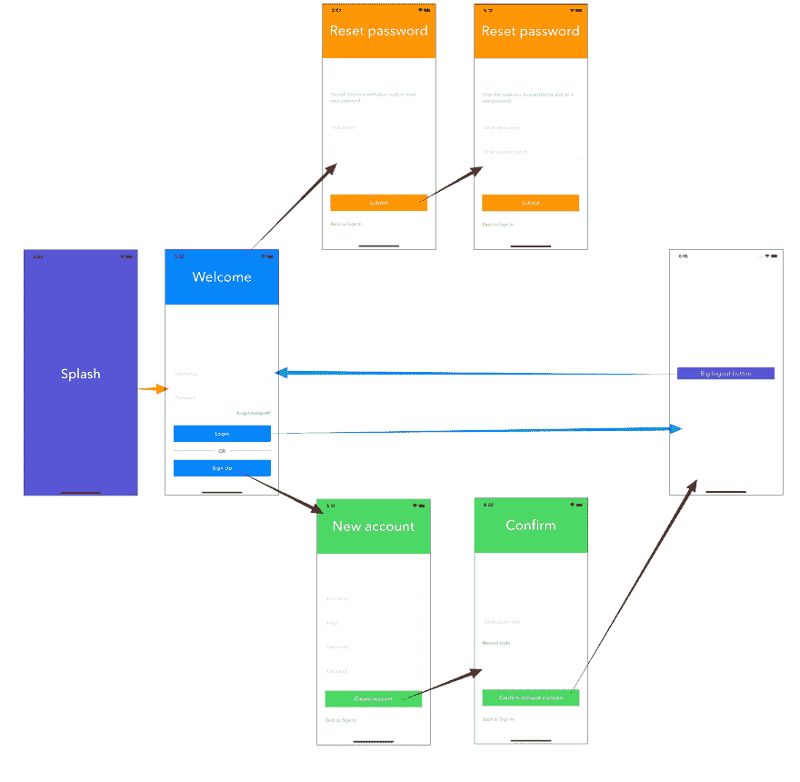
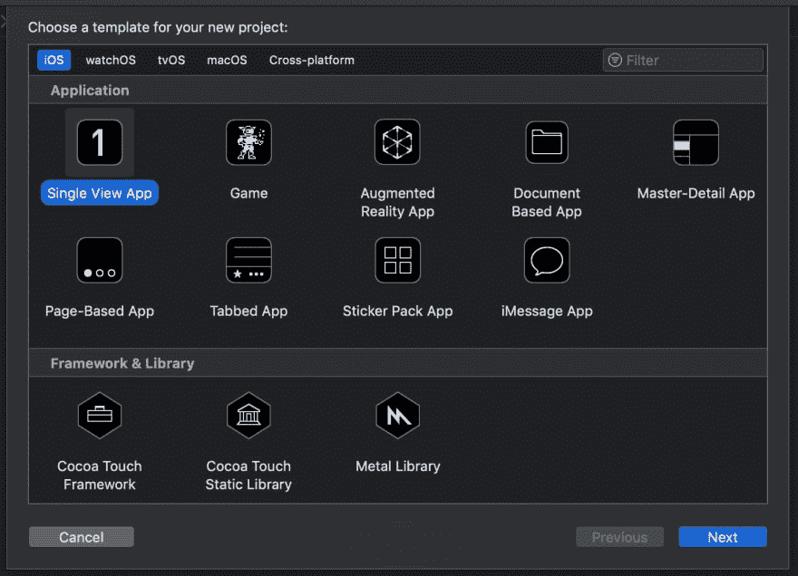
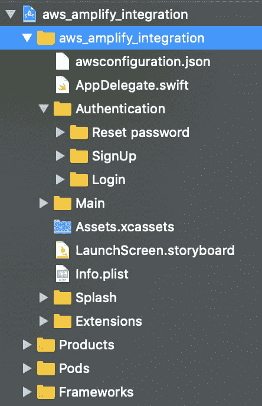

# 如何在 iOS 中使用 AWS Amplify 进行认证

> 原文：<https://dev.to/calin_crist/how-to-do-authentication-using-aws-amplify-in-ios-4kb6>

我既高兴又紧张地发布了我的第一个教程。😊所以让我们开始吧！

如果你是一名开发人员，你有 99%的机会处理应用程序用户的认证问题。认证流程需要安全、易于集成和可定制。这听起来可能很容易。但是大多数情况下，处理这个特性需要比我们想要的更多的工作。这就是 AWS Amplify 发挥作用的地方。它使得这种体验对开发者来说是可行的，对用户来说是无风险的。

在这篇博文中，我想通过展示我如何将 AWS Amplify Auth 组件集成到我的 iOS 应用程序中来证明这一点。

### **AWS 放大**

AWS Amplify 是一个开源库，面向希望集成强大的 AWS 服务(Auth、API、S3 存储等)的开发人员。)到他们的移动/网络应用程序中。

它有一个很大的优势:你不需要很强的后端知识来部署和集成。通过使用这个，你可以更专注于构建你的应用而不是配置。

### **Auth**

> “AWS Amplify 身份验证模块为想要创建用户身份验证体验的开发人员提供了身份验证 API 和构建模块。”([https://aws-amplify.github.io/docs/js/authentication](https://aws-amplify.github.io/docs/js/authentication)

它有一个很大的优势:你不需要很强的后端知识来部署和集成。通过使用这个，你可以更专注于构建你的应用而不是配置。

### **我将如何实现**

我计划创建一个基本的 iOS 应用程序，并向其添加身份验证流程:

*   注册
*   签约雇用
*   重置密码

为了更容易理解，这里有一个图表:

[](https://res.cloudinary.com/practicaldev/image/fetch/s--Lz8XID8C--/c_limit%2Cf_auto%2Cfl_progressive%2Cq_auto%2Cw_880/https://thepracticaldev.s3.amazonaws.com/i/jkuj0epudrbq9v57px95.png)

### **创建基础 iOS app 项目**

我创建了一个 SingleView Swift 项目，并将其命名为 *aws_amplify_integration* 。

|  |  |
| --- | --- |

### **文件夹结构**

下面是我建议的文件夹结构的截图:

[](https://res.cloudinary.com/practicaldev/image/fetch/s--CwmKC4yA--/c_limit%2Cf_auto%2Cfl_progressive%2Cq_auto%2Cw_880/https://thepracticaldev.s3.amazonaws.com/i/m6e803ezcx4t9vplruhg.png)

### **自定义 UI**

对于本教程来说，UI 是非常基本的。

如果你想看一下 xib 文件，到该项目的 Github 链接可以满足你的好奇心。

### **添加 AWS 放大 libs**

需要做什么在 AWS Amplify 文档([https://aws-amplify.github.io/docs/ios/start](https://aws-amplify.github.io/docs/ios/start))上有很好的解释。但我会摘录重要的步骤。

### **安装 AWS 放大器**

安装 Nodejs 和 npm，然后运行:

```
npm install -g @aws-amplify/cli
amplify configure 
```

安装 Cocoapods:

```
sudo gem install cocoapods
pod init 
```

打开 pod 文件并添加 pod 以使 AWS Mobile SDK 工作:

```
platform :ios, '11.0'

target 'aws_amplify_integration' do
    use_frameworks!
    pod 'AWSCore', '~> 2.9.0'
    pod 'AWSMobileClient', '~> 2.9.0'
end 
```

安装依赖项:

```
pod install --repo-update 
```

记得打开新创建的*AWS _ amplify _ integration . workspace .*

在 Xcode 中构建项目。

### **设置 AWS 服务**

需要做的是创建新的 AWS 后端资源。之后，将 AWS 服务配置导入应用程序。

在终端窗口中，导航到您的项目文件夹(包含 xcodeproj 文件的文件夹)。

运行以下命令(对于此应用程序，接受所有默认设置是可以的):

```
 amplify init        #accept defaults
    amplify push        #creates configuration file 
```

在 Finder 中，将`awsconfiguration.json`拖到顶部项目导航器文件夹下的 Xcode 中(文件夹名称应该与您的 Xcode 项目名称匹配)。当出现`Options`对话框时，执行以下操作:

*   清除`Copy items if needed`复选框。
*   选择`Create groups`，然后选择`Next`。

### **添加授权**

要享受自动设置，请在项目的根文件夹中运行以下命令。

CLI 提示将帮助您为您的应用程序自定义身份验证流程。

```
 amplify add auth 
```

配置您的认证选项后，更新您的后端:

```
 amplify push 
```

现在，`awsconfiguration.json`用 Cognito 配置更新:

[](https://res.cloudinary.com/practicaldev/image/fetch/s--nlgXmqjz--/c_limit%2Cf_auto%2Cfl_progressive%2Cq_auto%2Cw_880/https://thepracticaldev.s3.amazonaws.com/i/gpegddteqeh6yqw7tb5w.png)

如果不是，请确保您已经将该文件添加到项目中。

## **积分放大认证**

### 检查授权状态

首先，需要导入 AWSMobileClient 来使用客户端检查身份验证状态。

通过调用 *sharedInstance()* 从 *awsconfiguration.json 中提取配置。*这管理用户的授权任务会话，如自动凭证管理和刷新例程。

方法将启动一个新的会话。结果包含一个公开当前用户状态的枚举值:

```
 public enum UserState: String {
        case signedIn, signedOut, signedOutFederatedTokensInvalid, signedOutUserPoolsTokenInvalid, guest, unknown
    } 
```

我们可以利用这个工作流来决定向用户呈现什么。对于这个例子，我们使用 *signedIn。*

如果用户登录，我们可以重定向到*主视图控制器，*否则到*登录视图控制器。*

```
 import UIKit
    import AWSMobileClient

    class SplashViewController: UIViewController {

        override func viewDidLoad() {
            super.viewDidLoad()

            AWSMobileClient.sharedInstance().initialize { (userState, error) in
                if let error = error {
                    print("error: \(error.localizedDescription)")
                    return
                }

                guard let userState = userState else {
                    return
                }

                print("The user is \(userState.rawValue).")

                // Check user availability
                switch userState {
                case .signedIn:
                    // Show home page
                    let mainViewController = MainViewController()
                    UIApplication.setRootView(mainViewController)
                    break

                default:
                    // Show login page
                    let loginViewController = LoginViewController()
                    UIApplication.setRootView(loginViewController)
                    break
                }
            }
        }
    } 
```

在 AppDelegate.swift 的方法 didFinishLaunchingWithOptions 中，我们提供了 SplashScreenViewController。

```
 func application(_ application: UIApplication, didFinishLaunchingWithOptions launchOptions: [UIApplication.LaunchOptionsKey: Any]?) -> Bool {

        window = UIWindow(frame: UIScreen.main.bounds)

        if let window = window {
            window.backgroundColor = #colorLiteral(red: 0.9960784314, green: 0.9960784314, blue: 0.9960784314, alpha: 1)

            let splashViewController = SplashViewController()
            window.makeKeyAndVisible()
            window.rootViewController = splashViewController

        }

        return true
    } 
```

### 登录流程

当用户未登录时，显示登录屏幕。

从这里我们可以:

*   输入用户名和密码登录
*   转到注册流程
*   转到重置密码流

网点参照 *UITextFields* 和 *touch up inside 事件*参照登录方法。

现在，在这个方法中，我们可以使用 *AWSMobileClient* 使用用户名和密码登录。当结果可用时，此操作调用完成处理程序。

```
 public func signIn(username: String, 
                                         password: String, 
                                         validationData: [String: String]? = nil, 
                                         completionHandler: @escaping ((SignInResult?, Error?) -> Void)) 
```

该错误是一个 *AWSMobileClientError* 枚举值。这个枚举有 42 个事例。

通常，您的需求不会触及所有的客户端错误。但是处理大部分问题以给用户适当的反馈是一个很好的实践。

```
 /// The error enum for `AWSMobileClient` errors.
    public enum AWSMobileClientError: Error {
        case aliasExists(message: String)
        case codeDeliveryFailure(message: String)
        case codeMismatch(message: String)
        case expiredCode(message: String)
        case groupExists(message: String)
        case internalError(message: String)
        case invalidLambdaResponse(message: String)
        case invalidOAuthFlow(message: String)
        case invalidParameter(message: String)
        case invalidPassword(message: String)
        case invalidUserPoolConfiguration(message: String)
        case limitExceeded(message: String)
        case mfaMethodNotFound(message: String)
        case notAuthorized(message: String)
        case passwordResetRequired(message: String)
        case resourceNotFound(message: String)
        case scopeDoesNotExist(message: String)
        case softwareTokenMFANotFound(message: String)
        case tooManyFailedAttempts(message: String)
        case tooManyRequests(message: String)
        case unexpectedLambda(message: String)
        case userLambdaValidation(message: String)
        case userNotConfirmed(message: String)
        case userNotFound(message: String)
        case usernameExists(message: String)
        case unknown(message: String)
        case notSignedIn(message: String)
        case identityIdUnavailable(message: String)
        case guestAccessNotAllowed(message: String)
        case federationProviderExists(message: String)
        case cognitoIdentityPoolNotConfigured(message: String)
        case unableToSignIn(message: String)
        case invalidState(message: String)
        case userPoolNotConfigured(message: String)
        case userCancelledSignIn(message: String)
        case badRequest(message: String)
        case expiredRefreshToken(message: String)
        case errorLoadingPage(message: String)
        case securityFailed(message: String)
        case idTokenNotIssued(message: String)
        case idTokenAndAcceessTokenNotIssued(message: String)
        case invalidConfiguration(message: String)
        case deviceNotRemembered(message: String)
    } 
```

当没有错误时， *SignInResult* 包含用户的状态。

```
 public enum SignInState: String {
        case unknown = "UNKNOWN"
        case smsMFA = "CONFIRMATION_CODE"
        case passwordVerifier = "PASSWORD_VERIFIER"
        case customChallenge = "CUSTOM_CHALLENGE"
        case deviceSRPAuth = "DEVICE_SRP_AUTH"
        case devicePasswordVerifier = "DEVICE_PASSWORD_VERIFIER"
        case adminNoSRPAuth = "ADMIN_NO_SRP_AUTH"
        case newPasswordRequired = "NEW_PASSWORD_REQUIRED"
        case signedIn = "SIGN_IN_COMPLETE"
    } 
```

下面是整个实现和处理。
登录完成后，重定向到 *MainViewController。*T3】

```
 import UIKit
    import AWSMobileClient

    class LoginViewController: UIViewController {

        @IBOutlet weak var usernameTextField: UITextField!
        @IBOutlet weak var passwordTextField: UITextField!

        @IBAction func login(_ sender: Any) {

            guard let username = usernameTextField.text,
                let password = passwordTextField.text  else {
                print("Enter some values please.")
                return
            }

            print("\(username) and \(password)")

            AWSMobileClient.sharedInstance().signIn(username: username, password: password) { 
                            (signInResult, error) in

                    if let error = error  {
                        print("There's an error : \(error.localizedDescription)")
                        print(error)
                        return
                    }

                    guard let signInResult = signInResult else {
                        return
                    }

                    switch (signInResult.signInState) {
                    case .signedIn:
                        print("User is signed in.")

                        DispatchQueue.main.async {
                            let mainViewController = MainViewController()
                            UIApplication.setRootView(mainViewController)
                        }

                    case .newPasswordRequired:
                        print("User needs a new password.")
                    default:
                        print("Sign In needs info which is not et supported.")
                    }
            }
        }
    } 
```

### **报名流程**

这里我们有两个屏幕来完成这个流程:

1.  输入您的帐户详细信息(全名、电子邮件、用户名和密码)
    *   *签名女孩控制器*
2.  确认验证码
    *   *ConfirmSignUpViewController*

在 AWS Amplify 中，注册和确认与登录过程非常相似。

唯一不同的是结果。它使用包含注册确认状态的*注册结果*。

```
 /// Indicates the state of user during the sign up operation.
    public enum SignUpConfirmationState {
        case confirmed, unconfirmed, unknown
    } 
```

当状态为*未确认时，* Cognito 发送验证码。它可以通过短信或电子邮件，取决于如何配置 Cognito。

然后，应用程序进入确认屏幕。

```
 import AWSMobileClient

    class SignUpViewController: UIViewController {

        @IBOutlet weak var passwordTextField: UITextField!
        @IBOutlet weak var usernameTextField: UITextField!
        @IBOutlet weak var emailTextField: UITextField!
        @IBOutlet weak var fullNameTextField: UITextField!

            @IBAction func createAccount(_ sender: Any) {

            guard let fullName = fullNameTextField.text,
                let email = emailTextField.text,
                let username = usernameTextField.text,
                let password = passwordTextField.text else {
                return
            }

            AWSMobileClient.sharedInstance().signUp(username: username,
                                                    password: password,
                                                    userAttributes: ["email" : email, "name": fullName],
                                                    completionHandler: signUpHandler);
        }

        func signUpHandler(signUpResult: SignUpResult?, error: Error?) {

            if let error = error {
                if let error = error as? AWSMobileClientError {
                    switch(error) {
                    case .usernameExists(let message):
                        print(message)
                    default:
                        break
                    }
                }
                print("There's an error on signup: \(error.localizedDescription), \(error)")
            }

            guard let signUpResult = signUpResult else {
                return
            }

            switch(signUpResult.signUpConfirmationState) {
            case .confirmed:
                print("User is signed up and confirmed.")

                DispatchQueue.main.async {
                    let mainViewController = MainViewController()
                    UIApplication.setRootView(mainViewController)
                }

            case .unconfirmed:
                let alert = UIAlertController(title: "Code sent",
                                              message: "Confirmation code sent via \(signUpResult.codeDeliveryDetails!.deliveryMedium) to: \(signUpResult.codeDeliveryDetails!.destination!)",
                    preferredStyle: .alert)

                alert.addAction(UIAlertAction(title: "Dismiss", style: .cancel) { _ in
                    guard let username = self.usernameTextField.text else {
                        return
                    }
                    let confirmSignupViewController = ConfirmSignUpViewController(username: username)
                    self.navigationController?.pushViewController(confirmSignupViewController, animated: true)
                })

                DispatchQueue.main.async {
                    self.present(alert, animated: true, completion: nil)
                }

            case .unknown:
                print("Unexpected case")
            }
        }

        @IBAction func dismissModal(_ sender: Any) {
            self.navigationController?.dismiss(animated: true, completion: nil)
        }
    } 
```

ConfirmSignUpViewController:

```
 import AWSMobileClient

    class ConfirmSignUpViewController: UIViewController {

        @IBOutlet weak var verificationCodeTextField: UITextField!
        var username: String?

        init(username: String, nibName nibNameOrNil: String? = nil, bundle nibBundleOrNil: Bundle? = nil) {
            self.username = username
            super.init(nibName:nibNameOrNil, bundle: nibBundleOrNil)
        }

        required init?(coder aDecoder: NSCoder) {
            fatalError("init(coder:) has not been implemented")
        }

            @IBAction func confirmSignUp(_ sender: Any) {

            guard let verificationCode = verificationCodeTextField.text,
                let username = self.username else {
                print("No username")
                return
            }

            AWSMobileClient.sharedInstance().confirmSignUp(username: username,
                                                           confirmationCode: verificationCode,
                                                           completionHandler: handleConfirmation)
        }

            func handleConfirmation(signUpResult: SignUpResult?, error: Error?) {
            if let error = error {
                print("\(error)")
                return
            }

            guard let signUpResult = signUpResult else {
                return
            }

            switch(signUpResult.signUpConfirmationState) {
            case .confirmed:
                print("User is signed up and confirmed.")

                DispatchQueue.main.async {
                    let mainViewController = MainViewController()
                    UIApplication.setRootView(mainViewController)
                }

            case .unconfirmed:
                print("User is not confirmed and needs verification via \(signUpResult.codeDeliveryDetails!.deliveryMedium) sent at \(signUpResult.codeDeliveryDetails!.destination!)")
            case .unknown:
                print("Unexpected case")
            }
        }

        @IBAction func resendCode(_ sender: Any) {
            guard let username = self.username else {
                print("No username")
                return
            }

            AWSMobileClient.sharedInstance().resendSignUpCode(username: username,
                                                              completionHandler: resendSignUpHandler)
        }

        func resendSignUpHandler(result: SignUpResult?, error: Error?) {
            if let error = error {
                print("\(error)")
                return
            }

            guard let signUpResult = result else {
                return
            }

            let message = "A verification code has been sent via \(signUpResult.codeDeliveryDetails!.deliveryMedium) at \(signUpResult.codeDeliveryDetails!.destination!)"
            let alert = UIAlertController(title: "Code Sent",
                                          message: message,
                                          preferredStyle: .alert)
            alert.addAction(UIAlertAction(title: "Dismiss", style: .cancel, handler: { _ in
                //Cancel Action
            }))

            DispatchQueue.main.async {
                self.present(alert, animated: true, completion: nil)
            }
        }

        @IBAction func dismissModal(_ sender: Any) {
            self.navigationController?.dismiss(animated: true, completion: nil)
        }
    } 
```

### 重置密码流程

该流程分为两个步骤。

首先，用户必须通过电子邮件或短信接收确认码。这是通过调用 forgotPassword(用户名:用户名)来完成的。可以从响应中包含的 UserCodeDeliveryDetails 中检索有关如何发送代码的详细信息。

```
 /// Indicates the state of forgot password operation.
    public enum ForgotPasswordState {
        case done, confirmationCodeSent
    }

    /// Contains the result of the forgot password operation.
    public struct ForgotPasswordResult {
        public let forgotPasswordState: ForgotPasswordState
        public let codeDeliveryDetails: UserCodeDeliveryDetails?

        internal init(forgotPasswordState: ForgotPasswordState, codeDeliveryDetails: UserCodeDeliveryDetails?) {
            self.forgotPasswordState = forgotPasswordState
            self.codeDeliveryDetails = codeDeliveryDetails
        }
    } 
```

然后，该代码用于确认新密码。

```
 confirmForgotPassword(username: username, 
                       newPassword: newPassword, 
                  confirmationCode: confirmationCode) 
```

这里我们有两个屏幕:

1.  输入用户名
    *   ResetPasswordViewController
2.  确认验证码并输入新密码
    *   NewPasswordViewController

ResetPasswordViewController:

```
 import UIKit
    import AWSMobileClient

    class ResetPasswordViewController: UIViewController {

        @IBOutlet weak var usernameTextField: UITextField!

        @IBAction func submitUsername(_ sender: Any) {

            guard let username = usernameTextField.text else {
                print("No username")
                return
            }

            AWSMobileClient.sharedInstance().forgotPassword(username: username) { (forgotPasswordResult, error) in
                if let forgotPasswordResult = forgotPasswordResult {
                    switch(forgotPasswordResult.forgotPasswordState) {
                    case .confirmationCodeSent:
                        guard let codeDeliveryDetails = forgotPasswordResult.codeDeliveryDetails else {
                            return
                        }

                        let alert = UIAlertController(title: "Code sent",
                                                      message: "Confirmation code sent via \(codeDeliveryDetails.deliveryMedium) to: \(codeDeliveryDetails.destination!)",
                                                      preferredStyle: .alert)

                        DispatchQueue.main.async {
                            self.present(alert, animated: true, completion: nil)
                        }

                    default:
                        print("Error: Invalid case.")
                    }
                } else if let error = error {
                    print("Error occurred: \(error.localizedDescription)")
                }
            }

        }

        @IBAction func dismiss(_ sender: Any) {
            self.navigationController?.dismiss(animated: true, completion: nil)
        }
    } 
```

NewPasswordViewController:

```
 import UIKit
    import AWSMobileClient

    class NewPasswordViewController: UIViewController {

        @IBOutlet weak var verificationCodeTextField: UITextField!
        @IBOutlet weak var newPasswordTextField: UITextField!

        var username: String?

        init(username: String, nibName nibNameOrNil: String? = nil, bundle nibBundleOrNil: Bundle? = nil) {
            self.username = username
            super.init(nibName:nibNameOrNil, bundle: nibBundleOrNil)
        }

        required init?(coder aDecoder: NSCoder) {
            fatalError("init(coder:) has not been implemented")
        }

        @IBAction func verifyCode(_ sender: Any) {

            guard let username = username,
                let newPassword = newPasswordTextField.text,
                let confirmationCode = verificationCodeTextField.text else {
                return
            }

            AWSMobileClient.sharedInstance().confirmForgotPassword(username: username,
                                                                   newPassword: newPassword,
                                                                   confirmationCode: confirmationCode) { (forgotPasswordResult, error) in
                if let forgotPasswordResult = forgotPasswordResult {
                    switch(forgotPasswordResult.forgotPasswordState) {
                    case .done:
                        self.dismiss(self)
                    default:
                        print("Error: Could not change password.")
                    }
                } else if let error = error {
                    print("Error occurred: \(error.localizedDescription)")
                }
            }
        }

        @IBAction func dismiss(_ sender: Any) {
            self.navigationController?.dismiss(animated: true, completion: nil)
        }
    } 
```

### 签退动作

不多说了:)调用以下，通过清除本地钥匙串存储，用户将从当前设备注销。

```
 AWSMobileClient.sharedInstance().signOut() 
```

此外，这可以是从所有活动会话(所有设备)中注销用户的全局操作。它使所有令牌无效:id 令牌、访问令牌和刷新令牌。

尽管令牌被撤销，但 AWS 凭据将保持有效，直到过期(默认为 1 小时)。

这不是默认行为，所以我们需要使用 signOut options 对象来指定签出选项:

```
 /// Signout options to change the default behavior.
    public struct SignOutOptions {
        let invalidateTokens: Bool
        let signOutGlobally: Bool

        /// Initializer: Signout options to change the default behavior.
        ///
        /// - Parameters:
        ///   - signOutGlobally: Invalidate all active sessions with the service. The user will be logged out of all devices.
        ///   - invalidateTokens: If functionality available, the access token, refresh token and id token will be invalidated and won't be usable.
        public init(signOutGlobally: Bool = false, invalidateTokens: Bool = true) {
            self.signOutGlobally = signOutGlobally
            self.invalidateTokens = invalidateTokens
        }
    } 
```

```
 AWSMobileClient.sharedInstance().signOut(options: SignOutOptions(signOutGlobally: true)) { (error) in
        print("Error: \(error.debugDescription)")
    } 
```

主视图控制器:

```
 import UIKit
    import AWSMobileClient

    class MainViewController: UIViewController {

        @IBOutlet weak var logOutButton: UIButton!

        @IBAction func logOut(_ sender: Any) {
            AWSMobileClient.sharedInstance().signOut() { error in
                if let error = error {
                    print(error)
                    return
                }
            }

            let loginViewController = LoginViewController()
            UIApplication.setRootView(loginViewController)
        }

    } 
```

当 *signOut()* 动作完成时，显示登录屏幕。

## **结论**

就是这样！它只是众多组件中的一个。

就开发速度和可靠性而言，Amplify 库是一个真正的游戏规则改变者。下一步将是使用和处理其他 AWS 服务，如存储、推送通知或 API。

专注于实现特性而不是库真的很好。

*   github link[calin crist/AWS _ amplify _ integration](https://github.com/calincrist/aws_amplify_integration.git)