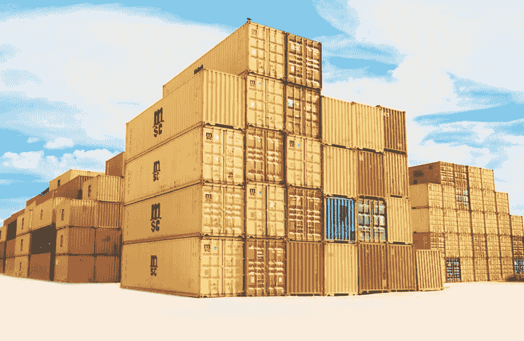
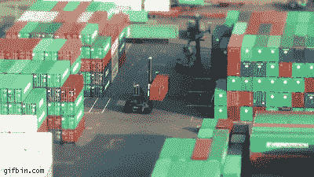
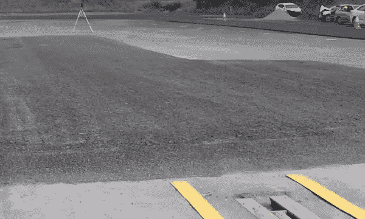

# 如何对你的 React app 进行 Dockerize？

> 原文：<https://dev.to/quickly_react/how-to-dockerize-your-react-app-2af8>

在我们之前的[帖子](https://blog.quicklyreact.com)中，我们已经讨论了 React.js 框架，并构建了一个相关用例的应用程序。我们还没有讨论如何部署您的应用。在这篇文章中，我们想了解一下 **docker** ，这是一个让你部署 React 应用更容易的工具。

[](https://res.cloudinary.com/practicaldev/image/fetch/s--Zhxj5KoG--/c_limit%2Cf_auto%2Cfl_progressive%2Cq_auto%2Cw_880/https://images.unsplash.com/photo-1493946740644-2d8a1f1a6aff%3Fixlib%3Drb-1.2.1%26ixid%3DeyJhcHBfaWQiOjEyMDd9%26auto%3Dformat%26fit%3Dcrop%26w%3D1368%26q%3D80)

> 注意:docker 通常用于部署应用程序，在这篇文章中，我们坚持讨论如何使用 Docker 部署 React 应用程序。

## 什么是 dockerizing？

对应用程序进行 Docker 化是将应用程序转换为在 Docker 容器中运行的过程。

[](https://i.giphy.com/media/6AFldi5xJQYIo/source.gif)

对于不了解 docker 的人来说，这可能有点模糊。

容器类似于虚拟机，它们为应用程序提供了一个隔离的环境。

docker 很有用的一个很好的例子是，你使用 Windows 来构建你的应用程序，但是你要部署的服务器是 Linux，在这种情况下 docker 真的很有用。您不需要编写任何特定于部署的命令，然后在构建时将它们改回来，有了 docker，您可以在构建和部署时使用固定的依赖关系，并节省担心环境✨.的时间

*大家:这种神奇是怎么发生的？*

这就是魔法是如何发生的，

这可能看起来有点混乱，所以让我们打破它

*   Docker 提供了一个在任何主机操作系统上运行容器的平台。

*   *容器*:每个应用程序都在容器内部运行。我们的容器包括应用程序所需的所有依赖项，我们部署包含依赖项的容器来运行我们的应用程序。

*   *基本图像*:每个容器都有一个 eg 的基本图像；Ubuntu、CentOS 是基本映像的示例。Docker 有超过 100，000 张图片，我们将使用它来构建一个容器。基础映像包括我们的应用程序所需的所有依赖关系。

*   *映像*:基础映像和应用一起称为映像。因此有色差😁。

## docker 是如何工作的？

[](https://i.giphy.com/media/itOuxcFvgYjWE/source.gif)

我们知道 docker 解决的是什么问题，对 docker 的工作原理也有一个大概的了解。

让我们跳到 docker 化一个 React 应用程序，看看 docker 到底是如何工作的。因为我们这篇文章的主要焦点是 dockerize，所以为了节省时间，我们将使用上一篇[文章](https://dev.to/what-is-nextjs)中的 Next.js 项目🤘。

## 安装对接器

不同的操作系统有不同的 docker 安装过程。你可以看看下面的官方安装文档，它们也很长，而且只针对特定的操作系统版本(更不用说我们太懒了😅).

*   [Mac](https://docs.docker.com/docker-for-mac/install/)
*   [窗户](https://docs.docker.com/docker-for-windows/install/)
*   [厘斯](https://docs.docker.com/install/linux/docker-ce/centos/)
*   Debian
*   [软呢帽](https://docs.docker.com/install/linux/docker-ce/fedora/)
*   [Ubuntu](https://docs.docker.com/install/linux/docker-ce/ubuntu/)
*   [二进制](https://docs.docker.com/install/linux/docker-ce/binaries/)

一旦你完成了安装，你可以尝试这个命令来看看 docker 是否在工作

```
docker run hello-world 
```

你应该看看这个

```
 Hello from Docker!
This message shows that your installation appears to be working correctly.

To generate this message, Docker took the following steps:
 1\. The Docker client contacted the Docker daemon.
 2\. The Docker daemon pulled the "hello-world" image from the Docker Hub.
    (amd64)
 3\. The Docker daemon created a new container from that image which runs the
    executable that produces the output you are currently reading.
 4\. The Docker daemon streamed that output to the Docker client, which sent it
    to your terminal.

To try something more ambitious, you can run an Ubuntu container with:
 $ docker run -it ubuntu bash

Share images, automate workflows, and more with a free Docker ID:
 https://hub.docker.com/

For more examples and ideas, visit:
 https://docs.docker.com/get-started/ 
```

这意味着你已经成功安装了 docker。干得好！👏👏。

## 整理我们的应用程序

现在，我们需要一个 docker 容器来运行我们的应用程序。

*大家:我们如何做一个 docker 容器？*

[](https://i.giphy.com/media/mvoxdYnpyk23u/source.gif)

1.  Docker 使用一个`Dockerfile`(与您的项目在同一个目录中)来构建容器。

让我们创建一个`Dockerfile`。

我们简要介绍了 docker 是如何工作的，但是在制作这个 docker 文件时，我们将看到 docker 容器是如何工作的，以及如何制作一个 docker 容器。

就像一场精彩的烹饪秀，我们已经准备好了😆。让我们进入它是什么。

```
# base image
FROM node:10.16.3-jessie

# set working directory
WORKDIR /app

# add `/app/node_modules/.bin` to $PATH
ENV PATH /app/node_modules/.bin:$PATH

# install and cache app dependencies
COPY package.json /app/package.json
RUN npm install --silent
RUN npm install --save next react react-dom               

# start app
CMD ["next", "dev"] 
```

### 基础图像

每个容器都有一个基本映像。基本映像包括执行代码所需的所有依赖关系。

*大家:这个形象是从哪里来的，是怎么运作的？*

Docker 提供了一个名为 [Docker Hub](https://hub.docker.com/) 的真正令人惊叹的服务，它拥有超过 10 万个容器图像。

对于我们的项目，我们需要一个 docker 映像来主要运行 Node。因此，我们定义我们的基本图像为:

```
# base image
FROM node:10.16.3-jessie 
```

你可以使用一个 Ubuntu 基础镜像，

```
# base image
FROM ubuntu:16.04-xenial 
```

但是它没有我们需要的节点依赖性(废话！).

### 安装应用依赖关系

既然我们已经选择了基础映像，我们希望在容器中为我们的应用程序创建并使用一个特定的目录。于是，我们有了命令:

```
WORKDIR /app 
```

一旦我们设置了工作目录，我们需要安装我们的包。我们可以通过这些命令安装:

```
# add `/app/node_modules/.bin` to $PATH
ENV PATH /app/node_modules/.bin:$PATH

# install and cache app dependencies
COPY package.json /app/package.json
RUN npm install --silent
RUN npm install --save next react react-dom 
```

### 运行 app

最后，我们需要运行应用程序，所以我们有命令

```
# start app
CMD ["next", "dev"] 
```

1.  我们在容器中安装了包，我们不希望来自`node_modules`的本地依赖被使用。

在这种情况下，Docker 可以忽略另一个文件`.dockerignore`

```
node_modules 
```

这样，我们的本地依赖项将被跳过发送到容器。如果你曾经使用过 [Git](https://git-scm.com/) ，这与`.gitignore`类似。

1.  现在我们已经完成了容器配置的设置，我们需要**构建**我们的容器。

我们将运行下面的命令(在我们的控制台中)

```
docker build . 
```

这将从本地项目文件构建我们的容器，除了`node_modules`(因为它在`.dockerignore`中)。

1.  一旦我们的容器构建好了，在最后一行我们会得到一条类似如下的消息

```
Successfully built edbdf759cd55 
```

(哈希可能不同)

最后。

1.  现在，我们需要**运行**应用程序，因此我们使用命令

```
docker run -v ${PWD}:/app -v /app/node_modules -p 3001:3000 --rm edbdf759cd55 
```

*(因为应用程序在我们的容器中)*

现在，如果你现在连接到`localhost:3000`，你将不能。

这是因为，应用程序正在端口`3000`上的容器内运行，但是使用了这个选项

```
-p 3001:3000 
```

在运行我们的容器时，我们的主机通过端口`3001`进行连接。如果你去`localhost:3001`，你可以连接到应用程序😊。

1.  如果您想要停止应用程序，您需要运行命令

```
docker ps 
```

有了这个，docker 将获得所有容器化的应用程序。

```
CONTAINER ID        IMAGE               COMMAND                  CREATED             STATUS              PORTS                    NAMES
39adcb9b4f0f        edbdf759cd55        "docker-entrypoint.s…"   5 minutes ago       Up 5 minutes        0.0.0.0:3001->3000/tcp   awesome_wilson 
```

我们知道我们的 docker 图像 id 是`edbdf759cd55`，我们需要使用`CONTAINER ID`来停止容器。

```
docker stop 39adcb9b4f0f 
```

容器停止运行，应用程序不可访问。

*大家:想重新启动 app 怎么办？*

你只需要运行命令

```
docker run -v ${PWD}:/app -v /app/node_modules -p 3001:3000 --rm edbdf759cd55 
```

## 复合坞站

有其他运行容器的方法吗？

[](https://i.giphy.com/media/TPl5N4Ci49ZQY/source.gif)

事实上，由于有了 [docker Compose](https://docs.docker.com/compose/) ，有了一种在后台运行 Docker 容器的方法。

1.  您可以使用`docker-compose.yml`来配置应用程序的服务。

```
version: '3.7'
services:
  nextjsprj:
    container_name: nextjsprj
    build:
      context: .
      dockerfile: Dockerfile
    volumes:
      - '.:/app'
      - '/app/node_modules
    ports:
      - '3001:3000' 
```

1.  如果你想让容器旋转，你需要跑

```
docker-compose up 
```

如果你运行

```
docker ps 
```

您可以检查我们的容器是否正在运行

```
CONTAINER ID        IMAGE                  COMMAND                  CREATED             STATUS              PORTS                    NAMES
9ba9bd01ed07        nextjs-prj_nextjsprj   "docker-entrypoint.s…"   15 hours ago        Up 14 minutes       0.0.0.0:3001->3000/tcp   nextjsprj 
```

1.  要停止容器，您只需执行以下操作

```
docker-compose stop 
```

使用 docker-compose，您可以运行多个容器，而无需检查运行或停止哪个容器。

## 正在部署

[](https://i.giphy.com/media/67rfI3AQcbHPO0qK8m/source.gif)

到目前为止，我们能够构建和运行 docker 映像，但是我们讨论了使用 docker 来部署我们的应用程序。

*我们如何使用 docker 映像进行部署？*

在建立我们的形象时，我们讨论了 [Docker Hub](https://hub.docker.com/) 。我们也可以使用 docker hub 来部署我们的映像😍。

1.  我们用我们的`quicklyreact1/nextjsprj` ( `username/project`)标记我们的图像，

```
docker tag nextjs-prj_nextjsprj quicklyreact1/nextjsprj 
```

这个标签不会影响我们的本地图像，但是如果我们推送我们的图像

```
docker push quicklyreact1/nextjsprj 
```

如果您还没有登录，您可能需要注册 [Docker Hub](https://hub.docker.com/)

```
docker login 
```

部署完成后，您可以在这里找到我们项目的图像[。](https://hub.docker.com/r/quicklyreact1/nextjsprj)

1.  如果你想在你的服务器上拉这个图像

```
docker pull quicklyreact1/nextjsprj 
```

并使用
运行它

```
docker run -v ${PWD}:/app -v /app/node_modules -p 3001:3000 --rm quicklyreact/nextjsprj 
```

哇哦。我们必须运行、构建和部署我们的应用程序🎉🎉🎉

## 参考文献:

*   [码头术语](https://docs.microsoft.com/en-us/dotnet/architecture/microservices/container-docker-introduction/docker-terminology)
*   [docker 文件参考](https://docs.docker.com/engine/reference/builder)
*   [Docker 文档](https://docs.docker.com/)
*   [dockered App](https://github.com/nishantrpai/nextjs-prj/tree/dockerize)

## 结论

1.  将您的应用程序对接可以让您自由地不必担心任何主机操作系统依赖性。

2.  Docker Hub 提供了超过 100，000 个集装箱的惊人资源。

3.  Docker Compose 允许您控制应用程序的服务，并且只需一个命令就可以运行和停止容器。

4.  Docker Hub 还可以用于部署您的映像，然后您可以在服务器上使用一个命令。

我们举了一个非常简单的例子来 dockerize 和部署我们的 React 应用程序，但它可能并不总是那么简单。如果您需要帮助，我们在[quick react](https://quicklyreact.com)有 24/7 React.js 开发人员帮助您解决任何问题或为您提供您可能需要的任何帮助。联系我们的支持👉去了解更多。

[](https://i.giphy.com/media/3oEjHH7QyGsb1YkcW4/source.gif)