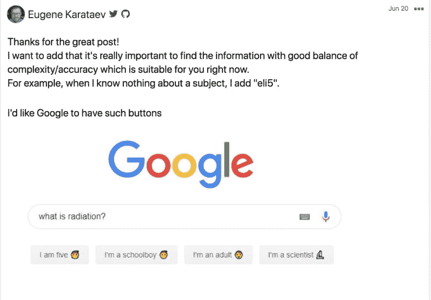

# 如何在一无所知的情况下变得更聪明

> 原文：<https://dev.to/taillogs/how-to-get-smarter-without-knowing-anything-34f6>

我经常发现，人们在讨论“智力”的时候，其实说的都是“知识”。这些术语的混淆导致了可怕的事情，如标准化测试和白板面试，它们只能证明你知道什么，而不能证明你学得有多好。

> @ dhh大家好，我叫大卫。我不会在白板上写冒泡排序。我一直在网上查代码。我不猜谜语。2017 年 2 月 21 日下午 21:04[](https://twitter.com/intent/tweet?in_reply_to=834146806594433025)[](https://twitter.com/intent/retweet?tweet_id=834146806594433025)[](https://twitter.com/intent/like?tweet_id=834146806594433025)

在人类历史的大部分时间里，绝对没有维基百科或“互联网”，在大多数情况下，人们甚至不知道如何阅读。在那些日子里，信息是稀缺资源，这反过来又使知识成为“感知智力”等式的主要部分。

### 已经不是 1429 年了

[](https://res.cloudinary.com/practicaldev/image/fetch/s--6s6Sh-X4--/c_limit%2Cf_auto%2Cfl_progressive%2Cq_auto%2Cw_880/https://thepracticaldev.s3.amazonaws.com/i/dafv7amhb9riecoj27bo.jpg)

信息不再是“感知智能”等式中的瓶颈。互联网提供了一种几乎总是可靠的方法，可以在任何你需要的地方快速检索到你所需要的准确信息。另外，**知物不成比例**。世上最聪明的人只知道

.0000000000000000000000000000000001%

在所有要知道的事情中。如果你把生命中的每一秒钟都花在学习某个特定的领域(比如 Java 编程)，你仍然会一无所知。信息太多了。

[](https://res.cloudinary.com/practicaldev/image/fetch/s--4zz8Ziju--/c_limit%2Cf_auto%2Cfl_progressive%2Cq_auto%2Cw_880/https://thepracticaldev.s3.amazonaws.com/i/ekfcsjs7wf3cgkdbib2q.jpg)

### 在一无所知的情况下如何变得更聪明

**你必须停止为存储知识而优化，转而为检索知识而优化**。只要你有一部智能手机，你的口袋里就有了互联网，也就有了世界上所有的“知识”。问题是，你如何确保你能找到它并理解它？

说你不需要知道任何事情有点夸张。实际上，你需要优化你的“引导知识”,同时在其他地方最小化。引导知识描述了快速找到信息*，并随后快速学习该信息*所需的知识集合。**

 **#### 快速查找信息

快速找到信息是“一无所知”策略的核心基础。显然有无数种方法可以提高你在网上找“东西”的能力。但是有几个非常重要。

**学习如何使用谷歌**

大多数人每天都在使用谷歌，但从未接触过它的任何高级功能。你知道在谷歌搜索中可以使用通配符`*`吗？像`AND`、`OR`、`NOT`这样的基本布尔运算符呢？[有上百种方法可以提高你的搜索能力。Google 是我们的 findability 图中的根节点，所以你应该尽你所能来增加你的准确性。](https://imgur.com/rNlQJuT)

更新:尤金提出了一个很好的观点，让你的搜索符合你目前的理解！这是正确的。

[](https://res.cloudinary.com/practicaldev/image/fetch/s---GYKP6_y--/c_limit%2Cf_auto%2Cfl_progressive%2Cq_auto%2Cw_880/https://thepracticaldev.s3.amazonaws.com/i/e6poub6ovz18r9thz4sn.png)

**学会看穿屁话**

人们经常在网上撒谎。喘息！大多数时候他们说谎很糟糕，有时他们说谎很体面，很少说谎很好。你不在乎识别好的骗子，太少，几率太低。相反，通过学习常见的[逻辑谬误](https://en.wikipedia.org/wiki/List_of_fallacies)和错误论点，过滤掉 99%。重要的是要明白，你同意的一个结构不良的论点和你不同意的论点一样危险。“一无所知”的头号敌人是虚假信息。

**针对特定信号源进行优化**

尝试为您所消费的信息找到一种统一一致的呈现方式是绝对重要的。每个来源与上一个来源的差异越大，你的大脑能优化的就越少。我个人倾向于 Reddit，因为固有的信息分离(subreddits)可以节省很多找东西的时间。它不一定是 Reddit，但它肯定需要是一个提供不同意见的网站(所以可能不是来自中国的任何东西)。对于那些不确定在实践中如何优化特定来源的人，想象一下，每次你搜索一个问题，你会搜索:

`affordable bike buy site:reddit`

跟上你所选择的来源的潮流和礼仪是很重要的。你对平台上用户的准确性和意图越有把握，你就能越快找到正确的信息。

**不要局限于某个特定的来源**

正如大部分时间使用一个来源很重要一样，在需要的时候舒服地使用这个来源也非常重要。即使有一个像 Reddit 这样受欢迎的网站，可用信息中也总会有缺口。仅仅因为这个原因，熟悉多种来源就非常重要。也会有这样的时候，你意识到从你的来源得到的信息是错误的。从控制你决策的信息方面来说，从另一个来源消费内容会让你感觉舒服，这给了你一个真正的选择。

旁注:为什么我更喜欢 Reddit？

做决定没有规模。在生活中，你需要不断地做出决定，没有办法自己做每一个决定并保持质量。相反，我更喜欢“委派我的决定”。

为了恰当地授权决策，你需要找到一个你认为与你的核心价值观一致的社区。然后，根据一套标准，让社区而不是你自己来决定小的决定。这样，你可以让自己只花时间在重要的决定上，把次要的事情交给一群人，他们很可能会选择你想要的东西。我计划将来再写一篇文章，深入探讨我如何以及为什么使用 Reddit。

#### 快速学习信息

快速学习信息是快速查找信息的唯一途径。我相信，你学习新信息的速度是由下面的等式定义的

```
learning rate = 
  relatability factor * base learning rate 
```

Enter fullscreen mode Exit fullscreen mode

`base learning rate`是从记忆率、阅读理解、词汇、从坏信息中解读好信息的能力等综合因素中得出的。`relatability factor`描述你想要学习的新信息与你已经知道的最相关的事物之间的关系。换句话说，新信息的相关系数是其真实“新”程度的表达。

##### 如何提高自己的基础学习率

提高你的基础学习率非常简单。多读书，多多益善。阅读是提高阅读理解能力和词汇量的最快方法。确保不断拓展你阅读的范围。如果你在一个流派或领域停留太久，你的词汇量的提高将会大大减慢。

老实说，提高基础学习率的最好方法就是更健康。大多数人睡眠不足，没有喝足够的水，没有健康的饮食，没有每天锻炼和冥想。这些事情都比任何直接的事情更有助于你的学习能力(和一般的心理健康)。

##### 如何提高你的关系系数

提高你的相关系数是一个优化问题。如前所述，不可能知道任何事情。相关性的目标是优化高度相关和高度分离的知识片段。毕竟任何事物都是其他事物的组合。所以你想知道尽可能多的东西的组成部分。确保你阅读的内容有%来自挑战你现有观点的来源，否则你可能会产生更强烈的偏见。

数学是一个建立关联性的完美例子。理解核心数学，如微积分，甚至简单的代数，将使你理解大量的信息，否则将无法获得。

自学一门新的语言也是提高你的亲密度分数的一个惊人的方法。学习常见的比喻、模因和文化参考也有助于适度。

记住，你的目标是学习尽可能多的常用信息。这将确保任何随机遇到的新信息都可能与你已经知道的相关信息足够接近。能够接触到新事物将会大大减少学习它的时间。这样，当你需要的时候，你就知道如何找到和学习你需要的东西，而不是必须知道“一切”。

### 结论

专注于提高你寻找和学习信息的能力，而不是试图通过收集信息来学习。我们生活在一个你可以信任知识基础设施的时代，它允许你把你的智力和你知道多少分离开来。

[我的博客](https://www.cdevn.com/how-to-get-smarter-without-knowing-anything)**