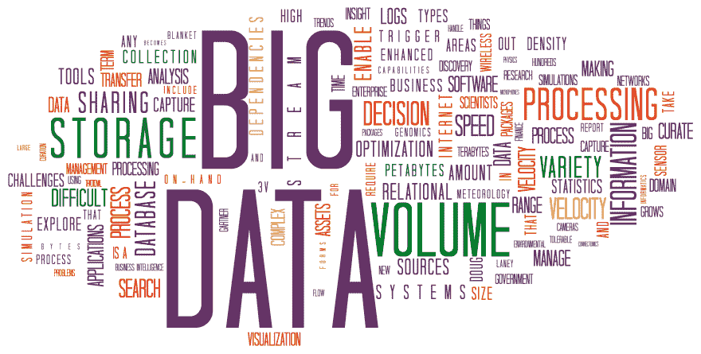

# 如何处理 BigData？

> 原文：<https://dev.to/klyse/how-to-handle-bigdata-a0o>

# 摘要

我目前正在做一个新的(令人兴奋的🤩)项目。该项目包含数据存储💾和分析。这个大数据项目最重要的特征之一是数据完整性。以下是确凿的事实:

*   我使用 MongoDB 作为数据存储
*   ASP.NET 核心作为 web 服务框架
*   。net core 来分析/收集数据

有一些所谓的收集者从不同的来源收集信息。那些收集器是用 c#写的，把数据发送到所谓的 Raw。美国石油学会(American Petroleum Institute)🌐。原始的。Api 处理信息，并负责向 MongoDb 集合中插入内容。由于数据完整性对这个项目至关重要，我将操作分为三步:

# 交易范围

*   第一个事务范围是:每个收集器决不能发送不完整的信息。一旦数据被传输到 API，所有信息必须一次全部写入数据库集合。不允许部分插入。

*   第二个事务范围是:一旦数据被转储到一个临时集合中，一个后台工作程序就开始将信息写入最终集合。这必须在 DB 事务中再次发生。不允许部分更新。据我所知，MongoDB 4.2 支持跨多个集合的 ACID。

*   第三个事务范围是:分析器必须一次读取所有数据并处理信息。不允许部分刷新，因为数据可能同时被更新，这将导致信息不一致。

# 处理 data⚙️

有多个收集器，每个收集器不时发送信息。例如每 5 分钟一次。一次数据交易大约包含 40mb。40mb x 每小时 12 个事务* 24 小时* 365 = ~4tb。数据太多了📚。因此，每个数据集都有特定的数据保存间隔，例如每天、每小时等。只要请求在相同的数据保存间隔内，每个新请求都会替换前一个请求中的所有数据。
每个文档都存储有“数据范围”和收集日期时间戳。例如，“数据范围”是一组可以被唯一识别的数据。这可能是一个域(【www.google.com】T2)。将信息从临时集合写入历史集合的第一步是删除相同“数据范围”和相同“数据保存间隔”中的每个文档。这保证了如果收集器传输的信息较少(因为有人删除了数据，这是允许的情况)，则“旧”信息将被删除。然后每个文档都被插入到历史记录集合中。对于当前集合也是如此，以确保对当前信息的访问更快。

# 分析

分析是在规则的基础上进行的，但我还不确定如何去做。有没有很好的工具或编程语言来存档呢？

对这个项目有什么想法或建议吗？我很乐意讨论😜